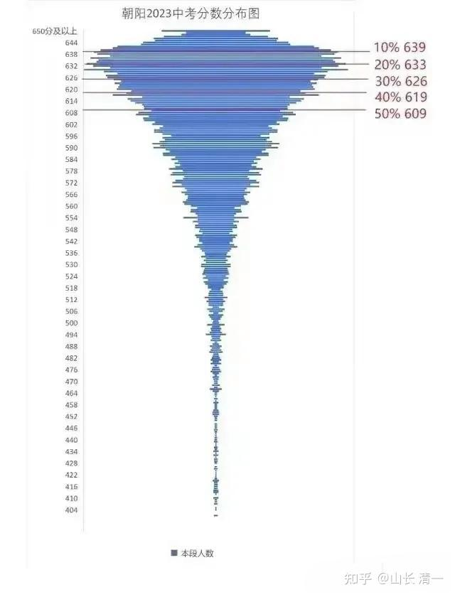
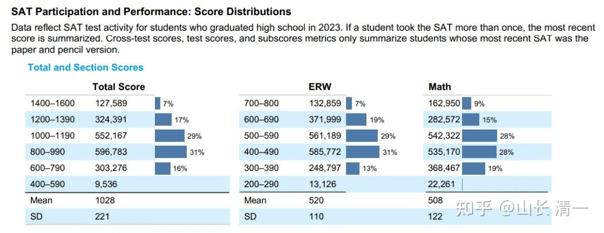

当我们的学生，18岁选择不去上大学，直接工作的时候，有人跳出来说：你们新教育的学生，连大学都考不上。

现在，我们的学生批量考入世界排名TOP100的大学，远远超过国内的985名校的档次。又有人跳出来说：为什么你们不敢去考中国高考？不去读中国大学？是不是你们没本事？你们不爱国？

其实：这些人都不明白。大学教育本质上是一个服务产品。大学教育存在的意义，就是要满足家长和学生的愿望要求。这里跟爱不爱国是没关系的！难道能说买苹果手机的人，就是不爱国吗？

如果大学教育是一个产品，家长们就不得不去研究和了解：通过大学教育，我们要得到什么？

如果你的目的，是想要通过中国的大学教育，获取资格后，将来去考国家公务员。我认为---最佳的途径，就是要去考中国的高考，然后大学毕业再去考公务员。如果你是海外大学的毕业生，可能走这条路，会有点不太顺利！

如果你上大学的目的，是想要大学毕业后，获得良好的工作机会。这样的话，国内外的顶尖知名大学，都可以满足你的要求！你考中国高考，或者美国高考，都可以实现这个目标。只有你能通过大学教育，证明自己是3%的优秀人才就行了！

**但为了达到这个相同的目的，两者所要付出的代价是不一样的。如果两者的价格相差十倍，甚至百倍。你想买谁？你不考虑性价比，但我会考虑的：因为所要付出的代价不仅仅是金钱，更是我孩子的生命和青春。白白浪费了，我会很心疼的！ **

**从绝对金钱价值来看，**东南亚知名大学的学费和生活费，与在中国上大学的经济开支差不多。但如果去欧美大学的学费生活费，要比国内贵得多---总体来说。国内的大学相对“价廉”一些---是不是“物美”就不多说了！

但是，**从“学生的时间和精力投入”上来说，**参加中国的高考，想要进入顶尖的大学，无疑是一次极为艰难的战争，而且对手不仅仅众多，而且很顽强，获胜的难度超级高！

北京中考，满分一共是660的卷子，居然有一大半的学生成绩，都超过了609分。其中626分以上的学生，居然达到了30%的。也就是说，您的孩子，就算考到了相当于百分制的95分的平均分，已经非常的优秀了。但跟他同样优秀的学生有30%。你依然没啥竞争优势。

这个数字是啥意思？**中国的985大学，只能录取其中最顶尖的1%多不到2%的学生入学。**中国的211大学，也只能录取其中最优秀的 5%的学生。因此---你平均分95分，也不一定能够考上985，211。为了进入2-5%的群体，你就要在高中的三年里面，努力去打败其他30%的对手，而你提升的空间仅仅有5%。这个难度大不大？无聊不无聊？很可能---这三年的卷就是完全就是没有价值的，甚至充满了运气和意外，拼掉半条命，你才能赢得最后的胜利！你可能一个闪神就落后了！

而且，别忘了中国的考生人数很多，2023年有**1291万人参加高考。**

**各位家长，算算账就知道了：你有多大的把握和信心，让你的孩子在中考的时候，就达到六科的总平均成绩95分?成功进入30%的优秀学生行列？**

**你又有多大的把握，高中三年后，让你的孩子成为2-5%的最顶尖的学生？成功考上总共39所的985大学？或者考上总共有115所大学的211大学？（其他普通大学，都太烂了，真不如不读呢，读出来也找不到工作）。**

作为家长，我认为让我的孩子去参加中国高考，是对她年轻生命的残酷折磨（如果我不用体育特长生申请的话）。 就算她能够考出来，估计我们全家人都要为了她“努力奋斗12年”，像是衡水高中一样变态的学习，才能获得让孩子进入985，211的机会！

这其实也很正常-----中国有14亿人口。进入国家最顶尖的优秀大学，也是进入高级职场的机会之门。自然卷得不行！每一个参加者，都必须竭力奋战，才有可能赢得一点点的机会！

*顶部10%的成绩带，挤进了50%的学生，可怕！*

上图说明：最顶尖10%的成绩顶峰区域，中国居然有50%的学生达到标准。这其实很不正常。下面的图片，是2023年国际高考SAT的成绩分布图。顶尖档次的1400分以上成绩，只有7%最优秀的考生才能实现。中间800-1190分，拥挤着60%的考生。**世界TOP100的大学，录取的是最顶尖7%的优等生。**美国TOP100大学，录取起点分数是1200分，已经算是**SAT系统17%的优等生**了。剩下的，就是让美国的其他三千多所普通大学去收捡的“学渣”了，这些学校，光看学生的入学成绩，你就知道有啥“就业前途”了！

不过----各位想知道今日国际学校的学生SAT成绩分布图吗？跟上面的北京中考图非常相似---蘑菇云状态，甚至更甚：我校大约超过80%的学生，考分集中在1400-1600分，“差生”的分数也在1200分以上。由此可见：今日学堂的国际竞争力有多强了！我们甚至奇怪---这么简单的SAT考题，为何看数据上，这么一大堆人都考不出来？说明国际学校的竞争力实在太差了！

*呈现正常分布的成绩表*

**相比较中国高考的难度，国际高考面对的竞争条件就完全不一样了。几乎是天上地下的差别。**

中国有14亿人口，其中每年1291万年轻人要参加残酷的高考！卷到了极致，你只有击败1200万多同龄人，你才能入读985，211大学。

全世界一共有78.88亿人口，但每年只有220万的年轻人，参加国际高考SAT 。全世界除了中国以外的知名大学，基本上都认可这个高考的成绩。你只需要与这两百万学生竞争，赢过他们，你就全世界最顶尖的学生！就能获取最佳的就业机会。

而且----就读海外TOP100的大学，就业机会是全球性的---包括中国在内的全世界企业都有机会去申请求职就业。但你就算入读了中国的985大学，就业选择基本上只能限制在中国国内！很难有海外就业申请的机会！

那么---入读世界顶尖的TOP100大学，需要的成绩是多少呢？SAT1400分就足够了。实际上，这个成绩还可以进入一些世界排名TOP50的大学。而中国的985大学，大多数的排名都在世界200名以后。甚至连世界大学TOP500榜单都进入不了。这就是差距！考SAT，你可以入读更好的大学，但付出更低！至于你想要入读美国排行前100名的大学，1200分以上就够了！只是我们觉得这个标准太低了。泰国的北大---朱拉隆功大学要求的SAT成绩，仅需1000分以上就行。

新教育的家长和学生，显然是中国家长里面更聪明，更会算账的一群人。他们一眼就看到了这两个不同的高考市场，两种教育世界，提供差异巨大的教育产品。因此毫无悬念的选择了在新教育考SAT，入读海外大学。而不是在国内跟1291万人去卷，去拼中国高考！

那么：**为什么会形成这种巨大的教育机会反差呢？为什么总人口达78.88亿的世界人口，却只有区区220万人去考美国高考SAT呢？**

为什么入读世界顶尖大学，甚至比去考中国的普通211都轻松很多呢？

关键的原因，就是美国制定的国际规划里面，有一个重要的因素，限制了全世界绝大多数人去参加这种轻松容易的国际高考：这就是英语水平的限制。由于传统教育体系中，外语教育水平的落后，要参加美国高考，就只有极少数非常富有的家庭，才能把孩子送到全世界各种国际学校里面去。普通的公立教育学校，不可能让学生掌握良好的外语水平。当然也就不可能参加SAT考试，轻松入读世界TOP100大学了！

另外一个重要的原因，就是除了中国以外的国际环境，相对都是生活，就业压力不太大的地方（除了几个东亚怪物国家外）。青少年的学习相对很轻松，学生压力不大。自然成绩也就一般般。习惯了努力学习的中国学生，很容易相对这些海外学生，取得更优等的成绩！拿到更好的工作机会。

特别是新教育的崛起，重新改写了世界教育的历史。我们能够用仅仅三到四年的学习，就可以帮助学生达到SAT超过1400分，甚至超过1500分的优秀成绩，可以轻松实现入读世界TOP100大学的目标。还可以把15-18岁，中国传统学校学生用来拼命卷高考的时间，省下来用于学习国学，学习武术格斗，实战。或者去学习商业，管理学的课程，学习社交，学习当网红。轻松快乐入读世界名校。

各位说------如果新教育的学生，有这么幸福和快乐地学习，并轻松成为世界1%优秀大学和优秀人才的机会，他们谁还会跟你一起去死拼，死卷中国高考？拼尽全力去争取一个**仅限中国市场有效**的微薄教育回报机会？

所以：**家长要赢得未来，心疼孩子，就必须聪明地学会选择跑道！**

体制教育跟14亿中的1291万人一起跑，你要跑赢1200万人（进入985，211），真的太累了！太不容易了。

新教育选择跟78.88亿人中的220万同龄人一起跑，只需跑赢200万人就能入读top100大学。我们会跑得很轻松，很潇洒。

我们就不跟体制内的你们，去争啥【中国跑道】了，真心是太拥挤了。

我们直接去跑【世界跑道】---这一条更宽广，但更少人去跑的跑道。

**新教育天书第四问：海外留学，应该去五眼国家？还是去小语种国家更好？**