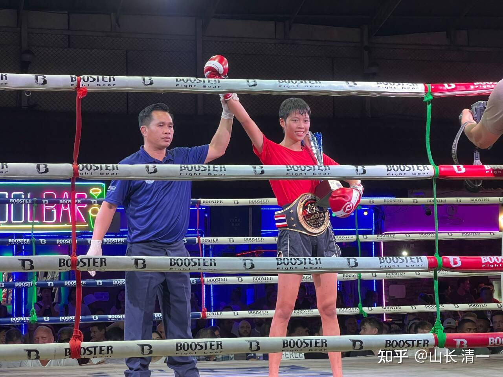
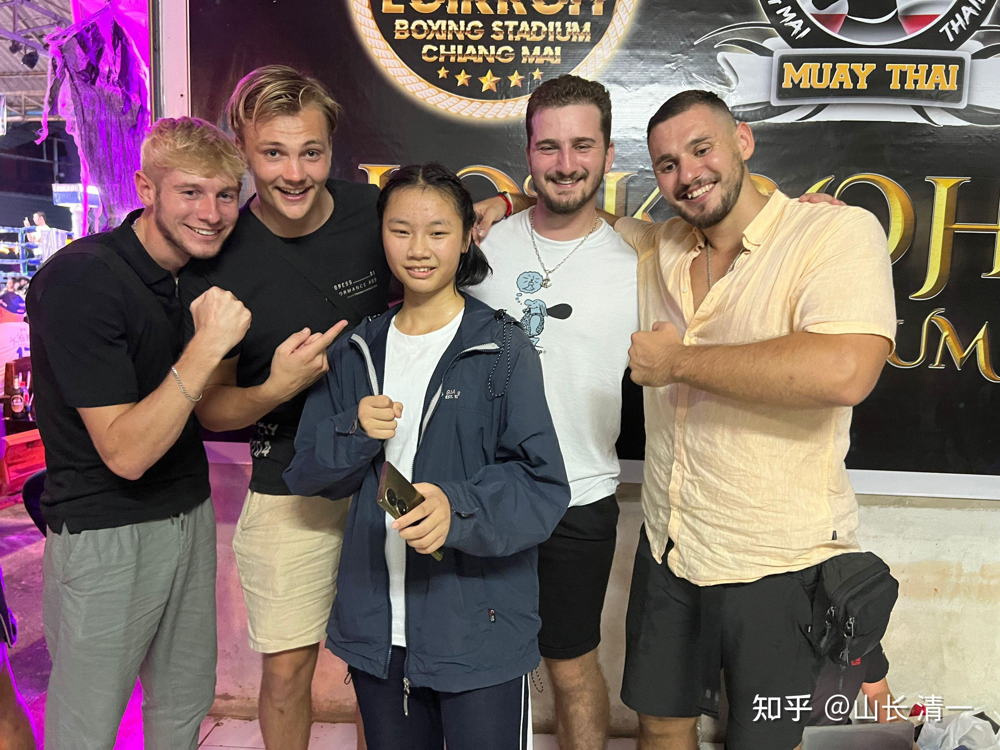
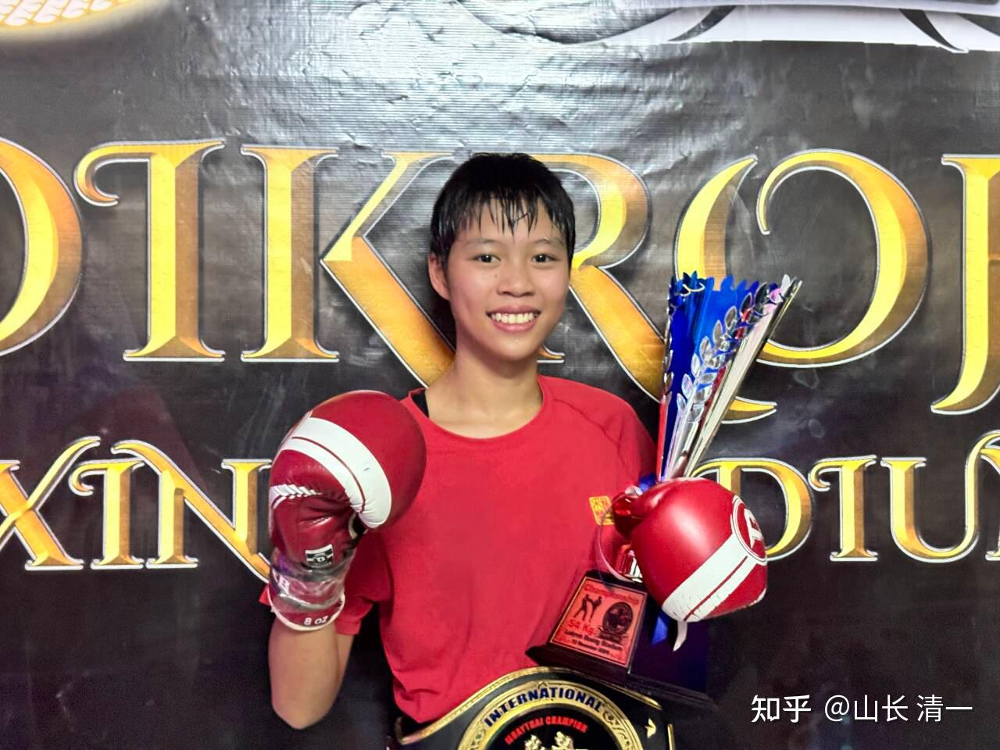
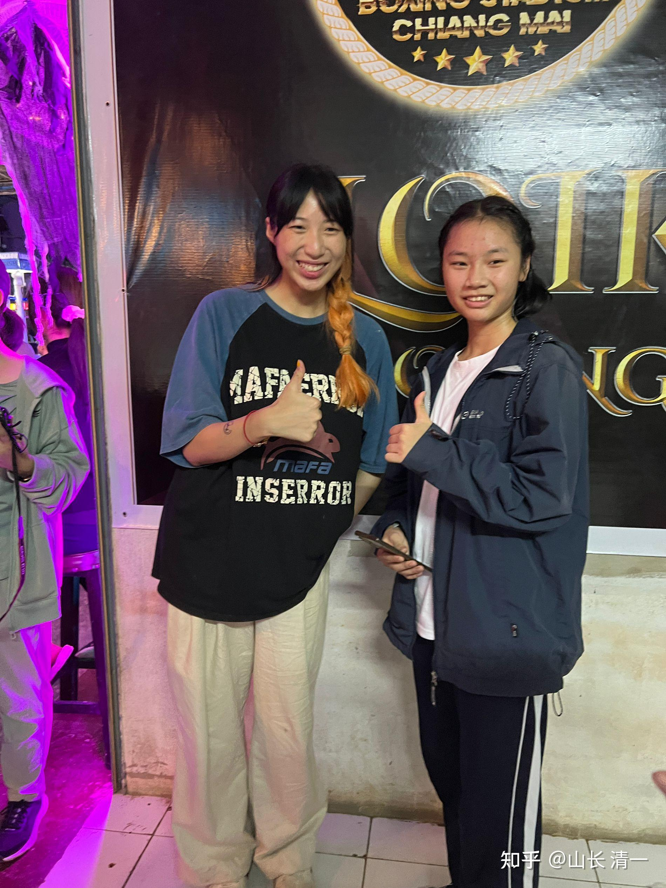

昨晚的公主班节庆比赛，公主班郑子夏和陆韵如拿到了两条地区拳场金腰带，还收获了一堆西方粉丝。昨晚两个新武士比赛中都ko了泰国对手，新一代的清一武士和木兰正在快速成长中！

*子夏收获西方粉丝团*

我计算了一下：2019年开始培养的第一代清一拳手，总共只有8个人！全都拿了金腰带，还拿了五个全国锦标赛冠军，剩下几个拿了全国亚军。目前他们中已经有六人已经入选国家格斗队，要参加国际比赛！证明清一战队的成材率超高！

第二代清一拳手，就是公主班的孩子。她们是在2022年疫情开放后，才来泰国开始培养的。总共有20多接近30人，今年她们才刚刚走上拳台。昨天，就已经开始了她们首次争夺“地区金腰带”的拳手生涯。老木兰们早就过了这个阶段（崛起的新锐挑战者），她们在清迈北部已经盛名远扬，不少热爱泰拳的泰国人，都知道他们的名字，看过她们的比赛。现在已经没有啥对手愿意跟她们在清迈打比赛了，偶尔拿了金腰带的有自信的泰拳新锐，有人不服气的，会来挑战一下“老霸主”，但基本上都是铩羽而归。木兰们的老对手，似乎不少已经退役了（结婚生子去了）。最近三年内，预期这批小公主可以拿到超过10个全国冠军！甚至会更多！因为她们的机会比上一代木兰更好。

第三代清一拳手（冠军班和小公主班），是2024年9月份才来泰国开始培养的，总人数超过60人。刚开始格斗和基础训练两个月。预期这批人三年后，就可以全面投入格斗战场了（最快大约一年半就可以走上擂台）。三年后，等他们训练完成，走上战场之后，很可能会“淹没”赛场。因为好像还没有任何单位，可以一下子拿出这么多的格斗队伍。清一战队，三年后，就拥有上百个可以参加全国锦标赛的格斗手。好像目前中国全国泰拳锦标赛的参赛人数，总共也就只有一百多人。因此，我们拥有的，相当于职业拳手水平的学生人数，“规模”是相当惊人的。因为职业格斗手，从来就不是一个批量批发的行业，是一个非常小众的集体行业。是因为我们的学校，才让这种“批量制造”格斗手的行为成为可能，这是世界教育历史上的创举！

更惊人的是，我们的格斗储备拳手，现在还越来越多，培养的周期，越来越快：

第一批拳手，是用了快20年才攒出来的一点点小家底！我操心还最多，最累，成效最低。我的两个大孩子，虽然从小就带她们学习武术，要求练武，但两人最终都并不热爱武术，也没有啥实战能力！因此，这几个第一批木兰拳手，算是星星之火！

但第二批拳手出来的速度就快多了。仅需两年多就有公主出战比赛了，还拿到了金腰带。再有三年到五年，就开启全面收获全国冠军和国际比赛了。

第三批拳手，几乎不用我操心，但三年后征战全国赛场或者国际赛场，应该毫无悬念。人数还特别多！每年都在快速增加！每年能新增百名拳手，肯定是世界第一格斗学校！

第一代拳手，是在被泰国人瞧不起的眼光中走上拳台的，特别我们的技术动作不像泰拳，像是动作变形的初学者！因此，木兰们一路上遭遇的都是泰国拳手，以及泰国裁判，主办方种种“木兰泰拳技术不好”的质疑。甚至中国人都不相信，认为我们是打假拳的。毕竟泰国是真的可以花钱买比赛的，这是一个公开的秘密！对泰国人来说，打拳就是一份职业，挣外国人的钱不丢人。中国人也一直很都崇拜泰拳，怎么也不敢相信：我们这一群“业余指导加上业余拳手”，就轻松击败了泰拳。因此---职业格斗人，对我们的质疑更大。甚至有些中国人，会公开来赛场，故意花钱给泰国人发奖金，让他们来打脸我们（当然这些人都自己被打脸了）。在国外的赛场上，西方人，洋人都更喜欢看我们挨打，不喜欢看到中国人赢。因为他们不相信中国人会赢。一年多两年前，木兰拳手拿着中国国旗出战，还被洋人一顿嘘声。

但现在，无论是泰国的拳手和裁判，主办人，等等，以及来看拳赛的中国人，还是西洋人，都对木兰拳手们礼敬有加。这是第一代木兰打下来的天下！她们开创性的努力，打出了公主班拳手更容易获取海外认可的结果！公主班的拳手们，还能给后来的人奠定什么样的更良好的基础呢？

2025年，将要来清迈的清一武道馆，开始学拳，走上格斗战场的学生，预期会超过90人，几乎是现有数量的一倍。这些人，大多数都是已经考完SAT的15岁学霸，来这里学习，都是零学费，还免生活费，住宿费，是我来负责供养和训练的。要养两三百名拳手，负担好像有点重----但中国的股市非常大方，每年都给我丰厚的报酬，所以资金不是问题。目前我正在清迈麦当庄园，加快建造拳手（学员）宿舍和训练场。我告诉孩子们-----拿到了全国冠军的人，就有单间住了。其他拳手就住三人间和双人间。我们拳手基地的宿舍，基地，绝对是泰国拳手的顶尖水平（泰国拳馆的拳手生活条件都较差，要么住在自己家里，要么就是住在拳馆租下来给拳手们住宿的集体宿舍，往往是十几个人一套房子的这种。可能还是没有床，直接睡地铺的）。可是我们的拳手，却住在大型的英式花园洋房里面，花园场地一共有一百亩之多！庄园内部还自带一条一公里长的跑道。这条件根本就不是普通泰拳手能够比的。所以前几个月，泰国拳馆评审的一些资深泰拳裁判和教练员们，来看了我们的训练场地，大赞叹说是这个木兰拳馆，绝对是清迈地区最高级，最有档次的拳馆。给了我们“五星级”的评价！（见题图的集体照照片，图中的训练馆，目前是三个，中式八角亭结构，每个亭子的面积是四百多平方米）

现在正在盖的宿舍和房子，都是中式的四合院结构，一栋有15个房间，以及一个81平方的中央学习大厅。最近三年内我要造出10栋这样宿舍和教室合一的建筑，因为预期2025年之后，同时在清迈这个训练基地的拳手总数会超过三百人----估计这个规模，应该就是泰国拳馆第一，肯定也是中国格斗拳馆的第一了！无论是人数还是质量，都是惊人的！

2025年之后，拳手数字每年都会继续增量大爆发。也许未来的全国格斗锦标赛，就会成为清一拳手之间的“内斗赛”了！外面的拳手，都必然要面临众多清一拳手的竞争，基本上无法登顶。我们将垄断几个轻量级的几乎全部金牌（由于队员全体吃素，体重提不上去。重量级的格斗奖牌，我们就只能让给体制内的拳手了）。此时，清一系拳手三年后，将是中国唯一最擅长外战的群体拳手。将成为为中国争光，替中国去全世界打国际比赛，拿奖牌的主力队。当然---肯定我们也是国家体育总局的宝贝----中国总算有批量的，可以拿出来打外战，而且还外战内行的格斗手了！ 【现在我国都很难选出去参加世界泰拳和自由搏击锦标赛的拳手，优秀拳手太少了，所以常常放弃参赛。作为一个世界级的大国，居然弃赛不去世界锦标赛，真的特别丢人。但派队伍去了之后拿不到成绩，更丢人】。也许中国武术中心，将来只能靠清一拳馆的拳手来扳回世界锦标赛的面子了！

明天是鲜花节庆典比赛。今天一早，三个清一男女武士就要出发，要去6小时以外的外府，参加节日庆典的古泰拳缠拳比赛。这是每年一度的泰国电视直播的重大赛事。原来的佳慧，谭木兰和明晓， 都分别参加过这个地方的缠拳赛。佳慧两年前首次参加，就取得了一个大奖杯，双方判平局，因为打的特别激烈精彩。其他两个人都在缠拳赛Ko了对手（也因此比赛不够激烈，两人就没有拿到奖杯——）。但赛后，对方拳馆的馆长，赛出他的两个拳手脸上伤痕累累的照片。一个脸上被打成了花猫，眼睛也肿了。另一个漂亮的小姐姐更惨，脸上被谭木兰用肘开了一个大口子。所以上次的比赛结果，震惊了清迈的泰拳界，对木兰的缠拳战斗力印象非常深刻。当时一个泰国的资深裁判还点评说-----木兰很危险。（缠拳由于没有护具，更容易打伤对手，脸上身上造成伤口。因此普通的泰拳手，普遍不愿意参加缠拳比赛）。 明天的缠拳赛，我们换了现在还没打过缠拳赛的新人，去体验第一次缠拳赛（陆鸽佳彦和刘轩宁三人）。佳慧本来也被邀请了参加本届的缠拳赛，因为泰拳主办方对她当年的缠拳比赛印象深刻。但她今天晚上要出发去国内参加泰拳国家队的集训。我们月底要参加东亚泰拳锦标赛，我方本次派出了五个拳手参加国家泰拳队的集训机会！这是木兰拳手首次参加国际比赛！但这只是木兰们的起点。明年四个老木兰们的重点赛事，就是参加国际比赛，击败各国格斗精英。新起来的这一批新公主木兰，重点是打好全国格斗锦标赛！争取拿到全国冠军。获得“清一研究生”的就读资格！