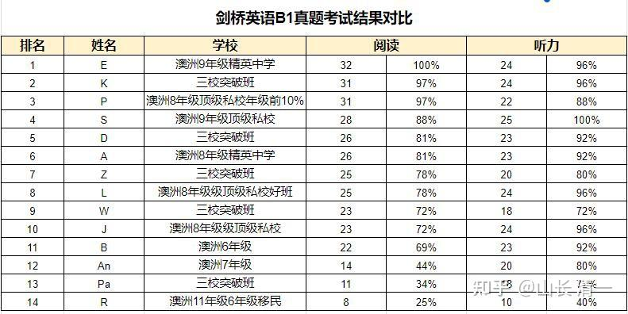

相当多的华人移民澳洲，是为了给孩子找个更好的学校和学习环境。几乎所有移民，都认为澳洲的教育水平要远远超过国内的学校。所以，下文的作者，早已经移民澳洲的李女士，居然反其道而行之。先是让大儿子四年多前考上了今日三语高中。去年又把女儿送来今日三校读初级突破班。在澳洲的朋友圈中，她成为了“怪物”，各种不理解，各种议论和反对！的确颠覆三观！都认为她脑子出问题了！

但李女士并不是傻子！她只是开放了自己的大脑，接受了原以为的不可能！

下面她整理的成绩表，就是她把自己女儿所在的班级（三校初级突破班，相当于今日突破班一年级，年龄11岁-12岁）的学生，与澳洲高级学校的6-9年级学生进行了一场英国标准的考试。结果发现：三校学生的水平居然差不多。等再学一年，肯定就能轻松超越这些母语学生9年级的水平了。学了三年以后，就可以超过本土学生10年级-12年级的水平了。这就是为啥叫做【今日突破班】的原因----我们突破了英美教育的高大上的形象。展示了中国教育的优越性。

这就是新教育的价值：与我们的传武格斗技术一样，对西方传统格斗技术。中国具有极其明显的优势。更加奇特的是，我们的学霸和武术霸，可以是同一人！这更是一个全世界都很难找到的“世界纪录”。

这样的优质学校，家长们怎么会让坏人毁掉呢？因此，我们最大的保护神，就是家长。我们最大的价值和意义，就是教出优秀的学生！

**转发澳洲家长李女士的成绩调查发文：**

身边无论今日塾，还是无名塾、清一塾的家长朋友都为自家孩子进入今日三校后，无论是心性还是学习成绩都快速地提升，全体那么多师生、家长却因为这些妖怪就要经历这么多波折！他们在造多大的孽啊！

分享一下我在澳洲接触的澳洲优质教育与今日三校的成绩对比，希望大家知道山长创办的今日三校价值高到什么程度，大家一起竭尽全力来保卫这个平台！！！

现在是澳洲的圣诞长假，我对9个澳洲本土6年级以上的学生做了一次剑桥B1的真题测试，刚好跟我孩子所在今日三校班级的前几名学生进行了相同考试的对比。我这里的大部分学生要么是顶尖私校，要么就是有名的精英中学。

从考试结果来看，我们三校突破班的这几个11岁左右的孩子基本相当于澳洲6-9年级的学生水平；而从心性上，就完全不是一个级别。我们的孩子积极、正面、乐观，能深入反省、思考问题，身体健康，运动能力强，而这里的全部学生（男生），无一例外都是沉迷游戏、好吃懒做、思想浅薄，甚至中学的孩子满脑子都是粗俗低下的东西，更加别说身体疾病、肥胖等各种问题了。

所以，今日新教育无论从学术成绩，还是心性、身体等各方面都完全超越了澳洲的优质教育，这就是为什么我们坚决放弃澳洲教育，把两个孩子都送进今日的原因。

中国人不需要出国就能享受到超越澳洲的精英教育，现在居然要被这些妖怪毁灭，真是让人恨之入骨！

李静盈 澳洲