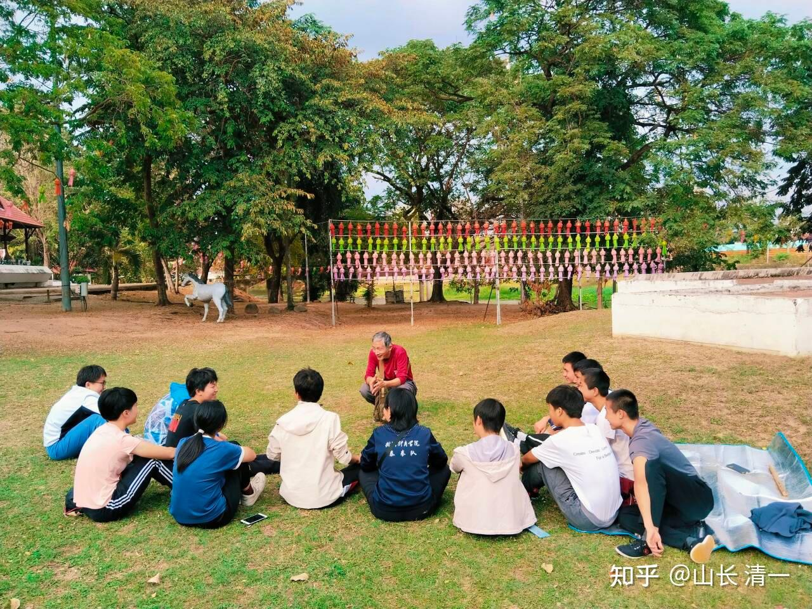
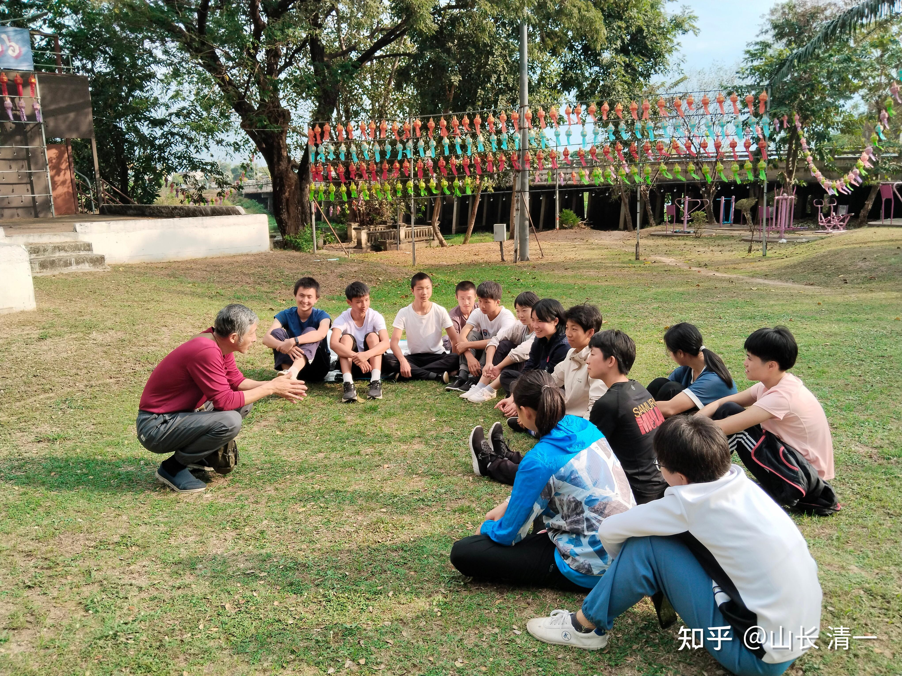
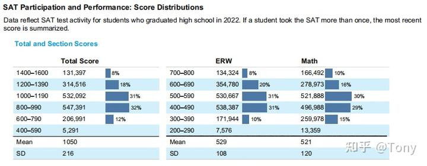

昨天周日，我带十几个留在清迈练拳，准备冲击几个月后的中国自由搏击锦标赛冠军的学生，去南奔府游玩。先是去一座金碧辉煌的大庙，看了泰国人正在举办的宗教活动，解析了周边的“宗教利益集团”，是怎样利用人民的迷信捞钱的。

午后，大家就在一个小公园的草地上，分两个小组，开始玩辩论赛了。方法就是每个小组中，一个人做辩主，负责维护我几天发表文章的主要观点。其他所有人都负责攻击和反对这个文章的观点，提不出反驳理由的就要挨批评，会被我说没思考能力。这就是我带的学生，学习很多重要课程的方式：用互相辩难，挑刺，去掌握和深入理解文章的精髓。而不是傻傻的记住和执行文字的表达。这样培养出来的是无脑死忠粉，就是教徒了。如果不许质疑圣经和大师，连明显违背常识也不能说。这种教徒怎么会有思维能力？而来自于那烂陀大学时代的佛学，千年前直到现在，都是这样学习佛学经典的。由此看，佛学其实不迷信，是佛教才迷信！（汉传佛教没有辩经一说，估计是中国特色---为尊者讳）。

[山长 清一：才华与国运的思考：中华文化上层的路径设计！](https://zhuanlan.zhihu.com/p/680092553)

总有一些外人会质疑：我带出来的学生，会不会过于崇拜我？盲目听从我，缺乏分辨是非的能力？如果你们知道我们一直采用辩难，反对老师观点的方式来培养学生，您还说得出这种话吗？也正因为这种训练，所以我的学生弟子们不仅仅理解力很好，他们的思维力和口才都很好。哪里会像宗教徒一样唯唯诺诺的，完全失去了自己的思想。

不过，辩难半天，学生们却难以攻破守护者的观点。我嘲笑大家当清黑都不知道怎么黑。我就自己来当一次清黑，让所有的学生都来攻击我的“反动”观点。

我一开口黑，就把他们全弄傻了：你们清一说，拿到太极世界冠军，就可以成为文化上层。这就是他忽悠人的，根本没有这种可能。文化上层和世界冠军，根本就没啥本质联系。中国的乒乓球，一直垄断“世界冠军”的称号。但你们谁见到乒乓冠军当上“文化上层”了？还不就是一个运动员。只是有点小名气，收入略高一点罢了！更多国人，根本不关心谁拿了世界冠军。

*瞧我黑起来六亲不认，连自己都黑！*

学生们不服气，说了很多太极拳----不是乒乓球这样的话，根本就不着调。都被我反驳的体无完肤！

最后看他们没脾气了，认输了，也沮丧。我才解释道：**以为你们代表中国，使用太极技术，去拿了世界冠军就是文化上层，这种思想肯定是错了。谁这样说，谁就是忽悠人。**

** 文化上层是啥？就是思想上，文化上，被世人尊重，崇拜，甚至来争相模仿跟随的潮流趋势，就是文化上层。西装穿起来难道真的比汉服更舒服吗？但你能穿中式的长袍短褂去公司上班不？为啥现在全世界除了中国人都喝咖啡而不是泡茶？甚至中国人有档次的中产阶级，更喜欢喝咖啡，喝牛奶？吃面包披萨？这就是西方的文化对我们日常生活行为的影响案例。只有能让全世界各国来追随和模仿的东西，才有资格称为“文化上层”！中国----很遗憾，目前还没有这种东西出现！至少世界上还不接受中国的文化，只接受中国制造的产品！**

** 太极格斗，想要成为文化上层，唯一的方式，就是让世界各国的中上阶层的的家庭，都热衷于来参与练太极格斗，花钱来学习太极格斗。下层阶级也喜欢看我们的太极格斗，成为世界的风气！而不是有几个人，去世界擂台上拿了几个世界冠军，别人就会送一个“文化上层”的头衔给你。这是绝无可能的事情！上层，可能就是看不见的。**

比如王石登顶珠峰，大家都说他很了不起。现在一大堆有钱人，都在玩登珠峰的游戏。虽然登顶珠峰就没啥现实的意义，劳民伤财。但这俨然是世界潮流，而且是上流社会的游戏，每年不仅收取很高的登顶费用，还有限流人数。没点能耐，连去爬珠峰的门票都弄不到的。

可是，夏尔巴人早就可以登顶珠峰，但夏尔巴人虽然有这登顶的本事，却跟主流社会，上层社会毫无关系，只能给这些人做苦力。很多白人登顶了一次，就成为英雄和榜样。当年中国队登顶珠峰还是民族英雄呢。因为当今的世界，是白人掌握了“话语权"。因此，白人玩的游戏，就是上层社会的游戏。乒乓球，不是白人掌控的游戏项目，更不是有钱人掌控的游戏项目，因此，乒乓球就不可能像是高尔夫球一样，成为“上层社会”的社交和娱乐，证明自己身份的工具。中国人掌握的乒乓球技术，因此就跟夏尔巴人掌握的登珠峰技术一样，都不受待见。本质上，运动项目是上层社会的价值和文化取向的标志，而和文化活动本身的价值没有关系。（夏尔巴人很难想象---一群人辛苦跑来爬雪山，有啥文化价值和意义？一群没事找事的白人神经病而已）

中国如果推广太极拳， 就算政府费大力，花巨资，找关系，把太极拳运动推进了奥运会项目，让中国人拿到了一堆的太极世界冠军。这个结果，也不可能会让中国人更受尊重，对白人也不会有啥吸引力的，甚至别人根本就不看你的这些比赛。跟乒乓球一样，基本上是中国自拉自唱的游戏！

韩国的跆拳道已经打进了奥运会，但在西方发达国家的人群眼中，韩国人依然没有啥话语权，不是啥文化上层！因此，太极拳运动，就算能够进入奥运项目，也无助于中国国家文化体育地位的提高！

我们现在正在做的事情，就是老子教的“无我”---不去自我标榜自己的太极运动！你说是兔子拳也没关系。但我们只是专心使用太极技术去打泰拳，去打自由搏击赛，去打拳击，去打MMA。本质上，我们没有去树立某个新的“中国文化特色赛事”。反而是我们放下架子，主动去和世界“主流格斗文化融合”，去这些西方世界制定的运动规则下，展示出我们强大的“中国力量”魅力！如果我们真的能够在这些西方人的传统优势，强势的项目上，取得明显的优势和胜利，这必定会吸引全世界的注意力，会关注到我们的底层格斗逻辑和技术（刚开始，肯定是种种瞧不起的），也客观上大涨了中国人的民族志气！这些冲击西方格斗霸权的中华太极拳手，就会成为中华人民心中的“英雄人物”，成为我们“中华文化符号”的代言人！

但就算这样，太极也无法成为“文化上层”，而只是成为“流量明星”。随著时间的消逝，他们作为个体，就慢慢淡出人们的视野。就如同当年，中国女排夺取世界冠军三连冠，中国人基本对郎平等中国女排队员的名字都非常的熟悉。而且当年女排树立的“拼搏精神”激励了整整一代人。但今天----这些女排队员，也没有成为文化上层！这就是局限于体育领域的必然结果！

** 因此，想要用太极格斗拿到世界冠军，以为就能够成为文化上层了，肯定是无稽之谈！**

但我原来的结论并没有错：所谓的文化上层，就是指我们社会上的中上层阶级---无论是经济中上层，还是政治中上层，以及社会各界的中上层人士。都愿意来追捧你，拥护你，加入你的话，你才能是文化上层。

** 要实现让世界各国的上层人士都来学中国太极？这恐怕是做梦。**我们就算是很牛，击败了世界格斗，只能让世界各国的”格斗上层“，顶尖的格斗精英们，谦虚地来找我们学太极，好去参加比赛。普通人，大多数的吃瓜群众，是不可能来学太极的。就像现在去看拳击赛的观众，大多数是不会去练拳击的！最多合个影，买个拳套回家假装练练玩。

但**全世界的上层人士，都一定会关心一件事情：如何让自己的孩子，也成为未来的上层精英人士？**如果我们能够帮助他们解决这一问题，我们就是理所当然的文化上层了！

而我们正好能够做到这一点，这是任何武道拳馆做不到的：**今日国际学校，可以帮助任何国家的孩子，成为这个世界上属于顶尖千分之一的优秀人才！**这就奠定了他们未来成人后，成为各种行业的上层社会人士基础！只要我们能够让这些上层社会的人士，知道我们的学校真的有这个实力，我们就会立即成为这些世界各国上层社会人士追捧的对象。**这就是让我们自动成为“国家文化教育上层”的唯一方式！**

而太极格斗击败世界冠军的神话事迹，只是我们学校的一个“宣传广告”罢了。**我们的冠军拳手，只是我们学校的“形象代言人”。并不是说他们就是代表文化上层了。**只是因为他们在世界格斗擂台上的精彩表现，让我们快速获得了全世界的瞩目。所有的人，都会关注到---是谁培养出这些优秀拳手的？他们原来学习的学校在哪？

因此，随著这批拳手将来获得各种世界冠军，甚至奥运冠军，这所学校就此而广为世人所知。我们就瞬间成为了上层人士追捧的【世界名校】，他们也纷纷想要把孩子送来这所学校-------而显然----得到了上层人士追捧的世界名校，肯定就成为了文化上层的一部分！

** 基于工科人士的思维习惯，我们用真实的数据，来证明我们以上规划的有效性。这已经是事实，而不是画饼。她未来需要的只是批量的量产制造人才而已。**

全世界每年出生1.3亿人。如果你18岁这一年，你有机会证明你自己，是这个世界上属于最顶尖千分之一的年轻人，我相信你有很大的概率，会成为未来世界的上层精英人士，有可能成为万选之一的精英人才。其他99.9%的人群，几乎没有可能成为精英分子,这就是核心逻辑。

**谁能帮你进入这个“世界顶尖千分之一人群”圈层，自然谁就是你的“贵人”了。谁还不尊重这样的贵人呢？国王都会尊重的！**

这个特别的人群，就是现在世界上的“天之骄子”群体----他们就是能够入读世界TOP100大学的学生。当今世界，是一个非常重视教育背景的世界。如果一个年轻人，没有进入类似的顶尖大学学习的背景，基本上就和“上层社会”无缘了。

想要进入世界顶尖100名大学，基本上学生都可以采用美国提供的SAT标准考试的成绩申请入读 （除了中国大学以外）。考生大概只要在1400分以上，就可以入读世界前100名大学。或者美国前40名大学了！

数据：【根据报告显示，2022年至少参加过一次SAT考试的**考生共有1,737,678人，比去年整整增加了20万人，增加了15.3%**。参加考试的大多还是美国本土的学生，一共有110万人】。

全世界每年出生1.3亿人。但总共只有173万人能够参加SAT考试。其中---只有13万人能够考到1400分以上。也就是说：只要你18岁考过了1400分，你就超越了999个同龄人！成为了千分之一的优秀人物！

美国2022届的高中毕业生是2004年出生的。这年的出生人数是4112052人。18年后只有四分之一的人数才有机会走进SAT的考场里面（这些家庭往往是中产以上家庭），其他人基本上等于被社会自动淘汰成为底层人士。能够考SAT的学生，就已经自动淘汰了75%没法高中毕业的同龄竞争对手。您大概不至于认为----未来社会的中上层人才，会出自这批连高中都无法毕业的“学渣”学生吧？

虽然美国高考SAT，本质上是对全世界开放的世界标准考试，相当于国际标准（连泰国都设有SAT的考场）。大多数像样一样的大学，都乐意采用SAT成绩作为入学申请标准。但非英语的其他国家，因为语言水平和经济能力的限制，要资格参加考试的学生很少。美国以外，含五眼国家，也只有60万人参加SAT考试。这60万人，基本上都是全世界国家中，经济条件和社会地位相对都较高的社会精英家庭，中产以上的孩子，才有机会走上这个“美国高考”的考场！

我说代表未来世界这些国家的中上层阶级人才，将来肯定会出自这批人中。这个结果，应该没啥怀疑的吧？这批学生，显然比美国本土的比例更低！家庭显然也更加“精英”了。

数据：本次考试**男生平均分为1056分、女生的平均分为1043分。只有9%的男生，分数在1400分及以上，而女生只有6%。总体达到第一层级（1400分以上）的考生，只是全部参加考试学生的8%群体。这些人只占美国同龄人口的3%左右。应证了一条成功学的规律-----“世界上只有3%的人口是精英。其余97%的人口，只是跟随者”，你不喜欢这条“成功学谣言”，似乎大数据支持它的真实性！**

*2022年的SAT考试成绩分布图*

那么？今日国际学校15岁的学生，以外国人的身份，参加母语国家学生18岁的高中毕业升大学的国际标准SAT考试，成绩会怎么样呢？结果是非常的亮眼：我们学生的考试平均成绩，超过了1470分。90%的学生都可以轻松超越1400分，20-30%的学生会超过1500分。只有极少数10%的学生，会跌到第二档（1200-1390分），但没有学生会跌到74%的美国学生的档位（低于1200分）。**而1200分以上，正好是美国前100名大学的最低录取标准分数线。**美国本土，大约有74%的考生，占同龄人口总数达94%的年轻人，无法跨越这条分数线！可见各位崇拜的美国中学教育有多差劲！连我们15岁的学生都瞧不起。

今日国际学校的靓丽成绩表现，足够让全世界的任何高端国际学校统统自愧不如。只要真正了解了今日国际学校的家长，都只会做一个正确的选择：力求把孩子送到今日学堂，而非其他任何看起来漂亮高大上的学校！目前生源不太多，原因只有一个：没有人知道，或者相信这些事实！以为我们是骗子！

你说：**今日学堂的办学水平是挺牛的。可是---这跟太极格斗有啥关系？跟文化上层有何关系？**

其中的核心关系就是：清一武道馆，只在15岁就考过了1400分的初中毕业生中，选择其中愿望强烈，志向远大，真心想要当冠军的学生，才给来清迈书院，学习太极格斗技术的机会。这一批学霸学生中，我们拿过来，训练两年到三年左右，就可以去跟从小练武，以及从全国各级武校里面选拔出来的精英专业武术人士去同台竞争，参加全国格斗锦标赛，并取得胜利！

其他的普通学生，志气不高，企图心不强，积极性不高，人懒心弱的学生，注定就只是普通人一个，将来能去做打工仔就不错了。学业上取得好成绩很容易，人生中要取得大突破就很难了。因此，我们给这些普通的学生的训练机会，就是玩玩太极操，能够强身健体就够了。我们不用去教他们太极实战格斗技术，也不去打什么全国擂台比赛！只管好好学习，考个好一点的大学，找个好一点的工作才是正事！不指望他们成为未来的精英阶级。

清迈校区学习太极格斗的这些学生，18岁之前就会去参加【全国青少年格斗锦标赛】，设法取得前三名的头衔。就像Ella一样不到18岁就去比赛。成年之后，这些学生将去就读世界前100大学，然后以世界名校大学生的身份，参加成年组的世界格斗锦标赛，甚至优秀者要参加奥运会，取得世界冠军称号。最终，以文武双全的优等校友身份毕业，去各行各业工作，开始他们的人生职场之旅。

这些从小就学习演讲，辩论，人际关系，社会实践，还有国学，哲学，心理学的学生，还拥有良好的外语水平，良好的心态个性品质，还是武术格斗明星。他们肯定就像是谷爱凌一样，注定是所在国家和大学的明星和宠儿！大学毕业之后，他们注定会获得比同龄人更多的职场发展机会，成为社会上层的机会更多。这就是未来文化顶流的正常走向！

更重要的是：全世界的家庭，特别是关心孩子教育，关注优质教育的上流社会阶层，经过媒体对我们太极世界冠军的各种访谈，信息交流等等，都会意外发现这一所新出现的，教学方式非常另类的，全世界绝无仅有的优质精英学校。教育特色非常的突出：

**1：这所学校的学生，居然只需要用3年，就能学完美国的12年全部课程，显然目前是教育界世界第一水平！**

** 2：这所学校的所有学生，居然在15岁就能参加GED高中毕业考试，通过SAT国际高考。且90%的学生能取得超过1400分的第一档成绩，显然教学速度超级快，教学质量也是世界第一！**

** 3：这所学生的学生，学习似乎完全不费力，不需要苦读就能取得优异的成绩。他们显然还有大把的时间用于从事各种课外活动。比如---去拿格斗的世界冠军？取得更好的入学名校的机会。这就不是“世界第一”了，而是“世界唯一”！**

** 4：这所学校，还特别重视个性和心理行为素质的培养。学生普遍都拥有良好的心理和行为能力，以及生活自理和与人协调相处的能力。这似乎与仅仅重视学业成绩的学校很不一样---其他的国际学校好像不教这些东西？**

** 5：这所学校，还是一所强调培养学生的【领导和管理能力】的学校。因为学生在上学期间，要大量参加课外的社会推广交流的活动，还有演讲，辩论，写作宣传的活动等等。这种综合培养的结果，显然能让学生从小就拥有极佳的领导能力！**

** 6：这所学校， 还是一所中华文化传统学校，学生们要学习【论语】，【老子-庄子】等古籍读物。而且与很多所谓强调传统文化死读书的学校不同，这所学校特别强调“知行合一”。要求把中国的古代经典，与现实的生活和工作结合！这似乎也是【世界第一】或者【中国唯一】。**

** 7：这所学校的教师非常特别，很多年轻的带班教师是全国格斗冠军兼学霸。而且这些教师们并不负责为孩子们提供知识，而是带领孩子们一起学习进步，共同提高。因此带班教师更像是孩子的大哥哥大姐姐，而不是高高在上的“老师”。这似乎也是【全世界唯一】**

。。。。。。。。。。。。。。。

类似这样的信息，你认为我们还可以列出多少条新颖和吸引人的内容来呢？

上面的每一项结果，和事实，不都是在展示，今日国际学校拥有的【国际名校】魅力吗？将来经由【世界冠军】的焦点聚焦，媒体大量的报道之后。这个学校的相关信息，就将快速地传递到全世界。而不是局限于目前数千人，数万人的清粉群了。今日学堂大爆发时代就要开启了！

这一天一旦到来，我们就注定会成为全世界顶层人士热捧的“顶流世界级国际名校”。经由这些全世界各个国家上层人士的推介，我们不就自然成为了未来的【文化上层】了吗？

这才是太极格斗获取世界冠军背后的故事。太极----只是冰山露在海面的塔尖。真正的底蕴，是我们能够培养出太极格斗手后面的“教育基础”----我们的优质国际学校！

现在，家长们就知道了：为啥我根本就不接受没有考过SAT1400分，家长号称有运动天赋，热爱武术的学生，来我这里学太极格斗了？为啥孩子们现在打出来之后，我再也不接受更多的“武术爱好者”来武道馆学习训练？只把机会给公主班和三语高中的少数学生？

因为进入武术界，格斗界，根本就不是我的目标。我们只专心用武术来锁定未来的“中上层阶级”！**当太极格斗技术，只为未来可能的文化上层服务的时候，她自动就成了上层社会的标志。**说不定---将来上层社会伙伴的聚会，分享的是谁当年拿了什么级别的格斗冠军的故事呢。

今年ELLA拿到全国泰拳亚军，尚且心有不甘，想要下次去拿冠军。暑假期间公主班的核心成员，都要去打全国自由搏击锦标赛，以及10月份的全国泰拳锦标赛。学生们的想法，就是等拿到冠军之后，就不去比赛了。把后续拿冠军机会让给其他伙伴，或者去掩护伙伴拿冠军。就像ELLA这次的冠亚军决赛，遇到的对手是明晓，她就自动放弃比赛了！这样的情况，将来每年都会发生。中国的几大格斗锦标赛，可能以后的参赛主角，都是我们新教育的学生呢！从今年开始，注定我们将在国内国外，掀起一股“中国太极风”的！本次惠州的比赛，我们的家长和学生群体，就给主办方，给国家体委的教练员，裁判员们留下了深刻的印象。我相信未来我们有组织的参赛活动，会更加强化这种印象的！

从以上的【上层社会培养路径图】。你可以清晰地看到---借助美国高考SAT，进入世界教育的高地。借格斗赛事，制造新教育的热点效应，走向世界教育和文化的高地，就是我们要走的文化上层之路。

您依然疑惑，**搞国际化尖端教育文化，我们干嘛不去SAT的母国---美国发展呢？直捣黄龙？**

原因也很简单：

1：现在是中美跨世纪大战的时代背景，我们去“敌国”干嘛？不是去找抽吗?

2：美国110万SAT考生，现在还不是我们的服务对象。我们考虑在为其他国家的60万SAT考生服务。也就是说：大多数第三世界国家的中上层阶层家庭，才是我们的服务对象。我们优先从东南亚国家，以及南美国家做起。一点一点的去削弱美国的文化，教育的影响力，慢慢树立中国文化和教育的地位。而没有必要现在就去美国，直接跟美国硬干！将来，等美国人反应过来，我们就已经站稳脚跟了。他们想要对付我们就来不及了！就像今天的华为一样。

3；我们毕竟是民间教育机构，尽管技术很强，但实力很弱。只能在一些不起眼的地方慢慢蓄积力量，就像当年红军在延安蛰伏多年，慢慢积蓄力量一样。如果那个时候，红军非要去占领北京，上海这样的大城市，就是找死了！要等到时机成熟了，日本垮掉了，才能来打对美国的三大战役。目前在环境比较宽松自由的东南亚国家发展，对我们是最有利的。

** 一旦打完此仗：中国文化上层的世界地位就稳住了，而且在这个中美文化实力的竞争过程中，我们培养出来的学生肯定是主力部队，将来论功行赏的话，给个文化上层的地位，要求不高吧？**

总之：目前大家看到的中美大决战，是一场人类历史上绝无仅有的大战，比二次世界大战更复杂，影响更深远。它不仅仅是贸易战，科技战，经济战，金融战，宣传战，文化战，甚至有可能爆发热战。但中美竞争更本质，更核心的，还要落实在“技术战，文化战，教育战”上。

今日学堂现在的教育要点，对学生，以“英雄主义”核心理念塑造为主，就是要帮助中国来打赢这场世纪大战。我们学SAT的目的，不是为了去给美国人打工，而是为了【师夷之长技以制夷】，用美国人的矛，来刺美国人的盾。我们培养的学生，应该是全世界绝无仅有的一群学生，她们的英语掌控水平最高，但却根本不崇拜美国人。骨子里面有傲骨，因为我们有中华文化作为脊梁和底蕴。

这就是我们未来成为文化上层的核心底层逻辑，而不是啥世界冠军。

世界冠军----仅仅是我们清一新教育的文化象征和文化符号！