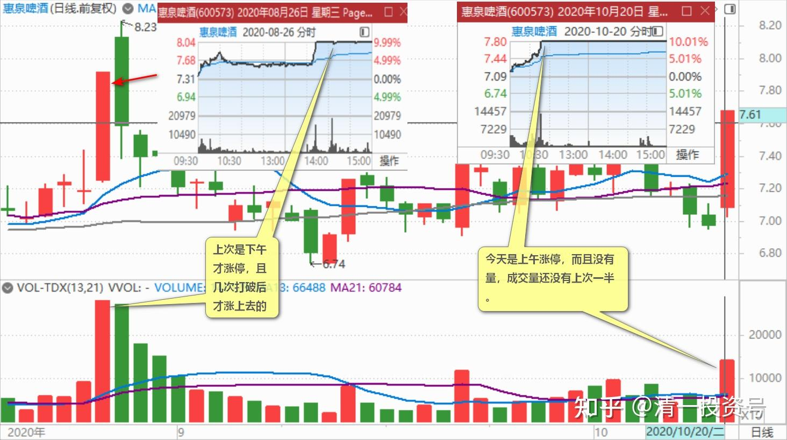
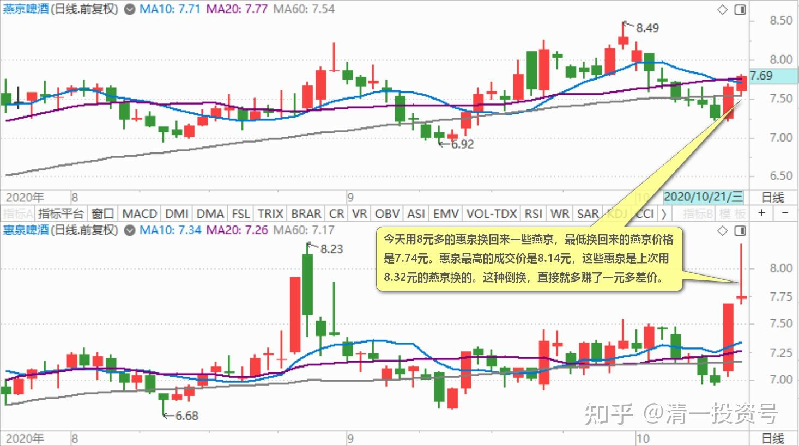
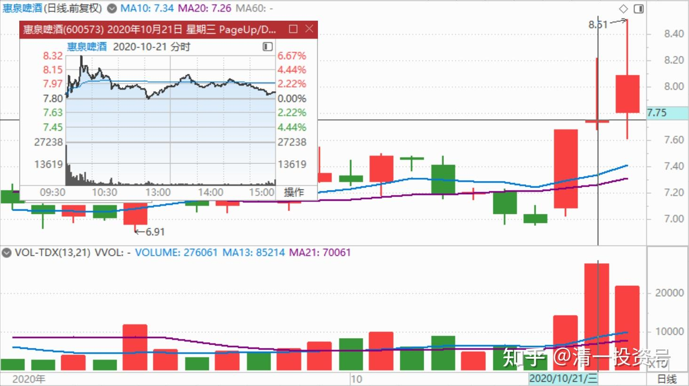
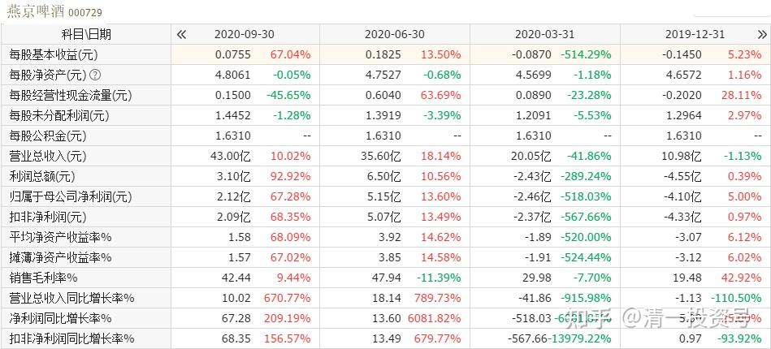

48篇.涨停是否要减持：时机、成交量、基本面配合情况

清一山长 2020年10月20日～21日

**一、涨停是否要减持**

清一山长2020-10-20 13:29:46

$惠泉啤酒(SH600573)$ 今天是惠泉今年来的第三次涨停，一个多月来的第二次涨停。以三大的身份，以及三季度大量增持的眼光，享受了这次涨停，感觉还是不错的，自我表扬一下。

上次涨停，我抓住机会，减持到只剩90万股了。这一次涨停，我是否也要减持呢？思考一下：

第一：时机，上次是下午才拉的涨停，且几次被打破涨停后被拉上去的，说明浮筹码尚多，所以走掉是明智的，其实我应该全部走掉的，连90万股都不应该留。而今天是上午涨停，而且没有量，说明这一次的浮动筹码很少了。成交还没有上次的一半。

第二：从成交量上来看，今天不需要涨停就跑。目前只有11.85万手成交，几千万筹码。压力很轻。

第三：基本面配合情况分析：上次涨停，是没有业绩来配合的游资拉升。本次的三季度，报表业绩非常的好，双位数的双增。说明惠泉在啤酒市场总体萎缩的局面下，逆向成长，殊为不易！加上走势上的量价配合良好，今天还不是出货的时候。除非换股。

如果燕京没涨的话，我再换回来7元多的燕京，就划算了，看燕京也涨了不少，价格上，比惠泉差价也不大，就一毛钱，就先等等再说。上一次燕京换惠泉很划算。这一次，再等几天看看！

清一山长2020-10-21 13:46:42

$燕京啤酒(SZ000729)$ 今天用8元多的惠泉换回来一些燕京，最低换回来的燕京价格是7.74元。惠泉最高的成交价是8.14元，这些惠泉是上次用8.32元的燕京换的。这种倒换，直接就多赚了一元多差价。逻辑是：惠泉是燕京子公司,惠泉的业绩很好，燕京应该差不了的，就赌明天三季报，看看这种博弈方向对不对。

清一山长2020-10-21 15:17:26

$惠泉啤酒(SH600573)$ 今日盘面解析——昨天涨停，但成交量很少。说明主力控盘很成功，洗了这么长时间，浮筹其实很少了。今天应该大幅上涨无压力的。所以，今天早盘成交很大，有很多看懂了图的老手就来抢筹码了。估计是昨天晚上复盘的结果。但问题是成交很大，却没有实质性的上涨行为。开盘仅仅十几分钟，就成交了今天一半的成交量，快一个亿了。我一看就糟了，主力显然是开始派发了。我也赶快跟着走了一点，挂的8.22元没成交。不过8.14元成交的。由于接单不多，我没办法大量走货。只能走一点，算一点。由于啤酒这个赛道，刚刚才开始起跑，我没必要“逃命”，就去换了燕京回来。一对一的换，差价差不多3毛钱左右。收市后，燕京股价已经高于惠泉，说明这次换股很成功。

逻辑其实很简单：惠泉的三季报好，难道燕京三季报就难看吗？不太可能的。所以，也许三季报出来，燕京也有一波拉升。尾盘看的确有资金在抢筹，看明天了。错了就认套。赚了继续换股。估计惠泉明天要继续跌吧？尾盘看这架势不好看。

**二、老燕京已经蜕变成了新燕京**

清一山长2020-10-21 19:29:55

$燕京啤酒(SZ000729)$ 第三季度当季，公司啤酒销量同比增长25%，营业收入同比增长10%，差不多是一二季度加起来的总和数了。净利润同比增长67%。

说实话我没看懂这份报表：啤酒销量增加25%，这个成绩很了不起。比利润增加更令人高兴。代表燕京的市场占有率大幅提升。不过，营业收入只增长了10%，跟销量不匹配？好吧，可能是降价促销。但是……等等。净利润大幅增加67%？咋整的？燕京卖假货吗？产品单价降低了，利润却增加了？难道不是消费升级，走高端导致利润提升的？而是卖成本更低的便宜货走量，导致的利润增加？难道是我看不懂报表？

可以安心的是：十大股东基本都在，唯一走掉的社保基金，果然是短线炒股高手，二季度低点进入买了三千多万股，三季度涨高了就果断走掉。北上资金买了一亿股。其他十大股东一动不动，继续坚持。我居然三季度减持了一些燕京换惠泉，比不上十大们气定神闲，毫不动摇，坐电梯坐得很耐心。真不好意思！不过，好歹惠泉也是燕京的下属公司，算是曲线投资燕京了[微笑]。明天的盘面预测：就算是仅仅看在24%的销量增幅上，代表燕京竞争力大幅提升。资金非追买不可。今天没及时上车的，明天该后悔了。

淡然无极24回复清一山长：（跟评上贴）

刚才细看了一下，的确是销售费用少了很多，三季度才那么一点销售费用。价量同增，费用减少，重阳赌的困境反转来了[干杯][干杯][干杯]

清一山长2020-10-21 20:06:31回复淡然无极24：

一季度的亏损额度较大，超出意外。导致燕京的一轮下跌，也让我吃进更多的燕京货。估计是一季度提前支付了广告费导致亏损[大笑]。三季度这些销售费用自然减少了，销量大幅提升，只管收获，网上的营销费用自然减少，还打开了啤酒的地域限制，非常高明的一步棋。这份三季报，显然代表老燕京已经蜕变成了新燕京。股价将开启新一轮上涨了。大家都坐好车，等这些聪明的，看懂了财报含义的，急性子的新人来抬轿吧！

(标题、图片为编者所加)

**文章音频**：

[415篇.涨停是否要减持：时机、成交量、基本面配合情况_清一投资号文章同步音频](http://link.zhihu.com/?target=https%3A//www.ximalaya.com/sound/703307784)

**参考链接：**

[40篇.这种企业，以后一定成为现金牛](https://zhuanlan.zhihu.com/p/668283112)

[41.持有期限最少3年最长15年](https://zhuanlan.zhihu.com/p/670833407)

[42篇.赔钱至少是有缺陷的](https://zhuanlan.zhihu.com/p/672139277)

[43篇.短线T、高级T和反向做T](https://zhuanlan.zhihu.com/p/673874352)

[44篇.没有等来秀场时间，依然要拼耐心](https://zhuanlan.zhihu.com/p/674885494)

[45篇.燕京的“传统”——总是令持仓者失望](https://zhuanlan.zhihu.com/p/677136646)

[46篇.风险是涨出来的，机会是跌出来的](https://zhuanlan.zhihu.com/p/677785950)

[47篇.主力的动向，说明了此股的利空利好](https://zhuanlan.zhihu.com/p/677786129)