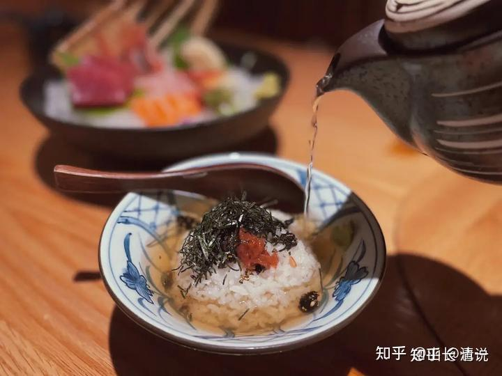

我一直认为： 中国人对于吃，有一种神圣的仪式感。无论我们做啥事情，核心的内容一定是“吃”。节日就是“大吃什么”的日子。就算是民工出来干活，也一定要吃好了。每天最重要的享受，就是要好好的吃一顿，还要专人烧饭吃。囚犯死之前，最重要的事情，也是要给安排吃一顿好的再走。

来了泰国，突然发现：这个国家的人，对吃是非常的不在意。泰国很少看到“庄严华美”的餐馆。大多数都是极其简单的小饭店，设施很简陋。回想中国的餐馆，往往都特别的醒目，不少大餐馆，就像是一个高级会堂一样华美，真的是饮食文化的差距巨大！

泰国人其实比国人更依赖“外食"。因为泰国人自己做饭吃都很少，往往都是『外卖解决』。因此中国人还传言泰国的房子没有厨房。应该是很不重视厨房吧？

泰国在村头街尾，都是有各种固定的饮食摊位，做好各种正餐食物提供泰人采购。专门做菜的，专门做饭的，各司其责。没有人会提供全流程服务。外出工作的人，往往就在路边，买了中饭就带走。我们呆久了，也习惯这样的方式，上周带孩子们外出旅游的时候，就路过菜市场。买了中午吃的菜饭，免得中午到处找吃的不方便。到南邦草地上吃完饭就讨论，游玩。基本上不依赖饭馆了。在中国似乎没法这样安排！因为似乎很少有市场提供做好的饭菜直接吃。

我们工地上干活的泰国民工，就是早上上工的时候，带一点食物过来，每份也就是10B，或者20B的样子。中午的时候，随便找个阴凉的地方，吃了饭就休息一会下午干活到五点，回家的路上，继续去买一点食物带回家。就当晚餐了。泰国人最喜欢的食物，一般就是10B的糯米饭，外加一块炸鸡，10-20B一份。这就是一餐了。讲究一点的，会买一份20-30B的菜。外加一份饭（5-10B）。甚至有工人就只吃一份菜粥，10B一份，就当一餐了。我和小女也喜欢买这种泰国粥吃。有时候我会卖30B一份的菜，一般来说要吃两三顿甚至更长时间才能吃完一份。但菜量并不多，泰国人一餐的量------中国人估计要吃两三份才够吧？我只是吃得菜很少，但饭量要比一般的国人大一点！一般是两碗米饭的量！

可以看出来：泰国人很不重视吃饭。也不重视全家一起在家吃饭，做菜做饭的。这些外面的菜饭也很干净。这个民族与印度人不一样，非常重视卫生。没有人认为外面吃饭有啥不妥的。我们都习惯了外来买饭吃！

这种生活习惯，大大节省了时间精力。中国人我看每天做饭都要把自己累死了。家庭主妇，每天从规划饭菜，去菜场超市买菜，回家清理菜品。各种做菜，色香味俱全。每天三顿，成为围着厨房转一生，你们认为这种生活有啥意义？都是白忙活，花钱还吃出一身的病来。

我和家人的吃法极其简单，身体也轻松，人就更轻松了，孩子想吃就吃，不想吃就不吃了。有时吃点水果就算一餐了！这是生活方式，低碳，营养，健康，环保。为什么要为了一点口腹之欲，让自己被食品利益集团绑架呢？

链接：

[也说：为什么日本人会用炸猪排下饭？](https://zhuanlan.zhihu.com/p/681040238)

织田信长在桶狭间决战前，则是先跳了一支村敦舞，然后吟诵了著名的诗句，「人生五十年，如梦也如幻。有生方有死，壮士何所憾」，最后也是喝了一碗茶泡饭就出战了。可见连织田信长这种立志“布武天下”的超级大名，给自己准备的“壮行饭”依然简单。日本对于米饭的情怀真的是食物天花板。大米饭吃着噎，就泡茶水往下送。从中可以看出来，那个时代日本的粮食和蔬菜的确很匮乏。哪怕一方势力首领，也没吃过啥好东西。

*日式茶泡饭*

日本的茶水泡饭这样子。不过我更喜欢用泰国的黄豆酱加上开水泡饭吃。在日本，饭就是核心。中国好像相反-----吃菜才是核心，口味才是王道。至于是否有营养，是否对身体好，统统就不关心。导致中国“病从口入"，非常影响国人的身体状况。实际上，很多菜对身体的作用是负面的。不说肉类了，就算是蔬菜。其实大多数是身体不需要的东西，毫无营养可言。烹调过程中甚至带来更多的对身体不利的化学物质。

清迈的武道馆，木兰和武士们，执行的就是古代道家的饮食方式。吃的菜品种和量都很少，但饭足够。接近于日本古代的吃饭状态！这种吃法，身体很舒服。偶尔时候我会酱汤泡饭的时候，吃一点鱼肉。上次去泰国的周末市场，买了一条20泰铢的烤罗非鱼，结果我花了三天时间才吃完。就是不想多吃，吃一点点就够了。慢慢体会到古人生活简单的智慧。

上面的文章，说是日本人这样吃，是因为过去的日本很穷，没啥物资。但为啥现在的日本人，吃的也是差不多这样呢？极其简单朴素。泰国的人，吃的菜也很少。有点类似日本人！

原来我们家还有一种煮饭的方式。会把土豆切块后，一起放进米饭里面煮出来吃【混合菜饭】，放点油盐进去拌饭，又好吃，又简单。根本不用专门的做菜，营养也好。早上煮一锅饭，一天都够吃了。这样一天节省出来的时间。陪孩子玩玩游戏，走走路，听听音乐，看看书都好的。干嘛每天在厨房里面忙活三餐饭呢？

当然，现在就更简单了，连土豆都不要了。直接煮白米一锅，吃的时候开水泡一下，放一点豆酱，买了一袋洋葱放在家里，吃饭的时候拿一个拨开，切碎了直接就放在饭碗里面，生吃洋葱。这样吃，维生素绝对够量了！

所以，我们家的油烟机，可以十年就不洗。大家可以想象一样----也许你大鱼大肉，身体里面恐怕就像油烟机一样淤堵，自然各种毛病都出来了。

想要健康，长寿，还是要学学古人的智慧。别以为现代人啥都懂。我们就是科技强一点，其他地方，还是谦虚一点对自己更好！