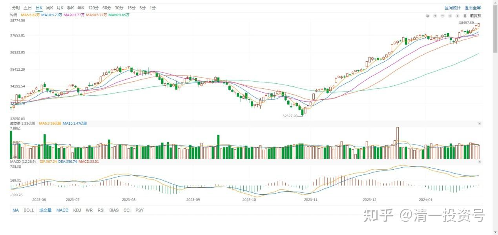
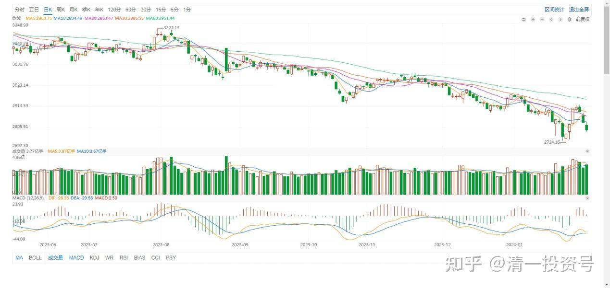
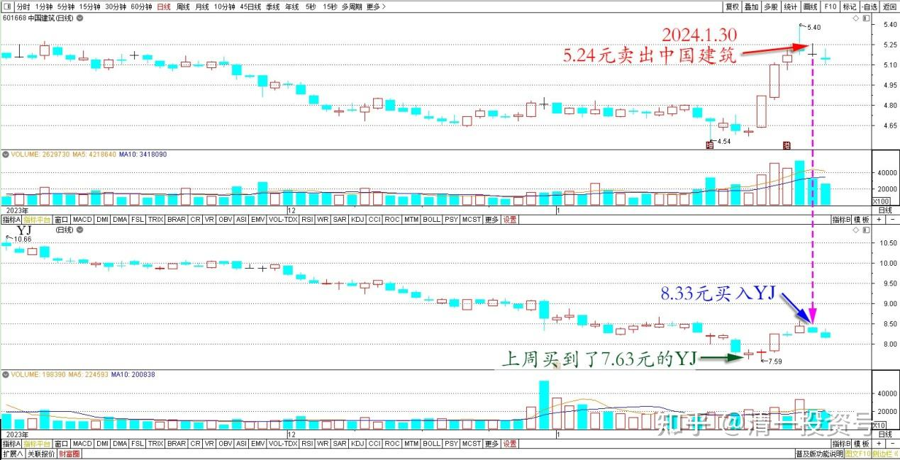

70篇.金融战·中建换燕京啤酒

清一山长 2024年1月30日

偶然看了一下道指，居然创新高了：38333.45。

道琼斯指数 2023年6月～2024年1月 日线

怪不得A股最近跌惨了。

上证指数 2023年6月～2024年1月 日线

我的账面损失也很大。只是——**手头持有的股票已经增加了不少。股指如果回到原位的话，我的市值就会创新高了**。很高兴我上周还买到了7.63元的燕京啤酒，**低位的时候没有恐惧**。今天还卖了一些看样子是有资金护盘的中国建筑：5.24元卖出，反手就买入了8.33元的燕京啤酒。

中国建筑和燕京啤酒 2023年11月～2024年1月 日线

有机会我就一直加仓，看燕京啤酒有无跌破5元的本事。反而**我还有现金股置换来买，敢跌我就买。涨了就一路卖**。我还是想不通：美股一直涨上去？一直涨到天上吗？中美金融战，打得这么猛吗？美国股指现在根本就没有上涨的理由，国内都闹成啥样子了。难道是想要拉崩中国吗？绝无可能的，看谁会撑不住先崩了。

(标题、图片为编者所加)

**文章音频：**

[416篇.金融战·中建换燕京啤酒_清一投资号文章同步音频](http://link.zhihu.com/?target=https%3A//www.ximalaya.com/sound/704261368)

**参考链接：**

[60篇.中国建筑安心买入，珠江啤酒价格很香](https://zhuanlan.zhihu.com/p/667041164)

[61篇.投资养老新模式？比退休金更可靠的金融账户养老收益](https://zhuanlan.zhihu.com/p/668298628)

[62篇.YJ前三大股东研究](https://zhuanlan.zhihu.com/p/669500082)

[63篇.负成本——换股的功劳](https://zhuanlan.zhihu.com/p/670185909)

[64篇.重庆啤酒的主力拉升分析（事后诸葛解析）（配图版）](https://zhuanlan.zhihu.com/p/671473163)

[65篇.惠泉异动，借机换股](https://zhuanlan.zhihu.com/p/672731534)

[66篇.金融理财？干嘛非要把简单的事情做复杂呢？（配图版）](https://zhuanlan.zhihu.com/p/672554704)

[67篇.A股破位下跌的奥秘](https://zhuanlan.zhihu.com/p/673876597)

[68篇.2023年最后一份持仓总结](https://zhuanlan.zhihu.com/p/675454059)

[69篇.股市大跌，中建换啤酒](https://zhuanlan.zhihu.com/p/680236538)

