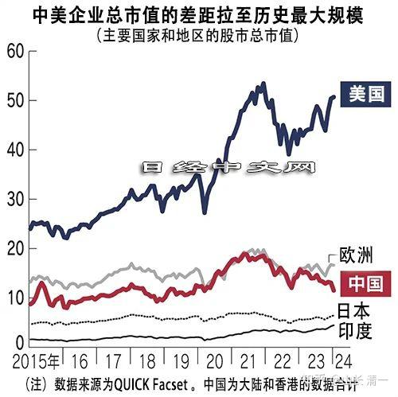

这个消息在网上流传。中美企业总市值拉大至历史最大差距。给人一种美国最强，而“中国要垮”了的感觉。文中的很多观点，都透出了这种判断！但我的观点恰好相反。也许目前就是我们历史上最大的财富机会，现在正在给我们最好的投资中国龙头企业的机会！我们有机会抓住就可以获取最大的利益！

[美国总市值逼近全球一半，中国降至1成](http://link.zhihu.com/?target=https%3A//mp.weixin.qq.com/s/ZPDj8STjw2LpjIzLgdtYNQ)

理性一点我们就知道：一直到2023年，中国虽然陷入低迷，但中国的经济还一直在成长。特别中国最近一两年，在高科技上取得重大的突破，在新能源汽车上，造船业等等上，突破非常的亮眼。

中国依然是世界第一的制造国家。中国的GDP总值，跟美国的经济体量非常的接近（有人计算的数据，中国的实际GDP是超过美国的，中国有意压低了GDP，而美国放大了GDP），这些都是实体的经济上的比较。中美现在是两个全世界最大的经济体！

但美国的市值，居然比中国高十倍？难道你们真的相信这是理性的，合理的吗？虚体经济的数值差异，难道能够说明实体的差距吗？

两个差不多的巨人，站在两台不同的称上，显示出来的数据却是十倍差距。你真的这个称量的工具是不是合理的？还是真的觉得美国比中国强十倍？

在我看来：要么美国现在虚胖极其严重，金融注水很严重。要么是中国过于低调，现在的中国严重低估。

未来其实只有两种可能----要么美国向中国看齐，回归正常估值。要么中国赶上美国。涨上去才正常。

我今天偶然注意到账户的：当日账户盈利数值。突然发现今天是我有史以来记忆中账户资值增加最多的一天。那么昨天黑色星期一，有可能就是我账户缩水最多的一天。这一天涨跌值，比如2014年上半年的总资产都多。那么----您认为我昨天的资产是“市场的正确估值”吗？还是我今天增长了很多的账户资产，才是我的“真实资产”呢？

其实都不是，都只是市场先生的疯狂报价罢了。真实的资产，是我持有的公司，每天在创造的产值。这个据我所知，是一个每年都在不断增长的正常发展的资产。没有发现我持有的公司在走下坡路。但他们的股价，每天不断的涨跌！这些都是不真实的报价。代表了市场先生的不理性！

我认为：中国美国的真实的区别，就是这样明显的---在物质世界上，真实地创造财富的能力，是中国的企业更强。每天都在为全世界生产各种产品。而美国的企业，为世界创造了什么真正的价值？还是美国的华尔街印刷出来了更大的票子吹肥了美国虚假的市场？哪一个，才是市场的真实价值？

中美的真实体量，都知道是差不多的。现在居然估值上相差十倍。万一等有一天，等全市场都明白了我的这种基于【企业制造产生的真实物质价值】的计算估值方式之后，对现有的资产来一个“资产重估”的话。您认为是美国降低十倍来和中国接轨？还是中国上涨十倍和美国接轨？或者美国跌50%，中国涨5倍？

当然，也有一种可能，是美国真的很牛！与中国的差距可以继续拉到20倍去！就像40多年前的中美差距一样。我们追赶美国，越追越远了。如果您就是相信中美差距，就是这种差距的话，就欢迎您投资美国！

但我更相信中国正在强大，美国正在衰弱！

因此，我的绝大部分的资产，都在投资中国！