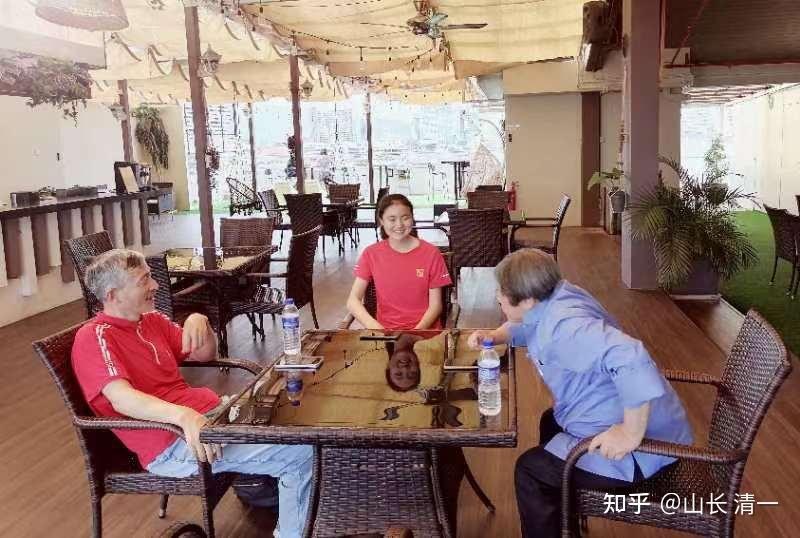
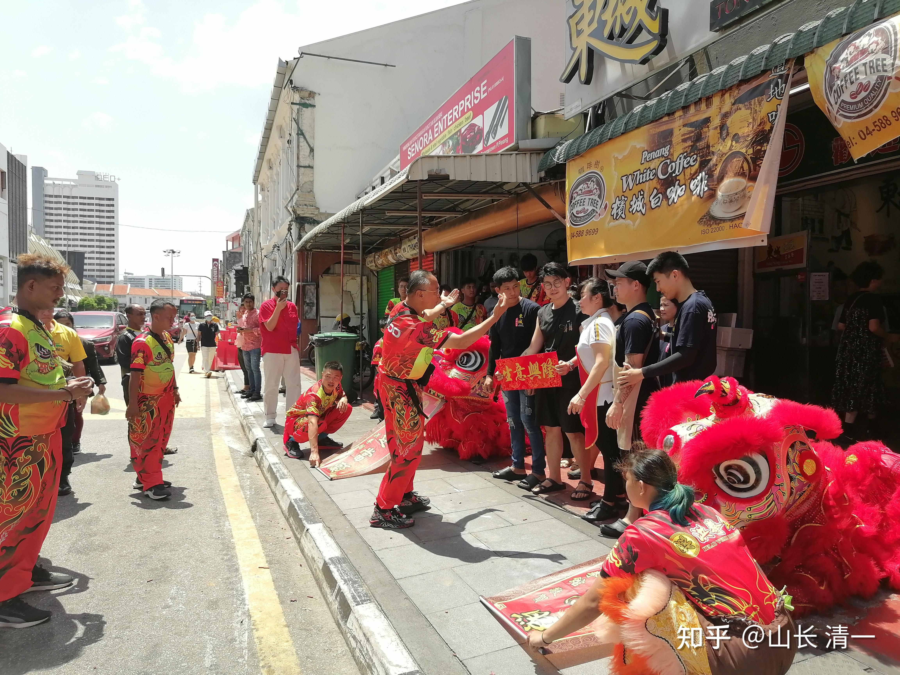
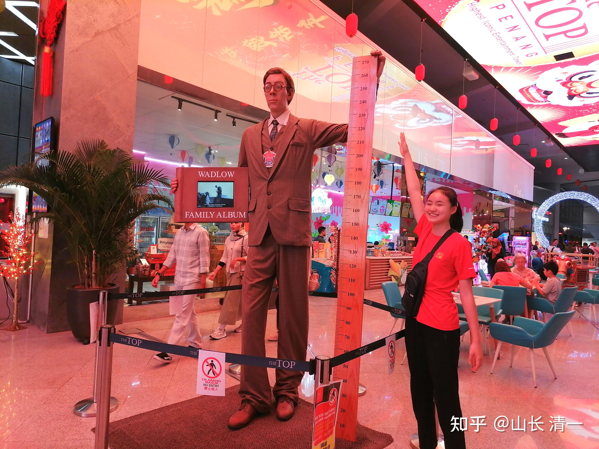
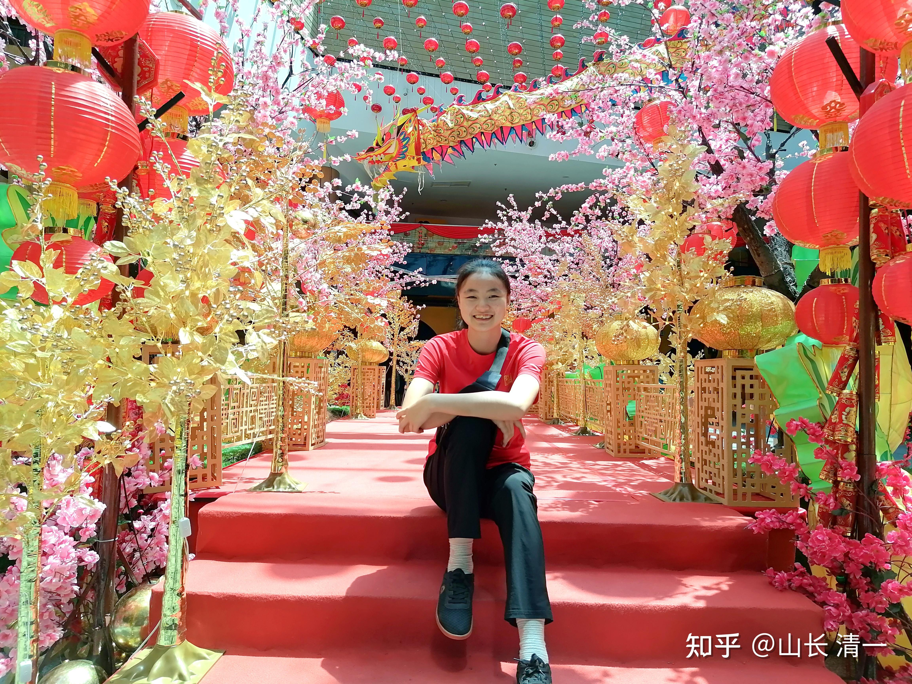
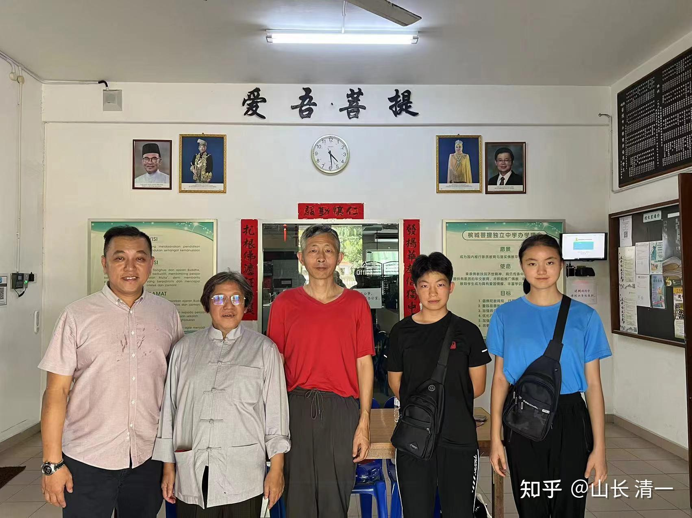
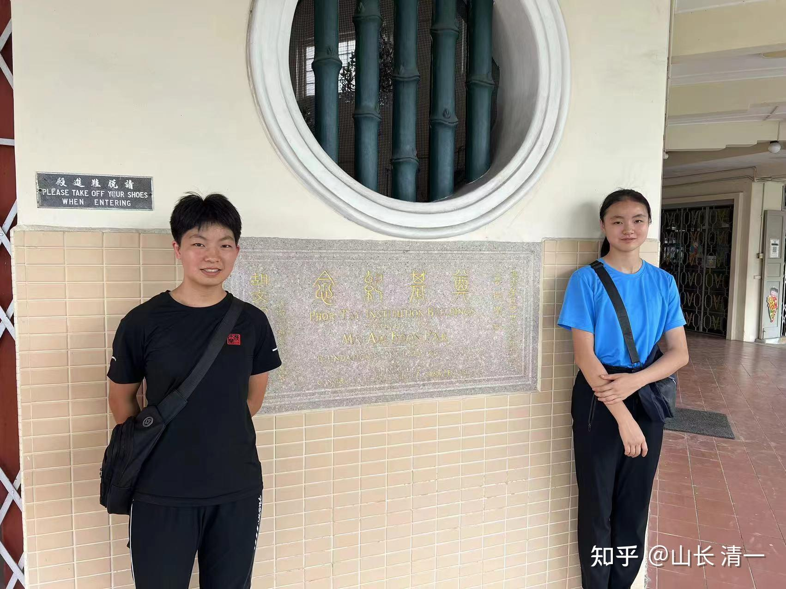

这次来槟城，是我第一次来马来西亚。因为我的师父，让我们考虑到马来发展新教育。我一直想不通：马来有啥好处？气候和生活还不如泰国，交通便利不如老挝。办学自由度-----应该三国都差不多。我们作为外国人，这三个国家都不太管我们怎样教学生。似乎我们已经有泰国和老挝教学基地，没必要考虑马来西亚发展的。

但基于对师父的尊重，我还是决定亲自来槟城查看，结果真有一些不一样的发现！马来真的华人的根还在。

之前我在网上看了一下槟城的介绍攻略。因为都是看的中文网络信息，结果让我以为：槟城就是一个和清迈差不多的城市，一个停留在时光机器中的，具有古老历史和小资情调的中古城市。等到达之后，却愕然发现：槟城比清迈的现代化程度高很多，也更发达。网上看到的哪个“古老怀旧的槟城”，其实仅仅是乔治市区海边，一块面积并不比清迈古城大的古城区。周边就是繁荣得多的现代建筑，不亚于中国的繁华的城市。

估计中国人心中槟城的样子，就是一批只来这里的古城旅游区住上一两天，拍几张照片，到处追吃粉红店裸条汤，就宣称已经了解了槟城。就如同一个人去了清迈古城，以为泰国就是这样子的。其实清迈人并不认为清迈古城就是清迈-----我们其实很少去古城！ 这里的生活很虚假。

我们约的当地华人朋友，让我们住在旅游区中心区的酒店。因此刚来我疑心重重的，总觉得这个地方看起来不对劲。就像第一次到泰国。住在古城一样，总觉得这个国家有点不对劲。今天有机会“不用当地导游”，我们三人自由行，坐公共汽车跑很远。都是去当地人的地方，让我们看到了更多，更真实的槟城！

*与道理书院的“山长”王教授聊天，他也是一个当地大学的副校长*

我们发现一个非常特别的事情。这里的华人，非常自豪和自然地使用中文交流！也许除了大陆华人外，其他的全世界华人，都不同程度地鄙视自己的华人身份！也被别人鄙视。我们的木兰们因为素质良好优雅，在泰国，很多外国人刚开始接触，会很热情的问候她们：问她们是不是日本人，韩国人。但一旦回答了自己是中国人之后，马上别人就冷场，变脸，离开，根本不想理睬你。深深感到“中国人”身份在国外的分量，弄到刘老师在泰国期间外出，都不愿意公开讲中文。宋老师在泰国办事情，常常会与泰国朋友（她的司机）一起外出谈生意，别人问她是哪国人？泰国司机就帮回答是台湾人。宋老师诧异说我不是台湾的，是中国大陆的。泰国司机说：说你是台湾人好一些。因为----泰国人不太喜欢中国大陆人，会刁难你的，买东西价格会故意报高的。我还亲自遇见一个中文很流利的超市女孩，跟我们说话。我很高兴的问她是不是华人后裔的时候，她坚决地回答：不是的，我是泰国人，纯泰，不是中国人！其实--她的脸型根本就不像纯种泰国人的，绝对有华人血统。

我春节还去过华人村，没啥年味了。除了老一代以外，年轻华人，互相之间都不说华语了，甚至根本就不会华语。我们外出往往只能用泰语交流。中国的大学，免学费还给工资补贴泰国华人去上大学，很多泰国华人还是不愿意好好学华语，去中国上学！反而专心学习泰文。因此，骨子里面，世界上华人的社会地位，以及自我认知，应该是很低的！东南亚的华裔，可以装作自己就是“本土人”。因为人种差不多。其他国家肤色你就装不出来撞，就在其他方式上装。中国的女子就想改造基因，让下一代变成真洋人，特别热衷与外国洋人上床。因此海外的中国男生其实很寂寞----包括本国的女生都不喜欢跟他们约会！----有可能，全世界华人地位最高的地方，认为“华人才是宇宙第一强人”的地方，大概就只能在网上，在知乎上吧？实际上，大陆人自己也对自己没信心的，都以崇洋为荣。上海的年轻白领，聚会的时候都习惯说英文，只会说中文的人会遭到鄙视----华人自己鄙视自己！这种情况多了！

华人被鄙视，典型的案例就是几十年前，马来西亚立国的时候，华人比例最高的新加坡，被拒绝加入马国联邦。李光耀得知消息都哭了。然后新加坡不得不独立建国。走上一条自强之路----其实是走上一条西化之路，抱紧英美的大腿，跟上了工业化和现代化的脚步。现在的新加坡，表面上是华人，骨子里面是英国人。在新加坡说华语会被鄙视的，认为你没档次。学校的教育，当然以英文为核心了，说华语是没档次。但新加坡居然有两所大学排名差不多世界第10名左右，经济收入也是发达国家行列，因此也算是华人【改换思想基因】，跟随英美化成功的案例！大多数海外华人，也是思想上的英美人吧？

我以为：华人海外地位也就如此了，被歧视甚至被自我歧视。没想到来到马来槟城才发现：华人可以很自豪地以自己的华人身份存在。很享受自己的华人身份，而不是回避自己的华人地位！

这里的华人， 不认为自己是“中国人”，只承认自己是马国的“华族”。称为马华人。我认为这是因为马国对华人，对其他族裔，给于了相当的尊重。比如：马国虽然信仰伊斯兰教。但允许其他教派自由存在。教育上，马来人自己运作自己的教育体系，走英国的教育模式道路，马来西亚国立大学还排进了世界TOP100大学。但却给了华人独立办学的权利。马国有1300多所华文小学。还有61所【华文独立中学】，走自己完全独立的教学方式，华人自己出资，自己管理，自己考试。当然，还有印度人自己的独立学校。在槟城有小印度街，完全的印度风情和食物。所以----至少我看到的马来西亚，是一个比泰国在教育上更宽容的国家！与我原来想象的伊斯兰极端政教合一的国家，区别还是很大的！我们在这里与穆斯林打交道也较多。真的很礼貌文明的，没有歧视华人的感觉！

我发现：有可能保留了中华的骨气和华人传统的国家，只有马来了（原本还有印尼，但因为70年代排华，很多人死亡和逃离了）

这一天，全程观看了一个洪拳的舞狮子，慢慢领会了狮子背后的“人文人脉关系”，看到老板拿出几十个红包出来发给卖力表演的洪拳社老师傅。后来我了解到：洪拳属于天地会的下属，而天地会现在一直都存在，并不是只存在金庸的小说里面。真实的身份和地位。他们在南洋的政治，商业界都很有地位。当地朋友还要介绍一个分舵主跟我认识。真的是长见识了！

*洪拳的舞狮队，正在一华商店前舞狮庆贺春节*

华人春节：据说马来西亚的春节。是最有节日气氛的。现在的马来人，印度人，都跟着一起搞春节节庆活动。因此很多华人喜欢来大马体验华人春节。

*身高快赶上我的Ella，在槟城跟世界上最高的人比高*

*小保镖ELLA在设置的春节盛会的台面上 照相*

*探访当地华人中学，与州议员一起合影。这是他选区的学校！*

当地华人学校的中文教学水平很高！应该是海外华教最成功的地区！

*上面是这个学校的捐款人的纪念碑刻。民国时期捐建的学校！*

华人做好事，建设记录的这些建筑，都会留下他们的名字。国内似乎没有这个传统！我们很多东西，都好像飘来的一样，没有历史感了！

明天，准备去一个华人在海外建立的国家【兰芳共和国】去看看。地点在东马！几年前，我们学校来过一批东马的学生，我们教了他们一个月，他们对新教育非常的感兴趣。一直邀请我们来马来办学。华裔老板拥有当地的数千亩土地，说我要多少地就送给我们建学校。可惜当时我不想来马来发展，所以没有要！这一次来看看---东马是什么样的情况？当年的兰芳共和国，其实就是天地会的国家。理念很先进，不许传给自己的后代，只给有德行的人。要比当年的大清国先进的多。可惜这个建立了很多年的国家，却在上世纪，被拥有现代武器的荷兰人灭了国。现在，原来的华人国家的首都，就在东马附近的西加里曼丹。如果这个国家能够持续到今天， 应该比新加坡更有影响力吧？