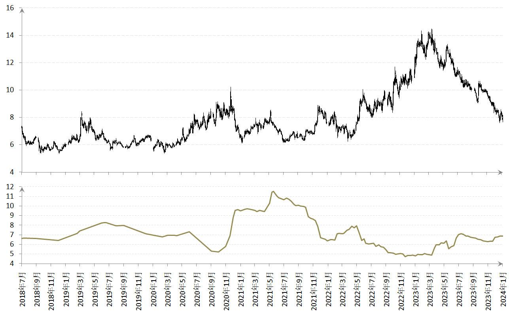
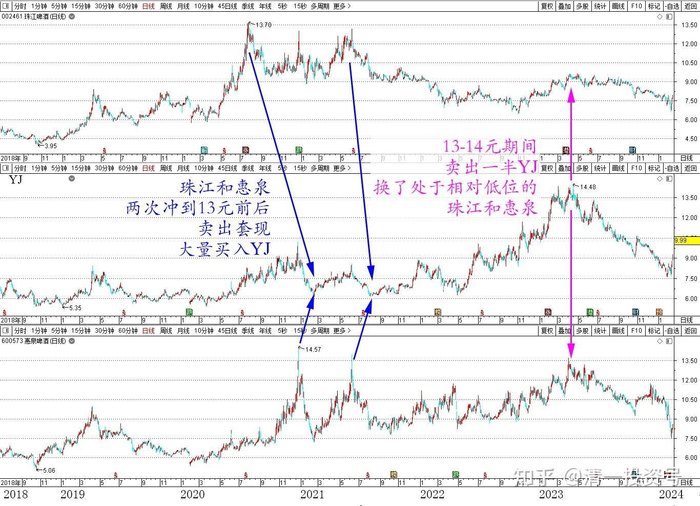
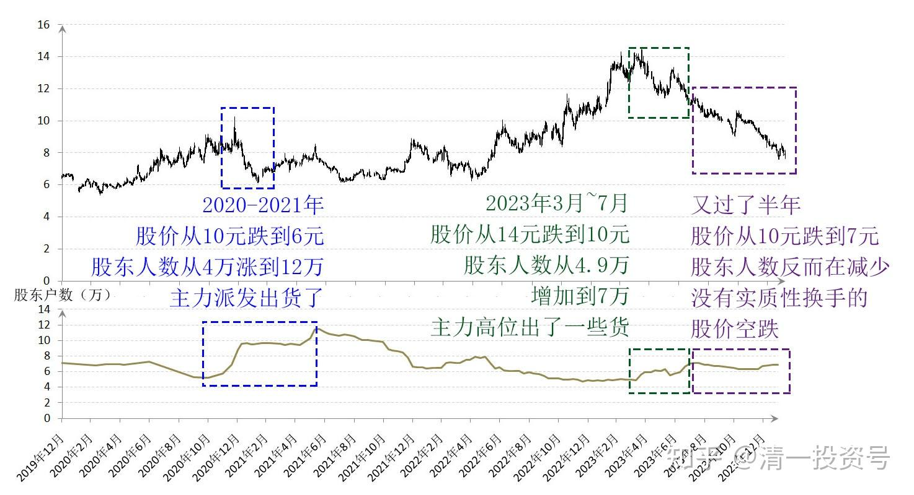

72篇.顺鑫农业现在还能买吗？（下）（配图版）

清一山长 2024年2月1日

看到这里，你就知道文章题目的答案了：现在顺鑫农业的价格的确很有吸引力，但是确定性远远不如燕京靠得住。我刚开始买入燕京的时候，燕京股东人数是6万多。现在五年过去了，还是6万多人，几乎没啥变化。2020年10月，燕京突破10元高价的时候，燕京的股东人数还降到了5万2千。之后就是股价一路下跌，股东人数一路增加到了10万～11万之间，价格也一直狂跌到6元多。说明主力派货成功。这一轮的高低起伏，我的燕京虽然买了一点点，但持有并不多。当年我的主力仓位是珠江和惠泉（都进入了十大），这两只股，两次冲到13元前后，我赚了两次，全部都卖出套现了。然后趁着燕京当年处在下跌期间，我用高价卖出珠江惠泉的资金大量买入燕京，最终补成了燕京十大。2021年6月，燕京股东人数创新高，快12万人了，股价也接近6元，我的账上燕京持股创新高，但盈利实在难看，颜色是绿的。此时，很多散户股民显然低位接盘了。

2022下半年开始，燕京从6元多的价格，一路上升，涨到了14元多的历史高峰，我的账面也随之创出新高。股东人数也缩小到了4万9千多人，算是历史新低。

燕京2018～2024年日线和股东人数

我在13～14元期间，卖出了一半多一点的燕京仓位，现在看样子，筹码是被主力拿走了！因为散户跟风似乎并不多。这恐怕也是这一轮燕京必然要打下来的吧？主力白白的辛苦拉升，却无人接盘。当然只能回调了。我原本已经跑掉的资金，换了当时处于相对低价的珠江和惠泉，再次进入了这两家公司的十大。直到最近燕京大幅下跌，我的惠泉基本上卖出换了燕京，珠江也卖出一部分换了燕京。

珠江、燕京、惠泉 2018～2024年日线

相对2020年～2021年的这一次大洗牌，从10元跌到6元的这一波，股东人数从4万多，大幅上涨到了12万左右。显然燕京的主力是派发出货了，股票都到了小散户的手中。但是——现在这一轮股价，燕京从14元的高点跌到7元多的低点。下杀的幅度，远远比2020年的这一轮还要惨烈。但观察股东人数，居然只是从股价最高的2023年3月4.9万人，跌到7月份，股价跌到了10元多期间。股东人数已经增加到了7万多人，应该说：主力还是高位出了一些货的，明显有派发迹象，也说明散户还是跟了一些进来的。

但最诡异的是——现在又过了半年，股价从10元多，居然再度狂跌，跌到了7元多。相当于2020年同样幅度的下跌，但查看股东人数，并没有大幅增加，反而还在减少？这说明：现在的情况，与2021年已经大不一样了。你们认为这一次大跌，叫做出货吗？我认为这就是“空跌”，没有看到实质性换手的股价空跌，主力账户是“浮亏"。与上涨中没有人实质性接手的“空涨”是一样的，都是主力玩的账面游戏罢了。实际的资本，并没有发生“转移支付”。

燕京2020～2023年日线和股东户数

这样一对比，大家就知道了：顺鑫农业虽然现在的价格很低，看起来很吸引人。但由于主力已经明显走掉了，现在筹码基本上都是在散户手中，你能指望这群散户能够维持局面吗？未来可能会有反弹，但想要大幅上涨是没可能的。当然，大幅下跌的空间也不大了。但主力要想重新进入布局的话，时间上算是划不来的，趋势上也并不明智。现在应该没有什么主力，愿意来建仓白酒股的，因为现在的趋势不对。白酒行业都在跌。特别是顺鑫这种原来爆炒过的股票，想要重新吸引人气非常的困难。**假如主力往上做，一路上遇到的都是套牢盘，散户解套的抛盘压力会很大。**所以，除非牛市资金过于充沛。否则一般来说主力是不愿意来做这种票的。可能要等很久以后，甚至这一代吃了大亏的股民，都遗忘掉顺鑫的教训之后，主力才会重新开始一轮新的运作。

当然——如果顺鑫的基本面发生重大的改变，主力也会快速进入的。不过——**白酒股这几年都是爆炒得很厉害，早就透支了题材。**因此未来几年内，我都不看好白酒股。而且中国老年化开启之后，经济下行，白酒的“社交题材”不再具备，恐怕未来很难维持良好的业绩！**也许——这几年白酒大量出现的十倍股，就是白酒行业20年内你们能看到的“最后辉煌阶段”了。**这就是虽然过去我在白酒股上也获利盛丰，但这几年白酒大幅回调，我一直没有重新买回来的原因。**有些时候，赚了就要该离开了。别想着上了宴席，你要从头吃到尾。我们需要学会吃好了就离席，除非你就是喜欢留下来买单！**

**人真的不要太贪心了，会不得好报的！**

燕京这一轮，如果不跌破10元，我很难下决心重仓持有燕京的。毕竟原来都已经离开大半了。如果没有跌破8元，我最多买回原来跑掉的部分补仓。现在既然老天给我机会，能够买到破8的燕京，我就买回比原来2021年更多的股票好了。目前燕京持仓量，已经超过我持有的酒类股票的历史高峰，算是超仓买入。一旦上涨超过30%，我会卖出超仓部分燕京。甚至燕京的主仓我也会根据情况随时调整，随时进出！我是不拘一格的人，没有啥固定的套路！别说我一定通知各位的。大家根据自己的福报来选择进退吧！

谢谢各位！

(标题、图片为编者所加)

**文章音频：**

[421篇.顺鑫农业现在还能买吗？（下）_清一投资号文章同步音频](http://link.zhihu.com/?target=https%3A//www.ximalaya.com/sound/708766852)

**参考链接：**

[61篇.投资养老新模式？比退休金更可靠的金融账户养老收益](https://zhuanlan.zhihu.com/p/668298628)

[62篇.YJ前三大股东研究](https://zhuanlan.zhihu.com/p/669500082)

[63篇.负成本——换股的功劳](https://zhuanlan.zhihu.com/p/670185909)

[64篇.重庆啤酒的主力拉升分析（事后诸葛解析）（配图版）](https://zhuanlan.zhihu.com/p/671473163)

[65篇.惠泉异动，借机换股](https://zhuanlan.zhihu.com/p/672731534)

[66篇.金融理财？干嘛非要把简单的事情做复杂呢？（配图版）](https://zhuanlan.zhihu.com/p/672554704)

[67篇.A股破位下跌的奥秘](https://zhuanlan.zhihu.com/p/673876597)

[68篇.2023年最后一份持仓总结](https://zhuanlan.zhihu.com/p/675454059)

[69篇.股市大跌，中建换啤酒](https://zhuanlan.zhihu.com/p/680236538)

[70篇.金融战·中建换燕京啤酒](https://zhuanlan.zhihu.com/p/681428626)

[71篇.顺鑫农业现在还能买吗？（上）（配图版）](https://zhuanlan.zhihu.com/p/682697509)

