目前，我们已经成功打通了清一新教育的国际教育快速通道。而且得到的成果，完全超出我的预期。

2024年9月，今日新教育的16岁高中生，就可以正式上国际标准大学了！还可以同时上两所大学。而且四年后，我们的学生就可以拿到三所大学的正式毕业证和学位证。其中有一所大学，是世界排名TOP100的世界顶尖大学（或者是中国的985大学，根据学生的愿望来选择三加一的大学)。这种学历，可是硬邦邦的，还是国际名校的标准。

20岁的黄金年龄，在其他的选择了中国高考道路的学霸，辛苦了12年，勉强考上大学后，还在传统的体制大学读大二的时候，清一新教育的学生，却连玩带学的拿到了三所世界知名大学的毕业文凭，这种人，当然就是妥妥的“人生赢家”！

这一次，到马来西亚开辟新通道，我与一些校长进行了深入的交流互动！经过资深关系的介绍，我注意到一所华人当大学校长的新型大学。而且该校学术成绩极为骄人，成功进入QS世界排名榜。 该校校长，对我们学生的学业成绩表示尊敬，虽然马国更喜欢用英联邦的教学规范来进行入学要求，但校长允许我们的学生，拿美国的国际标准考试成绩来申请入学，如SAT等成绩入学。不再要求我们的学生提供高中毕业证！而且，该校校长还是美国MIT麻省理工的面试官，可以推荐优秀的学生去MIT上大学。

但最重要的是：家长们并不希望学生过早脱落高中成长的成熟指导，完全进入自由管理的大学时代。特别是青春期时期，新教育的教师心理行为辅导，对学生的成长关系巨大。因此：我要求我们的教师将随行对这些学生进行课程和生活的辅导。该校校长表示：他们愿意特事特办。尽量满足家长和学生的要求！只要学业成绩良好， 这一切都好说！

还有更大的大礼包在后面：

我们将进行3+1的双学位学习进程：我们的学生，在该大学学习三年后，就可以获得本科毕业证书，以及学士学位。然后该大学将协助我们与更高级的大学进行“接轨”------让与该校有教育合作的世界前100名大学，与该校我们学生进行学分互认，然后去这个世界前100大学学习一年，就可以发给我们世界前100大学的毕业证书和学位证。等于我们用四年时间，学生20岁，就拿到了两个QS排名大学的文凭。

纵横全世界，谁还比我们的清一新教育更牛？

不是说三所大学吗？

当然---第三所“世界知名大学”的毕业文凭，也将在学生拿到两所QS大学的学位证之后，有我个人来颁发我们的【清一大学】毕业证。这所大学在几十年后，就比耶鲁和哈佛更牛了。因为清一大学是全世界唯一培养拳霸和学霸双霸合一的大学，未来的几十年，清一大学的学生，在全世界夺取了数百名格斗全国冠军，以及世界冠军。

您认为：全世界还有第二所这样牛的大学吗？

果然：妖风吹过之后，我们迎接的，是更加晴朗的天空！

清一新教育----大家一起加油，共创辉煌！

以下，是该校校长亲自发给我的该校照片：可能是马来西亚最漂亮。建筑上最有世界名校范的大学了---

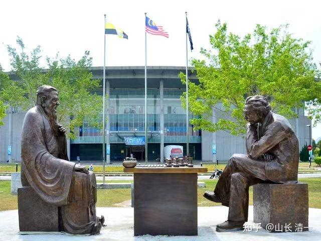

这一张照片，反应了该校建设【中西合璧】现代大学的精神气度，注意到是古装华人面前的围棋，和穿西装的罗丹【思想者】形象雕塑的国际象棋对弈，颇有深意！

该校目前以理工科作为核心课程，对标的大学就是MIT，想要成为马国的【南洋理工】。一度成为世界排名第11名的新加坡理工科大学！

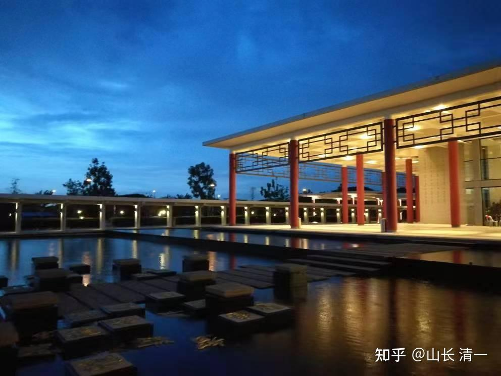

*“新中式”的现代化教学楼*

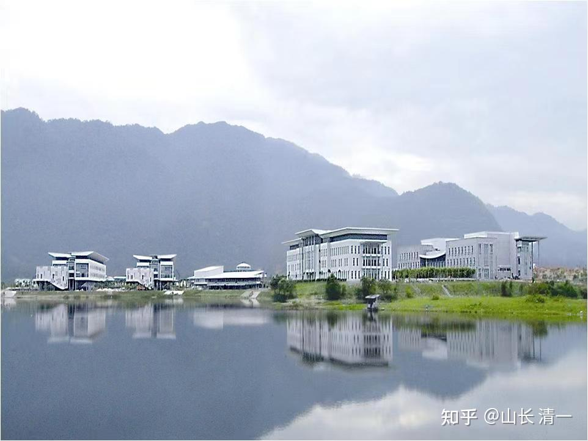

*美丽湖畔的大学校区风景*

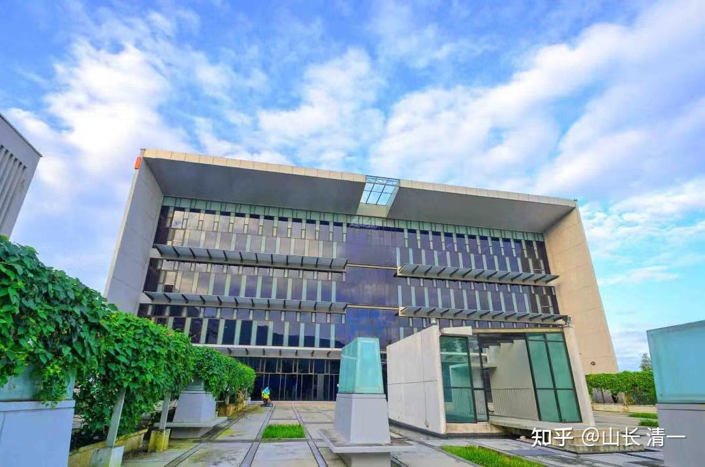

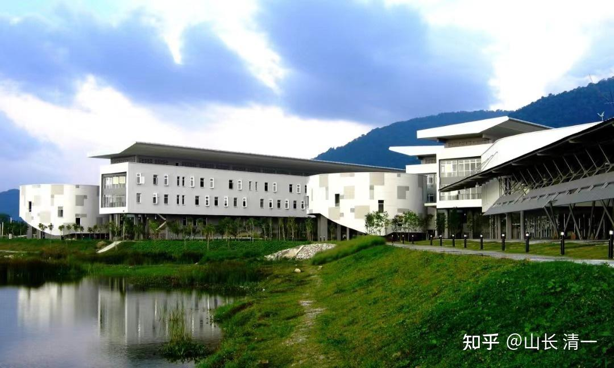

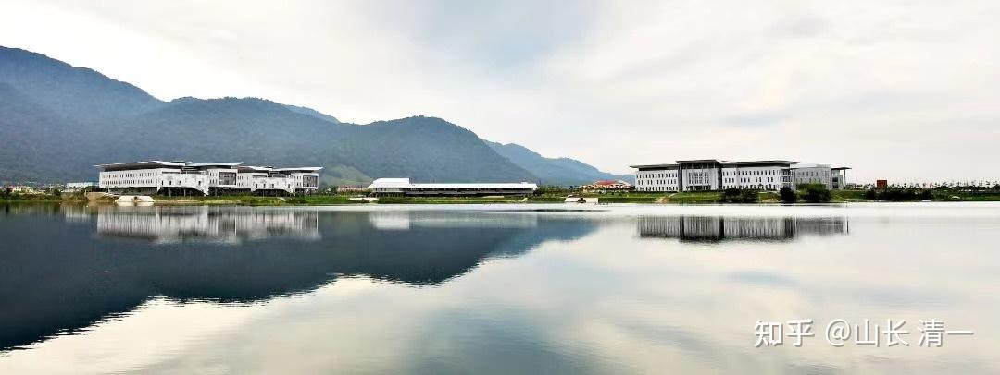

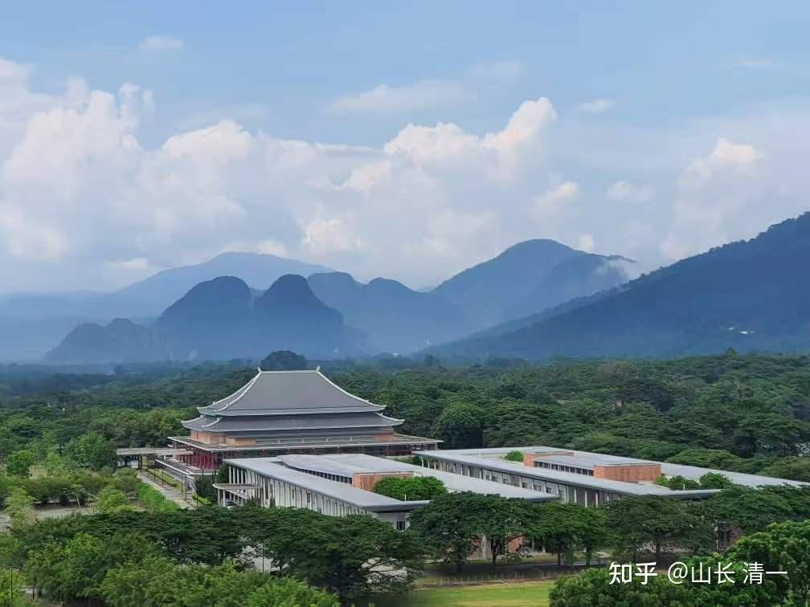

*大学的主楼：颇有中国皇宫的气派！*

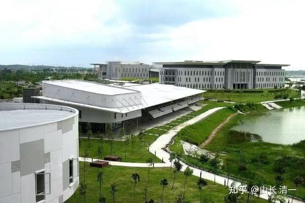

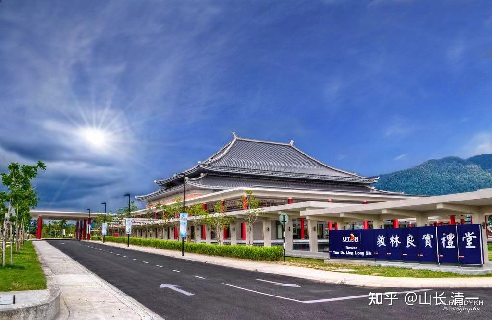

*华语---中华建筑----因为这所大学是马国华人公会的创办的现代大学！*

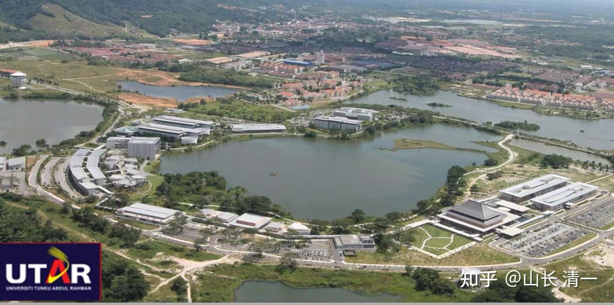

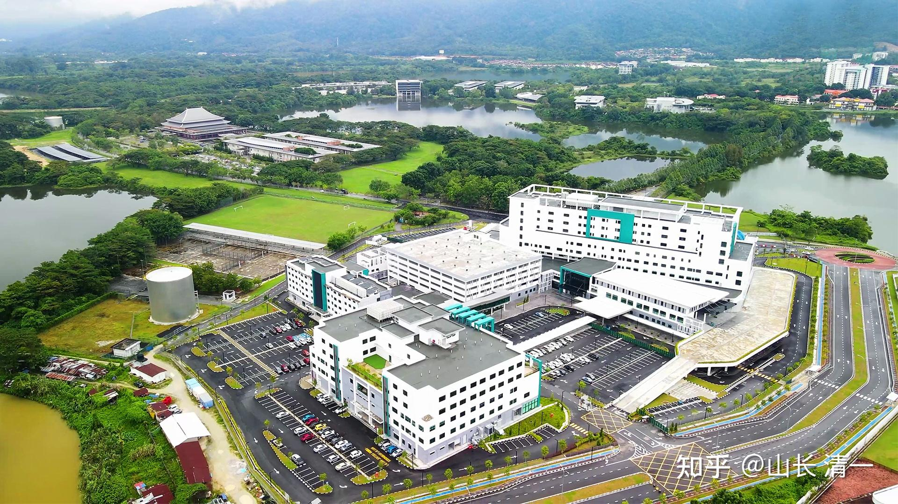

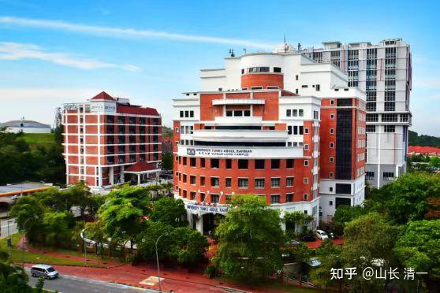

您想来这里上大学，用四年时间，拿到三所大学的文凭吗？您不用拼，不用卷。您只需要11岁，去申请上清一新教育学堂就可以了。没钱都可以上----你们在家，都可以自己一步一步的，完全跟学我们公布的【今日国际学校示范班课程】。您根本就不要啥学籍，也不用管啥学历的事情。你们只要15岁以后，去参加国际考试，您拿到一个SAT考试的成绩，来找我们申请清一高中免费入学就行了。等您16岁，我们就直接推荐您来上面的这个新派知名大学学习了！四年后---您就拿到三所世界知名。尽管其中一所大学，现在还不太知名。但未来，一定会比前面的两所QS大学更知名的，您不仅仅吃到了现在的世界顶尖大学的红利。您还提前锁定了未来世界最顶尖大学的未来红利，你是不是三赢？都赢麻了？（笑）

看吧：我给你多容易的现代新教育攻略，一点也不复杂！甚至还不用花钱，只要花目标锁定就行了！如果您还是要嫌弃我们“不正规”的话，您就是瞧不起国际教育资源布局的话。您就去花12年，读体制的中小学，然后苦巴巴的熬到22岁大学毕业。等我们的新教育学生，都已经拿到三所大学的文凭，已经工作两年了，您才开始到处苦巴巴的求职！而我们的学生，已经在全世界自由腾飞了！

这就是教育路径的区别：选择决定人生！

[今日国际学校的个人空间-今日国际学校个人主页-哔哩哔哩视频](http://link.zhihu.com/?target=https%3A//space.bilibili.com/487498588/)