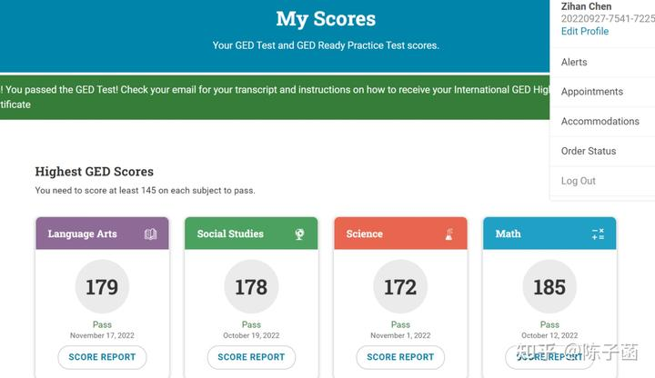

由于已经打通了【美国高中毕业资格证书考试】，新教育学生可以轻松入读世界知名大学。新教育学生，就完全突破了国内外体制学校设置的学籍壁垒，完全打破了任何国家设置的学历和学籍限制。新教育的家长们，可以完全不管任何学籍和学历，更不用操心啥小学初中高中的文凭。不再被一个学籍从小去牵着家长的鼻子走，我们新教育就可以帮你非常轻松地获取全球通行的【美国高中毕业资格证书】。这样，我们的学生，就可以提前到16岁进入海外排名前100名的大学上学了。

*今日三语高中陈子涵的美国高中结业资格考试成绩---优秀级（满分200分）！*

【 说明：以上四门课程，只要每门课程都不低于145分就算是及格，可以申请去拿高中毕业证书。不及格可以无限次的补考。四门成绩中，只要有任意一门成绩超过了165分，就认为该生符合大学的录取标准，可以用该考核的成绩，来申请大学入学资格。不一定需要学生提供SAT成绩（当然，想要入读优质大学，一般还是要求提供SAT成绩的）】

今年9月，大批16岁的新教育学生就将入读世界名校。目前我们正在筹备相关的前期申请考试准备。现在的三语高中学生们，准备抱团进入世界知名大学学习，提前打开自己的职业和学业之路。相比同龄人来说，低年龄入读世界知名大学，将来更能获取超越对手的竞争地位！

根据我对教育规律的研究，16岁真的可以上大学了，学知识没有这么难的。真没必要苦苦煎熬12年，慢慢的学习很多体制内没有啥价值的碎片知识，让孩子天天刷题，实在是浪费宝贵的生命！当年我上大学的时候刚满17岁。我的同班同学不少人还比我小。其中还有两个同学是14岁。这两个同学还都很优秀， 最终都获得了公派出国的机会，现在在英国发展很好。我的其他同学说“他们两位没开窍（指年龄小，没有青春期其他同学想法多），所以能够专心学习”。因为在学习上，这些小年龄大学生根本就没有不适应的情况！

新教育学生的高考和就业的出路，明显要比普通的体制学生宽广得多。目前形势下，未来的就业和竞争，国内都不再具备任何优势。学生们可以通过入读海外名牌大学，一方面避免了国内残酷的高考选拔制度，迫使家长必须从幼儿园和小学就开始卷，严重影响身心健康。另一方面还拓宽了未来的就业渠道，孩子无论在海内，海外，都可以获取很好的就业机会！如果16岁，就能提前入读海外100知名大学，未来职场的升职空间显然就比国内的同龄人拥有更大的优势！

参加中国高考的弊端，其实比简单的“太卷”，学的太辛苦还更严重。虽然高考是一个国内认为相对公正的选拔措施。只是21年前，我就发现：选择参与高考选拔这条路，对孩子来说太残酷了。我是研究思维规律的，我发现高考这种学习，考试的模式非常的变态。会严重破坏学生的正常思维模式，会让学生养成“碎片化思维方式”，无法进行更加深度的，严谨的逻辑思维。还难以去耐心阅读长篇的文章，更喜欢采用短视频和短信息阅读，成为一个无法具备深度思维的人，将来长大很难成为大人才！当然，---做个打工人倒是足够了！

而且体制教育高考带来的后果，似乎是不可逆的。即使将来得到很好的机会，重新学习新教育，也无法重新获得良好的思维能力！从目前来上过我的课程的成年学生，这些体制内的优等生，同堂学习却根本比不过没有参加过高考体系的，年仅十几岁的新教育学生思维更有序，理解力也赶不上。无法达到这些年轻学生可以达到的思维深度和宽度。

华莱士在演讲中说到的：**教育的目的不是学会知识，而是学习一种思维方式——根据这种说法，中国的体制教育和高考，就根本不配称为“教育系统”，甚至是反教育系统，因为这种教育破坏了思维体系。 **因此---我的三个孩子，都没有让他们去走中国高考之路，就是想让他们可以拥有一个正常的思维。他们成年后，两个大孩子今年27岁，证明比很多年长的人更有职业竞争优势。**保护和培养孩子的思维能力，就是父母对孩子最大的宠爱。**

我还以为，就我有这种“偏激”的观点和应对的做法。没想到：最近看到数学大师丘成桐，也有跟我一样的看法：经过高考的思维破坏后，学生无法拥有真正的数学思维。无法成为真正的数学家！因此他想要从10岁小孩里面，选思维没有被破坏的人，来专门带他们学数学，然后跳过高考的残害，直接读大学的数学系！才能学会真正的数学思维。他这个思路，与今日新教育从11岁的学生中开始选出学生来入读今日三校，用另外一套学习方式来接轨体制教育，系统培养完整的文化思维模式，几乎是一样的！可见高考在懂行的专家面前，完全就是负面的评价。只是大多数人不知道如何去绕开这种考试系统的思维破坏！数学家邱教授可以凭自己的名望来为这些孩子逃过高考残害。获取真正的教育机会。我们普通人，也可以用新教育的赛道。来实现比邱教授更广阔的大学和职业选择的道路、孩子和家长，都可以在成长中不断调整自己的目标，不需要一锤子盯死只能一辈子学数学！

[数学大师丘成桐只挑10岁小孩，不参加高考，由丘先生亲自带孩子学数学，推荐进入大学数学系](http://link.zhihu.com/?target=https%3A//www.toutiao.com/video/7338432957952036150/%3Fapp%3Dnews_article%26timestamp%3D1709121451%26share_uid%3DMS4wLjABAAAAO5-_FUCUFlnOq8-Fr38ALsEHxRyDttXcxiaXeFzWzG8%26wxshare_count%3D2%26tt_from%3Dweixin%26utm_source%3Dweixin_moments%26utm_medium%3Dtoutiao_android%26utm_campaign%3Dclient_share%26share_token%3D0a1f0221-54e8-4918-bac4-9d04cc8f6d71%26source%3Dm_redirect)

清一新教育，非常注意保护学生拥有完善，正常的思维和行为能力。这种教育轻松，高效，可以与任何体制教育接轨。三年就学完体制学校的12年。我们的这种教育创新，给了学生最广阔的未来职业和专业发展选择。学生们可以去学习任何学科------理工农医。当然也包括数学在内！

**新教育学生的高考出路----首选路径一**

今年9月份，清一新教育将送出一大批学生，16岁就直接入读世界前100名大学！本学期我们计划设立专门的部门人员，来帮助学生申请入读世界100大学名校。我们将根据家长的要求，根据学生的专业学习愿望，想要去留学的国家和大学等等，让学生根据自己的情况，选择最符合自己要求的大学和专业去就学！ 这是清一新教育多快好省地为全世界培养人才的方式！

特别强调：这一个选项，是最宽广的选择。不仅仅限于原三语高中的优等生。一些甚至考不上三语高中，成绩不符合清一大学要求的学生，也可以通过我们的这个路径，去海外的名校上学---甚至是直接入读top100名校。因为清一大学的15岁入读标准，高于不少世界TOP100大学的入学要求。一些我们新教育认为很差的学生，只要你的成绩能够达到SAT1250分以上，年龄满16岁，我们也可以帮助你申请入读一些国家排名前三的国内顶尖的大学上学，学费还是很低的，象征性的学费。实在没必要听中介的忽悠，去啥三流野鸡大学上学！这些学生，你们也没必要进入三语高中来学习，都是浪费你的时间！我们会给你提供专业的申请海外知名大学的意见。我们愿意派人专门负责，提供给大家这种选择帮助，主要是避免一些无良中介，为了赚钱而满口胡说八道， 专门忽悠一些成绩不够优秀，考不上三语高中。家长和学生又特别傻瓜，居然花大钱去这些无良中介推荐的国外高中和野鸡大学和培训机构上学！因此我们也希望----通过这个计划。可以解决一些成绩不够优秀的学生，也能考上相对较为理想的知名大学去读书！这些大学排名进不了前一百名，至少也是国家的前几名大学，相当于中国的211以上的大学。只有上这样的大学才基本靠谱！

**新教育学生的第二个选项：精英班 三加一文武师资班**

就是三加一大学海外留学项目。

[山长 清一：16岁读大学，20岁拿三所世界知名大学文凭！](https://zhuanlan.zhihu.com/p/683429557)

这些15岁就取得SAT超过1400分的成绩，愿望是想要从事新教育事业的学生，16岁以上就抱团进入一所世界排名800名左右的大学去学习第三外语。三年后拿到大学本科语言专业的结业文凭，四年后拿到包括世界前100大学和清一大学的毕业文凭！目前，首个三加一留学项目正在筹备中，我们的第一个班级就是“征日精英班”。本班将以学习日语作为小语种学习的内容，三年内达到外国语大学最优等日语专业毕业生的程度。同时每天半文半武，练习中华武术，实战太极，三年内去拿到自由搏击（日式踢拳）全国冠军等头衔。最后一年，去世界前100大学修学，取得学分互认资格，拿到世界前100大学的毕业证（或者中国985大学的毕业证）。毕业后的主要就业方向，就是各个新教育学堂的师资。

这个“征日专业”，本质上将作为新教育的【师资班】对待。未来还有泰语班，西语班等等！为不想去世界500强企业工作的学生，不想去传统企业工作的人，只想学习和从事新教育的学生，提供一个未来成为新型教师人才的机会！建设海外国际学校的师资。大家一起抱团，学习提高！

**新教育学生的第三个大学选择：**三加一综合班 【清一大学文科综合训练班】，普通班。

有一些家庭，不想16岁就脱离新教育的系统，去海外大学独自留学，过早进行专业教育。更希望在19岁以前，多学习新教育的内容。但孩子并不想去从事教育工作。更多的学生，只是想多有机会学习清一大学的本科（文科）课程之后，再去世界名牌大学上学。为了这些学生，我们也提供了类似文武师资班一样的三加一选择。只是入读要求，肯定会更低一些。这些学生会跟【文武精英专修班】一起学习，但不要求最终的结果。选择会更加的自由。要求是----三年内学完第三门语言课程和武术，跟学一些清一大学的文科课程后，就毕业自由选择去其他世界100名大学，学习自己想要学习的任何专业！理工科或者文科自由选择。自由接受教育结果。

简单地比较下来：与第一个选择相比，这些学生选择了先去“降级”的top800大学学习。而不是16岁提前去进入海外前100大学进行专业学习。是因为他们要留在清一大学，学习他们认为对自己更有用的课程！顺便捞一个小语种大学文凭。三年后，再去正式的读海外大学自己想要学习的专业。他们可以借用跟随学习第三语言的方式，逃过体制大学无聊的课程，和浪费生命的四年，充实和有趣的度过三年的大学时间，最终还拿到一个外语专业的本科文凭。相对国内外的普通大学生，绝对是赚大了。这种礼物，也只有清一大学才能给了。但是--这条路只对看懂了清一大学教育的人才有用。很多家长-----其实只看到了我们能够帮助学生考上top100大学的“好处，眼光极其浅薄！在这些家长眼里，名牌大学才是他们值得追求的对象。在我眼里面，很多名牌大学就是渣渣。

等19岁的时候，学生的思想已经很成熟了，再去自由选读海外前100名大学的专业课程。为了求职去有目的地学习，学生才会认真地选择自己的命运。甚至学生喜欢理工科，可能去读一个理工科或者其他自己喜欢的专业，成为文理双修的综合人才。未来他们的学习和就业，就具有最大的学习宽容度！ 比如----19岁清一大学毕业后，再去一所排名世界前100名的墨西哥国立大学学习真正的专业课程（本科或者研究生可课程任选）！这种学生，毕业后就可以在海外工作。这种背景的学生，应该在南美洲的一带一路国家，会有更好的发展空间。所以---这些学生将来想要学习的第三语言，应该是西语！

** 9月份之后，我们在国内的三语高中，就不再有存在的必要。**目前的三语高中学生们，都将进行【三加一选择】。或者我们直接推荐去就读世界前100名的学校。我相信对我们的家长和学生来说。这是一个更加广阔的道路和空间！是新教育人集体走向世界的起点！

不过，今年9月份，三语高中不再招生，并不影响原来计划考入清一教育系“最高学府”的学生---只是这些学生的申请对象，不再是一所高中。而是凭借【高考成绩】----申请入读设在清迈的【清一大学】本科部。只要年满15岁，取得超过SAT1400分成绩的学生（这是SAT考生top7%的优等成绩），都可以申请入读【清一大学】，甚至是全奖入读清一大学！这些15岁的学生，将在入学之后，用一年时间来进行青春期心理和社会学等的清一大学文科课程的学习，学习一些真正有用的社会知识。

第二年，16岁的时候，我们将组织学生去参加美国高中文凭资格考试，通过之后，就相当于拿到了全球通行的高中毕业资格证。各位这时候就可以自由决定，学生是直接去上世界前100大学，还是继续上清一大学，参与【三加一教育计划】。未来，各位计划考入三语高中继续学习的学生，其实获得了更好的学习条件！以及得到了更硬的，世界承认的大学文凭。今年，是新教育的升级之年！

今年，为了满足9月份申请入读世界大学的要求，我们现有的高中学生，也在转型新赛道。计划在今年5月份，让今日高中所有已满16岁的学生，包括公主班学生在内，在清迈清一书院，开一个【大学备考班】，集中并针对性学习一到两个月，帮助大家都拿到美国高中毕业证书。然后集体帮助大学申请继续三加一计划！9月份就去入读世界名校。

为了让这个计划，也能够帮助外围学堂的学生，凡是今年已经满了16岁以上的外围学堂学生，想要通过我们这个路径来上大学的，都可以报名参加，与高中部和公主班的学生一起学习备考大学！如果你们的SAT分数是高于1250分的，大概率只需要在这里进行一个月左右的复习和备考工作，就足够拿到【美国高中毕业资格证书】了。请有意者请自行联系我们的三语高中工作人员协助安排！

祝福各位新教育人---2024，我们的道路越走越宽广了！