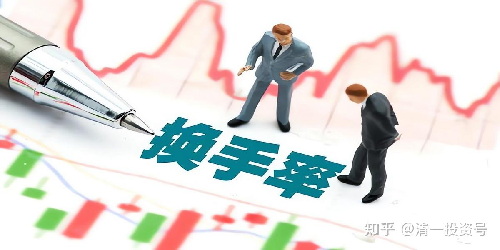
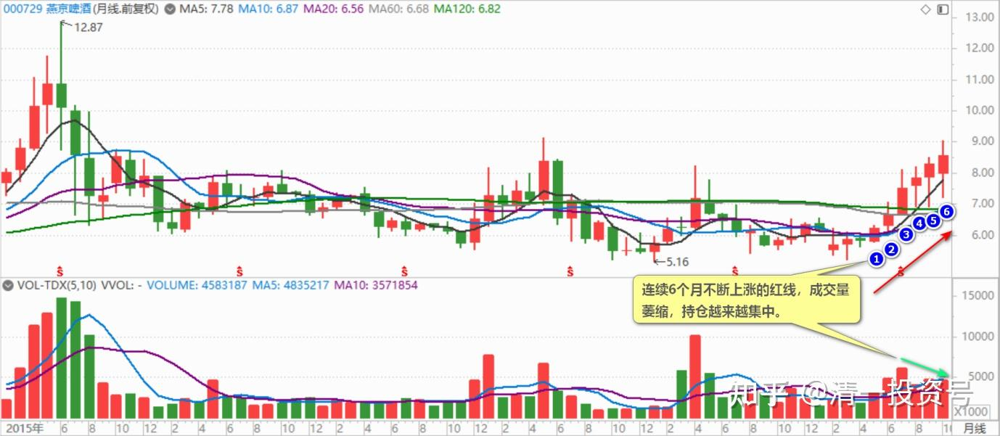
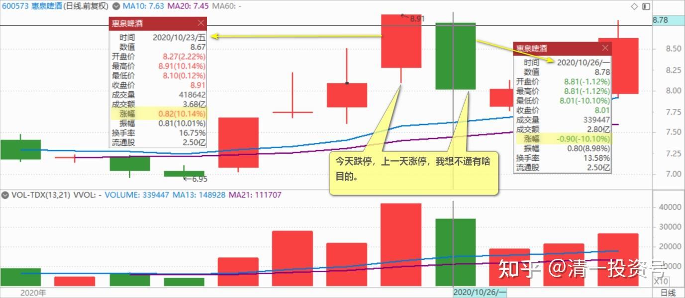
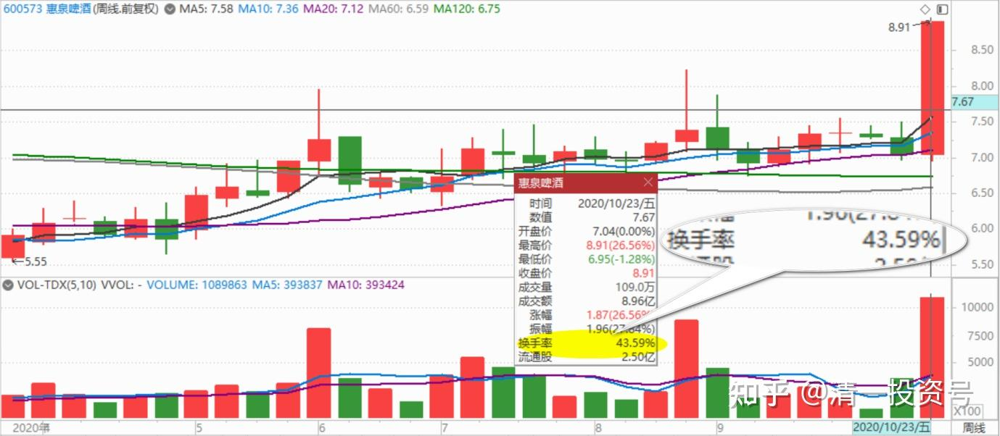
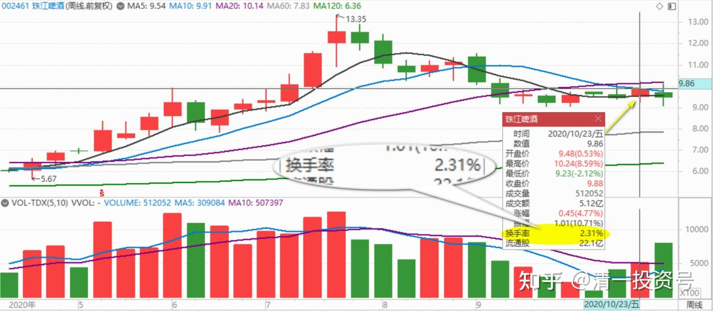
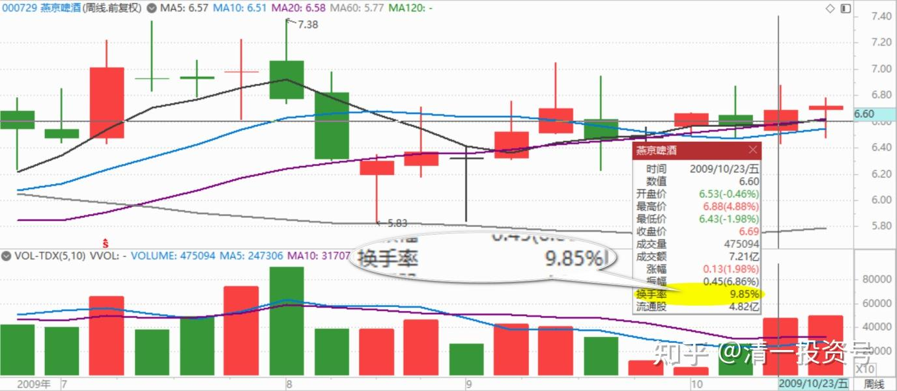
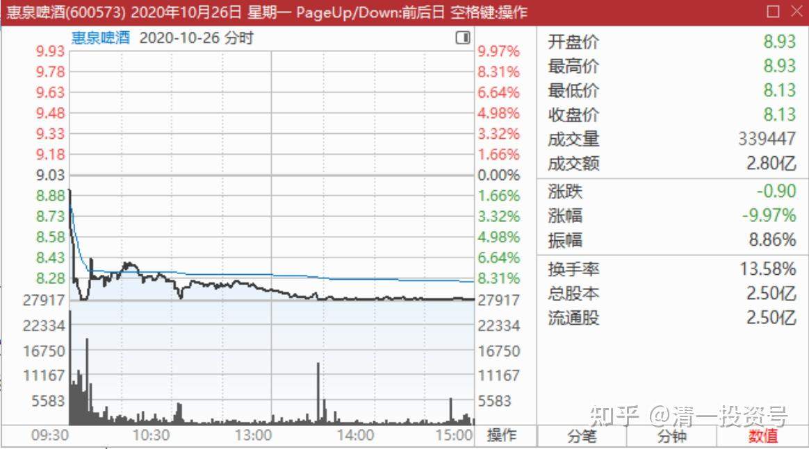
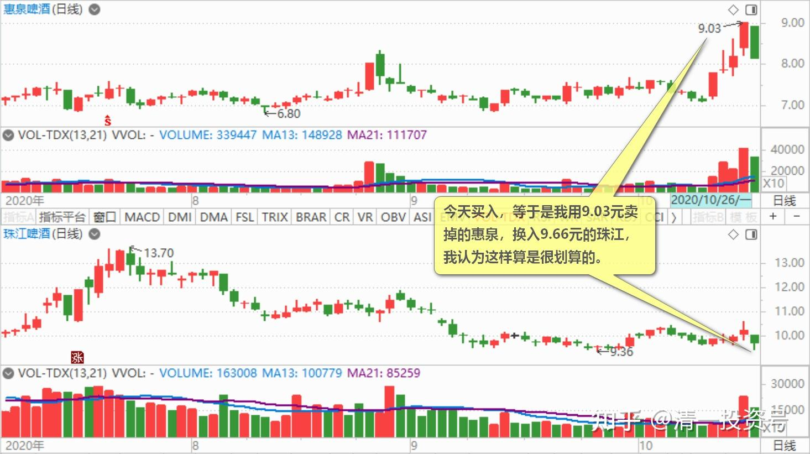

52篇.惠泉、珠江、燕京的换手率

清一山长2020年10月23日～27日

清一山长2020-10-23 22:22:18

$燕京啤酒(SZ000729)$ 复盘研究燕京。**突然发现燕京的月线图，是连续6个月不断上涨的红线，成交量萎缩，持仓越来越集中。俨然大牛股的形态。**为啥很多朋友持有燕京，一直在涨，居然还不满意？真心走势很不错了。（当然，每个月的上下振动的幅度也不小，每个月都有长长的下影线。所以，总有人就是拿不住）。

清一山长2020-10-26 12:34:45

$惠泉啤酒(SH600573)$ 上午带孩子们练功去了，没看盘。因为涨跌我都不在乎。不想为了抓几分钱的差价来浪费时间盯盘，费神。我认为身体健康是第一位的，早起多运动，才是最重要的事情。

没想到今天惠泉居然冲了跌停价，然后在跌停价附近交易。真的惊到我了。首先感谢惠泉主力给的大红包，真让人不好意思，无亲无故的，都不认识。居然很大方打赏这一大笔钱。第二、我认为惠泉主力，实在是不可思议。敬佩万分。这种不在乎筹码，也不在乎价格的主力，涨跌随心，令人除了敬佩就没啥想法了，因为怎么想你都猜不透他们的[为什么]。相比惠泉，燕京主力简直弱爆了。小里小气的，舍不得筹码，也舍不得放价。只会熬死你！不如惠泉主力玩得嗨皮。

上一天，拉涨停，我想象不通有啥目的。既然想不通，我就卖掉好了。因为这个方向，对持仓的我有利，但对手上没货的散户不利。所以我不会追涨。今天跌停，我也想不通为啥这样操作。想不通，我也可以补回来一点，就当昨天没出好了。再跌，我就继续做回三大也没事。这个价格，对持仓的人不利，但对持币的人有利。所以，博弈要选对自己有利的方向。

有兴趣研究者，可以看看惠泉的周线图。**上周换手率居然达到了43.6%。几乎可以说流通盘全换了一遍。**知道珠江才有多少吗？**才2%多点量。燕京呢？上周涨势也不小，也才6.44%的成交量。**知道为啥上交易日我几乎惠泉全出了？**就因为看它的换手率太高了，随时可能跌下来。**当然，也随时可以涨上去。就看主力的意思了。如果换手率这么高，散户手中没股了，这个股可以涨到天上去。反正没有卖压（你们看一些上百亿，千亿的热门股，盘面上筹码少的可以）。我还准备这次是卖飞掉的呢！彻底失去惠泉。结果今天居然以跌停的姿势来玩回调，实在不可思议，居然连象征性的拉高摆摆样子都没做。奇怪。要换我来操盘，起码今天开盘开到9.48元吧！空间拉开一些，好多出点货。不过主力可不像我这么计较，直接送钱，低开低走——当然，吸引了大量的散户买单进入。成交半日，就超过了2个亿。可以说，主力的大气打赏还是有用的。我猜今天买入的人，要么是因为上一日卖出了，今天做差价补回来的。要么是原来踏空了，今天也要找机会补回来。主力也特别大方，谁想要都给，还打折送筹码。

**根据惠泉的历史，每次周成交放天量后，都要调整个两三周的时间。**这一次会调整多久我就不知道了。如果今天跌停，我就买回一部分。不跌停的话，我就等等看。因为现在最值得买入，技术形态最好的啤酒股，并不是惠泉。我卖出来的资金，还有大用，没必要急乎乎的补仓。还可以慢慢用。

清一山长2020-10-26 20:53:49

$惠泉啤酒(SH600573)$ 今天试着挂单买了一点惠泉，8.13元挂价。总共挂了三次单，总量20万股。第一次的成交了，但成交很慢。主力似乎不想卖给我。**很长时间才收到这十万股。查看成交明细，很多小单子，3位数量级的很多单。**不知道他们是赚了钱卖的，还是昨天追高今天亏了本卖的。如果是三天前买入的，其实这个价还是赚的。尾盘挂的十万股买入，却没人给我货。好吧，我就放心了。主力绝对不想8.13元卖给我，这个价，看来是可以接受的。我喜欢跟主力反着做，如果主力大量派货，我就不敢接货。所以选低迷的股去买。**买的时候辛苦一点，卖的时候就可以潇洒一点了。**比如上一交易日，两百多万股瞬间成交。

不过，由于这两天惠泉成交量巨大，创近期新高。按照老股民的沙场实战经验，惠泉近期调整的压力还是很大的。所以不适合买入，慢慢地等机会吧！我是赚了钱不怕死的，买入一点试试盘罢了。

**目前相对价位较低，比较有确定性的股，可能是珠江。这个股成交很低迷。今天跌幅不小，全天也才成交一个多亿。**我看它跌不下去的样子，今天又加了一点。我是这样算账的——今天买入，等于是我用9.03元卖掉的惠泉，换入9.66元的珠江，我认为这样算是很划算的。这个比价值得交换。我的啤酒仓位，一下子空了2M多，需要慢慢地补回来，继续维持我的啤酒生意不减仓（持仓总量在维持不变基础上，市值可以接受不断增加）。目前没有减仓啤酒仓位的计划，但也没有增仓计划，只有调仓计划。**三只啤酒都过10元了，我就执行逐步减仓计划**。慢慢地换其他股票去。

刘一韦回复清一山长:

@清一山长[￥200.00]跟着山长学了不少东西，昨天涨停几乎全出，今天用惠泉的仓位在急跌中又抢了一把珠江，尾盘又接了一小部分惠泉，然后看到您发帖的操作自己全跟上了，感觉自己有点滑头了[大笑]

清一山长2020-10-27 09:28:55回复刘一韦：

[献花花]。学聪明了，可以自己看见博弈流动的方向，可以判断个股的相对价值并果断进行切换。这本事不赖！好好发扬光大，练熟技巧，树立了自己的投资体系之后，获取亿万资产不难[加油]

dude回复清一山长：

由衷佩服。价值投资，还精准高抛低吸，主力被山长来回盘剥。

清一山长2020-10-27 09:34:10回复dude：

我这是价值投机，才不是价投呢！价投不玩惠泉这种票。要买啤酒也只买青岛、华润。我没盘剥主力，就是主力吃大餐的时候，我在边上，跟着抢点边角料，一起吃吃罢了。主力给我鱼饵的时候，我悄悄地收下饵料，把钩子还还给主力。就这么简单，没啥技术含量[大笑]！

蔚蓝海岸78回复清一山长：

@清一山长[￥200.00]感谢山长老师，惠泉上周五全部卖出。

清一山长2020-10-27 14:22:39 回复蔚蓝海岸78：

红包退回，多谢支持。赚钱是你自己修来的福气，不用谢我[献花花]。这钱拿去买中建拿利息。如果可怜惠泉的股东跌得太惨了，就补一点回来。不用给我奖金。我分享我自己的投资，如何参考你们自己决定，赔赚都是你们自己的事情，跟我是没关系的。谢谢各位！

其他人赚钱了，也别给我发钱。我今天收了你的钱，万一你明天赔了，也来要我赔钱咋办，我可赔不起你们这么多人！

(标题、图片为编者所加)

**文章音频**：

[424篇.惠泉、珠江、燕京的换手率_清一投资号文章同步音频](http://link.zhihu.com/?target=https%3A//www.ximalaya.com/sound/711680568)

**参考链接：**

[43篇.短线T、高级T和反向做T](https://zhuanlan.zhihu.com/p/673874352)

[44篇.没有等来秀场时间，依然要拼耐心](https://zhuanlan.zhihu.com/p/674885494)

[45篇.燕京的“传统”——总是令持仓者失望](https://zhuanlan.zhihu.com/p/677136646)

[46篇.风险是涨出来的，机会是跌出来的](https://zhuanlan.zhihu.com/p/677785950)

[47篇.主力的动向，说明了此股的利空利好](https://zhuanlan.zhihu.com/p/677786129)

[48篇.涨停是否要减持：时机、成交量、基本面配合情况](https://zhuanlan.zhihu.com/p/680828476)

[49篇.报表已经证明燕京正在重新崛起](https://zhuanlan.zhihu.com/p/681475572)

[50篇.惠泉股性活跃，喜欢刺激的人有福了](https://zhuanlan.zhihu.com/p/682717047)

[51篇.是风险赌博还是稳定投资？](https://zhuanlan.zhihu.com/p/684479170)