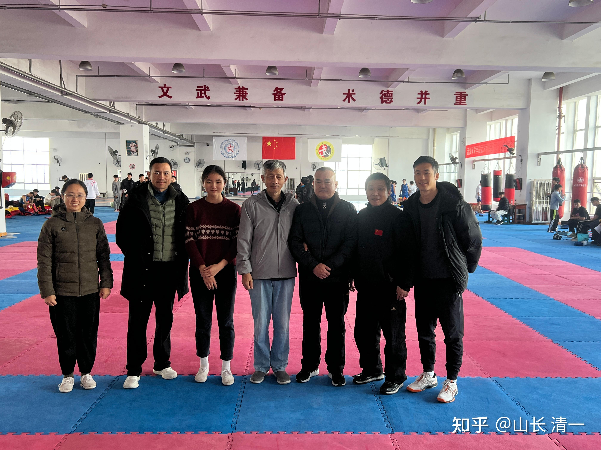
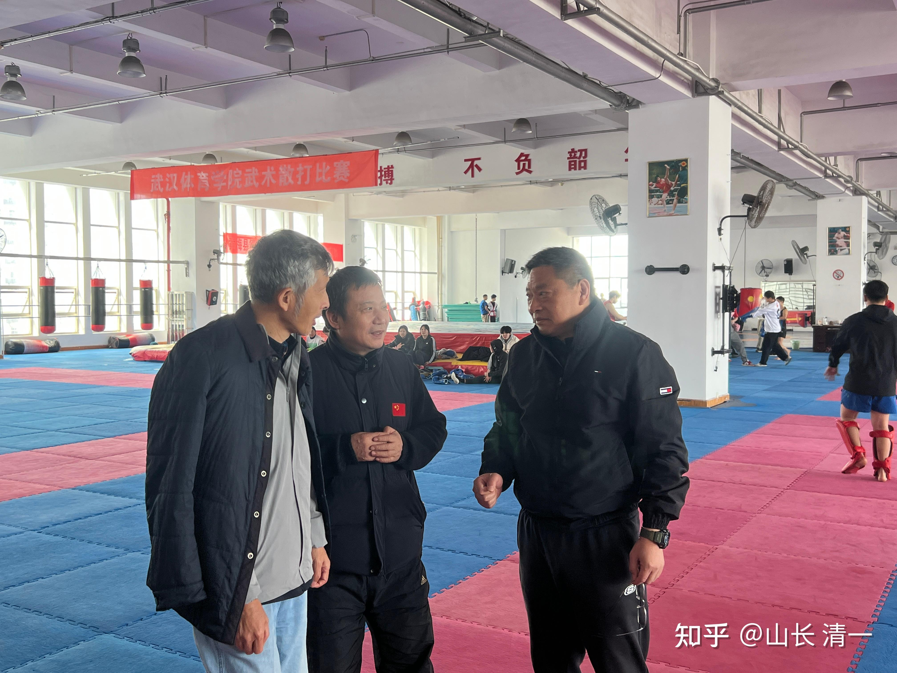
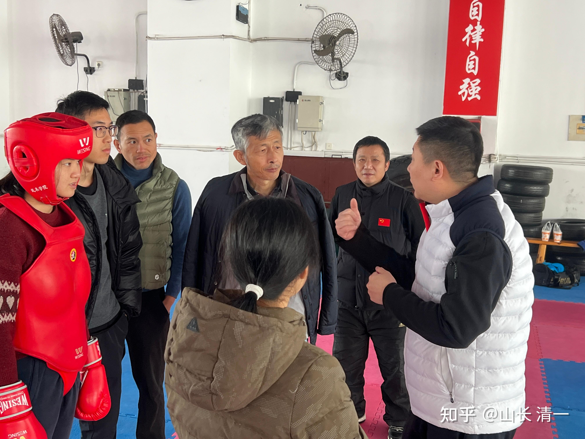
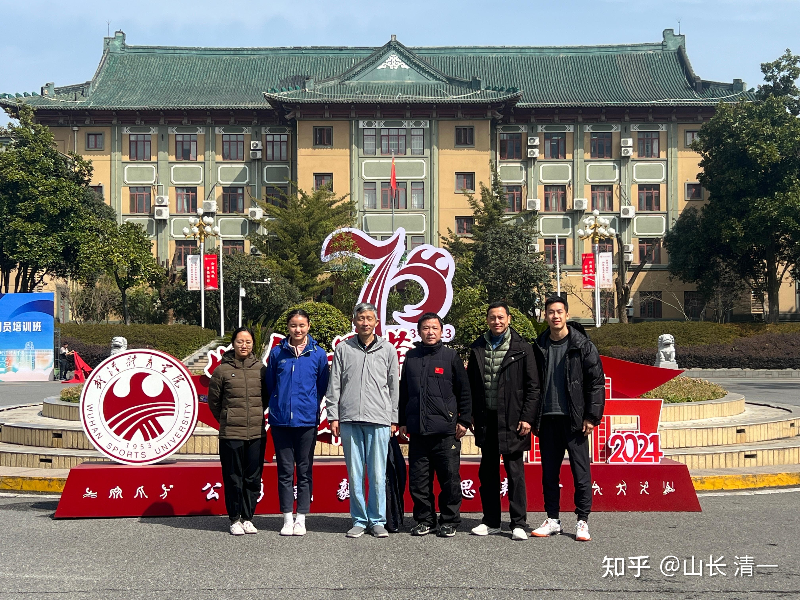
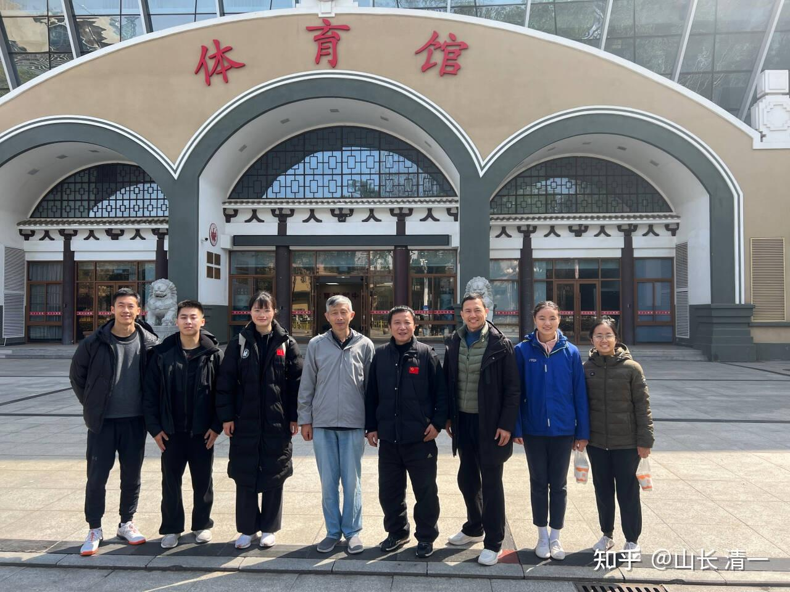
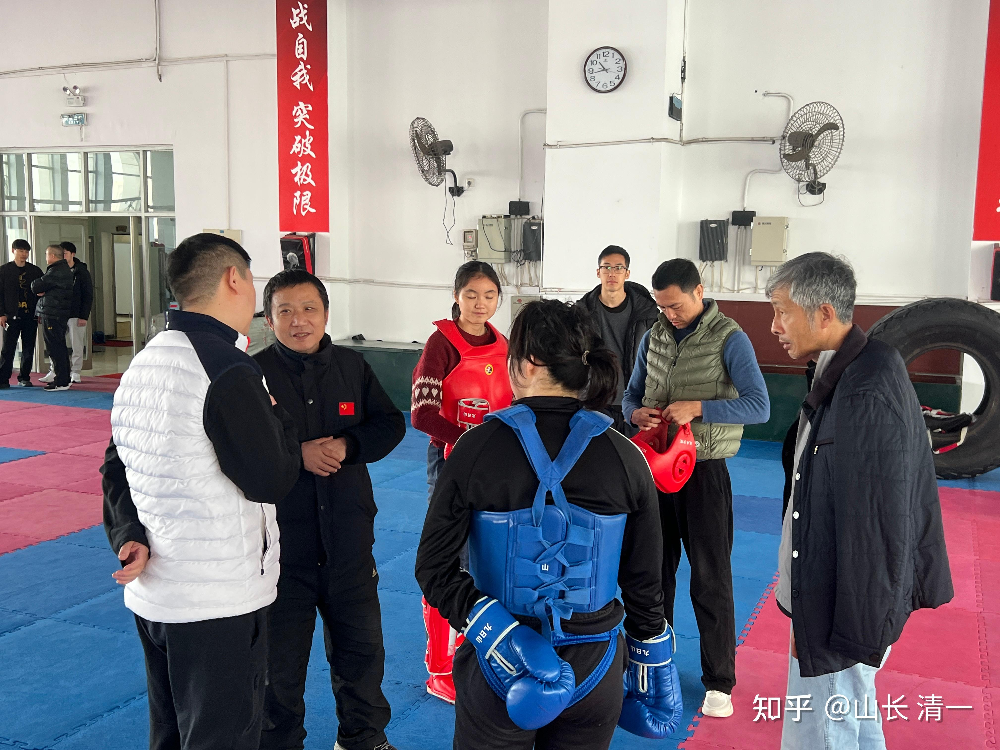
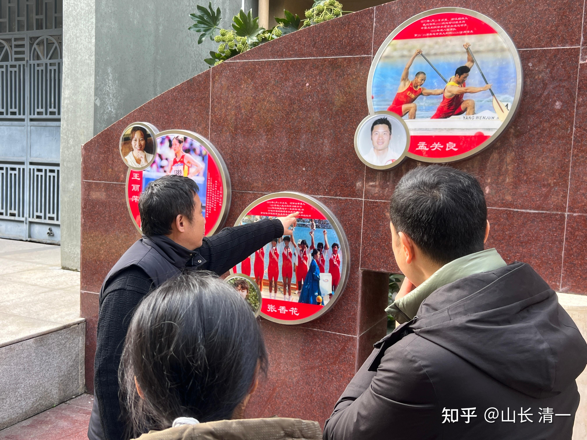
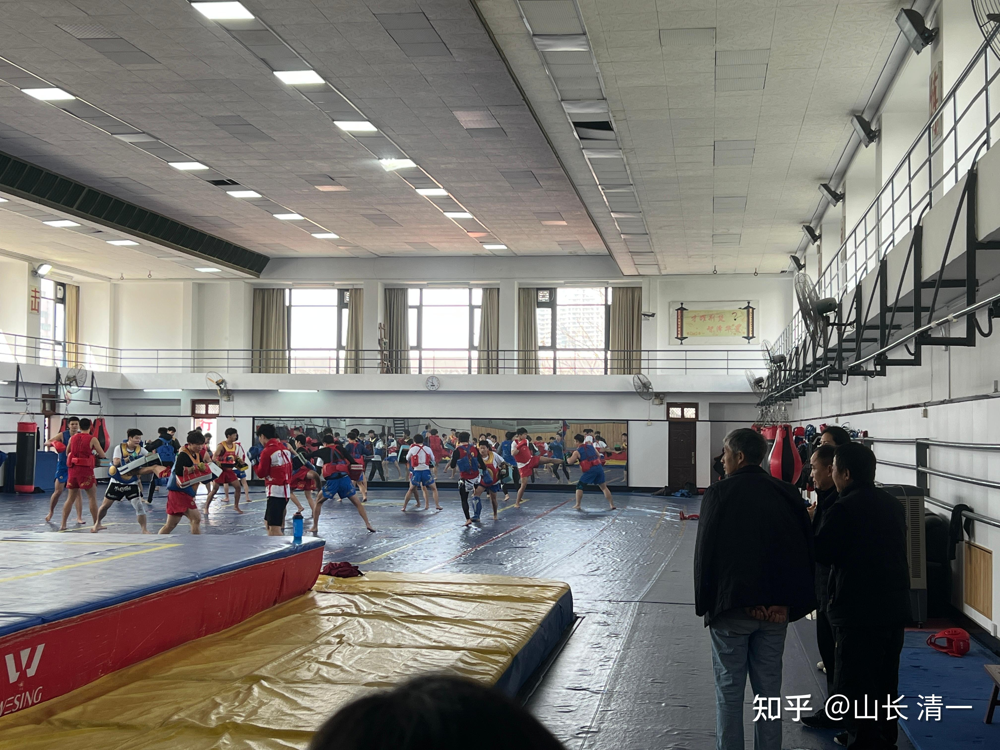
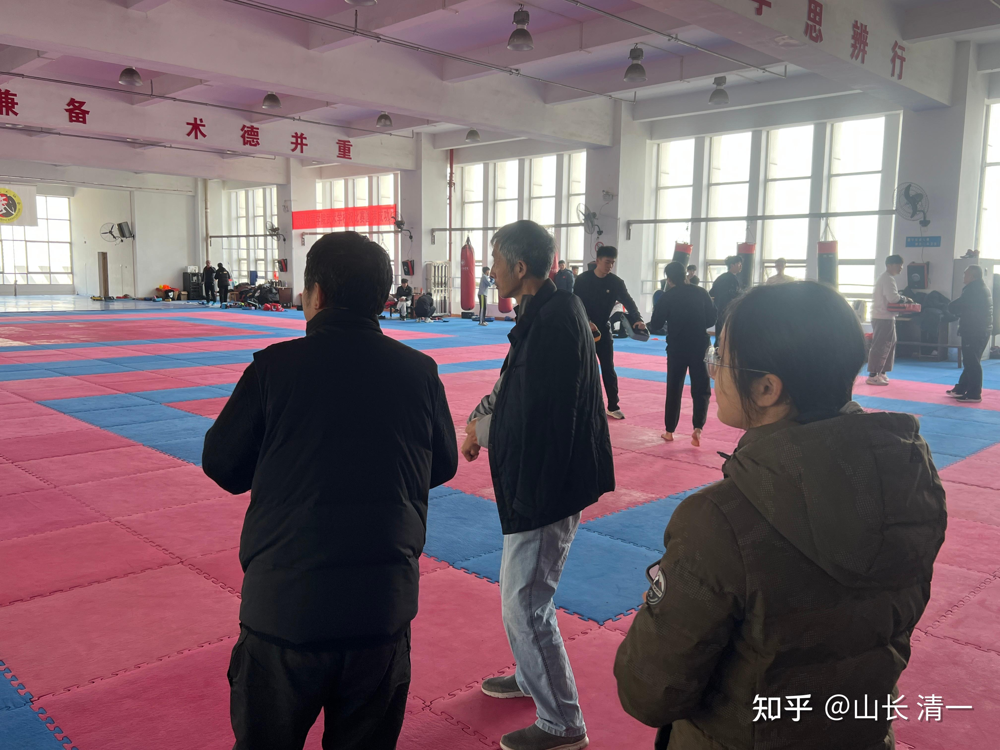

我马来西亚考察完毕后，到磨丁特区见过了家长和特区主席等。这几天首次回到了武汉，小光同学随后也飞到武汉，邀请我跟他一起北上，去见见一堆京官老同学。我们班六分之一的同学居然都在京城当官，最低也是厅级了。不过---都是退休年龄了。都在想“发挥余热”的事情、对文化事业都很有热情！

首站是武汉体院，体院已经被国家体委定位为国家泰拳队的集训单位。负责全国的泰拳推广和培训任务。目前，我们已经有五名队员（四名木兰，一名武士）获得了今年5月份，即将在在雅典举办的世界泰拳锦标赛的中国国家泰拳集训队入选资格。预期在备战一月后，从中选出每个级别的第一名，代表中国队出战雅典！

下面上传一些武汉见到新老朋友的照片。纪念我们的武汉之行。

*ELLA穿好护具，与体院散打专业队员对阵，体验散打与泰拳的区别！*

*冠军墙：武汉体院历年来获得的全国和世界冠军名字都在这里！*

*我像不像一只老猴子？人都站不直了*