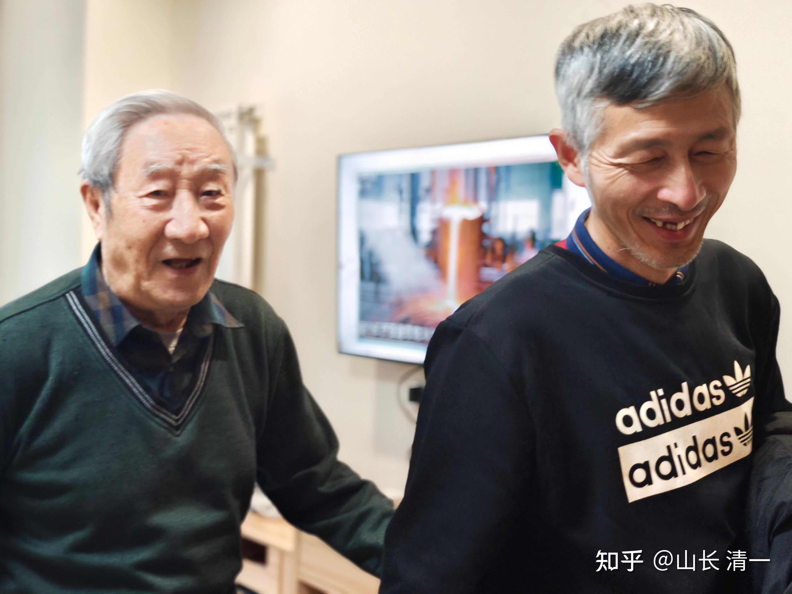
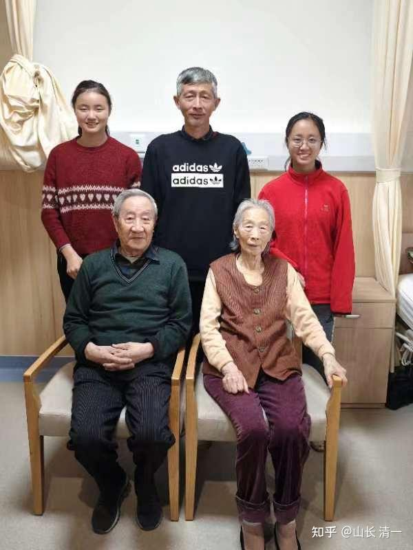
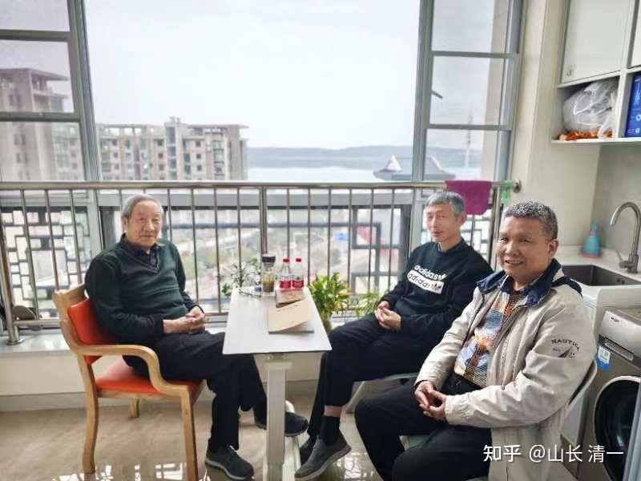
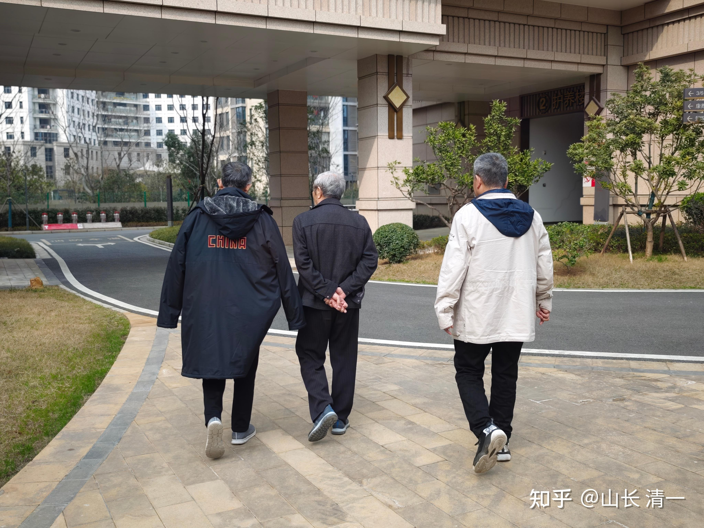
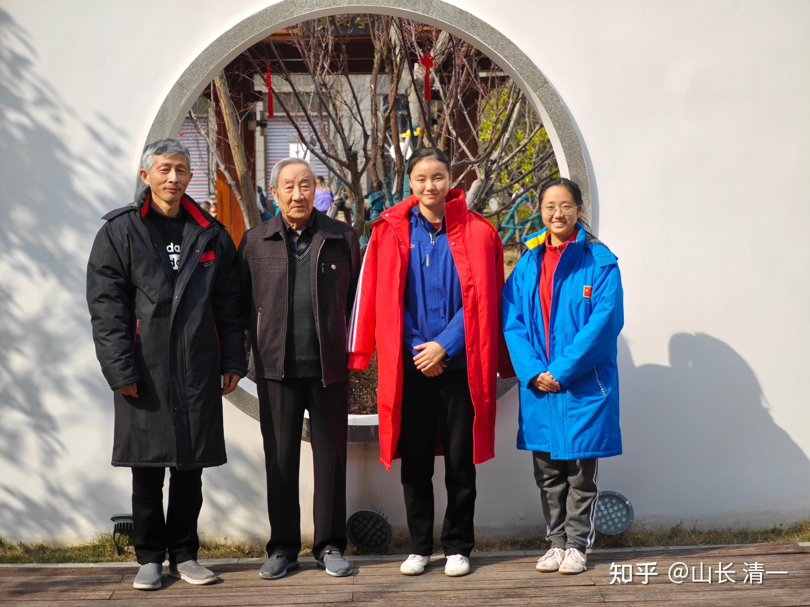
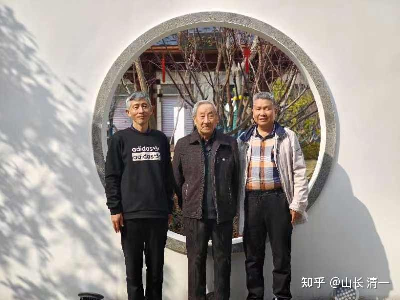
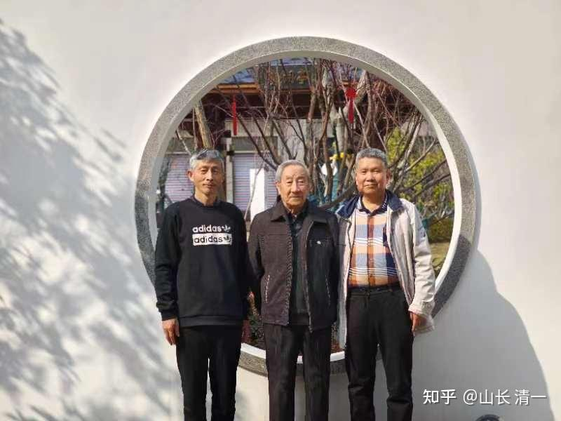
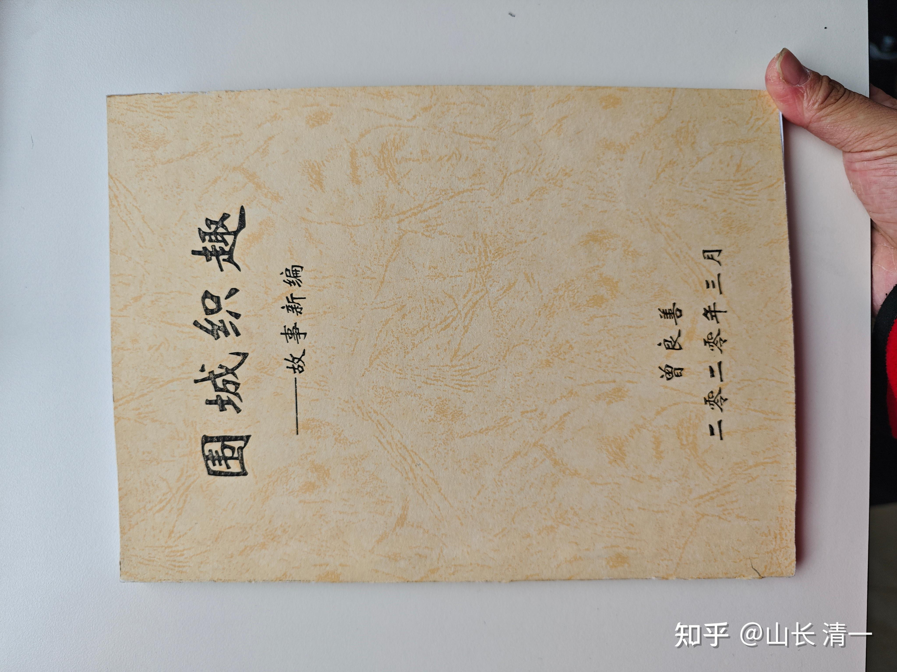

多年没有回武汉，这次回来，肯定要去看看曾老师的。昨日下午就在小光同学的带领下，两个小木兰和我一起去看望了曾老师！

我们在约好的时间到达养老院的时候，看到曾老师居然坐在路边等我们。看我们来了很高兴！

92岁的老人，能够和自己的夫人一起共度晚年，这是一种非常圆满，非常浪漫的事情。ELLA两木兰一直跟奶奶聊天，老人很开心。ELLA说奶奶年轻时候一定很漂亮。奶奶是江苏人！

两个老同学和更老的老老师一起聊天，交流信息。曾老师有点感伤地说---这里应该是自己的最后一站了。现在老师坐汽车市区都会晕车，去孩子家都不行。只好每天都留在院子里面不动了！

养老院坐落在卓刀泉，上面照片的背景是南湖。

老师在封城期间手写的书，装订得整整齐齐的。没有修改，就像印刷上去一样！

曾老师问我：什么时候回家？然后马上又说---你的家，到底算是哪儿的？似乎你已经没有家的概念了。能做到“四海为家”的人很少。

对呀？武汉？云南？泰国？老挝？马国？哪里是家呢？

我说马上要去郑州。随后小光要让我去北京见人。我也很多很多年没有去北京了，这次就一起去看看。小光认为：现在要安排一些事情，有京官照顾的人，地方大员就容易买账，从上顺下来比较好。下面直接找人，地方大员还比较牛，勾兑起来就困难一些！

曾老师说：你是个奇人。将来会有故事，会拍电影的。

我说：叶问现在拍的电影系列非常漂亮，看上去事迹非常的精彩。其实---当年也就是普通的武师罢了。是我们的时代需要传奇，老百姓需要故事。其实我们的日常做事，真没啥传奇可言。平平平淡的过去，只是积累的结果比较意外，别人看起来不平淡罢了！

老师问：啥时再来看他？

我还真的说不清-----就说7-8年都没有回来了，因为国内没啥事可做。也不敢做事。今年我们的所有人，都要搬家去国外了。国内我们勉强能够参与的活动，就是武术赛事了。几个大比赛我们都会参加。比赛之前回来即可！

老师就说：8年前回武汉，你为啥不来看我？

我就没法回答了！

看得出老师很期待见到老学生。虽然当年我不是优秀学生，甚至有点“问题学生”的样子，没有好好的走正途。经商下海等等。但也绝对没干过伤天害理的事情，没干过伤害老师和伙伴的事情。因此多年之后，见到老师依然坦然，师生同学均感情良好！

年轻人难免糊涂，有时候会做错事情。这些都不用担心。成长路上的必然代价。就怕做事的时候，有私心杂念，问心有愧，就后退无路了。

拜访老师之后，我和小公主们一路慢慢走回酒店。4公里多的路，一路聊天。告诉学生做人做事，要学老师的样子：一生刚直，问心无愧，这也是老师分享的“养生之道”。养天地浩然之气。做人做事，就应该这样子。

看了老师的状态。我也一直在想：我92岁的时候，应该是怎样的状态。才是“成长”了的样子？显然，如果我92岁，继续带学生练功，打比赛。到处交流互动。还能够继续用武力值狂虐学生。看起来似乎很了不起。但我认为：这不是成功，相反应该是失败。我的92岁，并不需要重复我62岁的样子，而是开创出92岁的新生活，新体验，接受新变化。 这才是人生真正的成功和成长！

人生如此，方可无憾！