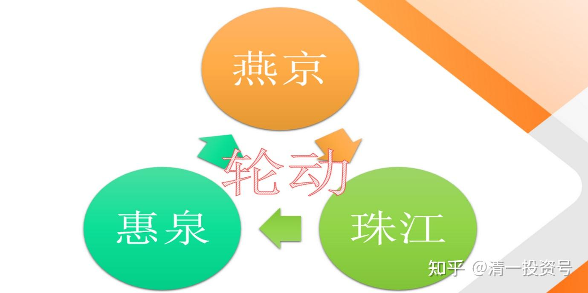

53篇.三只股轮动，谁涨停卖谁，谁跌停买谁

清一山长2020-10-27 10:08:11

**一、珠江的弹性多好**

$珠江啤酒(SZ002461)$ 现在看图，就知道为啥昨天我主要买珠江？而不是其他啤酒股了？今天您瞧珠江这弹性多好。**早盘半个小时，才6000多万，就涨超5%了。**相比下图的惠泉7800万元才涨了两分钱！燕京7000多万元，涨幅也才1.5%。多没劲！珠江看样子快活过来了。我的持仓也增加了。

再说一遍：这些啤酒股，10元以上我不加仓，只换仓和减仓！别乱跟我。另外，今天早盘，跌破8元的时候，我买了几十万股惠泉。还想多买一点的时候，它就涨了。涨了我就放手！我不跟别人抢。你们不要的我就捡进来。你们都想要的，我就让给你们！

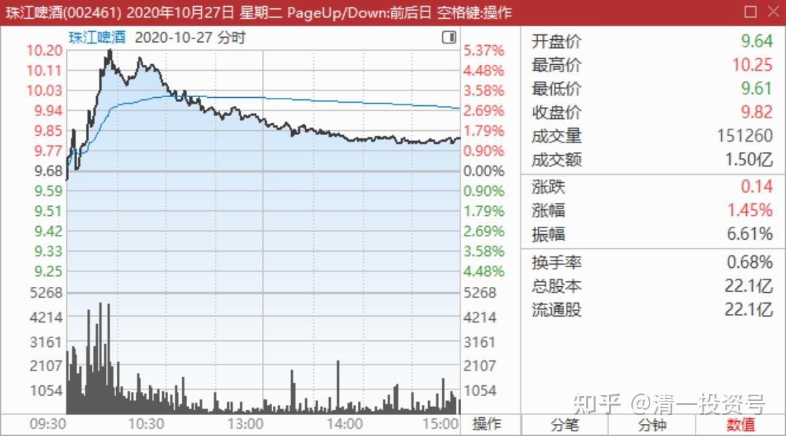

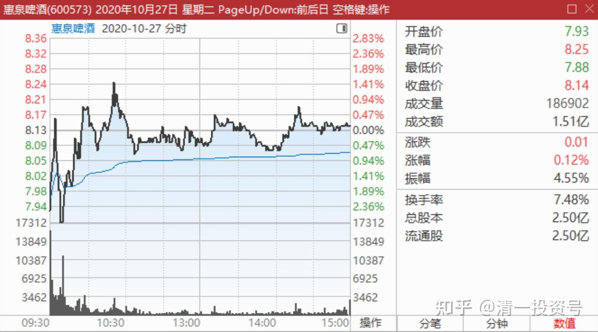

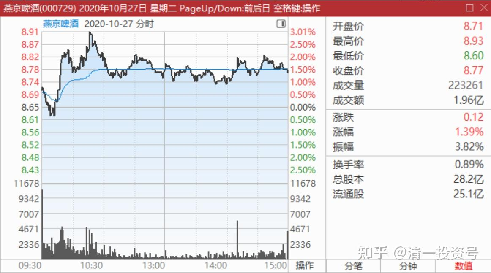

**二、三只股轮动，谁涨停卖谁，谁跌停买谁**

清一山长2020-10-27 14:33:49

$惠泉啤酒(SH600573)$ 珠江啤酒半年销量是56.54万千升。惠泉啤酒三季度的销量是20.55万千升。大致上是珠江三分之一量不到，四分之一更多的销量。但珠江啤酒的市值，是惠泉的十倍，是不是惠泉还有更多的提高空间？燕京啤酒三季度一个季度，就完成了121.17万千升销量。二季度完成了149.35万千升。一个季度就比珠江多两倍多，甚至接近三倍的量。可市值是差不多的，谁错了呢？谁更有潜力呢？就看你们的选择了。我都选——**三只股轮动[俏皮]。谁涨停卖谁，谁跌停买谁**。这样玩，我的机会多多，不亦乐乎[大笑]。

[珠江啤酒2020年半年报告](http://link.zhihu.com/?target=http%3A//static.cninfo.com.cn/finalpage/2020-08-25/1208236008.PDF)

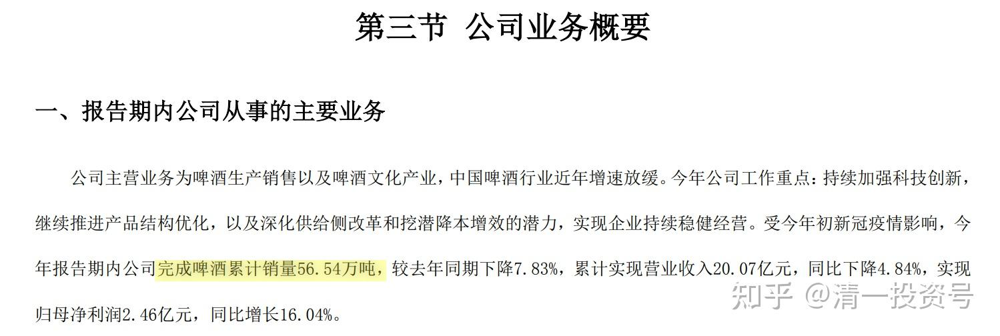

[惠泉啤酒2020年第三季度报告](http://link.zhihu.com/?target=http%3A//static.cninfo.com.cn/finalpage/2020-10-20/1208584242.PDF)

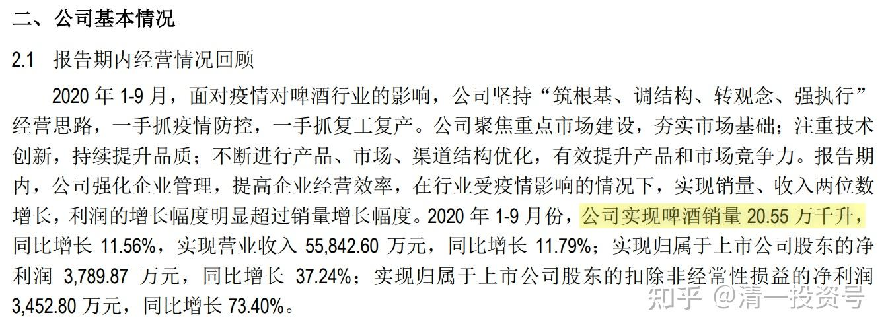

[燕京啤酒2020年半年报告](http://link.zhihu.com/?target=http%3A//static.cninfo.com.cn/finalpage/2020-08-28/1208281144.PDF)

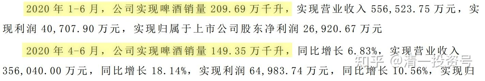

[燕京啤酒2020年第三季度报告](http://link.zhihu.com/?target=http%3A//static.cninfo.com.cn/finalpage/2020-08-28/1208281144.PDF)（330.86-209.69=121.23万千升）

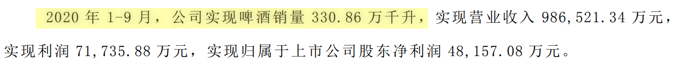

三、**惠泉股性妖冶，别指望预测它，看懂它，控制它**

清一山长2020-10-27 19:21:13

$惠泉啤酒(SH600573)$ 惠泉啤酒2020年10月26日收报8.13元，涨跌幅-9.97%，换手率13.58%。当日该股主力资金流入5342.98万元，流出1.05亿元，主力净流出5179.32万元。其中，超大单流入669.14万元，流出4449.05万元，净流出3779.91万元。当日散户资金流入2.21亿元，流出1.7亿元，散户净流入5179.32万元。资金流向分布情况如下图：

我的分析五天前的交易日，涨停7.8元。主力是打压制造恐慌后涨停拿货的。上周五的涨停，主力是拉升目的,资金大量流入。但昨天主力资金撤退,散户资金接盘。主力退出的资金，大致上与前一天拉涨停的资金相同。**可以说主力基本上全身而退，用极为罕见的跌停出货法，快速完成了换仓。还是游资打法——快进快推，不恋战**。后市如何不好说,可以继续高举高打，也可以长期调整。我觉得看其他两个啤酒的走势，可能惠泉不至于长期低迷。短期就不知道了。以下资料供参考。

**我认为：敢于用跌停来出货的主力，绝非凡人！操盘手段一流，不好预测。**只能尽量让自己站在不败的地位上，就算判断错误了也不会损失。这样才能玩惠泉。由于涨停我几乎全出了，所以目前的地位很有利。只要买入数量不超过我的卖出数量，就吃不了亏。最多把这次赚的钱赔回去。

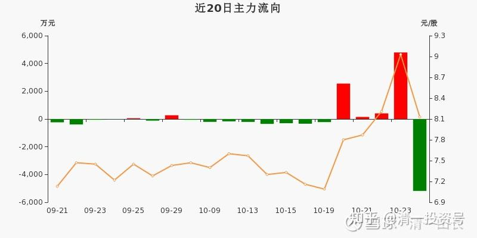

清一山长2020-10-28 13:33:50

$惠泉啤酒(SH600573)$ 就知道你妖怪。所以今天上午一直在买买买，成本8元左右。下午准备继续买的。害怕资金不够，还从信用账户多转了100万股燕京过来，当现金用，就是为了换惠泉使的。当初惠泉比燕京高的时候，卖掉惠泉换燕京。现在燕京比惠泉高，自然卖掉换回惠泉来。这种换，怎么都不会吃亏的。下午准备继续的，结果一开盘就开涨了。我只好停手了。反正今天已经重新买成十大了。只是当不成三大，量还没补够。降了几个位次。既然上次涨停拿了奖金，就别计较现在的名次了。能够上十大已经很给脸了[俏皮]。上次涨停出掉的啤酒头寸，今天，也基本上补回来了。惠泉的是没补够，但补了9元多的珠江，也没少吃货！**维持啤酒持仓量与涨停前一致，已经做到了。**

**总结：惠泉股性妖冶，别指望预测它，看懂它，控制它。只能利用它。**这个股，主力显然已经控盘，涨跌随心，怎么猜未来走势都没用的。你认为要涨的，它给你个跌停。你认为要跌了，它马上大涨。惠泉未来目标破10我认为是没问题的。所以我今天先买回来，不然就算涨停价卖掉的，也像是个傻瓜！（参看前面几次，8月26日8.04涨停，我卖掉了。幸亏全补回来了。所有才有后来的9.03元的再度卖出机会。今天，我在8月份的涨停位置上不断挂单，还买不到足够的量回来。就知道惠泉涨停价买入，只要耐心主力也给你解套的机会。10月20日涨停卖掉的价格，这次回调根本就看不到这个价格（7.80元），只能踏空了。我幸亏每次涨停后都重新买进了，10月20日，我还干脆一股没出。因为连8.04元都没到。现在也继续补回来。否则，将来再度破九。甚至破十，原来的成功记录，看上去就是个笑话了）。

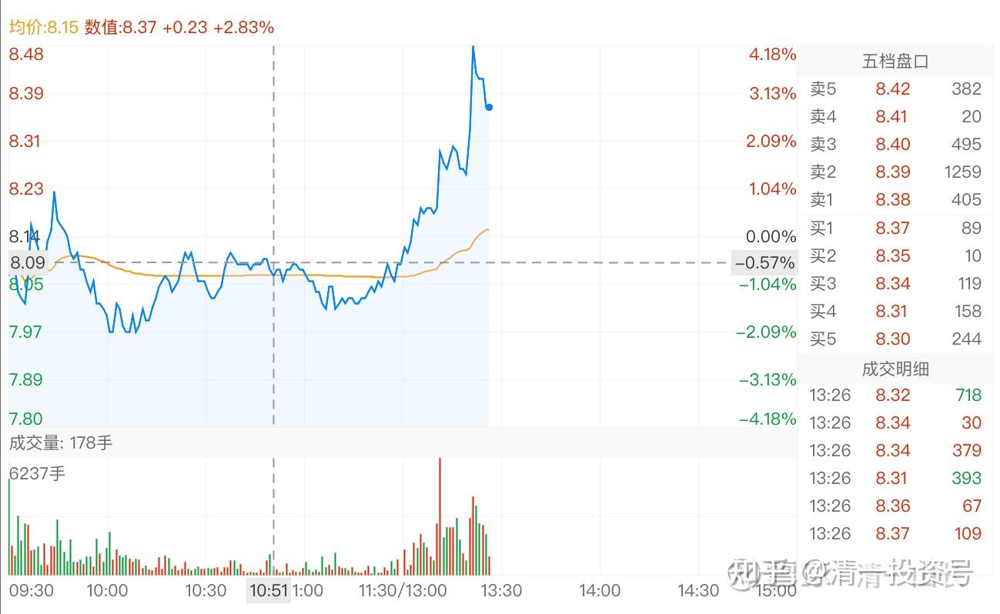

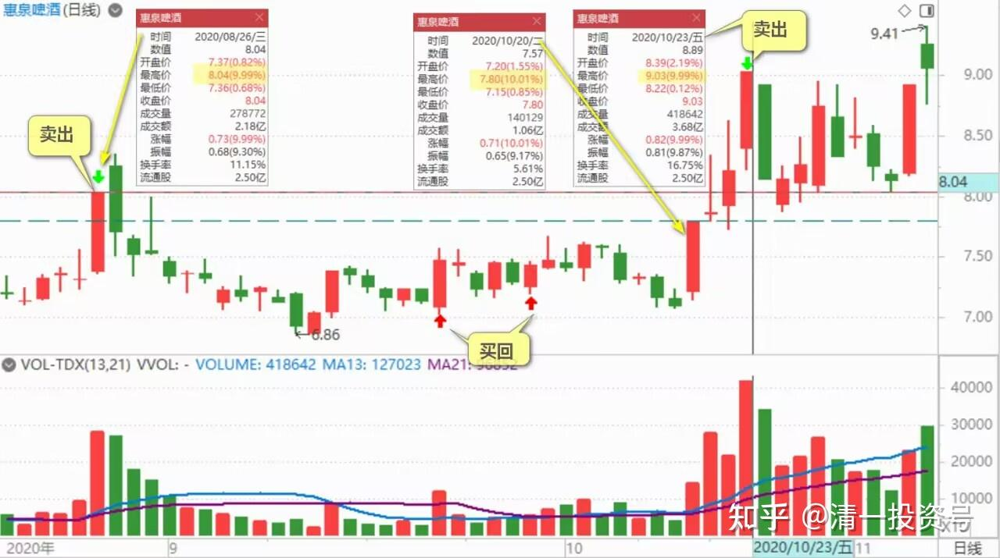

满仓死多30年回复清一山长：（跟评上贴）

山长太牛x了，现在看又是10个点入账。

清一山长2020-10-29 14:36:02回复满仓死多30年：

你算的帐没错：我这一轮惠泉的买入价格，成本就是8.006元,几天就赚了10%。不过才买了1M多，只买了原来持仓的半仓就涨了！调整时间太短,没想到。幸亏珠江都同步买进了不少，否则总持仓减少就遗憾了。

也恭喜原来买了我9.03元惠泉的股民。很快就解套了！[献花花]。欢迎你们以后继续追涨。

**四、啤酒买入的价格，就是确定性的低估**

娟娟tat回复清一山长:

山长兄，您好！经常听您学生的家长分享、您的教学理念和投资理念，也在雪球里观注了一段时间，由于我是股票小白，对于在这个时间段选择啤酒类有点不解？更不解的是惠泉这几天的流出资金大于流入资金，它却不断地涨？

清一山长2020-10-29 12:10:42回复娟娟tat：

啤酒的投资逻辑，别说股市小白了，多少资深投资人，老股民，都看不懂的。就算是我讲出来了，听懂的人，也是极少数。**有人跟风赚了钱，不是因为懂，是因为他们的运气好。我赚的钱，是因为市场不懂啤酒，我才赚到的。**我在啤酒上，今年赚到了比惠泉一家公司的总利润更高的钱，就是因为我看懂了啤酒。以后，别人慢慢就会懂了。**等懂的人多了，市场风险就高了。**比如白酒。我赚了底部的白酒，五粮液我买入的价格才14元。泸州老窖，我买入的价格16元。20元也买了不少。您看现在的价格？

当然，我早就出了，赚了三四倍就走了。风险增加了，我就去买了没涨的啤酒。其实算起来换不换都一样赚，甚至坚持拿住白酒，可能更赚钱。但是，我不喜欢赚这种高估，博傻的钱。**我喜欢确定性。啤酒我买入的价格，就是确定性的低估。**现在，啤酒也快被人看懂了，我也快进入收获期了。10元以上，我会慢慢卖出啤酒的。逢高就减仓。不是我卖出就不会涨了，燕京将来，涨过20元也不奇怪（跌到五元也正常）。我10元以上，逐步退出的啤酒资金，会去继续找低风险的，别人看不懂的底部股票去买。我不喜欢追热闹！所以我总在弄别人不懂的东西。

(标题、图片为编者所加)

**文章音频**：

[426篇.三只股轮动，谁涨停卖谁，谁跌停买谁_清一投资号文章同步音频](http://link.zhihu.com/?target=https%3A//www.ximalaya.com/sound/713987538)

**参考链接：**

[43篇.短线T、高级T和反向做T](https://zhuanlan.zhihu.com/p/673874352)

[44篇.没有等来秀场时间，依然要拼耐心](https://zhuanlan.zhihu.com/p/674885494)

[45篇.燕京的“传统”——总是令持仓者失望](https://zhuanlan.zhihu.com/p/677136646)

[46篇.风险是涨出来的，机会是跌出来的](https://zhuanlan.zhihu.com/p/677785950)

[47篇.主力的动向，说明了此股的利空利好](https://zhuanlan.zhihu.com/p/677786129)

[48篇.涨停是否要减持：时机、成交量、基本面配合情况](https://zhuanlan.zhihu.com/p/680828476)

[49篇.报表已经证明燕京正在重新崛起](https://zhuanlan.zhihu.com/p/681475572)

[50篇.惠泉股性活跃，喜欢刺激的人有福了](https://zhuanlan.zhihu.com/p/682717047)

[51篇.是风险赌博还是稳定投资？](https://zhuanlan.zhihu.com/p/684479170)

[52篇.惠泉、珠江、燕京的换手率](https://zhuanlan.zhihu.com/p/685682634)