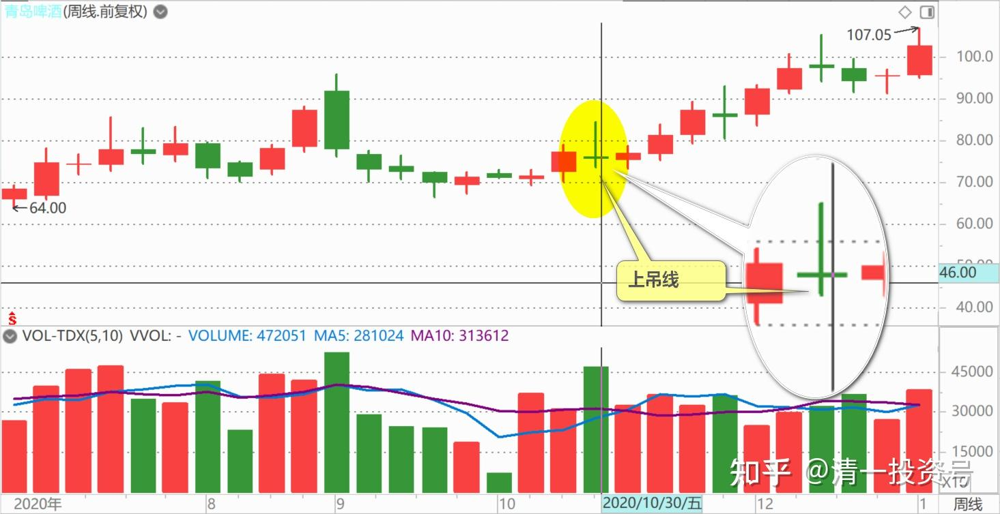
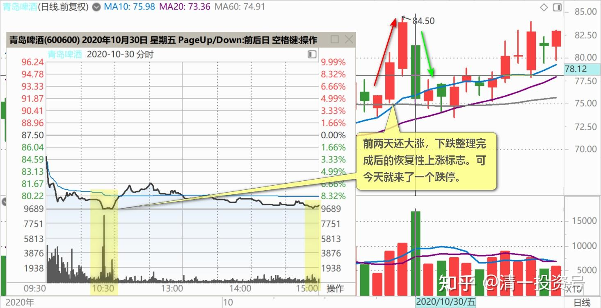
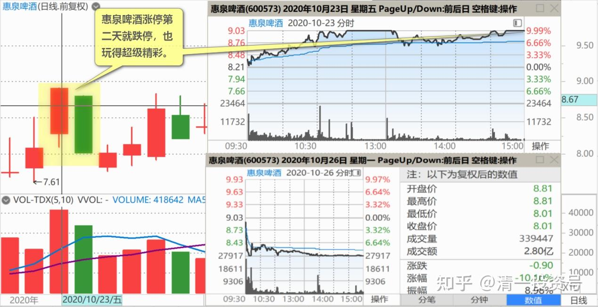
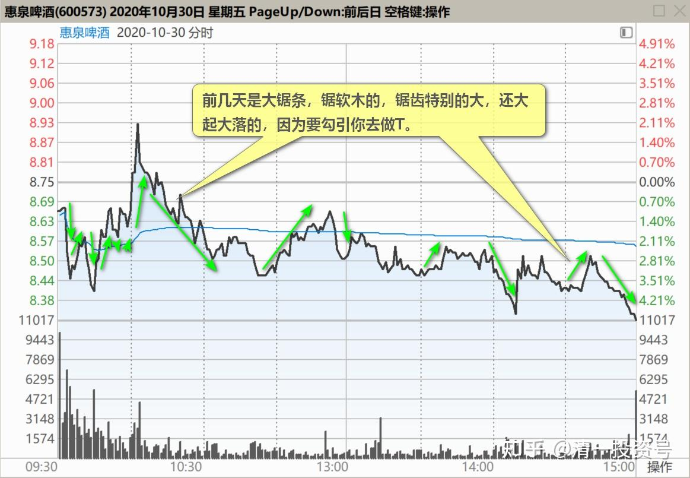
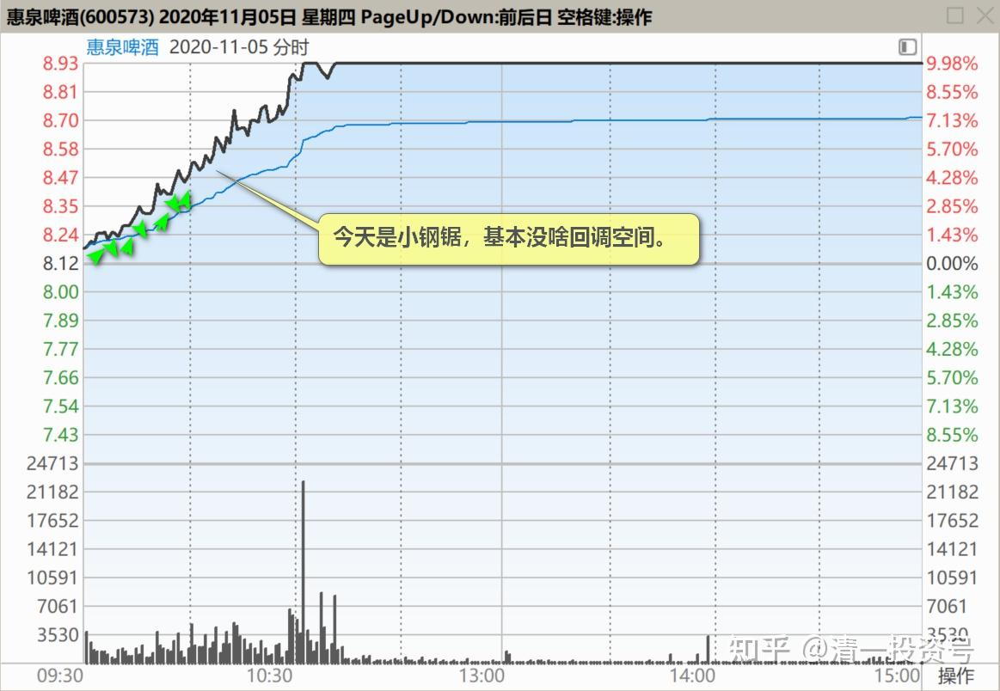
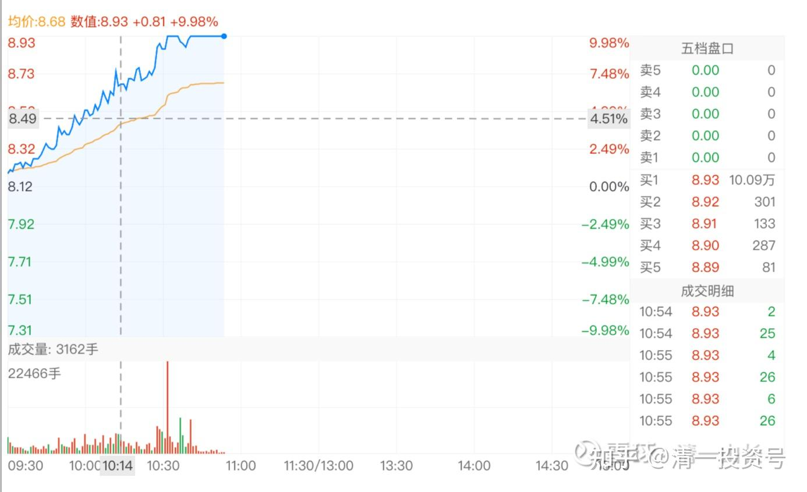
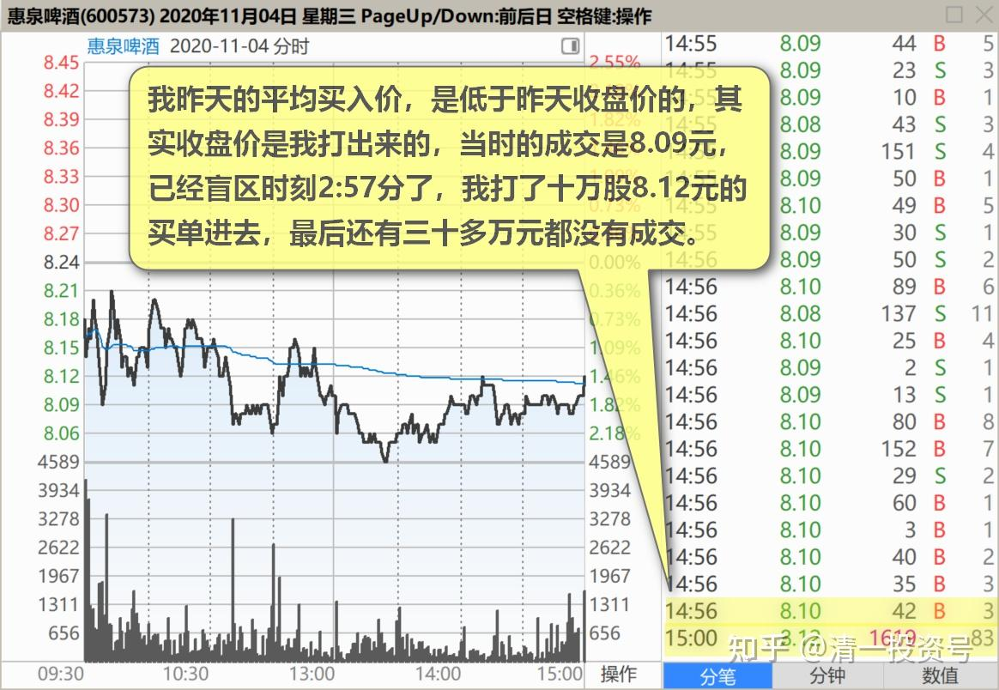
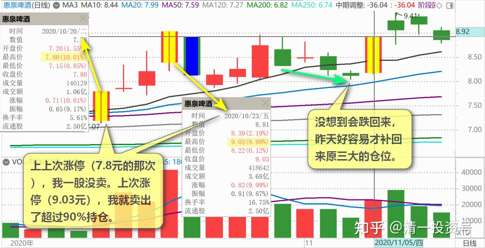
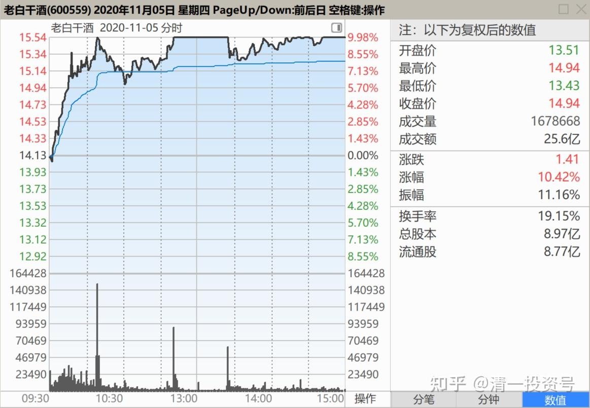

55篇.啤酒行业，已经有大鳄进来了

清一山长2020-10-30 10:32:12

$青岛啤酒(SH600600)$ 居然玩跌停？是要洗牌还是要出货？把啤酒股都全带崩了？周线上，本周一根上吊线，真难看。实际上，青岛本周除了今天，全是涨的。前两天还大涨，下跌整理完成后的恢复性上涨标志。可今天就来了一个跌停，真有你的。这种调整级别和手法，算是惊人的。**啤酒行业，已经有大鳄进来了**。杀伐声重，但也带来了市场的活力和兴奋。**过去多年死气沉沉的，现在经常冒涨停板、跌停板。精彩！**

惠泉啤酒涨停第二天就跌停，也玩得超级精彩。这些迹象，都说明啤酒开始热起来了，冬天喝啤酒吗？我才不相信主力会选冬天吐啤酒，这个季节，好喝不好吐！**最佳的吐出啤酒的季节，是夏天、秋天。**比如2021年的8～10月，可能小散们热火朝天的开喝啤酒的时候，就是啤酒大鳄吐出喝饱了的啤酒的时候了。比如白酒昨天的大幅上涨，泸州老窖涨停等，其实是喝多了，要吐酒的信号！[俏皮]

清一山长2020-11-04 15:20:22

$惠泉啤酒(SH600573)$ **今天满血复活，8.10元左右不断买入，**已经完全恢复了三大地位。如果还继续破8的话，难说我就要去抢第二大股东了。不知道到时候会不会给我一个董事职位[大笑]？反正我有大把的燕京来换股，不差钱[俏皮]。

行股如禅回复清一山长：（跟评上贴）

山长，能告诉我们当前十大股东有什么特殊待遇吗？如果成为董事会给发年薪吗？真的很想知道。

清一山长2020-11-04 17:21:06回复行股如禅：

我也特想知道答案：我到底有啥特权？能随便白喝公司的啤酒吗？可以找公司报销餐费、油费不？年终给不给红包？你们谁能告诉我[为什么]？

清一山长2020-11-05 10:31:35

$惠泉啤酒(SH600573)$ 昨天居然跌到8.0元几分，我当然买买买，补进了1M多。在普通账户上卖掉燕京、珠江，又在融资账户上补上燕京、珠江。换出上千万资金，才买了这么多，重新进三大。原以为今天会逼我争取当二当家的，没想到今天就来了大涨，看样子今天又要冲板了。**注意成交图的锯齿状，前几天是大锯条，锯软木的，锯齿特别的大，还大起大落的，因为要勾引你去做T。**今天是小钢锯，基本没啥回调空间。为啥？让做T的去死！你最多T个几分钱，就T飞了几毛钱！典型的逼空局面。而且，看成交量，并不大。现在才11万手。而且一大早就拉高，今天有打板的可能。但今天的打板，会不会又像10月20日的打板一样，其实是个坑呢？今天我要不要退出十大？

清一山长2020-11-05 11:09:05

$惠泉啤酒(SH600573)$ 刚发完贴，就冲板了。**224万股的成交（一笔就买了一个三大）直接拉板，板上堆积的资金量，达到1200万股**（**等于六个三大的资金量）。**瞧，这就是主力，秀肌肉！所以我说主力不是十大股东。除了控股方，其他全部的九大股东，加起来都没有今天拉板的资金大，**隐形的主力才是最强大的。**我这种三大，根本就不算什么。大散户一个罢了，根本没资格跟主力相比。

拉板几分钟后，破板了。引来一阵惊慌的抛盘。但不是把筹码打下来的。而是主力抽掉打板的资金，故意诱空的。我很认真看盘，发现抛盘很少。也就是说：**主力想要你尽量在涨停版卖出筹码，他用这种动作来催促你快卖。**我相信很快就会继续封板的。此时买入，肯定是赚钱的。但由于主力给的空间很少，只有一个点不到，还没有多少抛盘，想买也很难买到多少抛盘。大一点的卖盘，都堆积在涨停板上了，也就两千多手。**由于我的习惯，就是遇到主力涨停，发红包的话，我愿意卖出一点，与主力同喜。**我就忍痛让点筹码出来，放了仓位10%不到的单子在涨停板上。主力想要就要，算我送的。如果不想要，直接跌下来了也没事。反正我也不想低于上次涨停的价格卖掉。实际上我多虑了，接下下几分钟后，又再度快速封板了。这一次，看样子是真心封板了。其中有接近一半的单子，是我给的筹码！也就是说，其实真卖的人不多。要么就都是聪明人，持仓待涨；要么是笨蛋手上已经没货了。是不是昨天都卖出了？其实昨天收货很累的，一万股、两万股的凑单子，凑得累死了，才勉强拿了1M多。还没捂热，今天也舍不得多卖，卖个10%，是个贺喜的意思，就成了！[俏皮]

注意成交明细了吗？没有啥大单卖出的，都是小散在高兴地兑现利润。主力真大方，一天就给了我超过涨停的回报（我昨天的平均买入价，是低于昨天收盘价的，其实收盘价是我打出来的，当时的成交是8.09元，已经盲区时刻2:57分了，我打了十万股8.12元的买单进去，最后还有三十多万元都没有成交。早知这样，我应该打8.15元应该就全买进了）

曾乐天回复清一山长：（跟评上贴）

涨停卖出百分之十，啤酒股急跌买入。这种操作原则，如意的概率非常大！

山长老师威武……

清一山长2020-11-05 11:29:31回复曾乐天：

**不是你这样“量化”的。上上次涨停（7.8元的那次），我一股没卖。上次涨停（9.03元），我就卖出了超过90%持仓。**没想到会跌回来，昨天好容易才补回来原三大的仓位。还没捂热，所以今天只出10%[大笑]，筹码刚回家，我想放在手里先亲近亲近！明天假如再来个涨停，我就90%都出掉。不会只卖10%的。

清风紫悟回复清一山长：（跟评上贴）

山长，请问哈怎么练出来你这看盘的本事啊？

清一山长2020-11-05 12:07:57回复清风紫悟：

奥秘就是《鬼谷子》。只要您读懂了这本书，再来看这些K线，来猜主力庄家的心思、动静，就像透明的一样。这本书，是用来打仗用兵、治国的。我用来玩玩股票，实在是大材小用有点对不起先圣先贤们。谁让我根本就没啥远大的抱负呢[俏皮]！就用《鬼谷子》股市上赚点小钱，办个特色学校，让孩子们开开心心地读书，我也很开心了。

如梦初醒xhr回复清一山长：（跟评上贴）

有钱就是好呀！

清一山长2020-11-05 12:12:19回复如梦初醒xhr：

您弄错了。不是因为别人有了钱，才能赚更多钱。而是因为有脑子，才可以换钱，越换越多。有脑子也可以换成功的事业、幸福的生活等等。但如果您没脑子的话，多少钱，都要赔光的。也别谈啥事业、幸福。只能勉强打个工，过个日子罢了。

**我的钱，是用思维换来的。**不是谁给钱换的。**你们想要挣钱，先换脑子！这是铁律。不换脑子，来股市就只会赔钱！[吐血]**

清一山长2020-11-05 12:00:50

$老白干酒(SH600559)$ 最近一段时间。你三次冲涨停，我都根本没理你，连看盘都懒得看，真不好意思。今天你再度涨停了。事不过三，我就该关心一下了。账上动手，卖出20万股老白干，是个意思。表示友好出让一些筹码出来，不吃独食。

我注意到一点：**白酒真的和啤酒不一样。一个上午，成交已经19.44亿元了。涨停板上，依然有十几个亿的资金死死地封锁住涨停板。相反，珠江也算牛股了，珠江、燕京，玩一次涨停，也就两三个亿的成交量。**可是珠江、燕京的盘子，比老白干多一倍，资金硬是不青睐啤酒。要把老白干的这资金拿来玩啤酒，啤酒一样要飞天的。我就耐心等等吧！毕竟我的啤酒持仓，比白酒持仓多了一个量级。因为我犯傻了，觉得白酒过热了。其实，我本来有机会买入更多的白酒，账面会更好看的。有点小遗憾，下次有机会再补上吧！

(标题、图片为编者所加)

**文章音频**：

[430篇.啤酒行业，已经有大鳄进来了_清一投资号文章同步音频](http://link.zhihu.com/?target=https%3A//www.ximalaya.com/sound/718149307)

**参考链接：**

[47篇.主力的动向，说明了此股的利空利好](https://zhuanlan.zhihu.com/p/677786129)

[48篇.涨停是否要减持：时机、成交量、基本面配合情况](https://zhuanlan.zhihu.com/p/680828476)

[49篇.报表已经证明燕京正在重新崛起](https://zhuanlan.zhihu.com/p/681475572)

[50篇.惠泉股性活跃，喜欢刺激的人有福了](https://zhuanlan.zhihu.com/p/682717047)

[51篇.是风险赌博还是稳定投资？](https://zhuanlan.zhihu.com/p/684479170)

[52篇.惠泉、珠江、燕京的换手率](https://zhuanlan.zhihu.com/p/685682634)

[53篇.三只股轮动，谁涨停卖谁，谁跌停买谁](https://zhuanlan.zhihu.com/p/686904967)

[54篇.黑文滚滚或是粉红一片](https://zhuanlan.zhihu.com/p/687874750)