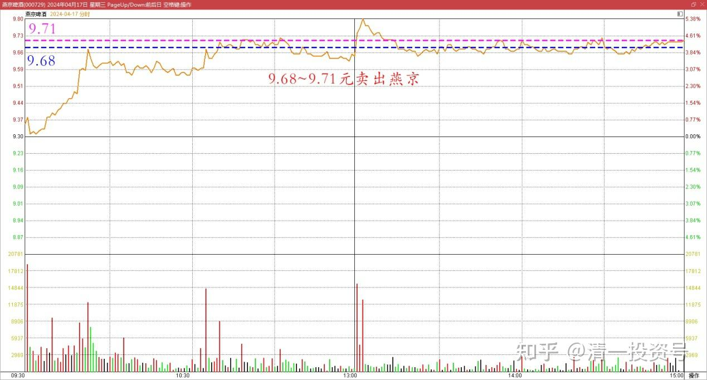
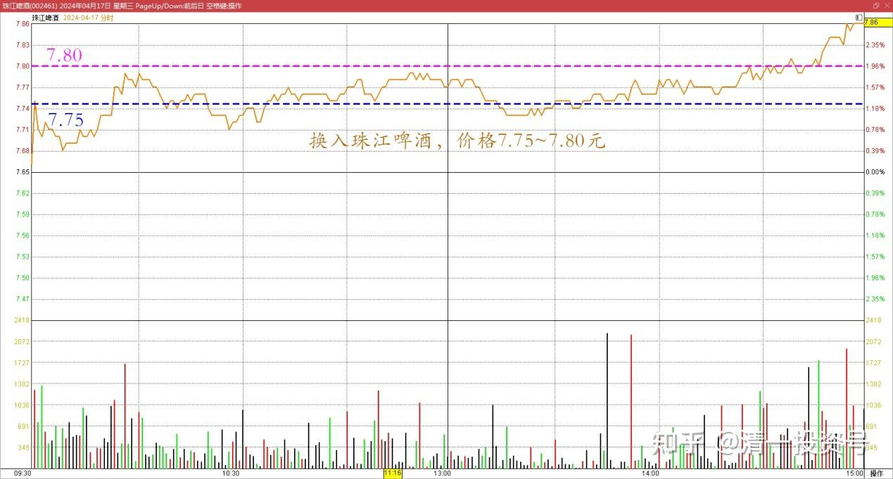
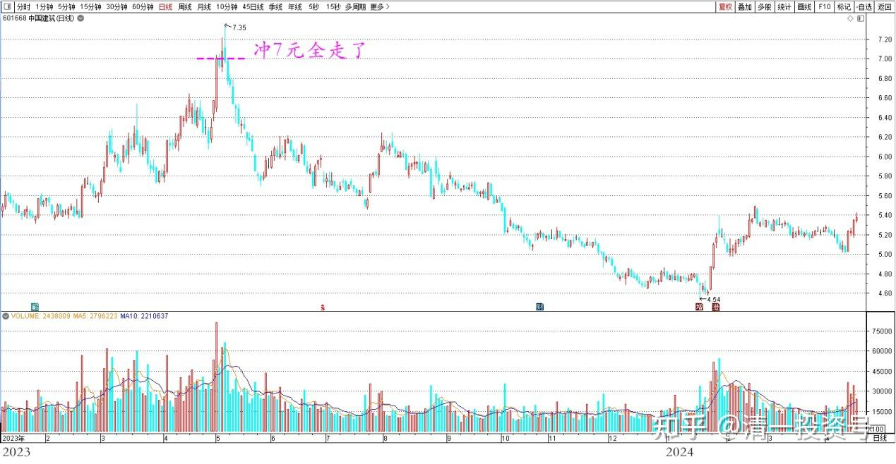
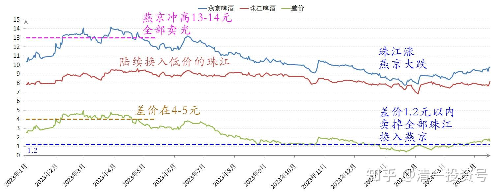
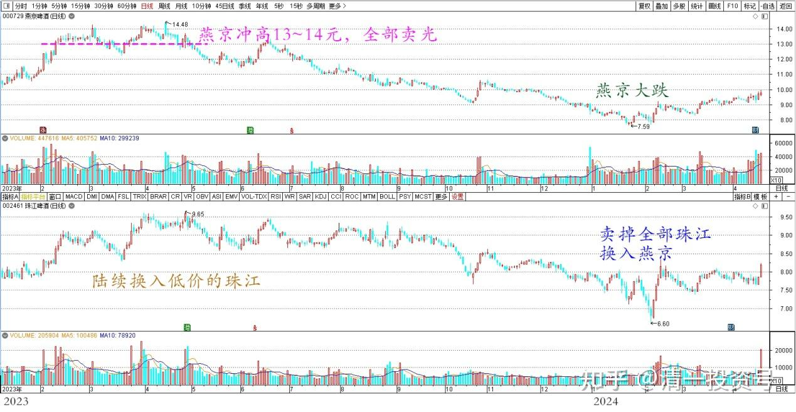

**79篇.养老账户操作：燕京换珠江**

清一山长2024年4月17日

今日老人养老账户的操作：9.68～9.71元卖出燕京，同步换入珠江啤酒。换入价格7.75～7.80元。

燕京啤酒2024年4月17日分时图

珠江啤酒2024年4月17日分时图

这个账户，去年持仓的几乎全是燕京和中建，中建冲7元全走了，只剩下利润。

中国建筑2023～2024年日线图

燕京冲高13～14元期间，已经全部卖光，陆续换入低价的珠江，当时两票差价在4～5元，也因此锁定了燕京的利润。前段时间珠江涨，燕京大跌。两票的价格差减少之后，差价在1.2元以内，就卖掉全部的珠江，换入了燕京。

燕京啤酒、珠江啤酒2023～2024年收盘价

燕京啤酒、珠江啤酒2023～2024年日线图

上一次的两票交换，珠江的账面上总利润基本上没有明显增加。但现在重新换入珠江的时候，燕京的账户上已经额外增加了300多万利润。珠江大概率后续也会追上来的，这就是不断换股的好处。目前啤酒已经成为老人养老账户的最大利润创造者。白酒是第二利润创造者（已经退出）。说明中国酒文化的魅力！

(标题、图片为编者所加)

**文章音频:**

[437篇.养老账户操作：燕京换珠江_清一投资号文章同步音频](http://link.zhihu.com/?target=https%3A//www.ximalaya.com/sound/724054751)

**参考链接：**

[70篇.金融战·中建换燕京啤酒](https://zhuanlan.zhihu.com/p/681428626)

[71篇.顺鑫农业现在还能买吗？（上）（配图版）](https://zhuanlan.zhihu.com/p/682697509)

[72篇.顺鑫农业现在还能买吗？（下）（配图版）](https://zhuanlan.zhihu.com/p/683344685)

[73篇.意外降价，买回惠泉（配图版）](https://zhuanlan.zhihu.com/p/682700319)

[74篇.A股要崩了？我还在买股票！](https://zhuanlan.zhihu.com/p/686286680)

[75篇.同为啤酒，敢否持有？（配图版）](https://zhuanlan.zhihu.com/p/684419681)

[76篇.年前最后一天，燕京换惠泉](https://zhuanlan.zhihu.com/p/688783385)

[77篇.年后第一天，看啤酒起落](https://zhuanlan.zhihu.com/p/688784278)

[78篇.洛阳钼业换华菱钢铁](https://zhuanlan.zhihu.com/p/692417410)

