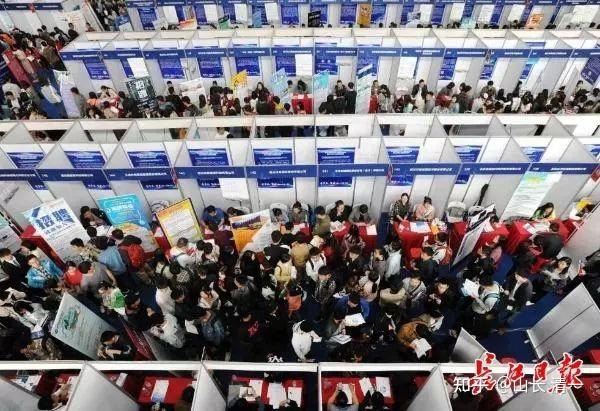

设想一下：假如你现在22岁，你在面试官面前，怎样拿出一份【独一无二】的学生阶段履历，凸显你独特的人生价值，在你的职场一开始，就获得明显的比较优势呢？

如果你没有啥规划，被动到22岁，再去想这个问题就太晚了。你就是千千万万随波逐流的求职者之一。毫无特色的你，只能被动地，委屈地接受别人的挑选。甚至很可能寒窗20载苦读，换回一个无人问津的结果！

*如此芸芸众生，熙熙攘攘。你怎样从中脱颖而出？*

人无远虑，必有近忧！为了防止生命被浪费，被消耗，也许你应该主动出击，寻找市场的漏洞，找到你最佳应对方案！

选择比努力更重要：一份靓丽的学习成绩单，其实并不需要你像在体制学校一样，从幼儿园就开始卷学习。你可以轻轻松松，快快乐乐就完成超越！你只需要在最关键的时刻，做出最有价值的选择就够了！比如，你可以在15岁，甚至更早在12岁的时候，就要考虑你未来在22岁将要面对的人生大事，选择一条与众不同的求学道路。要想到将来，当你面对企业的面试官时候，你要如何才能拿出一份堪称惊艳的求学履历，让你鹤立鸡群。与众多毫无特点，像是一个模子里面倒出来的体制学校求职者，彻底地区分开来，轻松获取职场的成功！

我相信：这是你为自己人生，未来的职场，创造的一份最有价值的学业规划和设计图！与众不同但卓越优秀！

设想你22岁，假如面对华为，或者腾讯，比亚迪的面试官，你见面开场的第一句话，就告诉他们：

**各位领导好，我是###，今年22岁。虽然我很年轻，但我已经读完了五个大学专业，而且是五个没有联系的不同专业。都知道大学有双学位，我是相当于五学位的大学毕业生！其中至少在三个大学专业里面，我属于顶尖级。其他的两个大学专业，我也是优等生级别！我学了五个不同专业，好处就是您如果录取了我，一个人就可以当五个人用，不会浪费。但您只需要支付给我一个人的工资就够了！**

面试官大奇：22岁？你读了五个大学？还是不同专业？吹牛吧？你咋读的？几岁开始上大学？

你就认真地告诉面试官，一一谈来你的求学经历。让他明白学习效率是学习卷时间更有用。

**我的第一个具有大学毕业水准的专业技能，是大学英语专业。**我取得了超过绝大多数大学外国语学院的英语专业学生成绩，掌握水平不仅仅是书面的考试能力，还具有接近于母语的理解，沟通，交流的能力！我拥有国际语言资格考试优等证书，证明我的水平超越普通的英语专业大学生！取得这个成绩的时候，我才刚刚15岁！当时我的雅思成绩是7.5，美国高考SAT成绩的成绩是1470分！美国GED成绩平均分是175分，而且口语非常流利标准！达到翻译水平。相信考官知道：国内外大多数大学外语学院英语专业的学生，大学毕业的时候，多数人是达不到这个能力的！

（说明：今日三校学习的学生，取得这个成绩完全很轻松，这就是今日三校学生学习四年之后的中等偏上的成绩，不算是最优秀的。我们可以批量培养具有这种水平---超越普通专业大学生的学生）。

**我的第二个具有大学毕业水准的专业技能，是小语种专业！**在我16-17岁的时候，我选修了西班牙语！并取得DELA考试的C1证书。据说C级别是大学语言专业研究生阶段的要求。本科阶段，很多学生直到毕业，连B2的证书都没有拿到。所以这是我第二个相当于大学毕业专业水准的专业特长！能力水平超过了很多大学语言专业的普通毕业生！

（说明：在具有外语学习教学优势的今日三语高中，学生学小语种专业只需一年左右，90%的学生就可以拿到超过B2的成绩，30%的学生可以拿到C1的成绩）

**我的第三个具有大学毕业水准的专业技能，是体育运动竞技！**15岁我考完美国高考之后，去泰国一所中国人办的武术体育学校学习--【SAMURAI MULAN学校】。学习三年后，我取得了明显超过体育大学搏击专业本科毕业生的技术水准。因为大多数体育大学的搏击专业学生，毕业的时候，连参加国家级的锦标赛资格都不够，只能参加校内比赛。每个队只有第一名，才能被派去参加全国格斗锦标赛。我参加过自由搏击全国锦标赛，泰拳全国锦标赛，并取得了全国前三名的成绩记录！我还代表中国队去参加过世界锦标赛。我是国家体育总局认可的国家级一级运动员，获得了国家级运动健将称号！因此，我取得了相当于国家体育大学最顶尖的优秀毕业生才有可能取得的专业运动成绩！

（说明：这对普通人根本不可能取得的竞技成绩，已经批量在今日系学生中展开。依靠独特的太极格斗技术，降维打击现代格斗，我们的学生可以轻易击败从小练拳的老手高手，轻松获取国家级运动健将的称号。如果不喜欢格斗的学生，也可以学习武术套路，参加全国性的比赛，也有全国武术套路锦标赛，这样也可以拿到金牌和银牌。相对来说，也比较容易取得国家二级运动员的资格。只是这个比赛的奖牌，含金量比格斗类的全国锦标赛价值要低得多）。

**我的第四个大学毕业的专业，是取得了QS排名相当于中国985大学的海外知名大学**的毕业证和学位证！我17岁这年，去泰国排名前三的清迈大学就读【人文与发展专业】，取得了全科优秀的优等毕业生资格！不过相对上面的三个专业来说，这个学业成绩，没有啥特别的优势，不好比较优劣！

【说明：清迈大学的国际学生入学要求很低，只需要雅思5.5分就能入读。甚至考不到5.5分，你去上清迈大学的语言预科班，学过半年，来个内部考试，就可以录取了。海外名校其实门槛不高，很容易入读，比入读三语高中都要容易得多，其实也学不到什么东西。好处是：这是教育部认可的优秀海外大学！】

**我的第五个具有大学毕业水准的专业，是清一大学管理学专业！**这是我五个大学专业里面学习难度最高，也唯一没有国际认证资格证书的大学和专业。因为这是一所私人大学。但我学这个专业是五个大学专业里面技术含量最高的专业。主要的教学内容，是北大光华管理学院的MBA管理课程，由世界五百强的企业高管亲授课程，相当于管理类的研究生水平。教学内容也特别接近于企业的需求，而不是普通大学里面迂腐的教条和规范！

我猜：你介绍到这里，企业面试官会目瞪口呆的。你再轻轻的说一句：

**其实我还有第六个文凭：是QS排名世界前50名大学的硕士研究生文凭。**我还有QS排名前30名大学的本科入学资格，可惜我只去上了几个月的学，发现他们的毕业生水平还不如我，是收智商税的，我就早早退学了。后来，我去社会上锻炼了一年，去体验最下层的社会的生活，去了解世界。现在想要正式开启我的职业生涯了，就来您的企业应聘了！

（说明：今日的毕业生，按照成绩，录取到世界前30名欧美大学并不难，锁定前50名就更容易了！英国的大学，读一个硕士，只需要一年半左右就行了，特别容易拿到证书，俗称水硕。技术含量高的是理工博士！但是，这些主要是欧美大学，除了顶尖理工科专业，别的专业，都有点智商税。没必要这样卷自己。如果你不是啥科学家情结，你只是为了找个好工作。我的这种规划安排，是比你去卷死你自己更容易的职场通行证。真没必要花大钱去这些大学卷死自己。其实现在的国内外大学里面，真学不到啥东西的，就是拿个国际认可的资格证罢了）

**我相信你介绍到此时，面试官只会小心翼翼的问你：你来我们企业应聘，想去什么岗位工作? 你有啥特别要求？**

你就可以大方地说：我可以做的工作，大概有以下几种：

1：我可以做翻译工作，由于我有三个国家的语言水平，都接近于母语程度！因此我可以与当地人和其他公司的高管，合作对象等用英语沟通交流，也可以帮助老板与我们的海外下级员工进行良好的沟通交流。我会认真去当好老板的翻译和助理！

2：由于我拥有格斗特长，在紧急情况下，我可以做老板的贴身保镖，尽量防止我们的管理者在海外出现意外伤害事件！

3：我系统学习过北大光华的MBA管理课程，我的学校一直在锻炼我们的沟通交流能力，我也擅长完成员工培训任务！我也会带班学习。所以，如果企业需要的话，我可以承担我们企业的基层员工培训和素质提高的任务。就不需要外聘讲师了，可以为企业省下一大笔培训费！

4：我也愿意去最基层工作，可以去海外第一线，与外国的工人一起工作，帮助他们理解工作任务，提高工作效率。并把我们的工作目标和要求，准确传递给第一线的工人。避免被一些无良的中间人，利用中国人不懂当地语言的信息差，在不同国籍的员工之间误导，为自己谋取不当利益，影响我们的企业形象！

5：我很善于写作和表达，善于做宣传。如果企业需要，我可以承担为企业宣传的工作和任务，做好企业的自媒体，帮助我们的中资企业在海外展示良好的形象。也可以帮领导写报告。

6：我最大的优势，就是学习能力强，可以短期内就学会别人学不会的内容。因此，我们企业的其他岗位，如果需要人去顶岗的话，我不懂也愿意去学习掌握相关技能，可以马上去学新知识，我会最快速度掌握相关的知识，去完成领导交给的工作任务。

因此----只要是企业需要的岗位，我都愿意去做！我不挑岗位！能够发挥我的价值就好！

你认为，你这样的工作要求和条件，在一大堆拿着世界名校毕业证的求职者面前，在久经沙场的面试官面前，他会怎样看你？

他最关心的，不是要不要你。而是担心自己的企业和待遇，配不配得上你。希望你千万别被竞争对手搞走了！

在你的大学同伴们， 只能苦巴巴的等待他人的审视。入职后也只能一步一步的从基层干起，在与机器打交道。对你这样的跨界人才，企业的总经理总会想起你，会叫你去他的办公室随时侯用。做他的工作助理。因为你多才多艺，太好用了。

将来要提拔新人，去做地区分公司经理，或者部门经理，你认为谁更有机会？难道是天天在机房里面写代码的理工科高材生吗？只要你学了真文科，竞争力是理工科没法比的！

20年后，你的位置会在何处呢?你根本就不需要理工科专业技能，掌握这些技能的人一大堆。你所需要的，就是让这些人各尽其能，合理地安排和管理好他们！

这就是新教育学生的风采！只会去拼名校，拼专业？不如拼眼光吧！