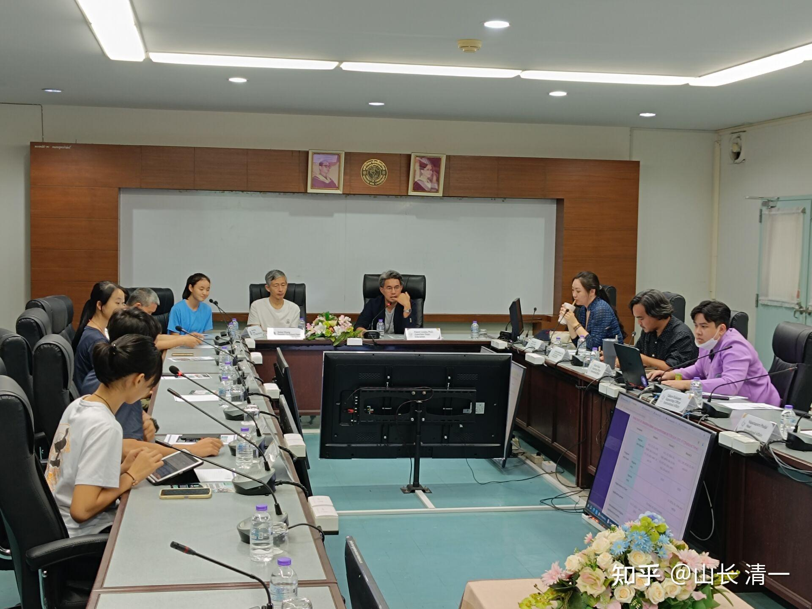

2024年4月27日，我校一行七人，与清迈大学人文科学院的副院长和相关专业的教授和招生人员，进行了两校合作的首次面对面交流探讨。之前双方已经通过电子邮件，交换了双方的合作意向和互相的了解！

清迈大学的负责人，见面后对我们的学生具备的能力和素质表示非常欣赏。特别是Ella作为翻译，在英语、泰语、中文三语之间熟练的转换，给对方的教师们留下了深刻的印象（对方一个新加坡国立毕业的博士，私下里对Ella表示，她应该去更好的大学，比如世界TOP20，认为她只是申请入读清迈大学就太可惜了。Ella表示不介意大学的档次，说在泰国工作生活的话，清迈大学已经足够好了）。校方非常认真地回答了我们的问题，表示非常欢迎我们的学生申请入读清迈大学人文发展专业。我们拥有的学习资历和证书，入读完全没有问题，符合该大学的申请标准。校方表示：会尽量为我们的学生设立方便通道，让我们的学生更好地发挥能力，入学后会给予我们学生更多的选择和发展空间。对于学生想要修习双学位，校方表示赞赏学生。认为学生如果有这个能力和需要的话，清迈大学的校方，会非常地支持！

会议现场。每个人都打印了出席名单！

不过，**清迈大学这个双学位项目，是为学泰语的公主班学生，开辟的特别通道**，也就是说，这是**为我们的【三语教育学专业】——未来师资班服务的校际合作项目**。当然，也不排除国内的学生，也愿意采用清迈大学作为跳板大学，通过它申请其他世界名校！因为也有一些世界名校，可能不直接接受中国学生的GED成绩申请，主要是这种通道，过去中国学生基本上没有采用过，一些古板一点的海外名校，不思变通，已经习惯了采用中国高考和国内高中成绩来审评学生！但清迈大学表示：在泰国有很多欧美学生，就不是正规的学校上学，而是采用HOME SCHOOL方式来学习的，因此他们会采用这个成绩，来作为高中毕业的成绩证明。因此他们大学原来就是习惯用GED证书作为大学录取标准之一的！并不一定要求高中的成绩和证书。如果GED的单科成绩在175分以上（单科总分200分），这个成绩还可以作为大学的学分来直接计算成绩。这样算起来，优等生差不多可以抵掉接近一个学期的大学课程（每学期学分要求是15分）。因此，这个选项还是很划算的！我们提前学的小语种也可以轻松抵6个学分！

除了对内的师范班，我们对外更多的是帮助学生适应社会和企业的就业要求。

**计划2024年9月份开启的【清一大学三语管理学专业班】。将**与东南亚知名大学——马来西亚的大学合作。学生15岁以上，用SAT成绩（不低于1400分），和GED优等毕业证书，就可以找我们申请并获取两校的入学资格，我们会帮助学生，直接申请海外大学，不需要到处找中介！只要你能够进入我们的三语高中，就能让我们帮助安排直接进入海外大学的双学位班级读书！三～四年后，学生就可以同时学完两校规定的课程，毕业就颁发两校的双学位、双文凭证书。因此，我们的学生不到20岁，就拥有至少一个国际承认，中国国家教育部也承认的海外名校学士学位和大学学历！以及现在国际教育界虽然暂时还不承认，但将来注定是世界名校的【清一大学本科毕业证书】。由我个人签发该证书，在学生获得海外知名大学学位证的时候，会同步发给学生持有！

我相信：这是一个超级实用的专业，本质上相当于体制大学的三学位专业：

**1、拥有小语种专业优秀生毕业水准的外语能力和证书，**

**2、还拥有清一大学相当于MBA级别的管理学课程水平，**

**3、还拥有海外名校相关专业的学士学位和文凭证书。**

目前东南亚和南美，中资企业出海，都急需有三语沟通交流能力的人才，也急需跨国管理人才。与入职国内的员工相比，除了工作岗位不卷，待遇不低于国内相同岗位的工资外。目前大学生毕业选择出国去工作，比如到东南亚地区，每天还享受企业50美金的海外生活补贴。如果你拥有三语优势，跨语言的管理学知识技能优势，学生就更有职场竞争优势了。我相信这个专业，必定会成为比海外名校理工科毕业更受欢迎的热门专业。

今年本专业的首次招收计划人数，是20人。关键是**个性必须比较开放，喜欢社交的学生才能入读**。社恐症的学生，学了管理知识也是白费的，根本就用不上。估计目前**最符合要求的，就是今日示范班的学生。**也许今年9月份，会有示范班第五年的示范——小语种教学！

**第一学年课程：**

第三语言（西语、日语、泰语任选）

管理学基础课程1：管理者的执行力。

管理学基础课程2：管理者的沟通能力培养。

辅修课程：国民性和中华文化特色1！

国学和中华武道修习（体育课程）

**第二学年课程：**

管理学课程3：管理者的思维误区

管理学课程4：领导者的管理人格和魅力1情商课程

管理学课程5：领导者的管理人格和魅力2个性魅力

管理学课程6：领导者的管理人格和魅力3领导力

管理学课程7：管理者的员工辅导和激励技巧！

辅修课程：国民性和中华文化特色2！

国学和中华武道修习（体育课程）

**第三学年课程：**

管理学课程8：管理者的演讲与口才

管理学课程9：管理者的压力管理和压力释放。

管理学课程10：国际职业经理人与国企管理人

管理学课程11：管理学的国际视野——世界知名管理学家范例学习

管理学课程12：管理学的中国思维——《孙子兵法》与商战智慧

辅修课程：国民性和中华文化特色3！

国学和中华武道修习（体育课程）

由于马来西亚大学是三年制的，因此根据英制大学的规则，我们上面只安排了三年课程。其实由于学生16岁才能考GED证书。对于目前入学要求——只需15岁就拿了SAT成绩，申请入读我校入学的学生而言，清一大学会提供一年的三语教学工作，学生必须拿到相当于B2水准的成绩，才有资格申请入读这个管理学双学位专业！因此，实际上对于清一大学来说，学生**总共是要学习4年的学习规划和安排**！

另外澄清一下：很多人可能误以为以上十几门管理学课程，都是“人学”课程，应该是我亲自代课提供内容的，其实不是的。因为**我的主要精力和时间，是师资班和武道班，这个管理学班不是我亲自带的**。

我对教学生赚钱做管理，虽然我很在行，但我真的不感兴趣。但的确这些管理学的课程安排和内容选择，是我亲自来安排规划的。每一门课的教材、内容和要求，学习方式，都是我选择内容，规划并由我的助教来贯穿和实行课程要求的，以达到本课程的最佳教学目标。

本管理学课程的核心内容提供者，是世界五百强的海外原高管，非常成功的高级管理人，内容是在他退休之后，被北京光华管理学院返聘，来做五百强企业的高阶人员MBA课程培训等等，属于北京光华管理学院的MBA课程高级培训内容。我当年学过这些课程，认为这些内容是非常实用，非常接地气的课程，与大学里面的普通管理学课程，完全不是一回事。

当然，当年的光华管理学院的课程培训费用，远远比上一个名牌大学贵得多，档次也高得多。我只不过是借助了北大MBA高管课程的教材和内容，作为该班级的培训内容罢了。没有自以为是的去授课，编教材，确定内容。而是取法乎上，让真正的世界五百强高管来培养未来的高管。这样才能培养出真正懂管理的优秀管理人员！

当年，我也做过企业，当过老板。也学过类似的大量有价值的实用级别的MBA管理课程。后来我也在武汉大学，给一群老板讲过MBA管理课程。因此我是知道：什么课程是有用的，什么课程是书生的花架子！我出来选择的光华管理学院的一些有价值的内容，肯定会重视现在企业的管理需要，是作为管理人才必须去学习和掌握的重要内容，才能成为我安排的课程内容！不浪费学生的生命学习废课程、虚知识！

该专业，除了我选择和提供一系列优质有效的企业高级管理内容作为【教授和教材】外，更重要是该班安排的**助教为原三语高中的首届优秀学生**，现在是三语高中的指导教师。让这些从小在我们学校学习的优秀老学生，带领现在的新高中部的孩子们，一起去大学里面学习和提升，效果比直接学这些MBA课程内容更好。因此——在内容上，理解上，重点上，肯定会受到清一派的“人学”理解的影响。既然我是派的助教一起跟随学习，所以我认为教学效果，与当年这个高管直接培训MBA班的内容，但是缺乏课后的跟踪辅导和监督相比，肯定学习效果会更好。另外，该专业班级，还有一些课程，并不是北大光华管理学院的课程，而是清一大学特色的。

有些课程内容（如**国学和武道修习，国民性理解，这些课程是与公主班同步，我负责授课的**），我个人，肯定是在泰国陪伴公主们学习。但这个管理学班级中，也有少量课程，是可以跟随公主班学生远程上课的！助教也是我直接指导的！

我相信：清一大学【**三语管理学专业**】，是一个培养超越世界名校各专业的【新型跨界人才】的创举；是在本科生阶段，就直接学习MBA实用课程的创举。未来这些学生，必将成为世界五百强企业在国际化发展中的抢手货。肯定就业前途，会比普通的理工科人才俏销得多！毕业生肯定会成为世界各国企业最欢迎的综合型人才，未来必有更多的学生，会走上世界五百强企业的高级管理岗位！这是时运趋势下，我国学生的最佳选项！这是一个不会过时的专业——中华“人学”和企业实际需要的结合课程！

当然，这个专业，并不适合所有人。一些性格内向，思想单纯，不喜欢社交活动，只喜欢埋头做题的小镇做题家，还是直接去读理工科专业更好。毕竟——小米的研发工程师，这几年一下子就扩大到了3万人。但我相信小米的跨国三语管理人才，并不需要这么多。领导和管理人员总是少数的，工人才是企业最需要的人才。大多数人，还是去做基层的技术人员，只有实实在在的打工阶层，才拥有更多的职位！

当然，我们三语管理专业的跨国管理人才，也不是普通的大学能够培养出来的，恐怕就是未来清一大学对外最核心的竞争力专业。由于每年只有一两个班的学生，铁定是供不应求的！清一大学另外一个热门专业，学生绝对不愁找不到工作的专业，就是教育学专业，师范职业了！10年后，也许还有医学专业！我相信这三个未来的清一大学专业，都是世界顶尖级别的！

发布于2024-04-29 01:26编辑于2024-04-29 09:45泰国

李华丽跟评：

单只是三年课程的安排，就可见含金量之高了。语言优势加中国传武优势之外，其他都是山长高阶课程的精华——心理行为课+江湖课，16岁就开始学习这样的课程，想不优秀都不行！

跟评山长回复2：

谢谢山长分享。当然不可能是山长亲授课程。山长一年才在寒暑假各开一次心理行为课、江湖课，每期只有21天，都一票难求，怎么可能3年都由山长给上课？但由山长教出来的新教育1.0老师、2.0老师来上课那是可能的。这些老师跟上山长泡了十几年，上出来的效果也不会相差太大。至于使用的教材，关键不在教材啊，关键在谁在讲、谁在引导。就像山长讲论语、讲老子，和很多所谓专家讲论语、讲老子，差别那就大了。所以，含金量绝对不是问题，问题是谁能幸运成为这首批的20个之一。

说明：原文被误伤了。所以找李丽华找了回来，这里重新登上来！