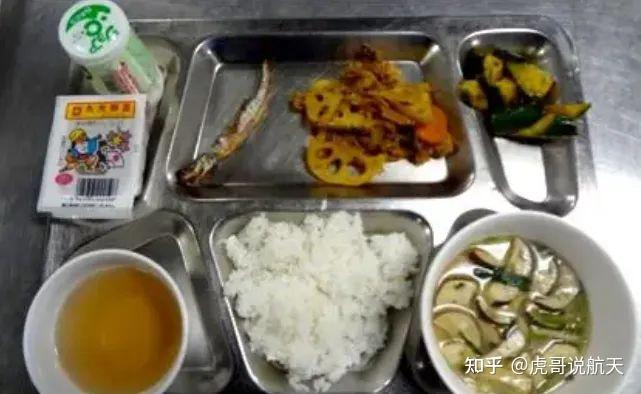
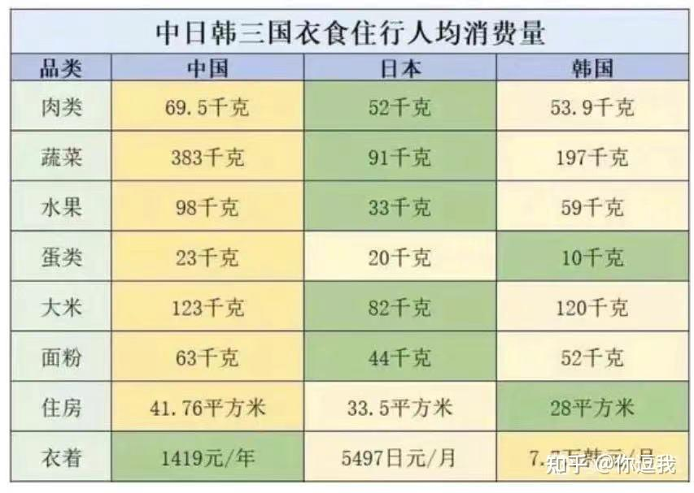

根据道法自然的原理来看：人和动物，在自然演化的过程中，必须是能够耐饥饿的动物。因为自然界，长期没东西吃是常态，偶尔才能拥有充足的食物。因此保持饥饿状态是正常，偶然饱餐才是意外。天天饱餐，身体一定出问题！---这是多少万年才自然演化出来的生物机能，不是短期内能够改变的！

相反---每天按时按顿吃饭，是人类稳定定居，且物质发达时代，工业化时代之后，才有可能出现的情况，相对自然界的生物演化来说，是非常短暂的。----中国只有最近40年，才真正实现温饱。我20岁以前，是吃不饱饭的，当时还是粮食配给制度---所有人限量供应，勉强够吃！

我泰国的家里，鱼池里有一群英国前主人留下来的锦鲤，当年离开之前。前主人交代我们要每天喂养两次鱼食，每次一份定量的食物，早晚各一次。当初我看到这些鱼，总是懒洋洋的样子，觉得怎么英国佬养的鱼，像是他家人一样慵懒。而且没多久，就会死一条鱼，只能捞上来埋了。但真不知道为啥会死。鱼池的通气，循环系统，过滤系统都正常工作，水也是清水。有一天---我突然想到---是不是鱼吃太多了？于是就减量，只给鱼原来50%的食物，结果很正常，也没有鱼继续死亡了。后来我去MAEON庄园，遇到一个泰国人也有个蛮大的鱼塘，但他喂鱼有一搭没一搭的，往往好几天才喂一次鱼，一个不小的鱼群，但他居然一个月也用不完一袋饲料。因为他不是靠喂养鱼来卖的人，养鱼只是爱好。我就发现---肯定我喂养的规律性太强，给多了饲料！于是回来后又减量供应，每天只给鱼儿原来20-25%的份量。甚至有时候忘了，好几天都没有喂鱼，但鱼似乎活得很正常，活跃度也提高了，不再像原来一样，懒洋洋的不爱动。每天在水里很有活力的到处游动！一两年前，我又放了10条小鱼进去，这些小鱼就更有活力！也在慢慢的长大。

**最能反应动物耐饥饿的案例出现了**：鱼原来饿不死，只会撑死！四五个前，大锦鲤鱼池里面只剩下四条小鱼了。剩下的鱼不知跑哪里去了，也没看见尸体，神奇消失了。最近才意外发现：原来这几条消失的鱼，顺著过滤的管道，溜进了过滤池，结果回不来了。但是----过滤池是没有投喂食物的，还被木板盖住，所以没有发现。投喂鱼食仅仅只丢进大鱼池，过滤池通过鱼池底部的一个管道与过滤池联通，水面上是两者是隔离开来的，鱼食没可能流到过滤池。而且---这个鱼池不是露天的，过滤池甚至有盖板，两个鱼池都没有阳光直射，因此也不存在靠生成藻类植物养鱼的事情。但我发现这些鱼，居然都活得好好的，甚至最不可思议的---是他们的体型与能够在正常鱼池里吃到食物的小鱼，大小也差不多，就是瘦一点。简单的结论就是：鱼几个月不喂养，也不会饿死。生物的确设计了超级强悍的“耐饥饿”机制！远远超过我们人类的普通认知，几个月不吃都没事的！相反---鱼如果得到充足的食物，吃的太多，真的更容易死亡。少吃一点，让身体总是保持在饥饿状态，是活力和长寿之道！我相信人也一样！

这一条原则，已经被现在的一些医学专业人士发现，有一本书专门研究“饥饿疗法”：

[《少食生活》：破译饮食中的健康密码，让头脑和身体更有活力的长寿生活](http://link.zhihu.com/?target=https%3A//book.douban.com/review/14574625/)

然而----中国的现实状态，完全与正确的饮食要求相反：国人均以多吃点，尽量吃撑自己。饱食终日为标准。生怕自己饿着！只懂得养猪方式的家长们，一代一代地把“尽量多吃一点”的食物价值观，输入到每一代孩子的内心深处。这种愚昧的饮食方式，已经严重危害了国人的健康，大批产生慵懒和活力低下的人群！

中国有可能是全世界最贪吃的国民了。不仅仅吃的品种多---啥东西都敢吃。而是吃的量很大，吃的品种太多！还有就是特别重视味道和刺激，各种口味都敢吃！

中国人吃饭，最被互相鼓励的价值观就是“多吃点，吃好点”。以多吃为能，以吃多为福。国人最喜欢的就是“饱腹感”，每餐都要吃得饱饱的才停下来。大致上，中国人认为多吃就是福气、东西只要吃到肚子里面，以为就是占了便宜。所以---每餐总是生怕自己吃少了！去哪里都是最惦记吃的东西！

下面这一份正餐，你能猜到是一个成年人，而且是士兵的正餐吗？在中国恐怕只是儿童餐吧？

*日本自卫队军人的餐食 非常简单清淡*

日本的饭量已经算是少了。但似乎医生们还在研究，觉得日本人还可以少吃一点。于是有这样一篇书籍，专门教日本人少吃一点：因为少吃与寿命长短息息相关！因此---日本人是全世界最长寿的国家，就一点也不奇怪了！

健康新秘诀！少食生活带来的惊人变化！【医生推荐的少食生活】。

[https://www.youtube.com/watch?v=66z2GJiuHOE](http://link.zhihu.com/?target=https%3A//www.youtube.com/watch%3Fv%3D66z2GJiuHOE)

从前的国人吃饭，因为物质匮乏，还算是基本正常，起码吃的品种单一，不复杂，量也不多。即使是富人，也不像现在人一样喜欢显摆，喜欢大吃大喝，比如白鹿原描写的富人：鹿子霖和白嘉轩都有不少金条，但他们吃的饭就是馍，小米粥，一碟辣子，一碟蒜。即便高兴的时候喝酒会炒四个菜：炒鸡蛋，炖豆腐，拌黄瓜，凉拌豆芽。很少出现吃肉的场景。这基本符合原来的老式国人生活场景。

现在的北方家庭中，也不少人就是只吃简单的主食。面条，粥和饼子等等。丰富多彩的菜品，是最近几十年才有的生活陋习！

日本人吃得少，国人认为是日本物产贫乏导致的。那么，泰国这样地理位置很好，农业很发达的国家，总不会是没得吃导致的吧？泰人的食量并不多。大致上只是中国食量的一半左右！学堂请了泰国的厨师来庄园里面做饭给学生吃，对我们学生的饭量表示非常的吃惊----因为大约是泰国人正常饭量的两三倍。很奇怪我们居然吃这么多！我们只能辩解是练拳的，练武体力消耗大，所以吃得多。其实我们去泰拳馆，看到泰国拳手的饭量也不大！----我们请的泰国体力工人建筑工地，干活很溜的这种，吃饭的量也不大。甚至比我们不干活的“文人”吃得还更少。

某东南亚人来中国在吃饭上的反馈是：“吃饭菜码特别大，刚来的时候根本吃不完。后来为了不浪费粮食，饭量也变大了，胖了不少，回国又感觉越南的菜吃不饱了”。 这种饮食差异，真的好大！这要就是习惯的问题！

我刚到泰国的时候，去商场里面餐厅吃饭，一份定餐肯定量是不够的，往往要两份才够。我家的小孩也一样，吃一份不够。现在停留的时间长了（已经来泰国五六年了），我们也习惯了泰国的量，现在吃一份就够了。回国后，吃的量也不多，去吃自助餐的只要一点点。明显比身边的人量少！但我们都是常年坚持运动训练的。小女为了打格斗比赛，训练量还是很大的！因此---不能用吃简单和运动量挂钩的！实际上，医学研究表明---我们吃进去的东西，大多数不消化，就再度排出体外了！这个过程，不仅仅造成浪费，更重要的是：饱食终日，让身体长期处在一个非常劳累的状态，精神能量和身体能量都很低！

以多吃为荣的饮食习惯，并没有给中国人带来更健康长寿的身体，相反——---在过去的30年，死亡率提升了60%。各种慢性疾病也非常严重。与我们的老一代人相比，现在的身体状态其实是年年下降的。国家组织的青少年体质健康检查，每五年一次，证明我们的下一代的体质是一直在下降的，特别是大学生的体质检查，一直在下降。

这证明---多吃哲学，认为吃出健康来的养猪理论，不符合人的健康需要，是不正确的！已经给国人身体造成了严重的负担，很多疾病因此而起！

肥胖，三高，以及所谓的富贵病--糖尿病，均与“多吃哲学”，胡吃海喝有密切关系！东北大约是中国饭量最大的一个群体。这个群体的糖尿病发病率，是全国第一。超过三分之一的人都患有糖尿病。而相对吃的少的贵州，西南三省地方，糖尿病的病案就低得多！

** 哈佛大学专门研究过：吃得多容易生病，更容易短命！**原因是人体为了消化过多的食物，以及食物残渣在体内停留过久，就会产生很多的氧自由基。氧自由基会攻击人体细胞产生病变，甚至是癌变。

传统上，有一种说法是：人这一辈子，吃的东西是定数。你吃多了，就短命。哈佛的老鼠食物量实验表明：分三组试验，一个小组是提供“超量”的食物，给与足够的食物给老鼠，想吃多少就吃多少，完全不限量。结果这批小白鼠很快就死亡了。另外一个是只给正常的食物量，不给多的，吃完就没有了。这个小组是正常寿命。第三个小组，是只给正常食物量的50%，让小白鼠经常处于饥饿的状态。结果这批小白鼠的寿命，远远超过了正常的寿命。因此研究人员得出结论：保持饥饿感，是人保持健康长寿的秘诀。如果失去饥饿感，明明不饿还要吃饭，甚至吃很多，显然就是导致各种疾病的根源！

不幸的是：国人的习惯，就是不饿也要吃，每次还吃很多！吃少了就觉得自己吃亏了。因此----各种疾病大量出现，也完全不奇怪了！现在有很多人到中年就各种疾病意外死亡的故事出现-------恐怕就是从小太贪吃，吃多了。

上文中的锦鲤死亡，总结出来就是：如果像人一样，一天两次，三次的饱餐，连鱼都受不了。人怎么受得了呢？动物试验也是这样的，随时感到饥饿的生物，可能更聪明，更灵活。我们这一代人，小时候是常常挨饿的。每个月的粮食都是限量的。但这一代人的生命能量往往很积极。相反---现在家长们每天娇养起来的孩子，每天饱食终日，无所事事的年轻一代，往往一副懒洋洋，病恹恹的样子。很多人青壮年就会突然死去！心脏病，三高等毛病，小孩子身上也出现了！

所以：聪明一点的家长，不是每天告诉孩子“多吃点”。而是相反：别吃太多了，吃到不饿就行了！饥饿是好事。正在让你的身体清除垃圾细胞！

古人养生理念，就是每天都有一点饥饿和寒冷，健康状况才能保持良好，甚至会用断食来激发身体的活力！

因此建议国人：每天都少吃一点，多动一点！这才是健康之道！