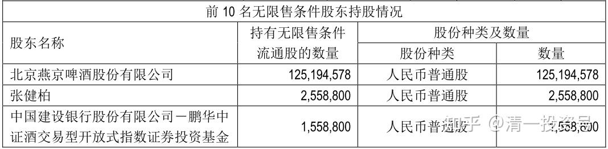
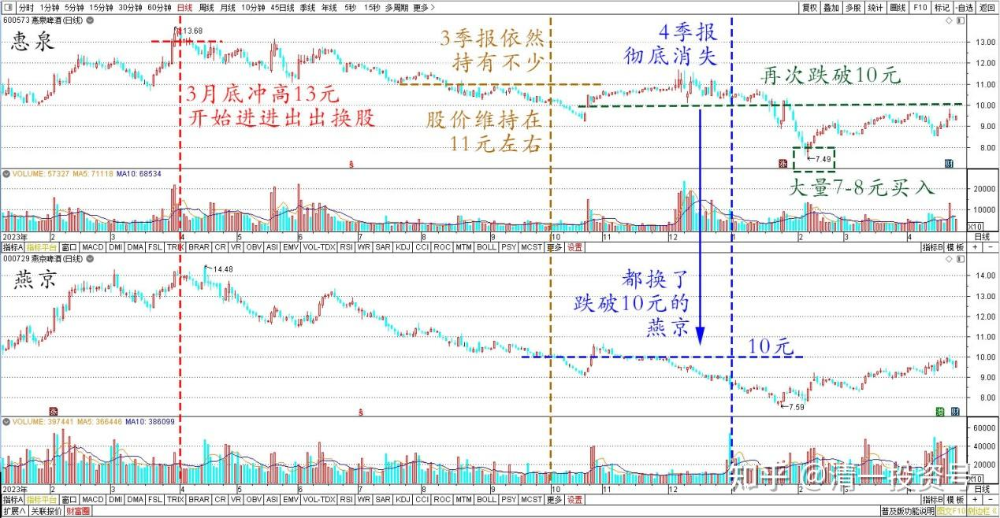
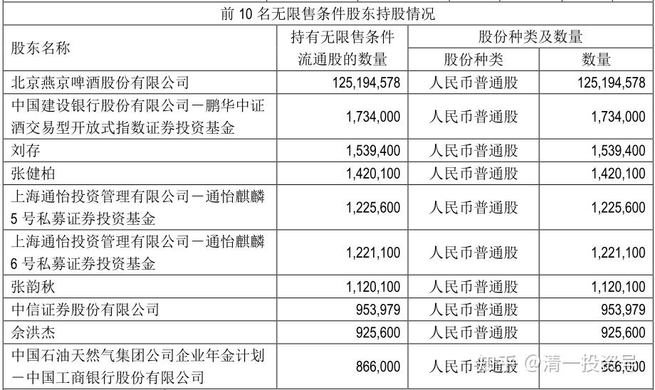
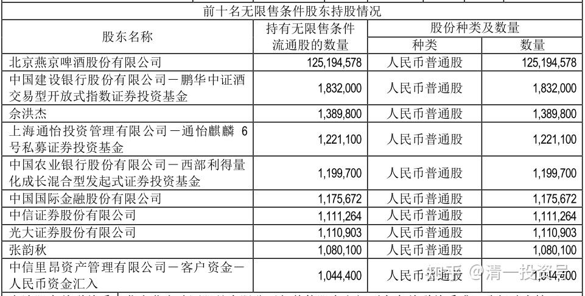
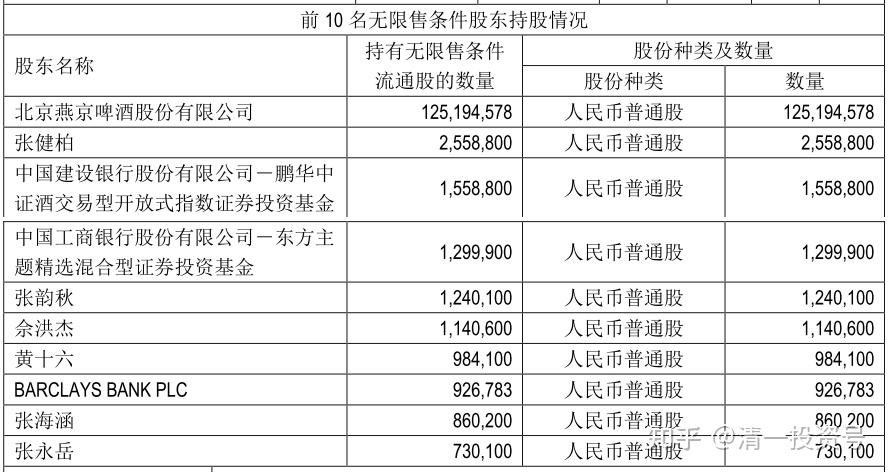
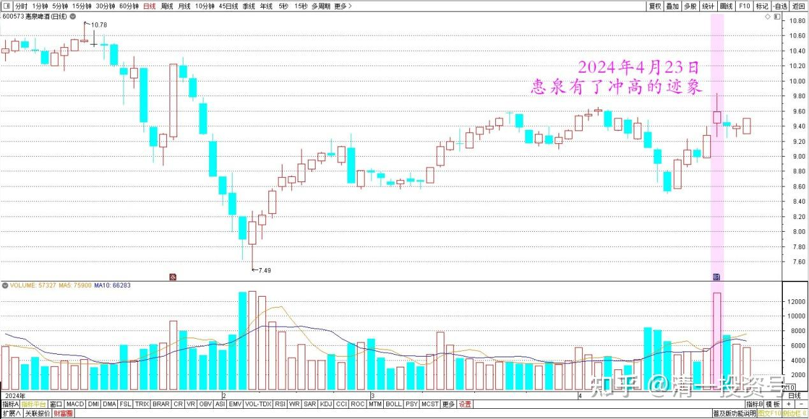

**81篇.惠泉跌破十元，再次进入十大**

清一山长2024年4月24日

惠泉公布一季报了，居然成了二老板。当然老二也毫无实权！

惠泉啤酒2024年一季报三大股东

有意思的是：惠泉3月底冲高13元，开始进进出出换股，3季报依然持有不少，股价维持在11元左右。4季报我就彻底消失了，其实都换了跌破10元的燕京。之后惠泉跌破10元，最低跌到7元多。我又再度进来，大量7～8元买入的股份，再次成为老二。

惠泉啤酒、燕京啤酒2023～2024日线图

惠泉啤酒2023年三季报十大股东

但惊讶的是：刚看到一季报的十大，大半部分成为了自然人，显然机构已经走了。目前的惠泉，不就是群龙无首了吗？

惠泉啤酒2023年年报十大股东

惠泉啤酒2024年一季报十大股东

昨日惠泉却有了冲高的迹象，应该机构又再度进入了。半年报应该有他们吧？**不管市场如何波动：高卖低买是王道。我只需稳坐钓鱼台即可！**

惠泉啤酒2024年日线图

(标题、图片为编者所加)

**文章音频**

[441篇.惠泉跌破十元，再次进入十大_清一投资号文章同步音频](http://link.zhihu.com/?target=https%3A//www.ximalaya.com/sound/726923278)

**参考链接：**

[74篇.A股要崩了？我还在买股票！](https://zhuanlan.zhihu.com/p/686286680)

[75篇.同为啤酒，敢否持有？（配图版）](https://zhuanlan.zhihu.com/p/684419681)

[76篇.年前最后一天，燕京换惠泉](https://zhuanlan.zhihu.com/p/688783385)

[77篇.年后第一天，看啤酒起落](https://zhuanlan.zhihu.com/p/688784278) [78篇.洛阳钼业换华菱钢铁](https://zhuanlan.zhihu.com/p/692417410)

[78篇.洛阳钼业换华菱钢铁](https://zhuanlan.zhihu.com/p/692417410)

[79篇.养老账户操作：燕京换珠江](https://zhuanlan.zhihu.com/p/693773038)

[80篇.不要钱，只要股——啤酒股切换](https://zhuanlan.zhihu.com/p/695027042)

