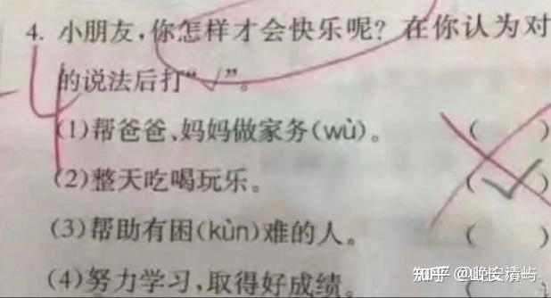

中国人，可能是全世界最会吃，也最贪吃的国民！

**如果说中国人也有信仰，我认为我们信的是拜吃教！**中国人以当吃货为荣。在微信上，天天出来秀得最多的就是自己正在吃什么？互相攀比自己吃的稀奇和丰富。李湘一家秀吃的，都秀到全国人民全知道她家的好生活，大家都羡慕的地步。

中国人出国之后，最关心的就是当地有啥好吃的，有何吃的特产可以带回家？而不是去关心和欣赏当地的人文和风俗，文化特点等等！国人去任何地方，吃东西---才是重点！

其他国家的人，吃饭是为了活著。而大多数中国人，信念刚好相反---**国人活著就是为了吃。**不吃的话----很多人认为还不如死了好！每天醒来，国人的目标就是挣钱。而挣钱之后，首先要花的地方，就是买吃的！挣大钱之后，就是“买最贵的东西吃”，一生以吃为目标！

为了一口“好吃”的，中国人不惜冒上生命的代价！比如“拼死吃河豚”之类的！ 人为财亡，鸟为食死，就是中国人的核心信念！人生一世，吃喝二字。就是中国人对自己的“人生智慧和人生总结”！

这种信念系统，在物质匮乏，人穷志短的时候，会爆发强大的动力，能让一个人努力奋斗，去动脑子赚到更多的钱！才能去吃到更多，更好的东西，享受更多的美食美色！最终不小心---就获得了很大的社会化成功！

不过相反的危险就是：**一旦人从小生活富裕，从小就享受到了丰富的吃喝玩乐，同时也没有啥追求的话，就会彻底失去生活的目标和乐趣。 **目要色，耳要声，口要味，四肢要逸乐。从小往吃货方向培养的结果，长大后的走向，肯定是往声色娱乐，放纵轻逸方向发展。所以富裕之后的国人，往往培养出大量的躺平主义者，大量因为无所事事，享乐也失去方向，提不起精神来，而导致的大批量的抑郁症患者！

这就是信【拜吃教】，崇尚享乐主义。消费者思维模式，必然带来的结果！生命失色，生活暗淡！

西方人活著，最大的追求就是玩。所以西方人会玩出各种花样和名堂来，有些玩法也挺变态的。但不可否认：这种追求也给了西方人最大的创新力量！成为世界很多领域的领先者---除了吃以外！

西方有最漂亮的大学，博物馆，图书馆和书店，但恐怕只有中国，才会有全世界最大最漂亮的餐馆和饭店。往往城市里面装修最豪华的场所就是餐馆，各种吃法和菜点花样翻新，完全让人耳目一新。家庭的餐厅，大学的食堂，一定都是 中国人“最关心的核心建筑”！

全世界的大学，恐怕也只有中国的大学门口，才会有异常繁荣的美食一条街！大学生们四年最快乐的时光，都与这些美食街的小餐馆紧密联系在一起！任何重大一点的人生事件，学业和爱情，成功和失败，都一定跟某个小餐馆有关。

走上职场也一样：生活和工作中发生的一切重大的事情，都一定跟某个餐馆有关！

**全世界可能也只有中国人，才会对吃，抱有一种极其强烈的，宗教式的热忱。**几乎任何有点重要的事情，无论好事坏事，吃都是其中最有必要的一环。一旦吃不好，就啥事都别谈了，啥事都做不成！国人吃的复杂程度也是世界第一吧。

所以----中国的父母招待客人，以及中国的父母表达对孩子爱的方式，也基本都是一样的---就是尽量给孩子安排各种特色的吃！---中国的餐饮业，自然是特别的发达！中国的老一代人，花在厨房里面的时间，远远超过他们一生花在工作上的时间。

2023年中国餐饮收入达52890亿元，如果用三口之家来算的话，每家去吃餐馆的开支平均每年超过一万元！不算自己做，自己吃的东西，这仅仅是上餐馆的费用！相当于泰国人半年的工资了！

我猜：没有家长会认为，生活上吃好喝好，与孩子的学习成绩会有啥深度的关联，认为就是两回事！

中国家长的一贯做法，就是在生活上，物质上尽量的满足孩子，甚至是纵容孩子。而在学习上，则会严格要求孩子。甚至家长会一厢情愿的认为：只要把孩子的吃喝生活照顾得最好，孩子学习就会越努力，越上心。家长们幻想自己的孩子是一辆车，只要加够油，给与足够的路费，这辆车就会走遍全世界！

可惜：人不是车！不是给的油越多，走的就越远的！恐怕正好还相反！

吃喝玩乐，与孩子长大后学习成绩的好坏，关联度真的很大。只是一般来说，不会从小就表现出来，所以容易被父母忽略。但肯定会在15岁以后表现出来。小学时候，好吃，贪吃，似乎没啥实质性的影响，甚至还有“正面”积极的影响。家长可以用各种好吃的东西来奖励孩子学习，孩子也会努力去拿个好一点的成绩来哄哄家长，换取自己的食欲满足机会！这种交换很容易实现，双方都其乐融融。反正小学课程都很简单，认真一点点，就能取得好成绩。这让家长以为好吃与成绩有正面的关联。但青春期到来之后，当课业需要更多的思考和努力的时候，一切就反过来了。凡是小时候用家长用吃喝玩乐来宠养孩子的家庭，孩子长大后，往往更容易“躺平”，成为学习的失败者。

为何会这样？

因为：孩子从小到大，每一件家长为他安排的事情，都会成为他的价值观和行为方式。长大后影响他的一切行为和选择。如果从小家长用行动来灌输给孩子们---“吃喝玩乐是人生最重要的事情”。 也就是【玩物丧志】。这种价值观，就会在青春期之后发酵，成为一个追求吃喝玩乐，不思进取，喜欢投机取巧的孩子。这种心理行为模式的孩子，怎么可能会努力刻苦学习，积极上进，并愿意承担工作责任呢？

古人有“好吃懒做”的词汇：“好吃”基本上就会带来“懒做”的行为模式。懒于思考，懒于行动。两者的关联度，真的很大！所以----现在社会上，大量的年轻人躺平，抑郁，死宅在家里不出去，不仅仅逃避工作和责任，甚至逃避社交，更不愿意结婚，不愿意生孩子。这都是这些家长们，从小认真投入心力，刻苦努力教出来的：“好吃懒做”心理行为模式的孩子！虽然各位身边，也有一些看起来“好吃”之人，学习工作生活也算成功。但这些人都是从小穷的人，价值观上平行排列，还有努力上进的因素。但家长们从小刻意用吃喝玩乐培养的孩子，概率上与从小就崇尚享乐，吃喝玩乐的人，长大后学习，生活，工作失败，才是最正常的结果！

学习和工作，肯定是需要努力和承担的。一个人想要获得成功，必须有志向，有理想，有追求。但一个从小就灌输了吃喝玩乐最重要，甚至是唯一生活目标的孩子，家长从小就在生活上，饮食上照顾得无微不至的孩子，基本上都属于所谓的“玩物丧志”之人，长大后不太可能会努力学习，承担事业，获取成功的！基本上只能是平庸之人，甚至是一个废物！

** 这就是古人强调“非淡泊无以明志 非宁静无以致远！”的真相。诸葛亮教子书，早就意识到对孩子真的不能富养，只能穷养！你家庭再富裕，再有钱，也必须从小给孩子提供艰苦的环境和磨炼，才能出人才！也才能出有教养，有荣誉的后代，甚至英国王室的家庭教育，也是只吃很简单的食物，而且量很少！**

作为一个父亲，诸葛亮深深地知道：只有不追求物欲享受的孩子，才有可能有远大的理想和志向！只有个性安静沉稳的孩子，这一生才有可能走得更远！站得更高。这是千年来有智慧的人早就发现的真理！

现在愚蠢的家长，却用与古人相反的方式来培养孩子----家长们从小就用吃喝玩乐来腐蚀孩子们的意志，瓦解孩子们的奋斗精神，给孩子从小就培养消费者思维和行为模式。然后，家长在孩子长大后，却一脸的迷茫---抱怨：为啥孩子不成器？不听话，躺平？这不是家长从小自己培养出来的结果吗？

这像不像疯子？家长的目标是北方，身子却往南方走，最终结果呈现的时候，却怪自己怎么到了南方？似乎是这个世界欺骗了自己一样！

在中国，现在物质条件，生活条件，已经非常的丰富。富裕家庭的家长们，都在尽力地用自己赢得的财富来摧毁孩子的追求和理想志向。将来社会财富重新分配，势所必然。即使是穷人家庭，也在尽力的娇养孩子。新闻里面，杨锁这种人，就是穷人家庭从小用好吃懒做思维方式培养出来的极致。杨锁甚至连给自己“做吃”的行动力都没有，一切都要别人来服务！自然结果就是宁肯饿死，也不愿意做任何事！现在家庭里面，不就是出现了一大批啥事都不愿意做，只会点外卖的【新型杨锁】了吗？

家长们就用自己可怜的大脑去想一想：你培养的孩子，假如连为自己做点好吃的东西都没兴趣，连吃东西都不愿意去动脑子研究，只想简单点外卖来解决问题的孩子，还有可能对你的家庭和社会提供啥真实的价值？不就是你用心培养出来了废物一个吗？家长花高价用心培养的废物！

所以：贪吃对学习成绩有无影响？难道你们真的看不出来吗？

**新教育倡导的，简单朴素的生活，就是在这个物欲横流的社会上，拯救下一代人的最后努力！**更像是绝望的努力！我们每年都在和家长们进行价值观的拉锯战，试图让孩子摆脱消费者思维模式，而成为一个进取，积极向上的人。家长们最可笑的选择，就是一方面要花钱送孩子来学校， 想要培养有出息的孩子。但孩子一旦放假回家，家长就用养宠物的方式来养孩子，重新教给孩子们另外一套与学堂教育不一样的人生价值观。最终这种家长与学校长期拉锯战的结果，我们注定会失败。孩子小的时候，在学堂学习，还勉强像个样子。但只要孩子长到青春期，肯定家长培养的价值观会起主要作用！孩子肯定最终会追随家长的“养猪哲学”，成年后躺平堕落，也不奇怪。

可惜---此时我们已经无能为力！家长从小不用心，不学新教育，不改变核心观念，孩子会自动复制家长的落后观念。我们再努力也是白费的！千万不要以为：你把孩子送入了今日上学，就会自动成为精英。关键是骨子里面你把孩子当啥来养？