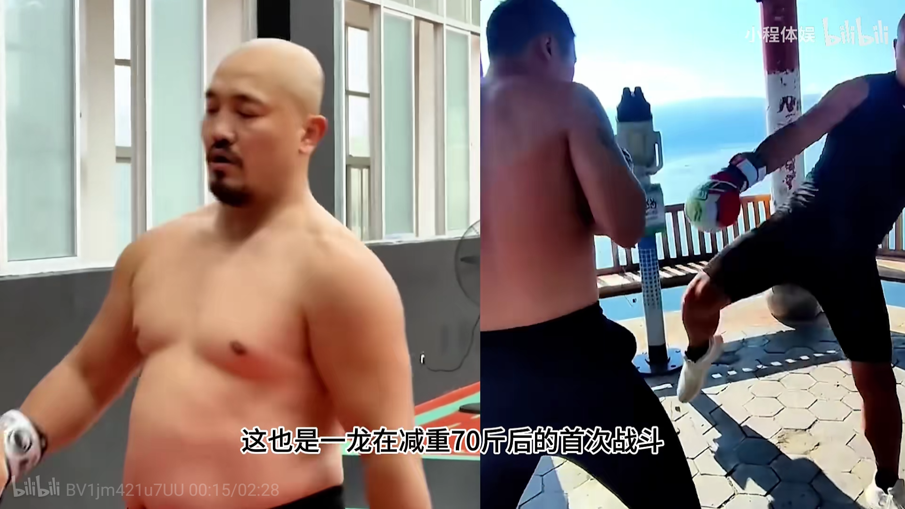

职业拳手面对的是最激烈的对抗，是对身体要求最高的运动项目。格斗对于神经系统的反应，身体的耐力，爆发力，移动速度等要求都极高。因此：格斗手的饮食，也应该是最讲究的，不能讲口味，必须符合身体要求才行！这样才能在擂台实战上，面对压力发挥出最大的身体潜能，避免放纵口味被KO的命运。

但是，遗憾的是：目前我国格斗手的饮食方式，理论和实践都完全是错误的。导致我国拳手的体能和素质，职业寿命，普遍要比国际水平低。就算是一些世界知名的拳手，如张伟丽，她的饮食上也是完全错误的！这种错误的饮食方式会严重影响身体健康，退役后，必将带来各种身体慢性病和机能的快速下降，也会更早结束运动生涯。如果格斗手能够保持良好的饮食习惯，也可以拥有很长的运动生涯。按照清一木兰的生活方式，50岁都可以上场比赛。但国内的运动员，基本上没有这种人！

最近，五个清一拳手正在珠海参加国家泰拳队的集训，下个月要去雅典参加世界锦标赛。集训期间的训练强度极高，国家队的领导也很注意保障吃的品质。所以看看国家队安排的特别饮食方式，就代表了中国武术界认为职业拳手应该怎样吃了。

清一木兰的训练汇报：“训练强度：这边的训练总体是两个板块，体能和力量。核心是每天疯狂刷体能、打靶打沙袋和到健身房举铁。空练的时间很少，也很碎片，一般都只是穿插在力量训练前后作为过渡。周一到周六的训练量略有不同，他们会有个体能周期，周一会相对轻松，然后逐渐加量，周三或周四会到达一个极限，然后再慢慢减量。每天训练两次，上午下午各两小时。虽然时间不长，但质量很高，时间很紧凑，每次训练完都筋疲力尽（上午的冲刺跑更累些，回去之后就基本什么都不想干，只想按摩和睡觉）。

随着训练逐渐深入，我们与其他拳手的不同也愈加明显。如我们的人体能很强，女生也可以跟上几位主力男队员的速度，远超其他队员。训练时也不会叫苦叫累；训练结束后的空隙会在旁边看书，而不是像其他队员一样刷手机玩游戏；吃素，而且吃得很少（相较他们的饭量）。更让他们难以想象的是，对于他们来说，正常训练已经很累了，但晚上我们还会跑去加训。

饮食：这边是一日三餐，早上训练完吃早餐（8：00），休息到中午吃午餐（12：00），下午训练后吃晚餐（18：00）。对比起清迈的饮食，这里的饭菜很丰富，他们很注重吃，午餐和晚餐都是八菜一汤，每餐必有虾，蒸鱼，炸鸡肉等各种荤菜，早餐还会提供纯牛奶。我们不太习惯这样的方式，所以依然按照一日两餐的节奏来，只去吃馆里提供的早饭和晚饭。负责人后来得知我们吃素，也单独给我们分了一个桌子。一般是3-4道清淡简单的菜。刚开始教练、队员都很惊讶，不停地劝我们多吃，怕我们训练强度大会晕倒，我们不想吃时也会强制性要求，后来看我们好像也挺好的就慢慢不说了。】

**我对以上木兰汇报的解析说明：**

中国的格斗拳手，都有非常强烈的【肉食崇拜心结】。【少林寺】电影开启的武术知识启蒙，把中国武术几代人都带进了坑！就算当和尚，都要冒犯戒的危险去偷吃狗肉，抓青蛙来补身体。就是因为练武人不吃肉，就没力气。身体就不行，因此自欺欺人的号称【酒肉穿肠过，佛祖心中留】。这种酒肉和尚的文化，至今深深置根在中国格斗手的心理意识中！认为不吃肉，吃得少，体能就不行。这显然严重影响拳手的身体和心理健康！

**【每餐必有虾，蒸鱼，炸鸡肉等各种荤菜，早餐还会提供纯牛奶】。为何这样安排？根据格斗界的所谓现代营养学“常识”，他们认为白肉（虾和鱼），以及两足动物（禽类）的肉质，是优质蛋白食物，更符合拳手的需要。认为运动员需要增长肌肉来强化力量，避免身体的脂肪影响体重。普遍认为：谷物类食物称为碳水化合物，被认为是格斗手不能吃的食物，应该尽量少吃。专家认为：吃碳水化合物，容易长脂肪，不符合长肌肉来增强力量的要求。属于格斗中的负资产。所以高级拳手就很忌讳吃谷物食品。国外的一些知名拳手，甚至根本常年不碰谷物，不吃披萨，面包和米饭。报导某中国的一个奥运选手，居然10年都没有吃过正常的米饭。张伟丽也说：“碳水化合物是永远的敌人”，因此每天她以各种肉类为主要食物！主要是牛肉，海鲜等。猪肉是拳手们认为不好的食物，也是因为脂肪多的原因。他们认为脂肪少的肉类，红肉，白肉（鱼虾），才是好的肉类。所以，海鲜，鱼类，牛羊肉，牛奶等等，就是拳手认为补充体能的“最佳食物”。而且由于训练很累，他们会尽量的多吃食物，认为吃的东西越多，身体就越强壮。因此养成了大吃大喝的习惯，这些观念全是错误的！是造成各种慢性病和糖尿病的起因！**

** 由于现在“科学”（也就是给饲料加毒素的科学）的养殖业大发展，肉类食物的添加剂很多。这种动物食品其实会带来很严重的体内毒素，导致人体不良影响，化学激素甚至打断了人体的正常发育。海鲜，鱼虾类产品，现在都基本上是养殖的。因此鱼虾类的激素问题其实更严重。高级拳手们也知道：现在普通的低价肉类食品都有各种问题，对身体不太好。所以一些有钱的“高级拳手”，就会尽量去找“自然原始生态的肉类食品”来吃。比如进口的澳大利亚牛肉，以及炖牛尾、炖海参、炖鲍鱼，龙虾等等高蛋白（张伟丽的每日食谱），认为这样才有营养，才能维持良好的体力。NBA球员**布朗 詹姆斯管理自己身体的故事：1年花150万美元保养自己的肌肉，8年没有吃过猪肉。**因此高级拳手赚的钱，经过专家的洗脑，又回到食品和医疗专家，健康专家这些利益集团手里了！**

** 的确：如果大家都知道，拳手与普通人一样，都需要健康强壮的身体，都只需要吃正常简单的谷物就够了，大家都这样做，这些专家和利益集团，怎么赚大钱呢？反正农民就只赚最基本的钱！**

** 格斗拳手真的可怜。年轻的时候，用不科学的，压榨式的运动训练方式，严重伤害了身体和心脏机能。退役后，由于生活方式和不良的饮食习惯，导致拳手的身体早衰，容易出现很多的问题，然后把责任归罪于体育职业太吃身体，运动员都普遍更恐惧身体的健康问题。平时更要多吃，吃好！造成恶性循坏。因此，中国的运动员肥胖超重是最普遍的问题，大量的心脏病和三高等，往往都伴随拳手一生。武术运动员往往还有喜欢喝酒的毛病，也是队员年轻的时候面对擂台对抗的压力，喜欢用发动情绪的方式来应对。因此这种人年纪大了也喜欢热闹，如果日常生活中缺乏气氛，就用喝酒来制造情绪气氛，一生都活在幻想的世界里面，非常脱离现实生活。这种拳手简单粗暴的情绪人际互动模式，往往导致拳手与家人也难以良好的沟通交流，所以拳手的家庭问题，往往也比较严重。**

** 清一拳手，用道家古法练拳格斗，也用道家古法养身。饮食起居方面，采用道家古法的简单朴素生活理念，以五谷为养的理念，简单清洁的饮食才是第一位的。拳手们即使只是用开水泡饭，都可以是美好的一餐。这些方式，其实才是最健康的饮食方式，是普通人和拳手都应该采用的方式。古代的军队和将领，都是这样吃饭的。大鱼大肉和各种丰富的烹调，根本就不是古代战场“埋锅造饭”所能解决的问题。“肉食者鄙”也见诸于史记。中国古代武人，真实的饮食就是吃谷物。日本也记录了古代大名的餐食，就是简单的茶泡饭而已。这些历史我们都忘记了，反而把西方利益集团的忽悠当成真理。造成了现在种种武术界的怪相。**

**最终的结论就是：大道至简。普通人和职业拳手，生活方式都是一样的：简单的谷物，才最符合身体的需要。**

**最近几天发生的事情：**下面的案例，我们看到一个原本还有一点武术追求的一龙，被吃喝玩乐毁掉的身体和运动生涯。在与播求的三番战取消之后，一龙开始“享受生活”，身体也快速堕落，体重超过200斤，挺着一个大肚子。估计是春节看了热辣滚烫电影，他居然要减肥，复出打比赛了。找了一个42岁的日本拳手来练手。但：场上一龙的身体，已经完全失去正常的反应了，水平明显下降（原来水平就不高，现在水平就根本没法看了）。场上看一龙的动作，反应迟钝，步法踉跄，出手无力，居然第一局就被对手KO。我猜完全不符合事先规划设计的复出版本。导致不小心KO了一龙的日本拳手都很意外，跪下来谢罪----才40岁的一龙老人家真心是倒得太快了！

[急速降重70斤的一龙复出，对战日本名将，却在首回合被对方KO_哔哩哔哩_bilibili](http://link.zhihu.com/?target=https%3A//www.bilibili.com/video/BV1jm421u7UU/%3Fbuvid%3D4AB5AAC8-61B3-4D1C-BFB7-C6D4A28EB6E818609infoc%26from_spmid%3Dsearch.search-result.0.0%26is_story_h5%3Dfalse%26mid%3DFTHZBAhP0fqssuy502OALQ%253D%253D%26p%3D1%26plat_id%3D116%26share_from%3Dugc%26share_medium%3Dandroid%26share_plat%3Dandroid%26share_session_id%3D61a366fd-c852-4498-af0d-6e94edb52c6f%26share_source%3DCOPY%26share_tag%3Ds_i%26spmid%3Dmain.ugc-video-detail.0.0%26timestamp%3D1715234669%26unique_k%3Df07NbAT%26up_id%3D1539147929)

一个对自己的身体都失去控制的格斗拳手，怎么可能控制好格斗场的竞争呢？

一个本来很有希望的拳手，也为此付出了很大的努力。但一生的荣耀，东山再起的机会，就毁在吃喝玩乐的信念上了。看来一龙的职业生涯，只能提前谢幕了。与此同时，比他年龄大的播求，帕奎奥，依然活跃在拳台上。对比之下，不改好好的反省自己吗？（播求的饮食理念---泰国糯米就是他力量的源泉---最朴素而最真实的生活）

资料：**糯米比大米含直链淀粉更少、含支链淀粉更多，因此糯米的消化速度更胜一筹。**国内外的血糖研究和体外模拟小肠消化研究证明，热的糯米食品消化速度更快，餐后血糖反应也非常高。 因此---泰国人喜欢吃糯米饭的确很有道理！

*一龙这大肚子，吃了多少“好东西”才养出来的宝贝！*