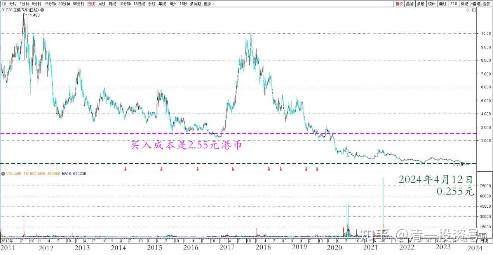

82篇.远离投机，踏实投资，才是正道

清一山长 2024年4月12日

这家公司咋样？是不是好公司？您愿意持有这家公司，做这家公司的老板吗？

【转载】

在汽车行业竞争日益激烈的当下，正通汽车有限公司(以下简称“正通汽车”)以其卓越的市场表现和稳健的经营策略。根据最新公布报告，正通汽车去年的营业收入达到了241.32亿元，同比增长7%，这一成绩不仅展现了公司的强大市场竞争力，也预示着其在未来可持续发展的广阔前景。

正通汽车表示主要是年内新车销售上升所致。2023年正通汽车新车销售量为60845辆，同比增长8.1%;其中豪华品牌销售量为51872辆，同比增长14.42%，销量占比为85.3%。2023年，新车销售收入约为202.24亿元，同比增长约为7.3%，约占2023年总收入的83.8%;豪华及超豪华品牌汽车销售的收入约为191.39亿元，同比增长约9.4%

作者：电鳗财经

链接：[https://xueqiu.com/4516855116/284341650](http://link.zhihu.com/?target=https%3A//xueqiu.com/4516855116/284341650)

来源：雪球

**清一山长：**

这是一家我曾经持有过的公司。买了两百多万股，当年买入成本是2.55元港币，刚才无意中去看了这个股的价格——每股0.255元。**如果我一直持有到今天的话，我就亏掉了90%的本金**。看着账上700多万港币的盈利记录（人民币600多万）。我陷入深思——我的狗屎运太好了，这种烂股，也居然是赚了钱走的。

正通汽车 2011～2024 日线图

不过——**现在我再也不敢买小股票、烂股票了**。我当年投机小股成功后，这种思维模式，也导致后来买的几个小股几乎亏光了。**现在改邪归正，就只敢买靠得住的大股，持股吃息，不想赚小钱了。这样反而在港股上赚了大钱，几只为了避险买的港股有色股份，居然都翻倍了**。正在想换换股票呢！

**远离投机，踏实投资，才是正道！**我用这个成功的故事，来反着劝大家不要投机：**进入金融市场，风险控制才是第一位的！否则多年的积累，很容易一下子就亏光光。**

(标题、图片为编者所加)

**文章音频**

[443篇.远离投机，踏实投资，才是正道_清一投资号文章同步音频](http://link.zhihu.com/?target=https%3A//www.ximalaya.com/sound/728358722)

**参考链接：**

[74篇.A股要崩了？我还在买股票！](https://zhuanlan.zhihu.com/p/686286680)

[75篇.同为啤酒，敢否持有？（配图版）](https://zhuanlan.zhihu.com/p/684419681)

[76篇.年前最后一天，燕京换惠泉](https://zhuanlan.zhihu.com/p/688783385)

[77篇.年后第一天，看啤酒起落](https://zhuanlan.zhihu.com/p/688784278) [78篇.洛阳钼业换华菱钢铁](https://zhuanlan.zhihu.com/p/692417410)

[78篇.洛阳钼业换华菱钢铁](https://zhuanlan.zhihu.com/p/692417410)

[79篇.养老账户操作：燕京换珠江](https://zhuanlan.zhihu.com/p/693773038)

[80篇.不要钱，只要股——啤酒股切换](https://zhuanlan.zhihu.com/p/695027042)

[81篇.惠泉跌破十元，再次进入十大](https://zhuanlan.zhihu.com/p/696066886)

