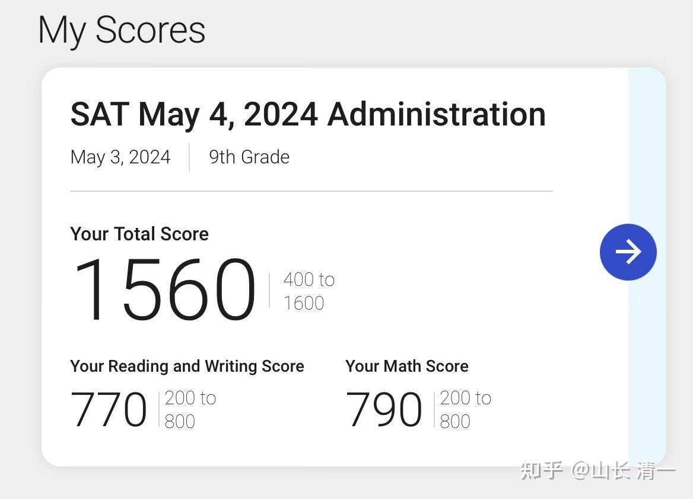

据说：今年参加高考的人数，是历年来最多的。走体制教育的学生，今年无疑是最难的一年！很幸运---新教育的家庭逃过了这场劫难！

今年这个难度，被媒体称为地狱级难度。其实----更难的在后面呢！

最难的是四年后的大学毕业：国内大量工作岗位的消失，也许四年后的媒体标题，可能就是【地狱级的毕业求职难度】了。

不过---对新教育的学生来说，高考却是轻松愉快的旅行。

昨日。今日示范班的学生，以及清一塾的特战班学生，他们年满15岁，都来清迈参加了国际高考SAT。大家觉得：高考的难度不高，考完后都很轻松。半个月之后出成绩！

下面的成绩单，是清一塾提前一个月来考SAT的两个学生拿出来的成绩。基本上算是满分了！我相信半个月后成绩出来， 示范班的主力部队拿出来的，肯定是更加亮眼的成绩！而且是批量的成绩！

这是今日三校首次班级集体参加sat考试。以后的班级，每年都会常态化的有数十人参加这个考试。每年都将批量毕业一批学生，进入世界名校学习。目前---全中国能够批量输出符合世界前100名校级别学生的学校，优等生成绩比例如此之高的学校， 应该只有今日了。我们取得的这个成绩，远远超过国内的体制高中名校！也超过世界各国的高中！我们现在在基础教育阶段，绝对是领先全世界！

而且----今日的学生们，要取得这样亮眼的世界高考成绩，只需要三四年！示范班四年来的直播，让全世界记录了这群学生的脚步！今年到了最终检验成色的时候了！收获的季节到了！

[今日国际学校的个人空间-今日国际学校个人主页-哔哩哔哩视频](http://link.zhihu.com/?target=https%3A//space.bilibili.com/487498588%3Fspm_id_from%3D333.788.0.0)

如果能够像这群学生一样，三四年就轻松考上世界名校，你们干嘛傻乎乎的在国内苦读12年？都读傻了！

如果能够通过GED考试，就可以轻松拿到美国高中毕业证书，实现高中毕业文凭的需求，你们干嘛老老实实的从幼儿园起。就紧紧抓住【学籍学历】的镣铐不放？

海外留学的难度，是语言关。

如果语言关没有过，海外留学就是高价的垃圾！

如果语言关过了，海外留学就是学业和就业的蓝海！海外的工作岗位竞争激烈程度，远远比不上国内。只要是名校毕业的学生，大差不差的专业，都很容易找到工作。甚至拉曼大学这种大学，居然就业率超高！更别说比他排名更高的大学了。

有人问：在新教育学习的学生，有人就是考SAT都考不过1400分的。这种人咋办？

我只能说：在体制要考好sat,由于学习方式不同，想要考出好成绩，难如登天。就像中国高考要考好，真的很难。

但是在新教育里面，采用了先进的学习方式，只用是正常学习的学生，考1400分实在是很简单的！如果这个成绩都考不上的话，不得不怀疑学生的智商或者学习的态度有问题。这样的人，基本上去哪里读书都没救了！就是超级学渣。这种人，根本就不应该去读书，更不应该去读大学。不如直接去打工。勉强去留学，只能培养成废材的。真不如去老老实实的做打工仔更靠谱。拼技术和体力吃饭，不丢人！啃老才丢人呢！

愿天下学子有明师指路！