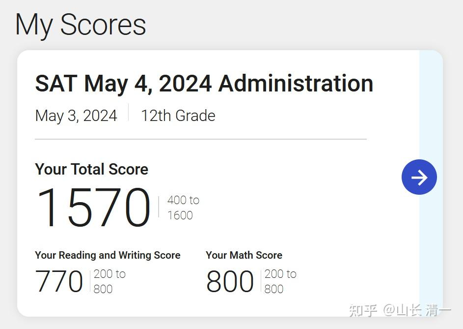

您很难相信：潘石屹们需要花上亿美金捐款，才能得到的宝贵的名校入学机会，居然在清一新教育这里，会变得轻而易举！似乎信手拈来！

财主们只会花钱。但拥有智慧显然更重要。很多花大钱都办不到的事情，拥有思考和规划，就可以变得很简单！

本届新教育的示范班同届学生，目前已经有三个学生拿到了超过1550的分数。最高分是1570分（满分是1600分）。由于考试中偶然的失误，就会扣分。因此1550以上都算满分了！

最大的优势是---这些孩子才15岁！未来还有很大的可塑性和发展空间！当然不是分数。而是---素质教育空间巨大！

这个SAT的分数，已经超过哈佛耶鲁的平均录取分数线了！其实是达到了顶格分数线！

案例：2023年哈佛大学SAT录取分数：1460-1590分

斯坦福大学：1390-1540分

麻省理工：1490-1570分

耶鲁大学：1460-1580分！

哥伦比亚大学：1410-1570！

我们15岁学生，目前拿到的SAT官方考试分数线！已经超过了很多常春藤大学的最高录取分数。进入顶尖世界名校完全就是毫无悬念！我对清黑们多年来拼命想要抹杀新教育感到万分的同情和歉意：我们每年都在用不断创新的靓丽成绩，来回答清黑们的无厘头抹黑。这不---一直抹黑说我们的学生考不上世界名校，今年马上就有批量的学生申请入读世界名校。三加一计划，本来是增加光彩的计划，但清黑们抹黑说新教育考不上名校。才这样曲线救国。现在更麻烦了：两年后就是今年考上今日高中的示范班学生，要开启他们申请大学之路的年头了。我们如果专门为这批学生打造靓丽简历。把大量名校OFFER弄入手中，不更会把这些清黑们气死吗？你们千万要保重呀。别气坏了身体！做我们的对手盘注定很艰难！

他们是否能拿这个成绩，现在就直接入读美国顶尖名校呢？

别闹了：这些孩子们才15岁呢。还不想太早去读大学，他们现在更想读的是清一大学！

我说过：去美国大学读书，就算是上名校，也是要付智商税的。美国大学目前的学费，已经差不多到9万美金一年了。我认为根本就不值！因此，我并不支持新教育的家长们，送孩子去美国读书，就算是名校也没啥意思！钱多人傻采取美国呢。除非你去交朋友。但没啥特别本事，也不可能交上啥该质量的朋友的！

除非----学生们能够拿到全奖入读哈佛耶鲁的机会？我认为还是可以去读一下的！花美国人的钱，去镀美国人的金，这好像也没啥不可以的！起码不是钱多人傻！

不过，你想入读美国名校？还想要拿全奖？这个难度就很高了！现在孩子们除了年龄不符合，才15岁。---另外，好像美国顶尖大学入读不仅仅看成绩，还要看课外活动等等综合素质。特别是体育项目拥有特长的学生，最受美国名牌大学欢迎！比如---谷爱凌！

拥有综合素质，体育特长，这种特质想要进大学？---学费根本就不是问题。但如果你只是书呆子----恐怕这些刁钻的考官，第一时间就把你剔除了！

对于中国的体制学生来说，卷出成绩都很难了。要搞课外活动，社会活动，以及体育项目? 更是不可能了。

但对于新教育来说：玩这些素质教育， 正好是我们的长项。玩运动？我们正好是全国顶尖水平！我们正好要冲奥运冠军。这些学霸，短期内要拿世界冠军恐怕不容易，不过用两三年时间，要拿一个地区冠军，全国冠军，我们认为很容易。两三年就培养出来了！正好赶上他们上大学的时间！

因此：我决定---给本年度分数达到1500分以上，年龄不超过16岁的今日三校学生，一个特别优厚的条件：可以全奖获得我们的“冠军拳手批量制造”待遇。这个特别的机会，现在是一些家庭要花至少双倍的学费才能获得的机会。

将来面对名校，我们的学生拿出来的申请条件是

一:我12岁这年，就读一个创新型的学校。该校的教育风格独特，强调个性化教育。允许学生根据自己的水平选择学习发展的方向，自由发挥，独立发展，所以我用三年的时间，就学完12年的美国课程。不需要与其他学校一样缓慢的学习！

二：15岁这年，我参加美国高考SAT官方考试，并取得了1570分的成绩！获得了全奖入读今日高中的机会。

三：我认为读书太容易了，我不想做一个只会死读书的人。我想找一个更有挑战性的学习任务。所以--15岁考完SAT之后，我想去泰国学习泰拳格斗技术，准备和职业拳手们一较高低。据说世界名校的学生，极少参加职业格斗比赛的，我想打破这一惯例。因为我的偶像是李小龙，他用功夫改变了世界。所以----我去泰国清迈的SAMURAI MULAN功夫学校学习格斗技术。这里有一群全国冠军和泰国金腰带拳手，我们在一起按照专业拳手的高强度来训练，每天6小时训练，度过了两年的美好时光！

四：16岁这年，由于在格斗学校全天候的训练，我没有去上正规的高中课程，拿不到高中文凭。但我的目标不是做职业格斗手。我希望18岁还是去上大学。所以我这年去考了一个GED考试，获得了美高文凭证书。四个科目的考试成绩均为优等。

五：每天6小时高强度训练后，多数拳手都用来休息和玩乐。我把学习第三门外语作为放松和娱乐的手段。因为我对小语种国家的文化和传统非常有兴趣，我喜欢文化的多元化。也希望我未来的职业就是去一些第三世界小国家当教师，帮他们的学生提高学习的能力。因此，我用一年的时间学习了西语（日语），并拿到了官方考试的成绩和证书，获得了西语DELA C1的成绩！据说----很多大学西语专业的学生，学了四年也拿不到这个成绩！我希望将来上大学后，可以帮助想学习小语种的同学分享我的高效学习方式！

五：17岁，我参与格斗训练两年之后，去了泰国的职业赛场，与勇猛凶悍的泰拳手们正面对抗，击败了很多泰国对手，获得了清迈地区金腰带拳手的称号（附照片）。同时我参加了中国的全国自由搏击锦标赛，获得了官方承认的全国青少年冠军称号（附照片）。也许我已经刷新了一个全新记录----可能在同龄人中，我是格斗界里面最会读书的学生。同时，我可能也是读书人里面“格斗技术最好”的人。我很喜欢我的跨界人生！

六：18岁，我想要尝试我热爱的教师职业，我去了我初中毕业的今日国际学校，申请当带班助教。我用我学到的学习方法来帮助11-12岁的年轻学生快速学习，他们对我的格斗。绩也很好奇，所以我也教她们一些基本的格斗技术作为体育课项目，我很快就成为学生们非常喜欢的年轻教师。虽然实习期只有短短的三个月，但我喜欢上了这份教学的工作。因此，我想来申请哈佛/耶鲁的教育学专业进一步深造。我希望我在哈佛大学毕业后，去拉美国家当一个跨文化，跨国的教师，帮助更多的学生用轻松愉快的方式来学习提高！

以下是我的老师给我的推荐信

---------

（说明----这是为某个想当教师的学生，设计的学业申请规划。在大学的专业上，我们尊重学生和家庭的自主选择，他们可以选择任意自己喜欢的专业和大学。没必要按照我们的理想来申请）

【注释：以上申请信。现在还不是事实，但也不是意淫和幻想。这是一份学业规划设计！是一份只需要用两年到三年时间就可以实现的规划。我作为大学的工学学士毕业背景的人，我喜欢先设计，再施工。以上就是我们给这些示范班优秀学生，在两年后的大学申请示范设计规划图。您将看到我们一步一步走向我们的理想。不管你喜不喜欢，这个目标一定会实现的。你们不相信的，可以继续吃瓜，继续等待看戏】