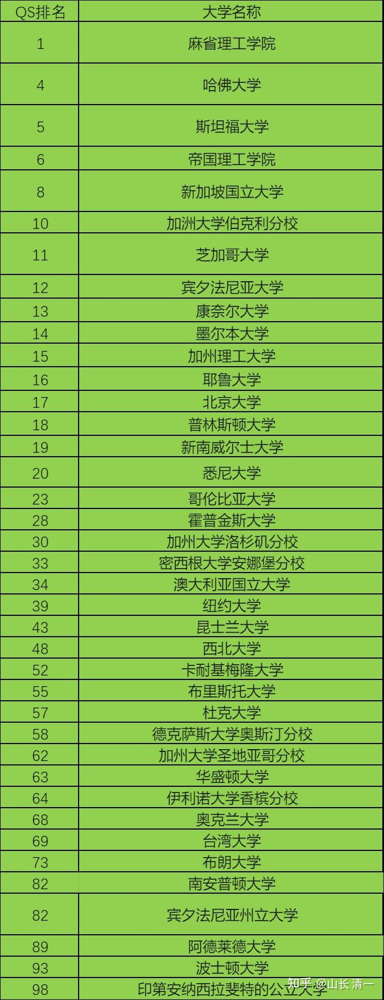
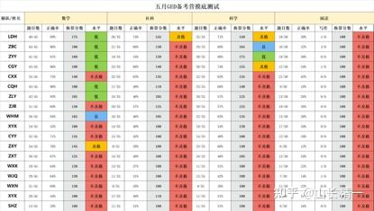
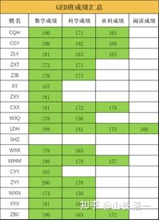

今日新教育，用三年学完12年体制课程，从技术上打破了体制教育的迷信。让人们知道：学生们并不需要苦学12年去考啥高考。省下来的9年的学习时间，可以用来玩更多有趣的游戏，学习更多有价值的内容！而不是天天考试刷试卷。这完全就是对生命的浪费！

可是：中国学校从幼儿园就开始的“学籍限制”，制造了学位恐惧。担心失去“学习和考试资格”的国人，居然不敢去尝试这种先进的另类学习法！

幸运的是：我们有GED证书考试的选项，可以轻松绕过体制的学籍和文凭限制！只要你通过了这份考试，美国以及世界范围的很多国家大学，就承认你拥有正规的高中毕业资格。你可以用这个证书在美国找工作，也可以你的文凭和高中学历使用（高中文凭几乎没啥求职价值吧？）。对于家长来说，最大的价值，就是可以凭借此证明，顺利地升入大学学习！

在美国，有一两百万人不上学，选择在家学习。还有很多学生，会中途因为种种原因而辍学。海外的很多西方家庭，也更喜欢选择在家学习。因此---美国政府特别为这些希望自己来完成高中学业任务的学生，通过这项考试来获取宝贵的高中毕业文凭。这项在二战结束后，专门为高中参军而导致辍学的退伍士兵们预备的高中毕业证书考试项目，就一直坚持到现在，帮助很多没有去正规高中上学的学生获得国际认可的高中毕业资格证书！现在，它的最大价值，不是用来去找工作，而是以此去申请大学。满足大学申请需要的“高中毕业程度要求”。

中国过去，很少有学生来考这个考试。这种奇特的【自考高中毕业证书】，因此国人非常的不熟悉。但对于新教育的学生来说，GED考试，就是一份轻松绕过体制学校低效无聊教学系统的利器，绕过高考，顺利进入海外知名大学！

原来新教育，有三语职业高中的毕业文凭可以使用。但从2024年开始，我们主动在国内撤销了高中编制。因此我们的学生，正式开启GED项目，目前首批学生正在清迈，用两个月时间来突破GED。【虽然有老挝的正规国际学校的许可，但是我们认为老挝学校的公信力，用来申请大学，应该不如GED有效】。只是一个预备罢了！

GED有多好用呢？看看下面这个名单就知道了----世界排名前百强的知名大学，大多数都愿意接受GED作为高中毕业证书申请使用。虽然传统上，很多海外大学已经习惯了中国学生用中国高考的成绩，和中国高中毕业证书来申请入学海外大学。但如果你使用世界标准来申请---GED和SAT，我相信他们会更熟悉和亲切！

上面只是官方明确宣布接受GED证书作为高中毕业资格申请的大学。其他没有注明GED许可的大学，有一些也是可以用这个证书来申请的。显然GED相对于海外大学的权威性，要比中国的普通高中更能获得海外大学的信任，申请海外大学当然更靠谱。

特别是：GED证书持有者，往往有很特别的非体制学校的学习经历。更能吸引希望招收到具有独特学习经历学生的海外大学青睐。因此---毫无疑问---使用GED加美国SAT，或者加上英国雅思的成绩，是一个加分项，更容易申请进入海外的一流大学！不至于像是一些国内的家长，钱多人傻，脑子坏掉了一样，居然为自己的孩子去申请国内某些大学的【海外大学连读班】。其实连续的都是一些很平庸的大学，就是专收中国人智商税的。

为了给外围学堂示范今日面对考试的高效学习法，今年5月份，今日高中首次开放给外围学堂的适龄学生，居中一起，在清迈集体学习通过GED的考试班。首批外围学堂的18个学生，5月4日抵达清迈。随即我们对这些学生进行了首次摸底考试。让我们心里有点沉重----这批学生的学习情况参差不齐，首次摸底考试的成绩很不乐观，要在两个月内通过全部四门高中毕业考试，我们认为有点难度！我们的学生肯定是毫无问题的，都能顺利通过！

下表就是这批学生的摸底考试成绩（姓名用字母代替）。每科145分是最低及格线，低于此分数，就拿不到高中毕业资格证了。

165是良好----达到此分数，可以进入大学学习（其实145很多大学也接受进入大学学习的。只是不建议上大学，去了也是白费的）

175是专业成绩很优秀的分数线，获得此成绩后，就可以用来在大学里来抵充相应科目的学分了！

下面红色部分就是摸底考试不及格的成绩，只要有一门课是红色，就拿不到美国高中毕业证书。而这里只要少数学生只有一两门不及格，大多数学生，连对中国学生来说算是最简单的数学成绩，都是不及格的！让我们觉得头大----怎么这么差！

该怎么在短期内帮助这批学生突破GED成绩呢？

我们要用什么老师来指导呢？要用什么特别的考学秘籍吗？培训机构夸口的助考过关秘诀是否比新教育的学习方式更有用？

我们的确拿出了今日系的绝招----不用老师教学，只用伙伴示范学习方式就够了！我们让高中部文科班的优秀学生们，一对二来带这批新生。每个月就每天在一起学习和考试。由于高中部学生都是很优秀的学霸，他们的学习方式，肯定比这些没有考上今日高中的外围学堂学生更有效。新生们只需要模仿他们的学习方式就可以快速进步了。而且有啥不理解的问题，可以有身边的学霸伙伴随时纠正和辅导，这样学习，就算是差生，也很容易变优等生。因为很多所谓的差生，其实智商并不差，就是学习方式有问题罢了！如果与学霸在一起，天天采用一样的方式学习和备考，他们也可以快速取得优异的成绩！

果然----才一个月刚过，这批外围学堂的学生，就展现出了令人意外的“突飞猛进”成绩！

下面这张图，就是这18个学生来清迈学习一个月之后的成绩表，而且是官方考试通过的真实成绩，不是模拟考试。虽然比不上今日高中学生的成绩，但是与他们自己相比，提高算是非常惊人的进步速度了！

绿色成绩，就是学生们已经正式通过的官方考试成绩。白色就是还没有参考的项目！

其中LDH同学是原来摸底考试排名第一的学生，已经全部通过了所有四门考试，成功拿到了GED高中毕业证书。

成绩对比如下：

数学科目: 从175分提升到190分！

科学课程：从150分提升到181分！

社会科学：从155分提升到175分！

阅读课程：从100分提升到166分！

进步最明显的同学，应该是CXX同学了。他从四课模拟考试全部不及格，到现在已经顺利通过了三科

数学科目: 从140分提升到181分！

科学课程：从135分提升到172分！

社会科学：从135分提升到178分！

阅读课程：100分（最低分）----待考中！

各位可以对比一下，就知道孩子们这个月的进步速度惊人。这是任何培训班，任何补习老师都无法实现的速度！可是在新教育这里，这些孩子非常轻松，就实现了这种快速跨越自己的成绩！进步明显！

孩子们在清迈的学习，并不是像衡水高中一样的紧张劳累。相反有很多的空余时间，更不会熬夜来学习。每天ELLA小公主和Mulan小公主还陪他们练功，学习和聊天。这样有一定基础的学生，仅仅用两个月的时间，就轻松愉快地通过了会让别人痛苦不堪的国际标准考试，这是不是家长和学生在教育上最划算的一笔投资呢？

上面的摸底考试的成绩单，是不是发现陪读的学生们进步速度超快？远远超过你想想的学习进步程度？

而且---大家都是同龄的年轻人。沟通交流，互相理解都很容易。比一个老师枯燥无味的讲课好得多。这就是伙伴价值---可惜---国内教育界无人会意！

那么---你也知道为啥示范班的学生，今年只需用两个月来备战SAT了？在一个积极上进，乐观开朗的环境里面，想不进步都天难了。相反---在一个互相打混，师生感情疏远，毫无激情的环境里面。常年玩天天刷题的游戏，真的令人讨厌。

干嘛我们不用两三个月来突破考试呢？非把孩子培养成厌学才好吗？