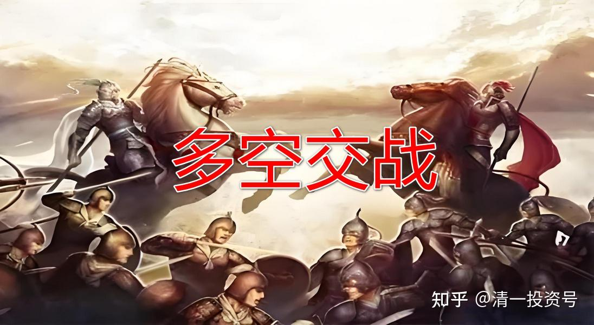
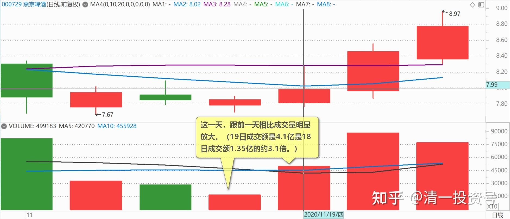
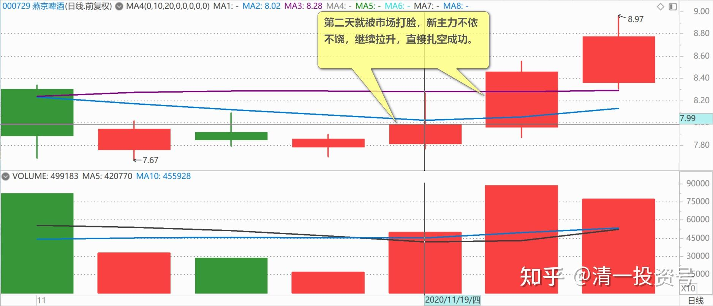
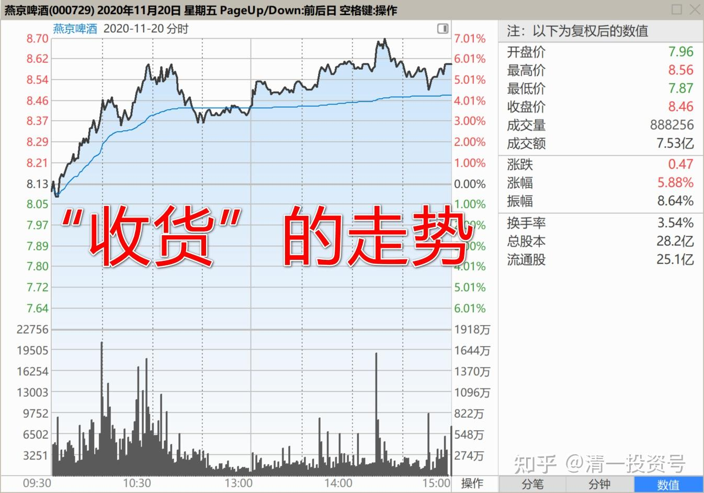
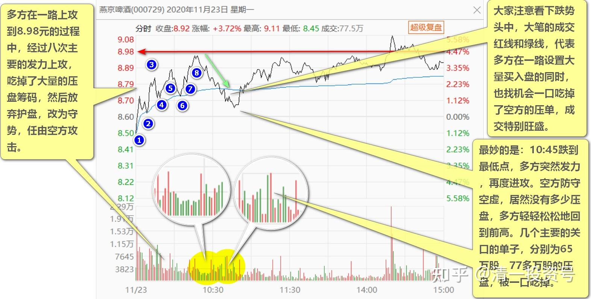
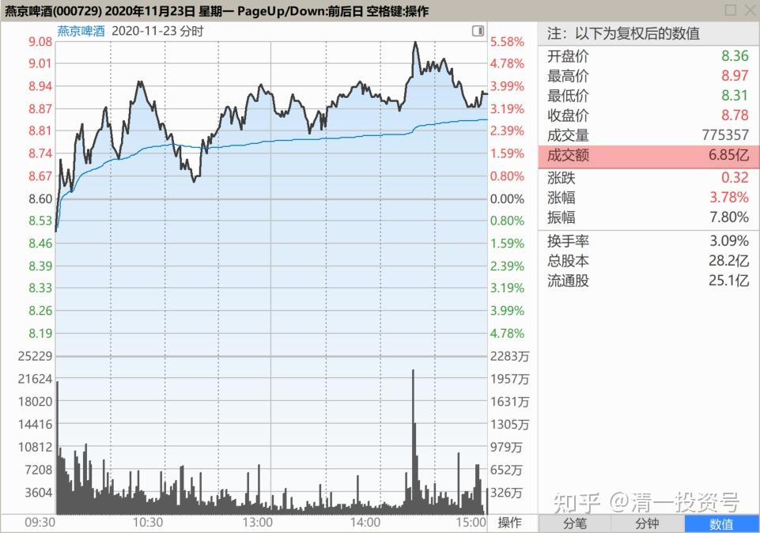
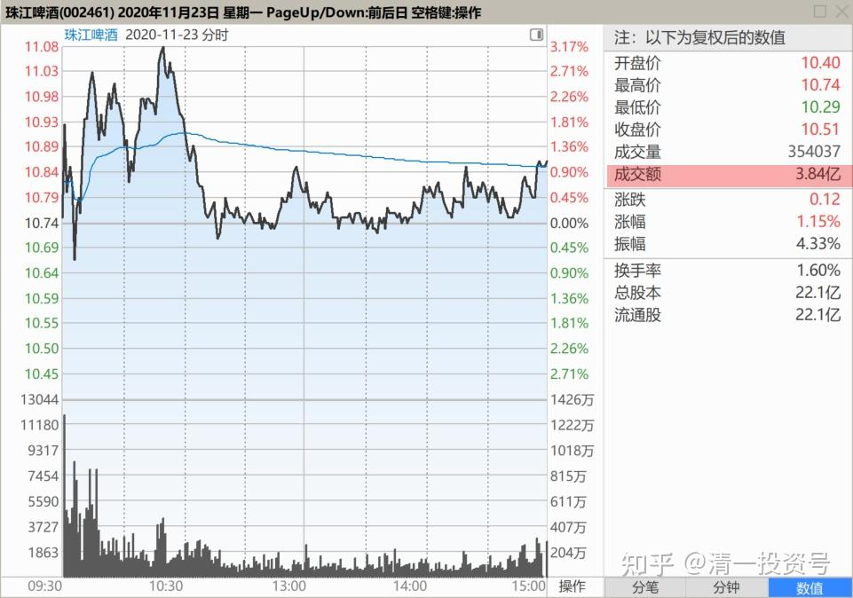

65篇.多空交战依然没有完成

清一山长2020年11月23日

**一、空方主力重阳被打脸**

[$燕京啤酒(SZ000729)$](http://link.zhihu.com/?target=http%3A//xueqiu.com/S/SZ000729) 回到前高了，突破了压力位。空方主力重阳被打脸，被新主力重重的打脸！！！我上次就发帖说明，11月19日的走势，是典型的出货走势，大量筹码出逃。现在已经证明了，这一天的确是重阳在出货打压，它都已经公告了，4000多万股卖出，以这一天为截止。这一天，跟前一天相比成交量明显放大。重阳这一天，好像“出货成功”的样子，也吓出了一些跟风的小散盘（如果看懂了盘面上的出货图形，就会抢先逃走）。

但第二天就被市场打脸，新主力不依不饶，继续拉升，直接扎空成功。说明我教的“**看空不做空”有多重要！看懂了图形，也要守住心中的原则，这就是定力。**

上一交易日（2020年11月20日），我发帖说走势图形是“收货”的走势。这一天，是多方主动大量吃货，浮筹大量被吃掉，空方试图打压，大量放货，试图压下去。但空方一直处于劣势，无法发起有效进攻，看样子新主力的实力特别强劲，所以最终多方获得胜利。重阳的筹码，恐怕又丢了不少。重阳坐庄燕京，贪心太大，一直压住燕京不让涨。前两年，这个策略成功了。现在居然想要更多的筹码，结果被有实力的新庄“抢庄”成功。重阳大约丢掉了一半左右的燕京筹码。真可笑，搬起石头砸自己的脚。祝福燕京！

**新庄入住，成本就是8元多进来的，十元以下，不可能出货的。所以，燕京的短期目标，应该是冲十元了。**

**不过，看多不做多。我不会抢盘买入燕京，只看不做。过了十元，会至少丢一百万股庆祝一下！**

二、多空交战依然没有完成

[$燕京啤酒(SZ000729)$](http://link.zhihu.com/?target=http%3A//xueqiu.com/S/SZ000729) 多空交战，今天也没有结束。但延续上一交易日的趋势，依然是多方占上风。多方在一路上攻到8.98元的过程中，经过八次主要的发力上攻，吃掉了大量的压盘筹码，然后放弃护盘，改为守势，任由空方攻击。空方试图恢复失地，大量筹码压出来。多方虽然不主动攻击，但很巧妙地把空方抛出的压盘一大口、一大口的吃掉。大家注意看下跌势头中，**大笔的成交红线和绿线，代表多方在一路设置大量买入盘的同时，也找机会一口吃掉了空方的压单，成交特别旺盛。**最妙的是：10:45跌到最低点，多方突然发力，再度进攻。空方防守空虚，居然没有多少压盘，多方轻轻松松地回到前高。**几个主要的关口的单子，分别为65万股、77多万股的压盘，被一口吃掉。今天主力抢筹的派头更加的勇敢、坚决。资金实力，10位级别的**。这是重阳两年多以来从来没有遇到的对手。这个对手，比珠江、惠泉的要强悍得多。

现在成交，已经放大到比珠江多了一倍。比四天前启动前一日，多了7～8倍（算半天的量）。**所以，多空交战依然没有完成。**最终谁能笑到最后？不知道。我虽然希望多方胜，但也不排除重阳系拼死一搏。新主力实力跟不上。最终也只好退兵认输。两年前，重阳用此举击败了连拉两个涨停秀肌肉的新庄，重阳居然成功了。让对方亏本而退，筹码低价还给了重阳。这一次呢？会不会也一样？历史会重复吗？

跟评上贴

[陈振杰1](http://link.zhihu.com/?target=http%3A//xueqiu.com/n/%25E9%2599%2588%25E6%258C%25AF%25E6%259D%25B01)回复[清一山长](http://link.zhihu.com/?target=http%3A//xueqiu.com/n/%25E6%25B8%2585%25E4%25B8%2580%25E5%25B1%25B1%25E9%2595%25BF)：

山兄！有没有一种可能以为是出货而真正目的是为了收货，若成交没达到10亿以上量级怎么叫出货呢！

清一山长回复[陈振杰1](http://link.zhihu.com/?target=http%3A//xueqiu.com/n/%25E9%2599%2588%25E6%258C%25AF%25E6%259D%25B01)：

您说对了。重阳真正出货的时候，必须是燕京成交破十个亿的时候。现在这不叫出货，叫压盘。但它公告说自己“出货”了。骗谁呢？

(标题、图片为编者所加)

**文章音频**：

[450篇.多空交战依然没有完成](http://link.zhihu.com/?target=https%3A//www.ximalaya.com/sound/733128234)

**参考链接：**

[57篇.持仓，减仓，长期持有](https://zhuanlan.zhihu.com/p/691822907)

[58篇.看股票就是跟人性作对](https://zhuanlan.zhihu.com/p/693094564)

[59篇.是主力换庄，还是野蛮人抢筹](https://zhuanlan.zhihu.com/p/694396823)

[60篇.跌破5元的可能和上涨破10元的可能](https://zhuanlan.zhihu.com/p/695644758)

[61篇.顺鑫农业记录七——机构坐庄三招：养、套、杀](https://zhuanlan.zhihu.com/p/556331421)

[62篇.看一看典型的骗线](https://zhuanlan.zhihu.com/p/698011435)

[63篇.为啥我认为是假出货](https://zhuanlan.zhihu.com/p/699291708)

[64篇.看懂长牛股的走势](https://zhuanlan.zhihu.com/p/700510263)