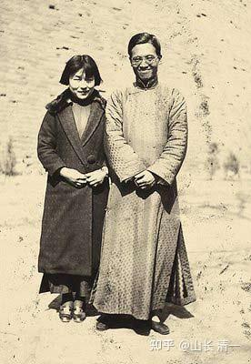
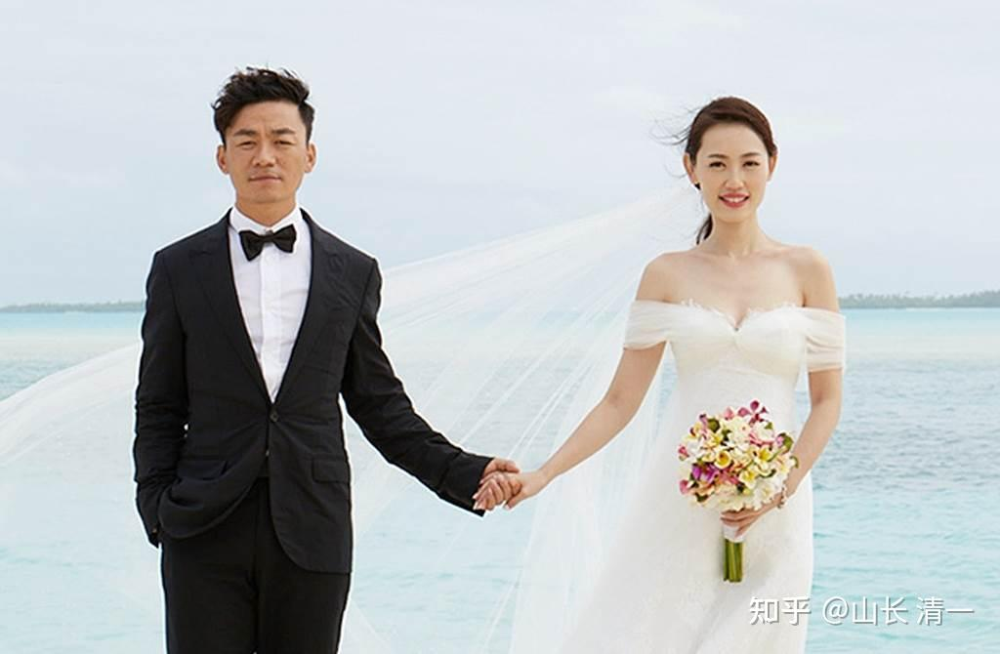

中国家长很少去思考：你们的孩子的人生道路，并不是只有华山一条路。并非孩子生下来就一定要走“考个好大学，找个好工作，过个好生活”的固定道路。孩子们个性不同，追求不同，要求不一样，要给她们不同的选择，允许她们去追求体验自己选择的人生！

家长们往往喜欢焦虑，喜欢为孩子安排“最好的出路”。把自己的一厢情愿加给孩子。其实---家长最需要尊重的，是孩子内心的愿望。否则结果就会很差----会闹的全家不宁的，甚至每年都有很多孩子自杀---就是他们生命中的追求道路被家长挡了，他们当然宁肯去死了！很多人不理解这些孩子为啥会自杀？因为你不是他们这种类型的人，他们不愿意走你认为良好的人生道路。

看起来，人的追求有很多。其实事不过三：孩子的内心愿望和追求，一般来说也只有三种大分类。

**第一种就是“事业型”的孩子：愿意为了他们追求的事业无条件付出的人！**

** 他们有强烈的事业心，企图心，算是“胸怀天下”的人。这种孩子对世界充满了好奇。他们想的是：世界这么大，我想去看看！**

**人际关系上，这种人最关心的要点，不是别人“喜不喜欢自己”，而是：自己做的这件事情是不是够牛？能否让人大吃一惊？**

**对这种有事业追求，想要去闯天下建功立业的学生，新教育根据他们的天赋能力不同，安排了三条不同的出路：**

第一条道路：就是为天赋高的孩子们安排的出路，15岁SAT就可以考到1500分以上，甚至是1550分以上。这种人，可以上我们专设的【冠军班】，我们帮助这批孩子，去刷一份靓丽的简历来上世界顶尖大学。比如：深度学习道家文化，学习中华传统武术，去击败现代格斗。三年之后，争取申请进入哈佛耶鲁，牛津剑桥！成为闯世界的顶级人才！这种人，其实学什么专业都可以，只要自己喜欢就好。顶级人才不需要你去安排。他们自有主意，自己有发展的目标和事业选择！

第二条道路，是中等资质的人，新教育考分大概在1400分以上。他们喜欢与人打交道，喜欢研习文科专业。还喜欢赚钱。而且很有行动力，愿意积极主动的去做事。这种人，就可以考学清一大学的【管理学专业】，走三加一的道路。未来的目标，是做世界五百强的中级管理人，以及自主创业等等！

第三条道路：就是中等，或者中下等资质的人，SAT分数的可能不太高，或者虽然大脑和成绩都很好，考分可以超过1400甚至1500，但他们对研究人没兴趣，个性也比较孤僻，不想去做跟人打交道的事情。这种人，可能只对研究【物学】感兴趣。他们喜欢探索星空的奥秘，却对人事毫无关心！这些人没必要去一流国家顶尖大学去交智商税，去了也学不好的。不如去考学二流国家的一流大学！将来找一份理想的工作应该不难！性价比高多了！这种想要创天下的人，追求事业和成功的人。根器不高的人，去读文科就废掉了！文科只有根器最佳之人去学才有意义。因为文科是道，不是术。道可化术，可是连术都学不会的人，去学啥道？只能学到虚文假道，当个低级的骗子！

*一对巴西夫妇，用18年的时间，种了200万颗树。也就是事业型的极致*

**第二种类型就是“感情型”的人。愿意为她们喜欢的人和家人，无条件付出她们的一切！本质上，他们是【爱家的人】！这种人不想去外面追求事业成功，独闯天下的人！更喜欢与家人一起相守。**

**人际关系上，这种人最关心的要点，不是自己做啥事牛不牛的问题，而是：自己做的事情好不好？别人是否会因此喜欢我？**

这种人的信念系统是：世界这么大，跟我没关系。世界再精彩，我也没兴趣！不喜欢去外面闯天下，没意思。我只喜欢留在我的家，好好生活。我也只愿意为我的家服务！找工作，做事情，也只是为了养家！这种人同事业型的人一样，工作也会非常的努力，想要证明自己的“好”，因此特别会关心和帮助他人！

比如ELLA，我说她是学霸，是公主班的班长。应该给公主班做好榜样，努力去考考SAT，拿个1550分以上，然后去读哈佛耶鲁，牛津剑桥，为国争光。这种“很牛”的事情，对第一种人会很有吸引力。结果她居然哪都不想去，对外面的世界不感兴趣。只想上个清迈大学就行了。因此---这种人的心不野，并不想去闯天下，属于恋家的人。如果家长非要勉强她，非逼让她去读啥哈佛耶鲁，恐怕她去了也不会开心，反而会抑郁的。哈佛大学的学生自杀率，据报道是常态的60倍。我认为就是因为一些“家子气”的学生，被迫去上了这种“胸怀天下”的世界级的名校。结果违背了自己的本性，心理上很不开心。因为不符合自己的本性和人生目标，所以想要自杀或者抑郁！恋家的人，女孩子居多。这种女孩子，需要的是给她们一个家就好，而不是强迫她们去闯荡江湖，走世界开山门啥的！

这种感情型，恋家类型的人，也可以继续细分，也分三种情况，有三种不同的出路！

**第一种情况，是恋“大家”的**，而且喜欢加入一个大家庭，为大家服务的人！她们喜欢加入一个符合自己的理想，能让自己获得尊重和地位的团队。她们往往拥有良好的人际关系，属于团队中非常受欢迎的人！她们也很善于与人沟通交流！也喜欢做跟人打交道的事情。这种人喜欢学习人学，可以让她去自己喜欢的平台，与伙伴们一起工作。这种人，如果喜欢新教育的话，就可以上清一大学【教育学专业】，读师范专业，成为未来的新教育教师。也可以成为医生，帮助人解决患难！这种人极其稀有，世界上很少有这种“大家之人”。

**第二种情况，是恋“小家”的人。人际关系上，他只关心某个特定的“家人”，如女生心中只有某个王子。**这种人就是为自己的【小家】而生的。她们一辈子追求的，就是去找到一个体贴的爱人，去建设一个温馨的家，去养一堆可爱的孩子。她们中，有人会很有才华，也会考到很高的大学，比如清华北大。毕业后也可以找到很好的工作。但她们事业和生活的核心，就是自己的小家， 不管成就多大，生活重心还是以“小家”为核心。比如杨绛就是这个类型的人--才华，智商，努力都过人一等。但她一心就只有自己的“小家”，只关心自己的家人，只想让【我们叁】（杨绛的书名）过好自己的日子。这种人，数量相对多一些。过去的时代，注重礼义廉耻。因此中国人这种人相对是最多的！只是现在，个人主义兴起，这种人是越来越少了！而且就算有的话，也往往白白托付---因为现在似乎也没啥值得终身托付的人！家庭正在全球范围内解体崩溃！小家已经难以成为避风港了！

三语高中也有这种人，不仅仅女生，甚至有男生也是这种人。比如有个男生，就因为暗恋的女生不理他，恋爱失败。结果就躺平在家，啥事都不想干，也不想去上大学，也不想去找工作。不想见任何人，干啥都没劲的样子，因为支持他人生行动的生命支柱倒下了。清黑就说---怪今日没教好学生----难道跳楼自杀的学生，就是哈佛没教好吗？其实就是每个人的人生信念罢了，这个几乎就是改不掉的！教什么内容，都无法改变他的基本信念系统！为一场恋爱，就要死要活的人，基本上就是这种类型的人。心胸格局小是小，但---别人很认真的！什么天下之大，世界之美，他们根本不在意。只在意天荒地老一份情！这种人。要么学会把小家化为大家，让自己的心气提高一点。要么就是自杀算了。因为他活著实在是受罪，孤独无依之人！

*杨绛:典型的感情型人。有爱心也很幸运，她遇到了真命天子钱钟书*

杨绛先生说：“一个男人，他最大的失败就是：把一个当初什么都不图你，只图对她好的女人，逼成了女汉子，疯子，最后绝情的离开！”。【她心中的女人，就是这样的命运。男人就是女人的“天命”。如果男人不是好人，女人的一生就白白辜负了】。

** 感情型的第三种人，就是“不爱别人，也不爱家人，不愿意为别人付出。但一生只爱自己，只愿意照顾自己”的自私鬼。**

这种人，现在是世界上数量最多的人。她们心中基本上只关注自己，做一切事情，都喜欢从自己的角度和利益出发。为了满足自己，会无视他人的利益和原则。这种人，也愿意努力做事情。这个类型的人中，努力和厉害一点的人，脑子好一些，努力程度高一些，耐心强一些的人，就成为【精致利己主义者】。他们来到世界，就是尽量找到一切机会，会自己捞到一切世界的“好东西”，为自己所用。其中混得比较成功的人，就成为精致利己主义者。 拥有很多可以用来炫耀的好东西！

但是其中大批的感情性人，由于脑子不好，一昧的沉迷在自己的感情世界中走不出来。一味的索爱却又得不到，往往就成为感情世界的失败者。一生寻寻觅觅，但结局注定凄凄惨惨戚戚！表现出来是这种人心比天高，命比纸薄，给人自私冷漠的印象，是令人讨厌的心机婊，最终，往往很容易名声扫地！没有朋友。因为她们从来真没有对人有真心真意的爱，只要求别人爱自己！

这种情况的学生，如果来新教育上学，聪明一点的人，可能她们的成绩也会很好。但以后上什么专业？读什么大学？其实她们才不需要别人帮她们操心的。她们也不关心上大学要学什么本事，他们只关心上大学能够给他们什么好处。这类人精于算计，很会为自己打算。我们对这种累下来的人：只能是尊重和友好协助，提供我们的资源给她们使用---如果她们看上了的话。至于这种学生想干什么？都可以，想上什么大学，凭自己的本事去上就行了！

*过渡型---马蓉是感情型人的第三种表现形式----“只爱自己的人”。叠价感觉型的疯子！*

马蓉其实有更多的感觉型人特点----严重缺乏理性。更符合感觉型人的特点！但她也很有心计，因此也有第二种人的特征---努力去接近自己想要接近的对象！

** 第三种情况，就是“感觉型”的人。这种人，是不愿意为任何事情付出的人，他们对啥都没有真情真意，都是根据感觉走的。甚至他们不知道自己到底要什么！很容易被媒体和流行趋势索操纵去做蠢事！有时候，这些人，就算为了得到自己想要的东西，她们不得不付出一点点，也会斤斤计较的，尽量以最小的付出，去获取最大的收益。一旦收益下降，或者只是不符合他们的感觉之后，他们立马就会转身！**

** 这种人不爱事业，不会真心为事业付出。**

** 她们也不爱别人，不会真心为他人付出！**

** 他们甚至不爱自己。因为他们也不知道爱什么！**

** 但这种人，很喜欢疯狂的“追求不现实的成功”，特别喜欢吹牛，似乎自己很了不起一样。比如未来想当明星，当电影大师啥的。但她们根本不会为之努力。根本不会认真长久，踏实的去做一件事情！**

这种人，也不会去爱上别人。但她们却希望全世界都爱自己，都围着他们转。如果没有人来关爱他们，他们就非常的抓狂，会很失落！她们会有很多段的感情。但她们抓不住一次----即使遇到了世界上最好的对象，他们也不会珍惜，反而会各种挑剔不满。然后会已经拥有的宝贝丢下，去满世界去找不存在的“真爱”！

** 她们有些人很会作秀，会装可爱，装成功，会吹牛！可能在特定对象面前，会装得特别的关心人，爱人等等，其实只是表演而已。其实她们本质上只关心自己---准确地说---她们只关心自己的感觉，只想让自己出彩！见不得别人的好！**

** 所以，这种叫做“感觉型”的极致人：浮萍型人才，就真的很难对付了！偏偏这种人中国现在最多！每年还大量产生这种人出来！**

** 这种人，看上去像是第一种人和第二种人混合体。因为他们什么都要---想要成功，想要别人爱，想要一切的好东西！刚开始会被人误以为是第一种人或者第二种人！**

** 区别不是看她们说什么。而是看她们做什么！这人是否愿意为了某件事情，某个人去努力付出！努力实现！衣带渐宽终不悔。这种人就是真心真意！**

** 付出一点点就认真算账---绝对就是假情假意!**

** 他们在人际关系上的关注点，不是要努力去做事来证明“自己牛不牛”。而是要去质疑别人：凭啥你比我牛？**

** 她们也不关心 ：到底我好不好？我怎样才能做得更好? 别人是否会喜欢我？而是理所当然的：凭啥你不喜欢我？**

** 这种人想要的，就是别人都会认同她的标准（其实自己有啥人生行为判断标准，她们自己都不知道，都是感觉好就行，感觉不好，啥都不行，因此她们才叫感觉型的人）。她们也希望别人认同她“更牛”，也希望无论自己做什么，别人都会“喜欢她”！而且为了得到这些认同，她们会用最简单，最不费力的方式去得到。如果得不到，他们就会很抓狂。**

目前，国内存在大量的第三种类型的人，很有点麻烦！因为他们不像第一种人---很有追求和想法，有走向世界的企图心！这第三类型的人，就是本质上，他们不关心任何事情，也不爱任何人，甚至他们不爱父母家人。他们也不想做任何费心费力的事情。她们活着就像梦游一样，只关心每天去找感觉，只关心吃喝玩乐。往往胸无大志，无知，愚蠢且俗气，个性往往自私和冷漠。

她们在感情生活上，往往非常的贫乏，他们根本就不理解人，也不想去理解别人。不像第二种人“感情型”的人，会尽量去理解他人。也为爱可以死生相与。这种第三类型的人，她们不爱事业，不爱人，也不爱家，更谈不上爱国，甚至他们连自己都不爱。他们不愿意付出任何努力，但想要轻松得到一切，而且期待了别人给他们送上门来。

总之-----他们来到世界上，不是为了创造美好的“事业”，也不是为了创造美丽的“爱”。他们只想去享受别人创造的事业，去拥有别人给与的爱。享受世界的一切！她们就是来找感觉的。

这种人，**在人格上非常的扭曲！在自卑和自大中不断的摇摆。**情绪也起伏不定！虽然从表面上看这种人自视甚高，总觉得自己了不起。但往往她们是自己折磨自己，看去上常常是一脸苦大仇深的样子，像是谁都欠了她的钱一样！总觉的这个“不高尚”的世界，对不起他们这种“高级人类”！没有把她想要的东西乖乖的送到她面前来，就是对不起她们。但他们自己其实也不知道自己想要啥？更不知道---什么样的世界才是更好的世界！她们想要的世界是啥？完全没概念！

这种人，来世界上似乎根本就没目的。他们就像是一群糊涂蛋，不知道自己为何来到世界上生活。往往到吃啥追随潮流，喜欢追星，到处找好吃好玩的东西。一生就是浮萍一样到处漂迫，毫无人生目的和发展方向。每天这种人关心的唯一事情。就是通过吃喝玩乐来证明自己的存在，喜欢获取“高端服务”来满足自己“牛”，自己可爱的愿望。到处找感觉的结果，就是他们有钱有强力的后台支持，就会过得似乎不错，有鼻子有脸的像个牛人。如果正好没钱就惨了，她们就在廉价的娱乐场所和家里的肥皂剧面前度过他们最宝贵的时间。他们的一生经历往往乏善可陈，什么像样的事情都做不出来。一生就是一堆失败的经历的积累！她们就像一只无头苍蝇，跟着世界的潮流乱转，每天得过且过。如果家庭条件好，女人特别是嫁个好老公。似乎她们看上去也很满足，也很光鲜，生活还不错的样子。但骨子里面由于她们毫无思想和追求，也不愿意动脑子去思考和行动，更不愿意好好学习和工作。而且自私自利，只考虑自己。而且--更糟糕的是，内心深处他们特别厌恶自己，所以往往会有抑郁症等等。所以-----这种人将来走到哪里，想做什么？实在无法确定！也没法给他们进行教育安排！

家长往往在小时候特别喜欢这种人，还会特别用吃喝玩乐来“定向”培养这种人，让他们习惯去找感觉！似乎说明家长就是喜欢感觉型的孩子！小时候似乎也没啥不好的地方。但往往在青春期以后，开始逆反和找感觉，家长就开始头疼这种人。然后---关系越来越僵。最终一地鸡毛。各种惨淡的结局都出在这种家庭！

你想认真这种人吗：他们中的失败者，低端人物，就在这里，你看看你家里会不会出这种人：（这种类型的高端人物，有钱有势的人，应该在精神病院里面，或者正在吸毒等等，或者已经死了）

[儿子被大学退学，呆在家里啥也不干，我们该怎么办？](https://www.zhihu.com/question/622014984/answer/3524395920)

新教育一般会放弃这样的学生，因为真的没法教！除非家长特别懂事---但这种家庭出现这种孩子，就是家长小时候培养出来的找感觉的孩子。所以指望家长理解难度很高。当然---如果孩子很小，不到10岁的话，来新教育还可以强行用行为调整转变过来。14岁以后，改变就很困难了，要靠缘分了。但这种孩子。如果只能上体制学校的话，基本上没有改变的可能！只能一条路走到死了！

你和你孩子到底是哪一种人呢？请去好好思考一下，为自己找到合适的位置吧！如果你正在培养感觉型人，请赶快悬崖勒马吧！