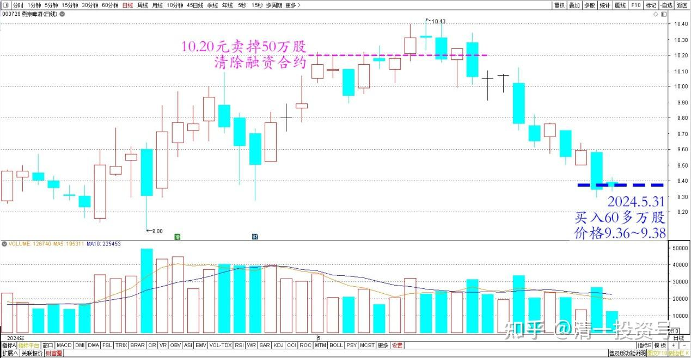
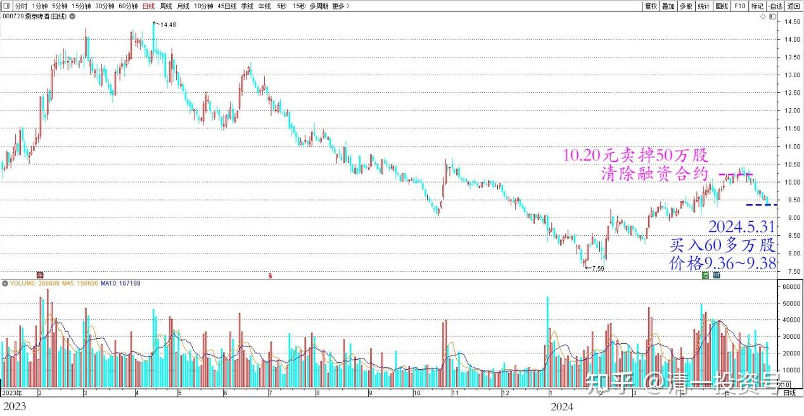
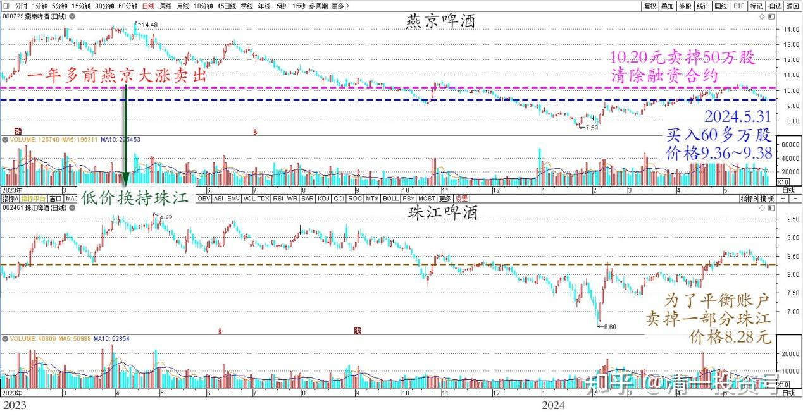
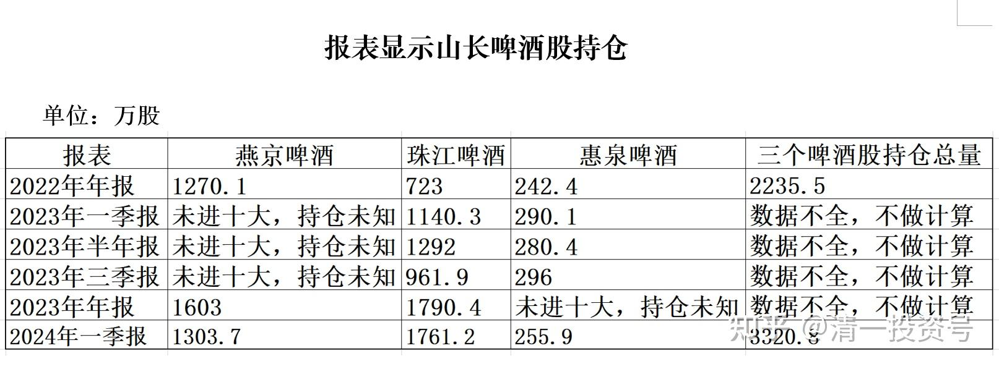
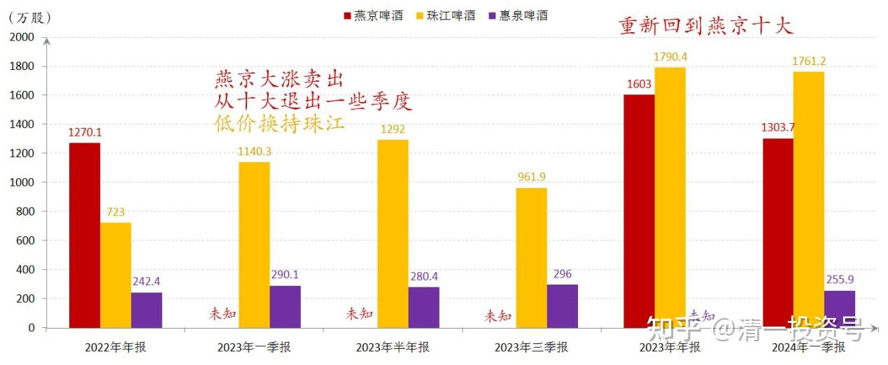
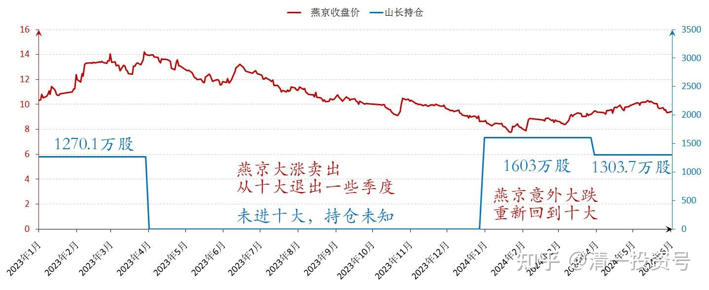
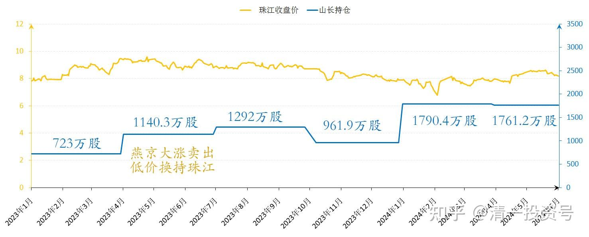
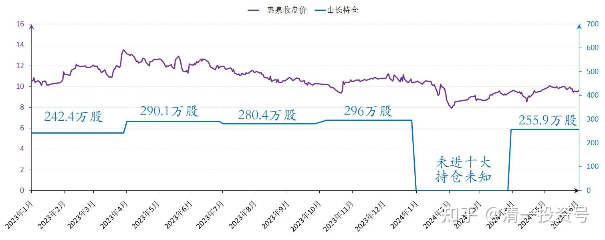
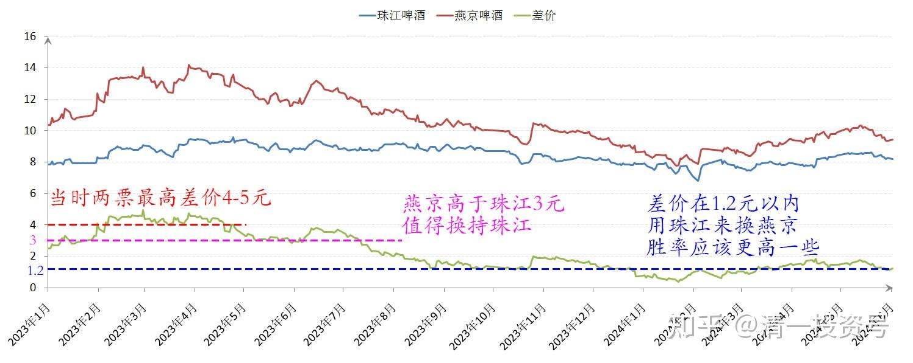

86篇.10元上下的啤酒操作

清一山长2024年5月31日

今天在某账户买入了60多万股燕京啤酒，价格最低9.36元，最高9.38元。因为前段时间该账户在10.20元左右，我主动卖掉了50万股左右的燕京（尺寸总量的一点点而已）。当时是认为**燕京股价超过10元，就不应该持有融资头寸了。结果就卖掉一些头寸，清除了燕京的融资合约，把融资额度都空出来了。**没想到才这么短时间，市场就给了机会让我补回来这些筹码。

燕京啤酒2024年4月～5月日线图

燕京啤酒2023～2024年日线图

由于今天买进的头寸多于上次卖掉的头寸，**为了平衡账户，还卖掉了一部分珠江**，价格是8.28元。现有的珠江持仓，都是一年多前燕京大涨卖出后，低价换持的珠江。

燕京啤酒和珠江啤酒2023～2024年日线图

我记得换持后有说明的，当时就从燕京10大退出了。一季度，珠江、惠泉重新成为十大。后来珠江上涨，燕京意外大跌，这才重新回到燕京十大。看报表就知道了我的进出痕迹。

报表显示山长啤酒股持仓

燕京啤酒2023～2024年收盘价与山长持仓

珠江啤酒2023～2024收盘价与山长持仓

惠泉啤酒2023～2024年收盘价与山长持仓

记得当时两票的最高差价居然是4～5元。我认为——**燕京高于珠江差价3元，都是值得换持更低价珠江的。相反——如果两者差价在1.2元以内，用珠江来换燕京，胜率应该会更高一些**。所以——目前价位，应该正好是可以换持燕京的领域。只是珠江的每日成交量很少，很难互相匹配，只能换一点点，多了换不来的！

**至于新买——我谁都不想要。价格都高于我的建仓心理价位。因此——只换股，不买股！只做T，不减仓！**

珠江啤酒和燕京啤酒2023～2024年收盘价

（标题、图片为编者所加）

**文章音频**

[451篇.10元上下的啤酒操作](http://link.zhihu.com/?target=https%3A//www.ximalaya.com/sound/733666731)

**参考链接：**

[79篇.养老账户操作：燕京换珠江](https://zhuanlan.zhihu.com/p/693773038)

[80篇.不要钱，只要股——啤酒股切换](https://zhuanlan.zhihu.com/p/695027042)

[81篇.惠泉跌破十元，再次进入十大](https://zhuanlan.zhihu.com/p/696066886)

[82篇.远离投机，踏实投资，才是正道](https://zhuanlan.zhihu.com/p/697366505)

[83篇.换股策略——高卖低买](https://zhuanlan.zhihu.com/p/698681371)

[84篇.赚股——卖出涨得好的，买入趴地下的](https://zhuanlan.zhihu.com/p/699932996)

[85篇.用涨了的天山铝业换没涨的中冶H](https://zhuanlan.zhihu.com/p/701250566)

