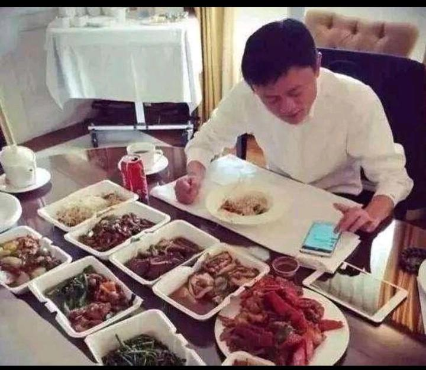

** 我们一天吃三顿饭。现代社会的生活和工作安排，就是围绕这种饮食方式来设计的。我们被告知：早餐是一天中最重要的一餐。工作时有午餐和休息时间。然后社交和家庭生活都以晚餐为中心。但这是最健康的饮食方式吗？**

[https://www.bbc.com/future/article/20220412-should-we-be-eating-three-meals-a-day](http://link.zhihu.com/?target=https%3A//www.bbc.com/future/article/20220412-should-we-be-eating-three-meals-a-day)

这篇BBC的文章，专门研究了一天到底应该吃几餐！各位有兴趣可以看一看！最终结论是---只吃一餐最有利健康。

古罗马据说是每天只吃一餐的。早餐最初是贵族阶层独有的。第一次流行是在17世纪，早餐在当时是那些买得起食物和有时间在早上悠闲吃一顿饭的人的奢侈品。查林顿-霍林斯说：“在19世纪工业革命和引入工作时间期间，早餐是常态概念”。

也就是说：一日三餐，是工业化带给我们的生活方式。并不是原始以来人类的生活常态！因此----未必是最有利健康的生活方式，只是有利于日常的管理。

*据说的马云早餐！显然不懂健康饮食*

中国人的一日三餐，一般来是是要求如下的：

早餐一定要吃好，肉蛋奶最好都有，因为要供应一天的能量需求，一定要吃优质食物。以上马云的早餐，您觉得很好，很丰富吧？ 马云的早餐，看起来丰盛多彩，其实真不如老百姓的稀饭馒头更有利身体，提供了大量对身体无益有害的东西！真吃完一定很累！真想吃早餐---喝点水，吃一个水果就更好了，帮助清理肠道还不增加肠胃的消化负担！早餐拿个油饼，油条包子饼子啥的，在路上边走边吃，是最伤身体的。干吃伤胃，特别吃油炸食品最不利健康！还不如喝一杯温水通肠更好！

国人的中餐就是工作餐，吃饱就行了！对品质的要求不高！一份简单的盒饭也行！相对来说，可能中餐是最健康的一餐了。

但晚餐是中国人的重点：无论是晚宴，还是回家的晚饭，晚餐一定是非常丰盛的！是一定要大吃一顿的！实际上，给中国人带来严重身体和健康问题的，就是晚餐特别丰盛的习惯！

中国每年喝酒而死的人，是70万人。如果国人晚餐，连酒这种超级难喝的东西，都能用来喝死自己。国人在吃东西上，显然更加不在乎是否会慢性吃死自己。只在乎口感味道的。这就是中国人为了吃，而不怕死的精神----有个词汇是拼死吃河豚？可见国人为了吃能有多疯狂！

世界卫生组织，医学专业人士，经过多年的研究，认为：最健康的生活方式，就是一天只吃一餐！这和佛陀倡导的生活方式，每天中午才吃一餐，是完全一样的！ 一些医学专家的研究表明：身体每天应该有12-16小时的禁食时间，才能够让身体保持良好的状态！因此每天只吃一餐，不超过两餐，才是正确的饮食方式！而不是媒体倡导的---一日多餐，少食多餐，平衡饮食，不停的吃！这只会损害我们的身体！

威斯康辛大学医学与公共卫生学院副教授罗扎林·安德森研究限制热量摄入的好处，这与降低体内炎症水平有关。她说：“每天有个禁食期可以获得一些好处。禁食让身体处于不同的状态，更容易修复和监视损伤，清除错误折叠的蛋白质”错误折叠蛋白质是普通蛋白质的错误版本，普通蛋白质是在人体执行大量重要任务的分子。蛋白质错误折叠则会导致许多疾病（癌症等等)。

用简单的话来说，就是身体保持**饥饿的状态，有利于身体自动清除和分解吸收有问题的人体细胞，避免人体组织病变。**

安德森认为，间歇性禁食更符合身体的进化方式。它让身体得到休息，因此能够储存食物，并将能量送到需要的地方，触发机制从身体中释放能量！

清迈的公主班和清一武道馆，正在实践这种生活方式！每天只吃两餐！重要的是-----不吃早餐！每天7-11点是一天中运动量最强的时间，如果饱餐之后运动非常影响身体健康。我们是训练完11点吃中餐，下午是文化课和学习，阅读的时间。晚餐是5点钟开餐，但要求轻食------就是尽量少吃一点，甚至支持流食---如喝米汤，和吃一点点的生花生，中间保持17小时的断食时间。晚饭后休息一段时间，再运动两个小时。如果第二天的早上，实在觉得饥饿，可以喝一点米汤，在泰国需要大量补充水分。清水不解渴，汤水更合适。早上尽量少吃固体的食物，特别是难消化的食物，这样的生活方式，更容易保持身体的活力和健康！

另外，断食的时间间隔时间也很重要，就是不吃饭，让肠胃彻底空出来休息的时间，对身体是很重要的保护措施！

佛陀要求是日午一餐。也就是每天一顿饭，间隔24小时空腹。这种方式，的确很健康。但现在的和尚，不明白祖师的意图，是让他们保持身体健康。以为吃素，以及只吃一餐，是要“牺牲自己，给佛祖面子”，所以：一方面就是私下偷吃东西，比如少林寺电影中的偷吃狗肉，造成了和尚偷吃“好东西”的坏习惯。另外一方面，很多庙人性化一些，一日提供三餐自由选择。因为和尚们普遍觉得吃素的营养不够，一定要多吃才行。结果一个个都吃成了胖乎乎的胖和尚，就是吃错了。佛陀本人吃的很少，也很廋。不是庙里面的大肚子佛像的样子。真修行之人，吃的都少，因为他们不喜欢昏沉。吃得多，能量消耗大，肯定脑子身体都昏沉的。南怀瑾的饮食习惯，就是每天都只吃一小碗红薯稀饭，身体很瘦，但他精神一直很好，也很长寿。

有一些严格修行的庙宇，就坚持日午一餐。或者一些精进的和尚，坚持一天只吃一餐。但这样的庙宇，和尚也未必很健康。很多人都得了糖尿病，往往这种只吃一餐的和尚都很肥胖。究其原因，就是认为一天只吃一餐。因此怕吃亏，就这一餐使劲的吃，结果把身体吃伤了。造成严重的消化系统问题，成为糖尿病。除了前面说的喜欢吃菜导致的问题，也有吃的量太大造成的问题。

因此可以知道：如果不懂基本的饮食常识，不懂道法自然，就算吃素，就算一天只吃一餐，还是会造成身体损害的！

我建议的生活方式，就是最好一天两餐，避免心理上间隔时间太长，觉得太饿，就会一餐吃的太饱，造成身体的损害。两餐的间隔时间，大概就是有12-16小时。虽然24小时的吃饭间隔时间最好，但毕竟普通人难以坚持。如果要尝试的话，又不想身体过于饥饿导致难受，我建议间隔时间，虽然不吃固体食物，可以喝一些流食，如喝一些米汤，担心蛋白质。维生素不够的话，吃一点生花生！这样身体的感觉会更舒服。同时，饮食间隔16小时，对于拳手来说，有助于让身体表面的多余脂肪层消除掉，让体重肌肉更加有效。因此是要必要的通过饮食改良身体的措施。如果简单模仿张伟丽的吃法，西方的营养学理论，不仅仅吃起来受罪，减重的时候更受罪，将来退役之后，问题更多！就是花钱买罪受了！

因此，饮食问题，不仅仅要关心吃什么内容？更要关心怎么吃的方法！不然很容易造成身体的损害！病从口入指的就是这个意思！