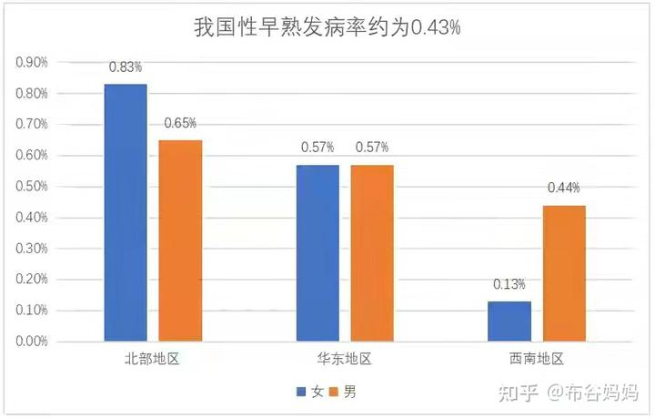

年仅七岁的女孩子，家长发现胸部有突起现象，家长以为有啥病，就带去医院检查。结果医生检查结论是：小女孩胸部已经开始发育了----性早熟！接下来测七岁孩子的骨龄，居然已经有10岁了！这就是现在很普遍，令人恐惧的“现代化疾病”。

人类的性成熟时间，与寿命长短息息相关，大致上人的寿命是性成熟年龄的七倍。正常的性成熟时间是14-16岁，有时候还更晚一些。如果7岁就性成熟，大约这人的预期寿命就只是50岁左右。事实上---现在的确有很多中年人早死的报道！当然---似乎大家都认为猝死是意外，其实是这人的年限到了，该走了！早熟必定早衰！

但是：家长们根本不知道是何种原因导致的性早熟，而且----媒体也不去提。上面的案例，就是孩子吸收了大量性激素导致的结果。简单地说：就是家长从小喂养给孩子大量含有性激素的食物，孩子被动成为激素动物了。具体是什么食物，需要去看她的饮食习惯，一般来说就是肉蛋奶。据说有小女孩喜欢吃草莓，导致胸部提前发育，提前来例假的报道。显然就是激素不仅仅来自于动物养殖，甚至来自于大棚植物生长剂。国内养殖业大量使用各种激素和生长素，膨大剂，农药等等，已经不是啥秘密。小孩子就是贪吃超巨量的激素食物，吸收了大量的生物激素，才会导致7岁就提前发育。很多女孩不到10岁就来例假的案例了。

女孩提前发育，提前来月经，往往会引起家长的注意。**但激素受害最大的其实是男孩，被弄得不男不女的。而家长往往还不注意。**很多给动物喂养的动物激素，生长激素，是雌激素。由此，吃了大量激素食物的男孩，刚开始会长得更快，更壮，12岁就跟成人体重差不多了。但各位仔细看这种人，就有点不正常：因为这种男孩，往往更像是太监，不像是男人！他的外表更圆润，胡须稀少，个性上也更温和，不爱动。有可能在性向上也会变异----有可能这种男孩更喜欢其他男人，而不是女孩，因此将来成为双性恋或者同性恋的可能性大大增高。现在大家不是发现周围的同性恋越来越多了吗？还有一些男人，就算是结婚后，也很难生育，因为这种男人往往患有少精症，而且---精子的活力也很差。导致婚后不孕的比例大大增加！但很少家长会发现真相，以为自己的孩子只是偶然和变异，其实是从小家长养出来的毛病！----就是吃错了东西！

但媒体明知原因，往往讳莫如深，故意的回避本质问题！因为---早熟，早死与食品行业的关系很大，涉及各级利益集团的事情，媒体都不敢去深入研究揭示的！现在早熟已经是非常普遍的现象了，早熟也意味着早衰。现在的孩子，普遍上生理全是早熟的！还能够按照正常的人类成长进程养育的孩子极其稀少。而不是一些官方数据如下图揭示的一样----似乎性早熟只是一些偶然的，个别的事件！以免群众不安心！

现在我国下一代的生理发育异常，并非下图所说是不到1%。其实我认为是90%以上！甚至是99%。只是因为性早熟的表现不够明显夸张，而且周围人同步变化，集体中毒，所以大家以为“一切正常”罢了！甚至早起的性早熟，催长剂产生的后果，会以家长非常喜欢和自豪的方式表现出现------就是会看到这些激素中毒的孩子长得更快，长得更高！长得更胖。家长还特别的骄傲，觉得自己有本事，孩子养得好。不知道自己原来是间接地拿了动物快速生长的饲料给孩子吃罢了！由于周围的小朋友，都一样是发育加快的，你就不会发现自己孩子的异常---其实你跟别人一样，就已经不正常了！

我们家是一个与周围相反的个案例子：我儿子小时候，个子一直长不高，远远比不过同年人不说，甚至比不过比他年龄小两三岁的孩子。15岁以前的身高，只有与他同龄的女生肩膀高。当年，他是班上年龄最大的男生，但他的个子是最矮的，显得发育不良的样子。直到16岁的时候，身高只有1.6米左右，瘦瘦小小的。他每年都在操心着急---为啥自己就是长不高？身高没有我高的大学老同学，也笑话我说---他儿子才12岁，身高就超过我儿子16岁了。当时已经超过1.7米了（后来成年身高是1.85米左右）。老同学让我别舍不得钱，要多买一些牛肉排骨等等给孩子吃。学他们家大鱼大肉，营养才够！其实我看他儿子虽然个子大，但身体虚，体能也不行，人也懒洋洋的，容易疲倦。远远不如我儿子的体力旺盛，活动量更大，精力更好。谁才是判断身体健康的标准？难道是肉多吗？你家难道是养猪出身的吗？

因为儿子的身高一直长不大，当年我一直被他妈唠叨----责怪我养育儿子的方法不对，因为我们家是素食为主！他母亲认为儿子一直“营养不良”，所以长不大。我回答说：我们不要跟别人比，别人吃了激素的，当然长得更快，长得高。我们又不是靠养孩子出来卖肉的养猪户。去跟同龄人比长得高，长得快有啥意思？我们父母的身高基因摆在这里，长多高，什么事时候长高，是上帝的事情，我们等待结果即可，何必去争高低快慢？我的身高是1.75，比我父亲高，我儿子大概率将来也不会低于这个身高。等他自然长大不好吗？干嘛看到周围的小朋友长得更高，长得更快，长得更胖，就认为自己养错了？没准是别人都错了！肉鸡才跟别人比肉多呢！

事实上，儿子后来的确身高，很快就超过1.75M了。当年同龄的，长得比他高一头的小姐姐，发育期结束就不在长高了，现在比他矮一头。当年的同学，比他高的也不多，只是提前发育，提前长高了罢了！这个案例：说明我们周围的群体，都已经被“现代化环境”改变了。我们周围的孩子发育过程，已经被人为的拔高了。实际上---我们的孩子，从小就摄入了大量的生长激素，因此大大加快了生理上的成熟时间。孩子过早长大，带来无穷的问题：生理上提前早熟，心脏负担加重。心理上也过早性成熟，但思维上依然极其的幼稚。所以青春期的躁动非常的强烈。

同时：生理早熟带来的身体潜在祸害是很大的。一个因素---早熟就必然早衰。同时各种慢性病就埋下了祸根，各位也知道：洋鸡的寿命，是远远比不过土鸡的，土鸡大概要一年才长大。而洋鸡一个多月就可以出栏了。不仅仅是品种问题，主要是喂养方式上，饲料中添加了大量的激素和化学物质，生长素等等，这样才能最短时间生产出大量肉食。这种养出来的动物，生理上，内脏器官上受损，因此养殖的动物，非常容易生病。特别容易死亡。洋鸡就算是不杀它，一直养着，也活不久的，因为各种药物已经损害了内脏。平时洋鸡就很容易生病，日常必须大量注入抗生素防止病死。这些动物身上，医生检查都发现---都有大量的癌细胞，这都是身体机能衰老病变的表现，所以这种养殖动物生命能量极其低下，疾病和死亡因子都很重（所谓的负能量很强吧）。人类大量吃这种养殖动物的肉类，还以为是超有营养的东西，其实就间接吸收了大量的激素和抗生素，自然身体就越来越差了！

关键是：如果长大了，再吃这些养殖的动物，身体受害还不是很大。因为激素，生长素对成年人的影响相对较少，成年人的排毒能力相对也更强。但对小孩子，成长发育过程中的影响就很大！在生命能量上，孩子肉食很重的话，受害是最强的，长大后的体能状态，要明显低于从小不吃激素，只吃健康食品的正常儿童！而且现在还有一个严重的问题，就是不孕症也越来越多。很多年轻夫妇，无法正常的生育孩子，或者怀孕后很容易流产，男子患有少精症等等，这些原因本质上都是因为现在吃的动物食品太不正常了，导致身体体内的各种动物激素太多，导致出现种种身体亚健康和疾病问题。

仅仅从激素和药物上面说，动物食物就带来这么多的问题。更别提日常大量食用动物食品，油脂等等，还会给身体带来的三高，和糖尿病，痛风等等慢性病的问题了，这些相对都不算啥事了！

现在，即使是海洋食品，鱼类，现在基本上都是养殖的，也一样需要大量的激素饲料。自然肉类现在基本不太可能正常生产。甚至连牛这种只能吃草的动物，都要被迫在养殖过程中吃添加了化肥的草料，以加快成长，增加蛋白质含量等等。更别指望市场能够提供“安全健康”的肉类给你！资本是逐利的，根本不会考虑你的健康和生命，只关心能赚多少钱 ---多快好省的赚钱才是目的。各位生活在商业社会，只能降低欲望，自求多福，管好自己的嘴巴。不要去花钱买罪受，不要花钱买疾病。

这个秘密，是我20多年前发现的。当年我的身体出现问题，经常生病。而且不到40岁的我，健康状态，体能等等，居然还不如60岁的老头子。我觉察到应该是我的饮食错了。当年我跟普通人一样，每天都食用大量的动物食品，以为吃肉才算有生活品质，肉食才有营养。在吃上花钱多，才是对得起自己。还每天喝牛奶保障健康等等。但最终我发现的真实结果，是我居然不如饮食简单，朴实的老人更健康，我才认清事实，还去研究和阅读了很多关于健康和食物的书籍，最终彻底改变了饮食方式。

我的孩子，当年就是3岁多跟随我一起改变了饮食方式，导致与众不同的。后来出生的小女就更加严格遵守自然饮食，现在15岁，明显比同龄人瘦小一些。但身体更强，反应更快，还可以与男拳手对抗。我家20多年前就开始一直以素食为主，谷物为主！我办的学堂，也是强调素食和健康的学堂（原来是一周吃一次肉，现在搬到磨丁了。就天天有肉吃了。老挝人做肉食供应食堂，我们不禁止学生去吃，只是引导学生注意健康）。因此饮食条件“差”，我家的孩子从小就长得小，长得慢。但身体很健康。现在身高体重都非常正常！

我很庆幸自己20年前改变了饮食方式，如果我坚持不改的话，可能现在我已经死了。9年前，比我小四岁的亲弟弟47岁就意外身亡。他从小就是一个“美食家”，经济条件也很好，长大后到哪里都喜欢找好吃的，自己一家也很会做吃的，长得也很胖。原来我的体重与弟弟差不多，但我转素食之后，体重下降了接近20公斤，一直稳定在我读大学时候的体重。但我弟弟47岁就因为一场感冒，意外死亡。本质上是饮食起居的方式不对，化学药物等掏空了身体，因此导致他的生命能量低，最终意外死亡。而我老母亲，老一代人生活简朴得多，现在都85岁了，还很健康长寿！我认为我弟弟的死亡，以及身边很多“意外死亡”，各种所谓的疾病死亡，本质上就是他们的生活方式不健康惹的祸！

下面的数据，你们看了，就知道我的想法，肯定和一般人想法不一样了？

【我国是全球最大的肉类食品生产消费大国，人均肉类食品消费量从1978年的9公斤/年快速上升到2022年的70公斤/年。14亿国人一年能吃掉大约7亿头猪，5000万头牛，4亿只羊、165亿只家禽】 ----说明---这个数据是不算鱼虾海鲜类的食物的！我们实际上食用的肉类，超过每年70公斤！

各位看到这个数据。肯定是感到高兴和得意，说明我们中国人的生活质量越来越高了！但我认为：这些人正在更快地走向疾病和死亡！

你难道没有发现：现在的医院越来越忙了？越来越拥挤了吗？现在的各种慢性病，怪病，是不是越来越多了？身边各种中年人。年轻人突然死亡的事情，是不是越来越多了？别以为社会越来越进步了，也许真相是---国民身体健康越来越差了，看起来寿命长了，体质其实更差了。整体上，是越来越多的疾病，慢性病，拉低了生命质量。所谓现代化，无非是你花钱买食物和花钱买药的钱越来越多了罢了，本质上是一种退步！

当然：我不反对各位为了一口美食，不惜牺牲自己的身体去找感觉。付出牺牲健康和生命的代价，来满足自己的一点口腹之欲。大家都是成年人，每个人都为自己负责好了！对于喜欢吃，认为吃就是乐趣的国人来说----如果真的放弃肉食，基本上就等于“放弃了生活”。你就没法出外吃餐馆，吃宴席，吃酒席了。没法跟朋友吃在一起，玩在一起，也许你们也没法一起做事了！所以您为了工作“不得不吃”！因为你要跟随大众！

国人连白酒这种明显就“不是人吃”的东西，都恋恋不舍的坚持不肯放弃，还拿出高价来大买特买。一家茅台酒的市值，都比全部的中国四大建加起来更高。每年喝死的人比交通事故死的人更多，也没见国人就拒绝喝白酒了！显然国人为了吃喝就不惜一切的。别说啥生命和健康了，吃比一切真理都重要！

因此，我上面说的这些饮食和健康的道理，其实也没多少人当真的。就随你们吧！各位爱咋吃，就咋吃好了！

祝福各位，只要您吃得开心就好！