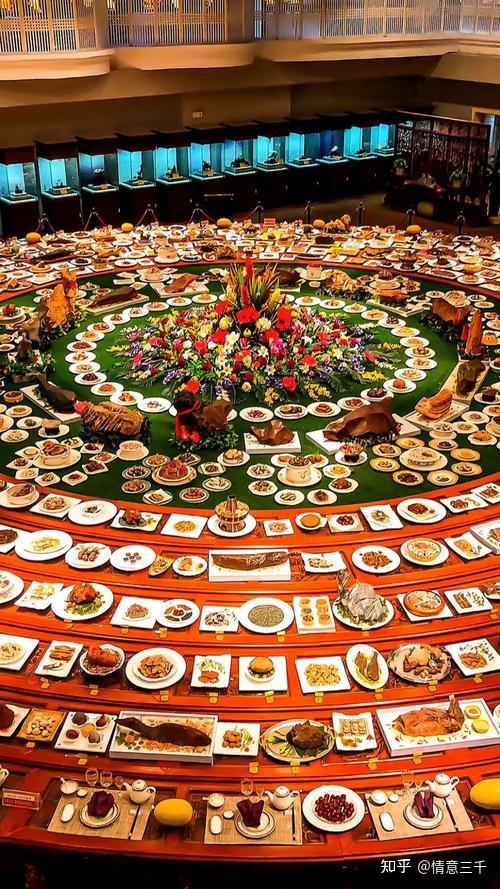

我查了一下资料：中国总共有1.4亿糖尿病患者。排名世界第一。这是一个极其惊人的数字---达到了人口总量的10%了。如果算起来的话，一个人一生中患糖尿病的概率，应该超过20%。统计上：全球65岁以上的人得糖尿病的比率，的确超过了20%，而且这个数字还在继续上升中！中国数字是超过世界平均值的，因此你一生中，得糖尿病的机会，大于20%。

据调查：患病率高的省份主要分布在东北、华北和华东地区，其中北京发病率最高，达到了14.8％。这些地区的65岁以上得糖尿病的概率，应该超过30%了！一个非常惊人的比例！

美国每年花在糖尿病上的钱。是3400多亿美金！中国的数字也是超千亿级别。这是一个利润巨大的市场！患病之后，病人就要长期服用降糖药物，还要吃胰岛素。这个疾病，给医疗利益集团带来了巨大的利润。不过可笑的是：每年这些巨额的医疗和药物开销，实际上根本就无法治疗糖尿病。本质上，只是给你一种安慰数据上的安慰---让你愿意一直服药，一直到死亡为止！这是医疗集团一个精心奇妙的设计。不得不佩服！

由于糖尿病能够稳定地创造巨大的利润，利益集团基本上啥事都不干，就可以获取稳定的收益（美国糖尿病"治疗“药物的价格是成本的百倍以上），从理论逻辑上来看，医疗利益集团，是没有认真研究和治疗糖尿病患者的动力。反而有纵容，扩大糖尿病的迹象。实际上，几十年的历史证明---的确没有人去真正治疗糖尿病，反而每年都制造越来越多的病人。 这就是世界的真相----别指望某些"组织"会当观世音，会来救苦救难，你只能自己拯救自己！

糖尿病的成因：本质上就是病人贪吃，多吃，带来的“贪病”！

*满汉全席，也许就是中国吃货的最高理想*

上面图片中的满汉全席，也许就是中国吃货们的“最高理想”---吃的顶尖待遇。不过----会不会自己问一句----你真的需要吃满汉全席吗？你到底身体缺什么？不吃这些东西，你会损失什么? 吃了，你又能得到什么？

其实，不管你吃的是满汉全席，还是街头盒饭。几个小时之后，你们吃下去的东西，都会变成完全一样的东西---大便！本质上两者毫无区别！但你为此身体和金钱上的付出，就完全不是一个级别了！

不管是吃肉还是吃素，不管是吃多品种还是单一品种。只要是贪吃的人，喜欢大量吃的人，最终就会得糖尿病。因此---中国东北地区这些习惯超大份饮食的省份，三高，糖尿病患者就更多！---随著中国经济的增长，富裕程度增加，越来越多的人，正在积极加入糖尿病群体。预期未来10年内，糖尿病人会增加50%。

按照西医的观点，糖尿病是不可能治愈的。只能用胰岛素，降糖药“控制病情”。降糖药这种东西，基本上相当于身体报警了，边关有事来报警总部寻求帮助，但司令官的处置方式，就是简单粗暴地“杀死报警人”。这样就天下无事了。与去痛片原理是差不多了，美国人习惯了长期服用去痛片----甚至一千片一个包装的买回去。但居然医患双方，都不关心到底是什么原因导致了身体疼痛，只关心“关闭疼痛感觉”。其实疼痛就是身体发出的警报系统。所有每年都有大量服用止痛片的人因为各种“并发症”而死亡。这就是白痴医疗系统选择忽略身体的报警，杀死报警人，并不能解决报警的问题，只能糊涂地死去了！

糖尿病，本质上就是身体营养和能量系统不正常的警报：表示身体已经出现了很大的问题，需要主人处理！

但是现代医学，对糖尿病的理解，完全是错误的！这种医学体系，当然治不好糖尿病。

现代医学认为：糖尿病是富贵病，就是病人吃得太好了，营养过剩，营养物质（糖分）溢出到了血液和尿液里面（表面上，的确是这样的现象）。因此，医疗系统认为：糖尿病就是营养过剩的毛病，是病人吃的过多，过好了。因此，为了降糖就让病人节食，就让病人多吃菜叶子。甚至病人可以吃肉，但就是不能吃身体最需要的谷物----因为碳水化合物会分解成糖分，增加体内的糖比例，“加重病情”！

**实际上，糖尿病并不是营养过剩。本质上，是因为身体极度营养不良造成的！这个判断违背各位的常识。但应该就是事实！**

首先。就是糖尿病人吃的东西是错误的，本质上没有营养。长期下来，身体细胞就极度缺乏营养，就成导致糖尿病得产生---古称消渴症。

比如说：我们去高级会所，吃一顿多少万元的大餐。我和小公主们只吃一小碗米饭，吃极其简单的一点点素菜。好东西都不吃，看起来特别吃亏。其他人都在喝酒吃菜，各种大鱼大肉，各种海鲜美食。基本上都不吃饭。您认为谁吃的才有营养？在我们看来，这些人吃的高级菜肴，都是身体不需要的东西。而且制作和烹调的方式，带来了大量的化学物质，对身体反而有害。因此---他们每餐吃的食物，没有给身体带来营养，反而带来了负担。但他们的肚子是饱的，身体其实是“饥饿”的！长期这样乱吃的话，身体只能从肌肉的肝糖元中，分解和释放一些养分，来供给身体日常运行的需要！长期以往重复这个过程，就形成了糖尿病！糖尿病人的肌肉组织特别松弛，就是严重缺乏营养和健康受损的标志！

并不是大量吃肉喝酒才会导致糖尿病，即使是吃素的人，每餐摄入食物的量太多，也会导致糖尿病。因为我们吃进去的食物，是需要消化后转化成身体所需要的精微物质才能有用的。消化的过程，是需要耗费身体的能量来支持，这就是“脾胃系统"，脾主运化。但病人因为长期吃没有营养，而且很难消化的垃圾食物，以及常常吃得过多，身体本来就缺乏能量，还要来处理垃圾，自然就忙不过来。因此病人的消化肯定不良，长期下来，脾系统损坏，造成功能受损，运化不良，就表现成了糖尿病！

糖尿病就有一个极其奇怪的表现：就是人特别容易饥饿，特别想吃东西。但是吃撑了也没用，没多久就又饿了。于是就形成了恶性循环！因为这是身体系统缺乏营养，向身体发出需要吃饭补充营养的指令。但吃的食物，第一可能并不是身体的需要。第二：吃下去后，消化系统也没有能力转化为身体需要的营养物质。因此长期以往，身体技能就越来越衰弱！病人的能量越来越低，最终导致机体出现各种并发症而死亡。其实---核心都是身体的营养不良引起的！

糖尿病还有第二个怪现象：就是晚期糖尿病患者，会从足部开始开始溃烂，然后是小腿，大腿开始溃疡。糖尿病人一旦有外伤，伤口愈合很困难（因为没有良好的细胞材料来修复身体）。但西医根本就不知道如何治疗，只能像是对待机器一样，去截肢解决问题，但这个过程又再度伤害身体，造成更严重的后果，最终病人的肢体萎缩，截肢！瘫痪，最终死亡！

这个过程，本质上说明了身体在能量极度不足情况下，为了保证内脏器官的需要，身体采取了“舍卒保车”的行动，放弃四肢的营养供应，甚至主动地夺取四肢的能量物质（肝糖原）。让四肢肌肉的开始萎缩，溃烂，保障身体的基本需要！因此，糖尿病人刚开始，可能都是胖子。如果没有突发死亡正常发展的话，最终临死之前，往往骨廋如柴。这些现象，都非常明白地指明了---糖尿病就是营养缺乏症。由于病人吃多了，吃错了东西，造成身体运化不良，最终因营养不良而死亡的疾病！

明白了这个道理，糖尿病其实就是可以治愈了。首先就是改变生活方式----当然，一辈子习惯的生活方式。有人就是死都难改。但只要不改变生活方式---病肯定就是治不好的。西医从来不关心生活方式造成的疾病问题，都是头疼医头，脚疼医脚的超级短视行为。当然就治不好了！

另外---糖尿病人由于脾系统已经损坏，需要修养生息。因此需要严格执行轻断食疗法---每天16小时的断食时间。让脾系统慢慢恢复。而且吃食物，也不能乱吃，必须像是婴儿一样，只吃最容易消化的单一简单的食物---比如小米粥，米糊之类的东西（万千别喝牛奶补充能量，有毒的）。也不能多吃各种补品，每天适量就可！饥饿感，也是治疗的必要体验。

有人会跳出说：糖尿病人你还敢吃粥？这种东西，吃下去就生糖。不是害人吗？

拜托：你们有点常识没有？----医院抢救不能饮食的病人，需要吊水，用的是啥东西？就是葡萄糖水。这就是给病人补充能量的最佳方式。身体是靠葡萄糖作为能量维持运转的。这时候怎么不说要降糖了？血糖高了就不行？你认为糖尿病人就要控制体内的糖度，要减糖---这就是你们跟身体的恢复机制作对，当然病人就越治疗，身体越糟糕了。一个违背常识的医疗系统，只会用“正常人”的指标来要求一个需要抢救的病人，你指望这种医学逻辑，能懂生命的“系统思维”是啥回事吗？

** 总之----如果想要未来逃脱糖尿病人的危险，你就必须从小养成优良的生活习惯，不要去乱吃东西，更不要贪吃！**

可惜---中国的父母和爷爷奶奶，每天都在不遗余力的教孩子贪吃，多吃。可以明确地知道---未来的糖尿病人只会越来越多。我们虽然知道咋回事，也知道该咋做，但我们认为无法拯救人类的愚蠢！如果人就是要自讨吃苦，那么你们随意吧！

下面是正确的，符合道家健康方式的饮食方法在这里示范：这是正在练武的首批木兰公主用身体和实践来检验===即使是每天的大运动量训练，也不需要吃太多！如果你们不服气的话，可以来跟她打一架。她的身体肌肉特别紧实，不还手你打上去都疼。这就是喝粥水喝出来的体质，你吃会所大餐吃出来的人，比不过她们的！

[郑子夏：新型饮食方法试验 | 第一个月实验汇报：每天晚餐只喝米糊，能否提供一名格斗运动员所需的所有能量？](https://zhuanlan.zhihu.com/p/701086120)

新消息：基于饮食和断食的自然疗法，**可以治愈90%的二型糖尿病，或者80%的高血压。国际流行【16+8断食法，指的是8小时可以食用食物，其他16小时断食）**