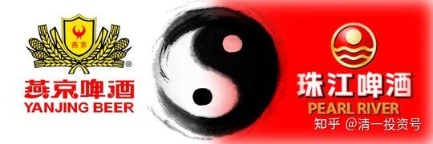
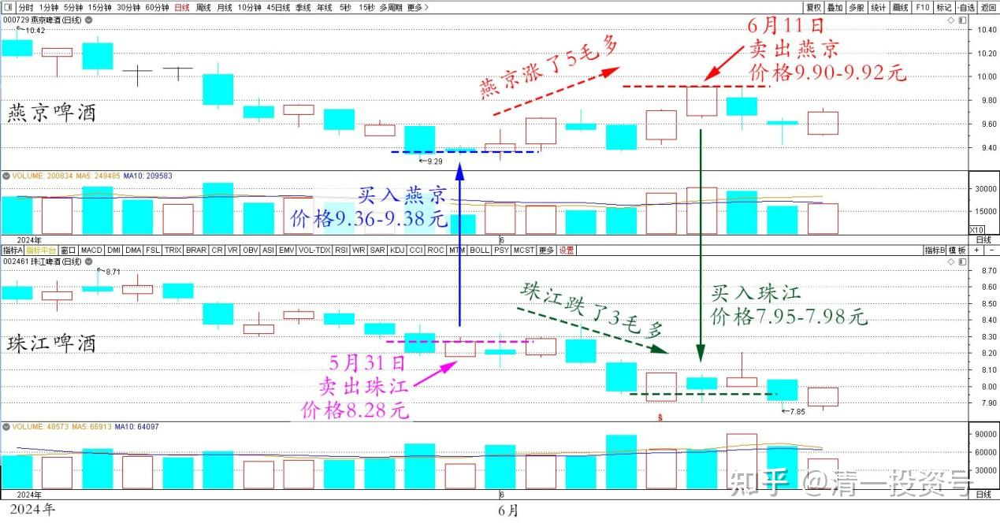

88篇.燕京、珠江轮动——增厚账面利润

清一山长2024年6月11日

今日操作记录：今天卖出了60万股燕京啤酒，卖出价9.90～9.92元。买入了珠江啤酒，买入价7.95～7.98元。这些燕京，就是5月31日买进来的头寸。当时是卖出8.28元的珠江，买入9.36～9.38元的燕京。现在燕京涨了5毛多钱，珠江跌了3毛多钱，加在一起，这笔跨股的T+0交易，每股多赚了8毛多钱。60万股——就赚了超过50万元了。

燕京啤酒和珠江啤酒2024年5月～6月日线图

据说这笔钱，已经超过现在很多银行的支行长的年薪了。对我来说——只是我在十几天来做T交易的反向补仓交易罢了。来回一趟，锁定利润。今年以来，已经多次做这种交易了，比如4月份做的很多这样的交易**。我一直在三大啤酒公司换来换去的，明显增厚了账面利润。其实——我啥实际的工作都没做，觉得自己真是寄生虫。所以一定要多做一定好事回报社会！**

上次这笔燕京的买入记录在这里：

[今天在某账户买入了60多万股燕京啤酒，价…](https://www.zhihu.com/pin/1779909317887143936)[山长 清一：今日操作记录](https://www.zhihu.com/pin/1783956881179435008)

（标题、图片为编者所加）

**文章音频**

[455篇.燕京珠江轮动--增厚账面利润](http://link.zhihu.com/?target=https%3A//www.ximalaya.com/sound/736751443)

**参考链接：**

[83篇.换股策略——高卖低买](https://zhuanlan.zhihu.com/p/698681371)

[84篇.赚股——卖出涨得好的，买入趴地下的](https://zhuanlan.zhihu.com/p/699932996)

[85篇.用涨了的天山铝业换没涨的中冶H](https://zhuanlan.zhihu.com/p/701250566)

[86篇.10元上下的啤酒操作](https://zhuanlan.zhihu.com/p/702432867)

[87篇.中国中冶的筹码分析](https://zhuanlan.zhihu.com/p/703727743)

