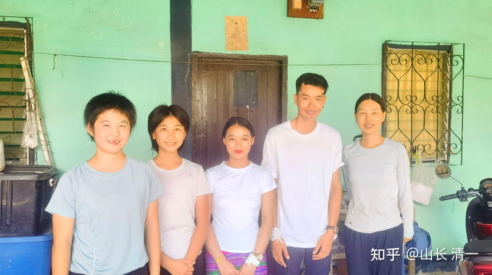
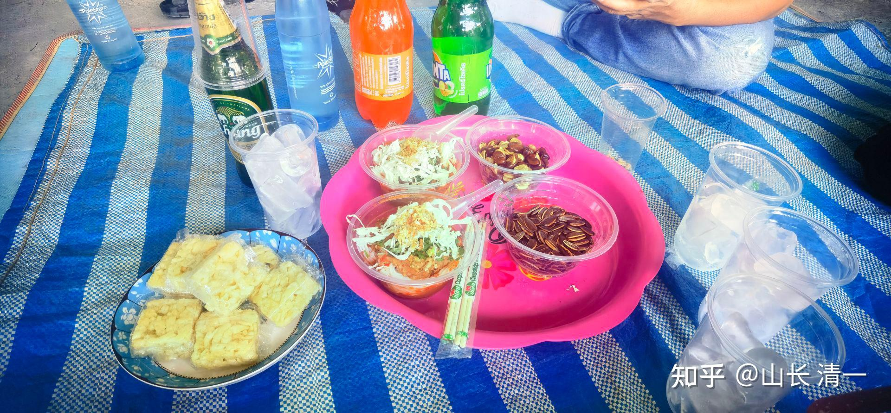

我们在泰国有两家公司，也有一群专属的建筑工人，长期为我们工作。这几年一直在为我们建房子！最近老工头的儿子小工头找我们说自己结婚，要请假！并说泰国结婚有三天时间，但他只请假一天，其他两天还是来工地干活。

这是我们第一次遇到泰国工人结婚的事情。我认为：是不是这些工人想多赚点钱？所以连结婚都不休息？因为他们的工资是按天考勤并结算的。我就跟管理这些泰国人的助理宋老师说：你告诉他可以休息三天。不用急于上班。另外让宋老师带礼金去看看新人，特别是给新娘送一点礼物，因为她要支持丈夫的工作。

结果宋老师去后，完全出乎我们的想象：她们的婚礼，就是亲人祝福一下。根本没有【操办】的痕迹。不过这也不奇怪，我们这代人，几十年前也一样，当年大学毕业后结婚，也这样简单。几个同事简单聚聚，家里做做饭，连餐馆都没有去。就这样被子抱在一起就结婚了。简单温馨。现在的国人，一个结婚把自己弄得人仰马翻的。而且离婚率还特别高。不知道时代是进步了，还是退步了！

我带两个孩子，暑假都要结婚了。不过我和孩子都决定不办婚礼，不去折腾亲友。就让孩子们自己决定安排，孩子们的想法是去旅游结婚！不想大操大办！

的确婚姻是自己和家族的事情。干嘛去用折腾一大堆别人的方式来折腾自己。不如把这些时间精力用来好好工作，把 这些胡乱浪费的金钱，用在改善自己的生活品质，没必要交给婚庆公司和饭店旅馆去。大道至简，但人就是喜欢玩复杂的。自己都不知道自己在搞什么！

以下是我的泰国事务助理宋老师去参加婚礼后的回报

伙伴们好，昨天去参加了工头儿子WEN的婚礼，公主班推选田雨菲和陈子璇与我同去。因昨天需要采购，所以阿伦也一块儿去了。

我们去的是新娘子的家，原来大泰国人结婚先在娘家办，新郎要在新娘家待3天，然后才把新娘带回自己的家。一到目的地，新郎和新娘就出来迎接，让人惊诧的是，两位新人着装非常朴素，两人都穿着纯白的短袖T恤，新郎穿黑裤子，新娘穿颜色较为鲜艳的条纹长筒裙，衣服的品质看着比较廉价。宾客只有双方家庭成员，我们是唯一的外来客人。

听工头介绍，上午新郎一家来到新娘家，给娘家父母送来5万泰铢的彩礼，结婚仪式就是双方家庭成员按照从老到小的顺序，轮流给两位新人在手腕上帮一根白色的绵绳。有人会在新人前面的银钵里放上一百到几百泰铢，没钱的可以不放。我们这次送了5000泰铢，对他们而言应属“豪华大礼”，考虑礼金是给夫妻双方的，所以没有按之前计划（新郎3000新娘2000）的给，而是一起放进银钵，还配了一个有中国特色的红包，上面用中泰双语写了祝福语（红包是佳惠提供的，祝福语是佳惠帮忙写的[表情]）。但我给新娘准备了额外的礼物——一条紫水晶串珠手链，新娘颇为惊喜。我表扬了新娘漂亮可爱，也在新娘面前大大称赞了新郎，给足了新郎一家人的面子。

*中间的新人：没有表演，就是简单过生活*

新娘家招待婚礼的食物也超简单，跟中国的酒席大相径庭，每人只是一碗传统米线，里面除了米线还有一块鸡肉和一块猪血，两个孩子和阿伦都吃了米线，我跟工头说我吃过了，不吃他也能够理解；待客的点心是：炒瓜子、炸蚕豆、沙琪玛；饮料是：雪碧可乐；看到有男客人，也会拿出一瓶象牌冰啤酒，因阿伦还要开车，所以没喝。这就是婚礼宴席的全部内容了。

*泰国的婚宴就是这样的*

在那里，我们见到了工头的家人，工头有四个孩子，都已开始自立，最让人印象深刻的是工头的母亲，老人85岁，满头黑发，皮肤润泽，精神矍铄。一开始，两个小公主还以为老人染了头发，后经确认，没有被染过。问起老人的饮食生活，发现长寿老人都有一些共同的特点，如：乐善好施，心态平和，饮食有节，喜欢劳作。

我们待了一小会儿，看大家只是坐着，也没有其他安排，就打算离开了。走之前说想跟新郎新娘合个影，结果新娘却找不到了，后来新娘的姐姐告诉我们，她出去买米线了，因为米线没有了。这也让我们觉得挺惊讶的，中国人结婚，没听说东西缺了需要新娘出去买的。

最有意思的是，结婚前一天，在听了山长的建议后我跟WEN说，教授让我给他放3天带薪婚假，他很感谢，但说不用休息3天，1天就够了。下午找工头谈事时，我跟工头也说了此事，工头说，WEN告诉他了，但他觉得我们对他很好，所以他不想休息太久。结婚当天，阿伦也跟WEN聊天，问他计划结婚第二天做什么，WEN回答要回麦当上班（因为在家也只是坐着，什么价值也没创造，不如出去工作更有意思）。结果今天一早，下着很大的雨，工头和WEN，以及工头的弟弟，一起都来上班了。老板主动给带薪假期都不要，这种情况，在中国应该也很少见。经确认，WEN确实是一个实在人。

以上是参加这次大泰国人婚礼的见闻，汇报给老师和伙伴们了解：