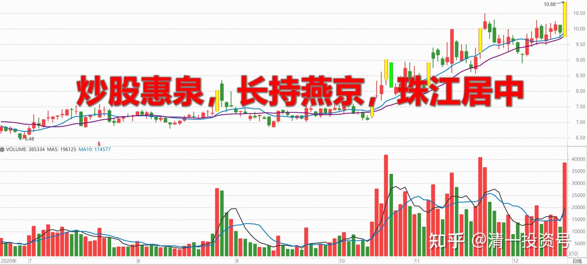
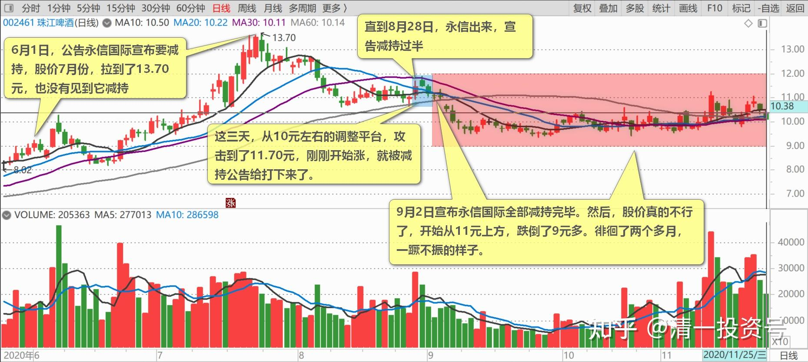
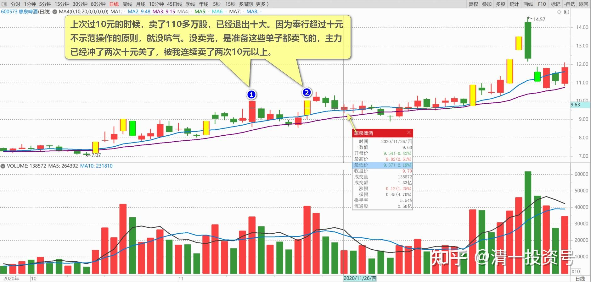
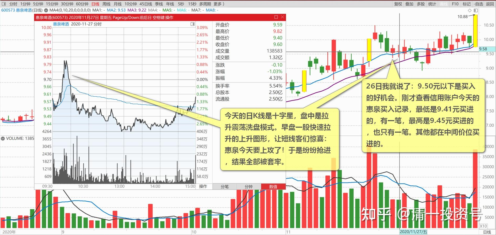
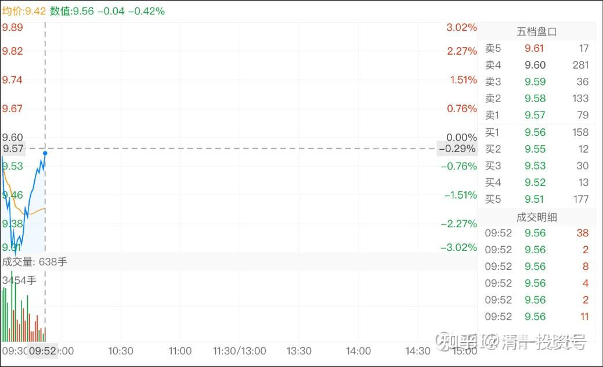
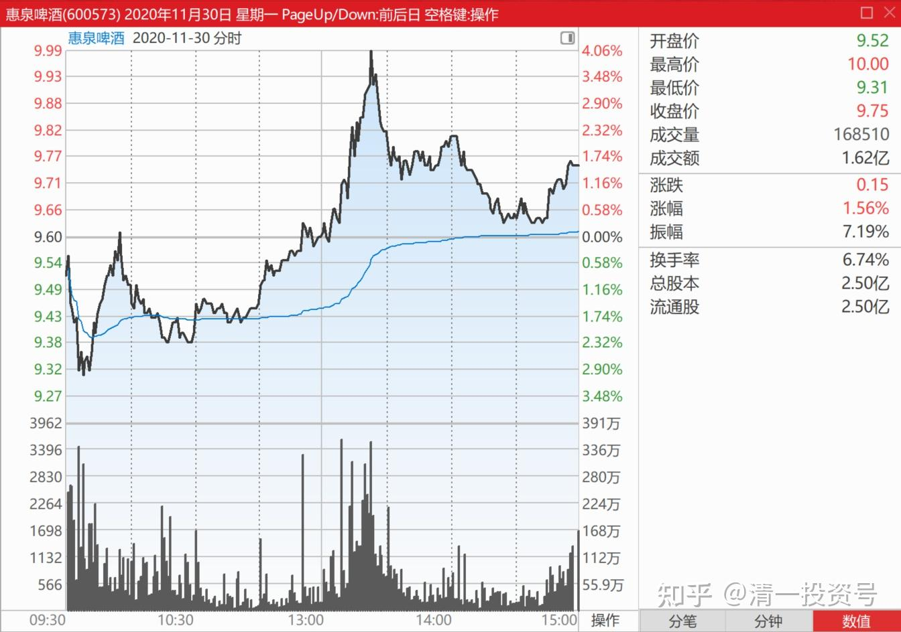

69篇.炒股惠泉，长持燕京，珠江居中

清一山长2020年11月24日

**一、主力的司马昭之心**

2020年11月24日《战鼓擂！啤酒市场群雄争霸，谁领风骚？》[网页链接](http://link.zhihu.com/?target=https%3A//finance.sina.com.cn/stock/hkstock/ggscyd/2020-11-25/doc-iiznezxs3492772.shtml)

清一山长2020-11-25 09:52评论上文

【啤酒花的供应有63.56%依靠进口满足。若进口因为国外疫情而暂缓，导致啤酒原料的供应未能跟上需求的增长，或令原材料成本大涨，而蚕食这些啤酒企业的毛利率。有鉴于此，大资本见好就收之举实属合情合理。】

关键词是：**小散们，见好就收吧！已经给钱赚了，还不走！**[大笑][大笑][大笑][大笑]

**主力的司马昭之心**！

清一山长2020-11-25 12:29:41

[$珠江啤酒(SZ002461)$](http://link.zhihu.com/?target=http%3A//xueqiu.com/S/SZ002461) 珠江的减持，很蹊跷！6月1日，公告永信国际宣布要减持，却迟迟未动手。此时股价在9元左右。公告三次，未见实际减持行为，股价7月份，拉到了13.70元，也没有见到它减持。直到8月28日，永信出来，宣告减持过半。这一天，珠江看上去调整完毕，正在恢复性上涨，涨到了11元上方。结果减持公告就出来了，这三天，从10元左右的调整平台，攻击到了11.70元，刚刚开始涨，就被减持公告给打下来了。9月2日宣布永信国际全部减持完毕。然后，股价真的不行了，开始从11元上方，跌倒了9元多。徘徊了两个多月，一蹶不振的样子。

好容易调整差不多了，技术上珠江最近重新进入上升通道了。结果又再发减持公告。我就弄不懂了：

第一，上次永信减持1200万股，说是“减持完毕了”。现在出来又拿永信“一致行动人”说事，总共减持了2200万股。啥意思？见不得珠江涨吗[大笑]？

第二：永信的人都是傻子吗？看不懂技术指标吗？才刚刚恢复上升通道就要急乎乎地跑出来减持？慢一点行动，走出了上涨通道，多卖个几千万不好吗？

**所以，啤酒股的盘面上，透出的都是怪异！主力动向，控股股东动向，似乎都在警告各位：别冲过11元，不然老子要减持了。**

燕京，重阳减持了一个多亿股，都没把股价打下来。珠江就这两千万多股，算个毛呀？两个股盘子一样的。

但诡异的是：似乎这两千多万股，真的把珠江给压趴了。真搞笑！就像上次的永信就1200万股，就把珠江压得大跌20%多，还两三个月动弹不得！珠江真弱鸡呀！

作为前珠江十大股东，现在依然持有两M多万股的小股东，我对这些大股东的言行表示不解！对市场的这种怪异行为表示不解[俏皮]

不过，我不在乎你们继续打压珠江。我的持仓成本才1.62元，我相信没几个人比我更低，也没几个自然人持股比我更多。**我涨跌无心，都可以接受！我就坚持长期持有，与广州国资委第一大股东一起坚持“守护珠江，捍卫珠江”，直到珠江变重庆啤酒，我才考虑变心！**[俏皮]

**二、不可思议的价格**

清一山长2020-11-26 11:30:57

[$惠泉啤酒(SH600573)$](http://link.zhihu.com/?target=http%3A//xueqiu.com/S/SH600573) **不可思议。我今天居然买到了9.37元的惠泉**[赚大了]。是今天的最低价（也许下午还破这个价？），现在已经重新回到第三大股东位置了，但股份还没有恢复原位，还差大几十万股，看机会再补。真不好意思，这个月都退出三次十大了，每次又给我机会再回原来的位置。惠泉总挽留我，不好意思不回头呀！

上次过10元的时候，卖了110多万股，已经退出十大。因为奉行超过十元不示范操作的原则，就没吭气。没卖完，是准备这些单子都卖飞的，主力已经冲了两次十元关了，被我连续卖了两次10元以上，难道还继续调整回9元，让我在继续拣货吗？没这么好心的吧？心想卖飞了，就去捡燕京去，舍掉惠泉算了。没想到，才几天就跌回来了。惠泉的主力很大方[很赞]，赏钱多多的。

我个人认为：惠泉重新跌破9元的可能性不大。这一次回调的极限价格，应该在9.3元以上。到了9.30元至9.50元，捡回来都是可以接受的。所以，今天跌破9.5元，我当然就买买买了。但为了不引起主力关注，我每次单子就是一两万股。盘面上也没多少可以买的货，慢慢攒股。然后等涨停价就一次性批发给主力，每单一百万[大笑]。我就赚点辛苦钱，就当替主力打小工，帮主力收购零散筹码了。

[欢乐马6l6](http://link.zhihu.com/?target=http%3A//xueqiu.com/n/%25E6%25AC%25A2%25E4%25B9%2590%25E9%25A9%25AC6l6)回复[清一山长](http://link.zhihu.com/?target=http%3A//xueqiu.com/n/%25E6%25B8%2585%25E4%25B8%2580%25E5%25B1%25B1%25E9%2595%25BF)：（跟评上贴）

山长不怕主力看到你的操作，故意反向一下么？

清一山长回复[欢乐马6l6](http://link.zhihu.com/?target=http%3A//xueqiu.com/n/%25E6%25AC%25A2%25E4%25B9%2590%25E9%25A9%25AC6l6)：

怕呀！我好怕主力。**只要看到主力反向，我也赶快反向逃。**只要跟主力的方向相反，逃远一点就安全了。假如主力继续打压，真破了9元，我就反向继续多买一点。**主力拉涨，我就反向逃走。**

就是因为太怕主力了，养成了惊弓之鸟的习惯。不像你们特别喜欢跟主力交朋友。我就不敢想，可以跟主力坐在一个桌子上舒舒服服地吃大餐，只敢远远地看着，主力来了，我就赶快退走。主力要走，我就捡回来！[大笑]

**三、惠泉的股性特别活**

清一山长2020-11-27 15:23:03

[$惠泉啤酒(SH600573)$](http://link.zhihu.com/?target=http%3A//xueqiu.com/S/SH600573) 盘后点评**：今天的日K线是十字星，盘中是拉升震荡洗盘模式。早盘一股快速拉升的上升图形，**让短线客们惊喜：惠泉今天要上攻了！于是纷纷抢进，结果全部被套牢。这种虚晃一枪，对于主力的成本没有太大的关系。但早盘拉升买进来的筹码，已经通过下跌消化掉了。应该没有亏钱，但也谈不上赚钱。就是拉了几个追高的伙伴帮着一起站岗，免得成为未来拉升中的T族增加成本。**后面一整天，就是打压吃货了。**主力的吃货区，就是9.5元以下，9.40元以上的区域。我也跟着买了几十万股，基本上买回我这次卖掉的股份了。昨天我就说了：9.50元以下是买入的好机会。刚才查看信用账户今天的惠泉买入记录，最低是9.41元买进的，有一笔，最高是9.45元买进的，也只有一笔。其他都在中间价位买进的。总持仓成本是负的0.196元，快接近零成本了。比珠江还低（珠江总持仓成本是1.698元）。两只股，都持有百万股级。目前的珠江数量要更多一些[赚大了]。

**惠泉的股性特别活。喜欢炒股的，应该炒惠泉。喜欢长持的，应该拿燕京。珠江居中，有时候激进，有时候温吞。**

清一山长2020-11-30 09:53:33

[$惠泉啤酒(SH600573)$](http://link.zhihu.com/?target=http%3A//xueqiu.com/S/SH600573) 这种开盘，就是说：今天要涨的[笑]，下午看对不对吧！

(标题、图片为编者所加)

**文章音频**：

[458篇.炒股惠泉，长持燕京，珠江居中](http://link.zhihu.com/?target=https%3A//www.ximalaya.com/sound/738770021)

**参考链接：**

[61篇.顺鑫农业记录七——机构坐庄三招：养、套、杀](https://zhuanlan.zhihu.com/p/556331421)

[62篇.看一看典型的骗线](https://zhuanlan.zhihu.com/p/698011435)

[63篇.为啥我认为是假出货](https://zhuanlan.zhihu.com/p/699291708)

[64篇.看懂长牛股的走势](https://zhuanlan.zhihu.com/p/700510263)

[65篇.多空交战依然没有完成](https://zhuanlan.zhihu.com/p/701863047)

[66篇.讲鬼故事还是真减持](https://zhuanlan.zhihu.com/p/703026413)

[67篇.开盘这十分钟，才是最重要的时刻](https://zhuanlan.zhihu.com/p/704358659)

[68篇.中国的啤酒迟早会赚钱](https://zhuanlan.zhihu.com/p/705635827)