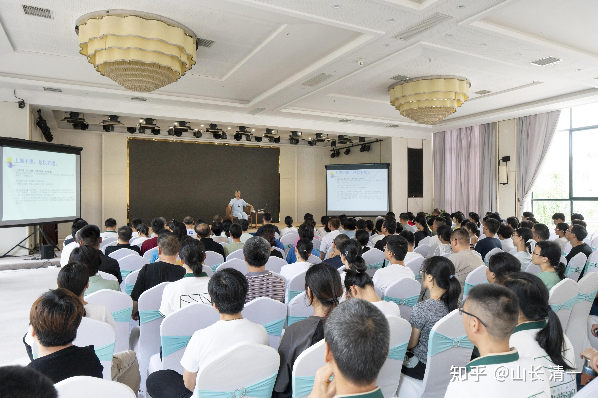
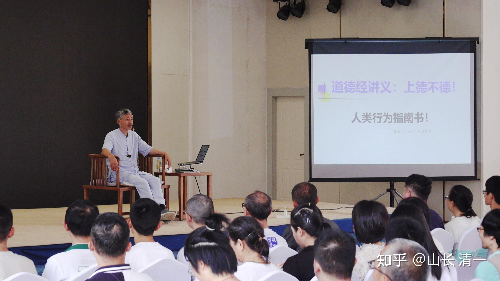
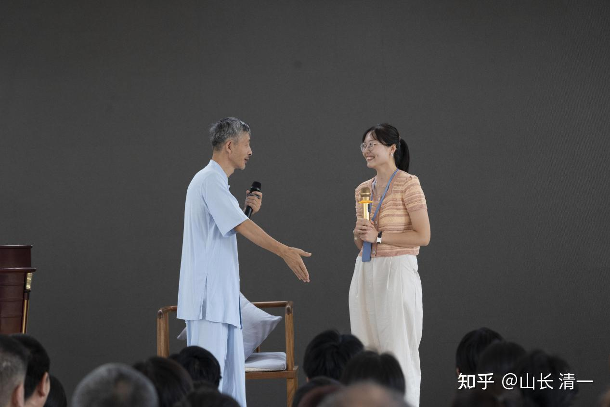
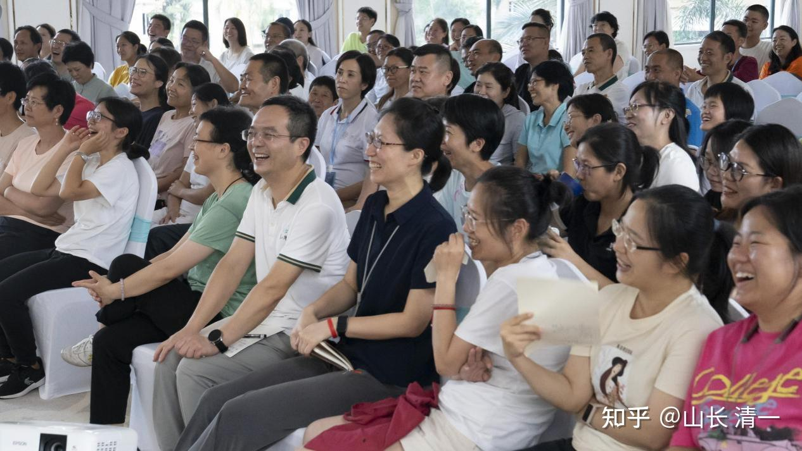

自山长上一次讲道德经起，已经过了十几年了。当时虽然很受欢迎，但总是因为各种原因被终止。现在，在摩丁的清粉社区，山长又重新开始了讲解道德经的国学讲堂！

本来，山长的培训课都是不对外开放的，特别是讲道德经的这种高级课程，连内部的学生都没怎么听过。所以清粉们都非常珍惜这次机会，纷纷从国内各地赶来。有的学员为了听课，当天上午坐飞机赶到现场；有的学员干脆就在摩丁长住；还有很多财富课的学员，在课程结束后也一定要听完山长的国学讲堂再走。就这样，一个小小的摩丁，每周六下午都会有一百几十号人聚在这里一起学习听讲。

道德经分为“道经”和“德经”两部。道经讲的是道家做事的基本原则，德经则讲的是如何实操。这次山长主要从“德经”开始讲起，教我们把道德经的智慧 运用到财富、教育和生活中。第一节和第二节课，讲的就是德经的第一章（第38章）的前几句话。先给大家看看原文：

上德不德，是以有德；下德不失德，是以无德。上德无为，而无以为也。上仁为之，而无以为也。上义为之，而有以为也。上礼为之而莫之应也，则攘臂而扔之。故失道而後德，失德而後仁，失仁而後義，失義而後禮。夫禮者，忠信之薄而乱之首。

这一段话，大家能看懂是什么意思吗？是否能做得出来山长布置的课程作业呢？

[https://zhuanlan.zhihu.com/p/707141919](https://zhuanlan.zhihu.com/p/707141919)

想必大家看到原文就已经懵了吧？看到苏辙的解释后，可能就更懵了。不过没关系，因为苏辙虽然文采很好，但他对道德经其实也是一知半解，要么在玩文字游戏，要么是用儒家来解释道家。而山长的解释就更落地多了。不过，这种更加实在的解释 大家是否能够听懂呢？比如，山长竟然说，一个杀人的人其实背后是上德、最厉害的学习方法就是不学习。到底是为什么，就一起来看看下面的讲解吧。

**一、上德不德，是以有德，下德不失德，是以无德。上德无为而无以为，下德为之，而有以为。**

**上德不德的第一层意思是：上德的人，心中自然是有德的，所以不需要刻意去做也会自动有德。而下德的人，心中其实没有真正的德，只是外界告诉他这样做是对的，他认为自己应该这么做，所以会需要刻意去做那些“有德”的事情，尽量让自己“不失德”。**

比如，以“善待他人”为例。上德的人会觉得 对所有人好是理所当然，有什么好东西自然就送给别人了，甚至都不会想到自己是在善待他人。而下德之人，心中原本并没有帮助别人的心，但因为外界的观念告诉他这么做是对的，所以才去帮助别人。

因此，由于不是出于内心真实的想法，所以下德之人也会更纠结。比如在送别人东西的时候，下德之人就会觉得“送了别人我就没有了”，但为了“不失德”还是会去送，虽然比完全无德的人要好，但也只能称为下德。

**上德不德的第二层意思是：上德之人做出的行为，往往和没有道德的人很像，甚至外表上看不出区别来。而下德的人，可能看起来做的事情是“有德”的，但其实并不是最高级的德。因为下德的人心中无德，他们为了“不失德”就需要刻意用表面的行为来表现自己的德。而上德的人心中自然有德，因此并不需要一个固定的规则和行为。甚至很多时候做的事情都在规矩之外，但背后其实才是最大的德。**

比如，有这么一个案例，一个老人在他儿子睡觉的时候，拿锤子把儿子给敲死了。他的行为，大家应该觉得是“大不德”吧？

但这个事情的背景其实是这样的：他的儿子是个混混，干尽各种坏事。老人觉得自己年纪大了，死后留下这个儿子对不起社会，才决定在死之前除此一害。结束后他就在家里等着公安局来抓他坐牢，结果整个村都为他求情，觉得他不是坏人。那么，就算最后法律可能还是会判他入刑，你能说他不德吗？比起说‘我要守住道德，我作为父亲要照顾他’，哪个更好一些呢？

但他的这个行为，跟存心想要害人的人很像。甚至如果你只看表面，就会觉得这个人怎么这么坏，一点都没有道德。所以上德和无德很像，这就是上德不德的更深一层含义。

**带着这个思路，道德经可以运用到生活的任何地方，比如用到教育上，就是“上教不教”；用到关系里，是“上爱不爱”；用到事业上，是“上业不业”；甚至用在整个人生中，就是“上活不活”。**

**为了让大家更好的理解和思考，山长在课堂上会用问答和讨论的方式，让学员先讲出自己的理解，然后再指出其中的问题和漏洞。这样才能意识到自己和老师的差距，也才能有更大的收获。接下来就分享一个讲解“上学不学”的课堂实录：**

分析完“上德不德”之后，山长就让学员们用同样的逻辑再讲一个别的案例，大家一开始都陷入了沉默之中，过了好一阵子后，终于有一个学员上台发言了：

“我想讲的是“上学不学”。我认为上学就是，做什么事情都是发自内心的想学习，所以无时无刻都在找规律和学习。”

山长：“你这是把自以为领悟的道理，用鸡汤的方式说出来。你要去明白和尊重老祖宗的意思，既然说了上学不学，看上去一定是**不学**的状态。而你说的却是无时无刻都在学习，不觉得这样很累吗？就像衡水高中，上厕所跑步都拿着单词本，你认为那是上学？”

学员说：“我觉得衡水高中是下学。”

山长：“是的。不过下学也不错了，下学不失学，他虽然没有真学问真精神，但也不失为学。

于是学员想了想，又改变了自己原来的说法：“您说的我也认同。原来我自己见过那种上学的人，就是平时不怎么用功，但只要什么考试基本都能考的很好”

没想到山长又说：“那种人叫聪明吧，不叫上学。”

学员还想再证明一下自己的观点：“但他就能跟你讲明白，你有什么事情去问他，他都能告诉你这个规律、能够举一反三。”

山长说：“这是因为他聪明，不是因为他是上学。有些人聪明，他一下就能听懂；有些人笨一点就是搞不明白，这叫根器不一样。就像有一个人有一万块钱，有一个人只有一块钱，但是你能说前面那个人用钱看起来很有余，所以代表他会赚钱吗？学习也是一样的，这是学习能力的区别，但不是上学下学的关系，你不能从结果上看。”

学员疑惑：“那是看学习意愿吗？”

山长解释道：“上学的人，心中根本就没学的概念，根本不知道他在学，也没在想学不学的事情，但又达到了最高的学，这才是上学不学。”

“我讲一个”上教不教”的例子，给你点启发。

大家都知道清迈的GED班创了个记录。学生原来都是外围学堂 考不上三语高中的人，刚进去的时候做了一个摸底测试，成绩一塌糊涂。但两个月之后，考试不仅全通过了，还有好多都是优等。

那你问他是哪个老师教的？没老师！因为我干了件很奇特的事情：把三语高中文科班的学霸和考不上三语高中的GED班放在一起。我说你们根本不用教。你们就在一起，你怎么学他怎么学，你运动他运动，你吃饭他吃饭，这样混两个月就够了。别忘了，这些学霸都是很会学习、考试的。GED的学生有什么卡点，他们随便一答就行了，压根不用费劲，更不觉得自己是在“教”这些学生。

但你说我到底教了没教呢？你说没教吧，那肯定教了，他们如果不来绝对没有这个分数。你说教了吧，又没有老师。上等的教就是这种教，我给了外围学堂的学生跟学霸在一起学习的机会，他们就一下变成了很高的分数。”

这样一来，大家就开始理解什么是“上学不学”了。教和学是一体两面的，把这种方法反过来不就是上学不学了吗？比如明慧和Ella跟着山长转悠了四年，看起来没学什么东西，但玩着玩着就什么都学会了，现在在公主班融入的很好，一点也没落下。

但这样的教法、学法，普通人其实很难学会。因为你需要懂背后的道才能做到，不然就变成真的不教了。山长看起来没教，其实用的是更高级的方法在“教”。但如果让孩子跟着一个普通家长晃个四年，结果可能就是相反的了。因此才说它是“上教”，虽然行为上看和不教一样，但是又达到了最好的教的效果。

**现在回头来看苏辙的解释，就知道他其实大部分的解释都错了。**

苏解：“聖人縱心所欲不逾矩，非有意於德而德自足。其下知德之貴，勉強以求不失，蓋僅自完耳，而何德之有？”

“聖人縱心所欲不逾矩”，意思就是“圣人怎么做都不会违背规矩”。但我们刚才说过了，上德做的很多事情，都是在规矩之外的，甚至会和无德很像，怎么能说是“不逾矩”呢？。

“其下知德之貴，勉強以求不失，蓋僅自完耳，而何德之有？”意思是 下德是勉强遵守的德，所以根本谈不上道德。这么说又错了，下德虽然不是自动自发做到的德，但至少做到了“不失德”，所以起码称得上是个“下德”，跟完全的不德是两码事。假如上面讲到的那个老人，没把儿子杀死，而是尽心尽力的照顾儿子和邻居，你能说他就是无德吗？他跟一个冷漠、甚至因为私欲而把自己儿子杀死的人，还是不一样的。

1. **二.上德无为而无以为，下德为之而有以为。上仁为之而无以为，上义为之而有以为。上礼为之而莫之应，则攘臂而扔之。**

苏解：無為而有以為之，則猶有為也。唯無為而無以為之者，可謂無為矣。其下非為不成，然猶有以為之，非徒作而無衛者也……

看完原文，是不是又懵了？什么为不为的？不过苏辙明显也懵了，开始在玩文字游戏，用不同的方式又把同样的意思再表达了一遍。

其实，上德无为而无以为，意思并不复杂，就是上面所说的：真正的上德不会刻意做什么，甚至别人在外表上也看不出来他做了什么“德”，比如上等的教育看起来就像是什么都没教，这就叫做“无以为”。

**同样的，“上仁为之而无以为”，意思就是上仁很多时候也是看不出来的。**因为仁爱可以是无形的，很多时候别人看不见的爱往往才是真正的爱。比如最爱孩子的父母，会让孩子去受各种训练和折磨，甚至让他从小就离开自己的身边，到更好的地方去学习。看起来像是把他抛弃了，但其实是为了让孩子成为一个独立、优秀的人。而有些父母，看起来对孩子百依百顺，其实不是真正的爱，反而把孩子培养成了一个废物。

**但义就不一样了，“上义为之而有以为”。**义都是看得出来的，因为公正需要通过行动来呈现。比如在学堂里，山长的孩子跟其他学生没什么不同；老师吃的东西跟学生吃的东西没什么不同，这都是公平正义的体现。如果有些人的规则跟另一些人不一样，那就是不公平。

**最后：上礼为之而莫之应，则攘臂而扔之。**“礼”代表的是表面的礼节和面子，既然是礼节，那肯定要通过行为呈现，所以礼肯定也是看得出来的，而且还要在双方的互动中完成。如果一方表现了礼，但另一方却没有做出符合礼节的回应，那么就会引发争乱，也就是“攘臂而扔之”。

比如举一个例子，著名的“鸿门宴”中有一个大家熟知的片段：

项羽和刘邦在宴席中，樊哙突然破门而入，项羽按剑问道：“壮士何人？”，张良告诉他：“这是刘邦的侍卫，樊哙”。项羽看是刘邦的人，就命令下属拿一个猪肘给他。下属取来一个生猪肘，樊哙直接把它往盾牌上一放，就切来吃了。项羽连叫“壮士”，赐了他两碗酒。

但是，为什么樊哙吃的是生肉呢，有没有觉得有点奇怪？

其实，这就涉及到故事背后没有直接讲出来的部分了。樊哙作为侍卫，是不应该直接闯进营中的，这是一种非常失礼的表现。后面得到这块生肉，其实已经暗喻了对方的剑拔弩张。

项羽作为贵族之后，是一个高素质的人，不会当场发作。反而为了给客人面子，还让下属拿一个猪肘给他。但他的下属就不一样了，觉得“就你这种人，也有资格闯进来跟主公一起吃饭？”。他们今天本来就是打算要跟对手决一死战的，怎么会有好脸色、好东西给他？虽然君命不敢不从，但主公可没说这猪肘是要生的还是熟的，所以胡乱煎一下就拿上来了。

那樊哙直接吃下这块生肉代表什么？其实代表了他准备好赴死的勇气，不管给什么我都能吃下去。盾牌一翻、拿剑一砍就吃了。这种人你觉得好惹吗？如果真的打起来会怎么样？肯定是不惜一切的那种人。所以项羽有点顾忌，赶快夸他“壮士哉”，赐酒给他，把这个矛盾给平息下来。在此之后也更加谨慎，不敢掉以轻心，因为如此，刘邦才能撑久一点，找到“上厕所”的机会趁机离开。

但如果不是因为对方的谨慎，樊哙的无礼就必定引发一场争斗了，那块生肉就是明显的挑衅。这就是“上礼为之而莫之应，则攘臂而扔之”的含义。

**三、故失道而後德，失德而後仁，失仁而後義，失義而後禮。夫禮者，忠信之薄，而亂之首。**

道德仁义礼，其实指的是人们做事的五个层次。“道”指的是宇宙世间运行的规律，比如教育有教育的道，股市有股市的道，而德指的则是符合道的行为。“仁”指的是仁爱，“义”指的是公平正义，“礼”则是表面的礼节和面子。

这五个层次，是逐级往下的关系。如果一个行不通，就要往下一层。或者反过来说，前面做到了，才能逐步往上升级。

以【不偷东西】为例。上德之人知道世间有因果，如果拿了别人的东西，最后吃大亏的是自己，因此他很自然地就不会去偷。下德之人，只要你告诉他偷东西不好，他虽然不知道为什么，但也不会去偷。但这样的人只有极少数，对大多数人这一招都是不管用的。

对于次一级的学生，就要跟他讲仁爱、善良，用爱来启发他。告诉他 如果偷了别人的东西，别人会难受的，他就不会再偷了。

但如果他连仁也听不进去，就要跟他讲公平正义，也就是讲规则，约法三章。比如告诉他，偷东西是不公平不正义的行为，因为别人的东西是别人的，你要的话应该通过自己的努力去获取。而且规则定的也是不能偷东西，大家都是这么遵守的，这样他就不会去偷了。

但还有些孩子，连规则也不遵守，根本没有公平正义。单纯就是觉得：如果我偷东西，别人会觉得我不好，所以不去干。但如果没人看见的时候，他可能就会去偷了。如果别人发现了，他还不会承认是自己干的。对于这种人，就要用“强权”管控了，让他没有空子可钻，不敢违反规则，才有可能老实起来。实际上，很多孩子在小的时候就是这个层级，所以必须要严厉一些。等他懂得基本的礼、义了，再逐级上升。如果一开始就用“天道”“仁爱”的方式对待他，他大概率就变成一个无法无天的小坏蛋了……

三个小时的时间，转眼就过去了。课堂中有实际案例、有问答讨论，还有各式各样有趣的延伸，比如历史课、文学课等等。所以虽然课程已经超过了原定的两个小时，学员们都还完全没有意识到时间的流逝，反而觉得一下子就下课了，意犹未尽。期待下一次课程的到来！