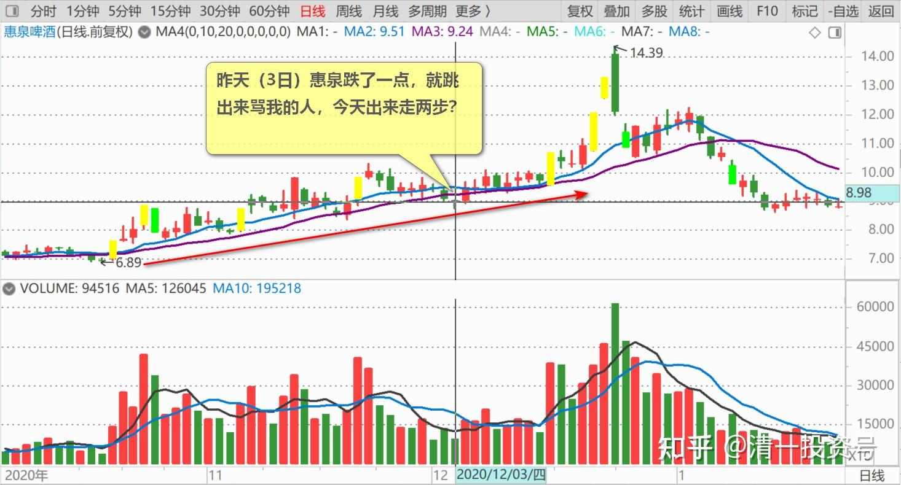
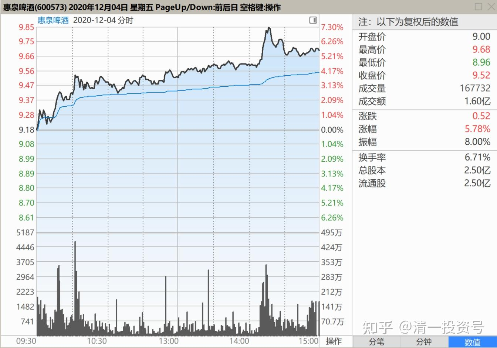
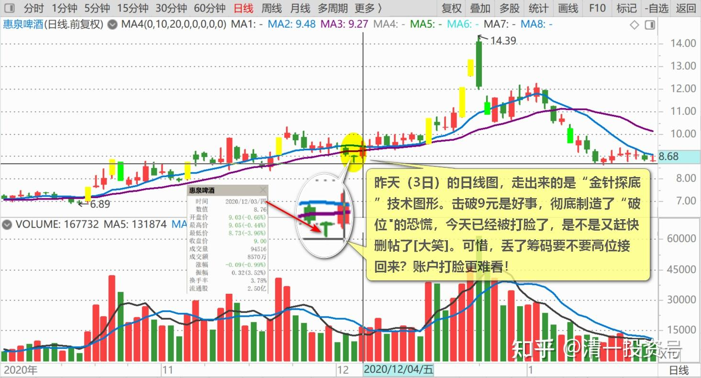
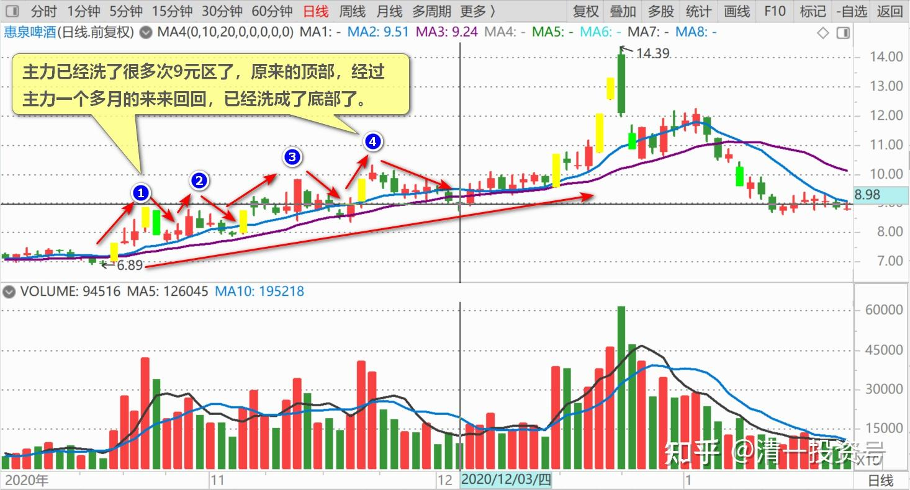

71篇.从不缺乏热闹，只缺乏理性

清一山长2020年12月4日

**一、中国的股市，从来不缺乏热闹，只缺乏理性**

[$惠泉啤酒(SH600573)$](http://link.zhihu.com/?target=http%3A//xueqiu.com/S/SH600573) **现在拉新高，其实不是好事。**我以为下午开盘才会拉的。居然一根20几万股拉上去了。**如果中午趴在9.5元下面，不发力，下午就好看了。**拜托不要冲过9.60元收午盘，现在还有9分钟，**看它上午怎么收盘，就知道下午怎么走了。**

昨天惠泉跌了一点，就跳出来骂我的人，今天出来走两步？[俏皮]。你们就是一群垃圾人！成天只会跟负能量共振。不懂尊重，没有智力、判断力就算了，还不懂最起码的修养和礼貌。我最喜欢拉黑垃圾人了。

不过，由于垃圾人实在太多，庄家也不喜欢我透盘。我分享干货，价值无限，还要被人骂，被主力羞辱（**主力肯定是看我说不会跌破9.3元，才故意破九的，这绝对不是他们的原计划。**主力用这句话告诉我：别乱猜了，他才是主人。他说多少，就是多少。我说了不算。昨天我不乖乖认输了吗？主力今天就拉升了。感谢主力昨天的教训和打赏[献花花]）。

所以，为了给主力面子（虽然主力昨天，是很不给我面子的，当众打我脸。但他给了我几十万股的小费，我就认怂算了，I服了YOU[俏皮]）。**惠泉应该很快过十元了，我就真的闭口不言了。**做人要会感恩，我拿了“主人”的赏钱，还“卖主求辱”，让一些垃圾人来泼污水。我就实在太不是东西了。**所以，惠泉10元以上，就让这些垃圾人、大神、“股神”们，出来秀你们的本事吧！很多投机客会一涌而至，装成他们才最懂惠泉，最了解惠泉，早就看好惠泉，还赚了很多钱的样子，啥啥啥的！**一群牛人会出来指点江山的，韭菜们不缺“高人指点”。**中国的股市，从来不缺乏热闹，只缺乏理性！**

**二、击破9元，制造“破位”恐慌**

[$惠泉啤酒(SH600573)$](http://link.zhihu.com/?target=http%3A//xueqiu.com/S/SH600573) **昨天的日线图，走出来的是“金针探底”技术图形。击破9元是好事，彻底制造了“破位"的恐慌，**不是就有人出来说：这趋势，要破8元才稳得住了。如果他持这种想法，肯定破9就赶快丢筹码，去8元下方等筹码了（你等燕京破8，还靠谱一些[俏皮]）。今天已经被打脸了，是不是又赶快删帖了[大笑]。可惜，丢了筹码要不要高位接回来？账户打脸更难看！

我写帖子，错了，对了，都不删帖的。话已经说出去了，就要负责的。错了，我就认错呗！我说不会破9.3元，昨天就是破了，我公开认错！我错了，谁也没来把我吃了。我又不是神，怎么可能每次都猜对？

我的确猜错了，但我错了，没关系的，甚至我的错误能够让我更多的赚钱。因为我不但不卖股，昨天还多买了50多万股。因为惠泉不能融资买入，为了筹这点钱，还让我忙活了一阵。如果能融资，买个一百万股都不费劲，额度还有很多空余的。上次融资买中建用满了的，但惠泉不是涨了吗？老白干也涨停再涨停，实在看不过去，我就卖了一两千万的现金出来，居然就犯糊涂，直接拿来还融资了。害得我这次买股，还要挪钱出来，用普通账户重新买进惠泉。

说实话：现在的惠泉，9元以下是很安全的。**主力已经洗了很多次9元区了，原来的顶部，经过主力一个多月的来来回回，已经洗成了底部了。**所以9元左右，大胆买进惠泉，吃不了亏的。（除非大市反转，惠泉不得不跟跌）。**未来惠泉的主战场，是10元上方，一定更精彩，更激烈。**我6元建仓惠泉，才一年，今天有幸超仓，满仓杀到了10元区，总持仓成本才三元多，真的很感恩这个市场，这个游戏很好玩。

感谢陪我玩惠泉游戏的所有人，包括清黑们！有你们，世界更精彩，股市更活跃，赚钱更轻松，更快乐！

(标题、图片为编者所加)

**文章音频**：

[462篇.从不缺乏热闹，只缺乏理性](http://link.zhihu.com/?target=https%3A//www.ximalaya.com/sound/741949125)

**参考链接：**

[65篇.多空交战依然没有完成](https://zhuanlan.zhihu.com/p/701863047)

[66篇.讲鬼故事还是真减持](https://zhuanlan.zhihu.com/p/703026413)

[67篇.开盘这十分钟，才是最重要的时刻](https://zhuanlan.zhihu.com/p/704358659)

[68篇.中国的啤酒迟早会赚钱](https://zhuanlan.zhihu.com/p/705635827)

[69篇.炒股惠泉，长持燕京，珠江居中](https://zhuanlan.zhihu.com/p/706901073)

[70篇.隔山观火，不投入情感](https://zhuanlan.zhihu.com/p/707564067)