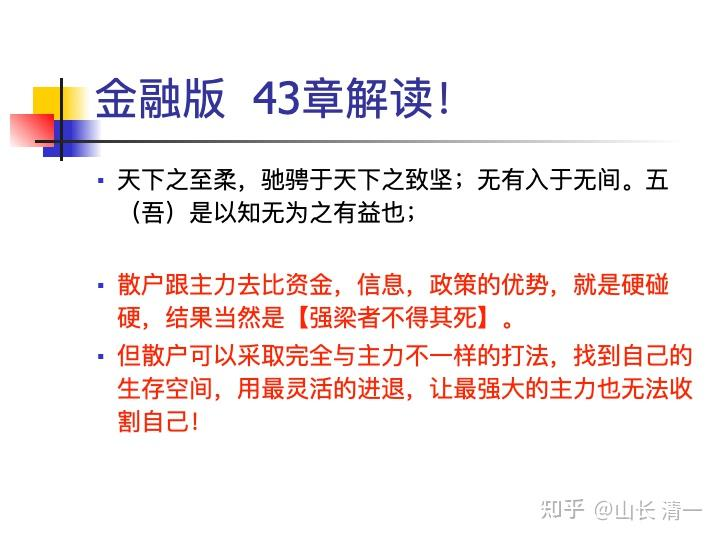

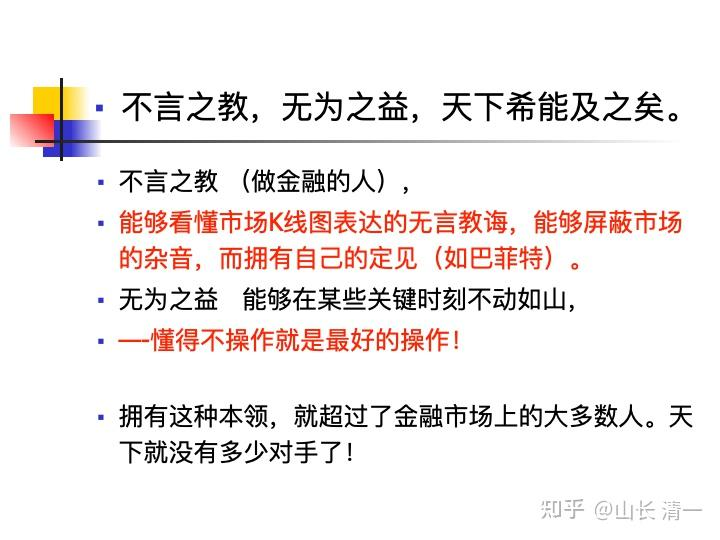

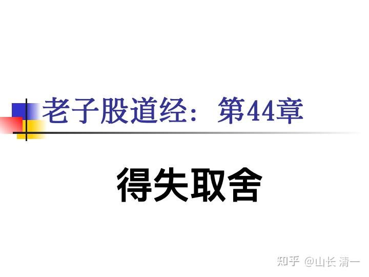

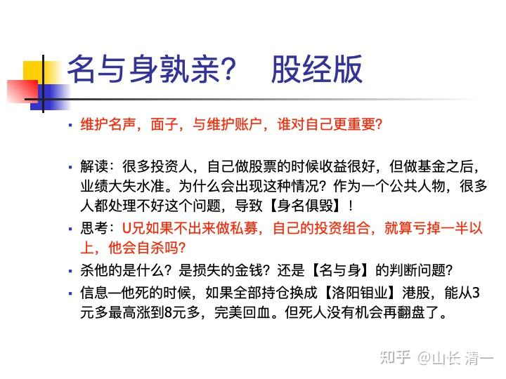

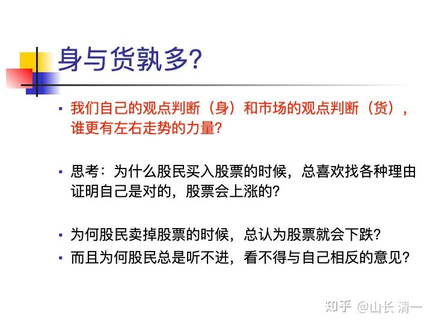

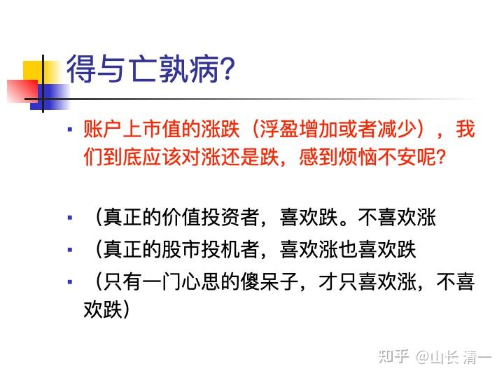

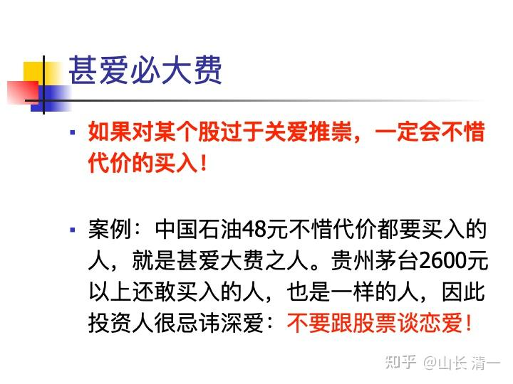

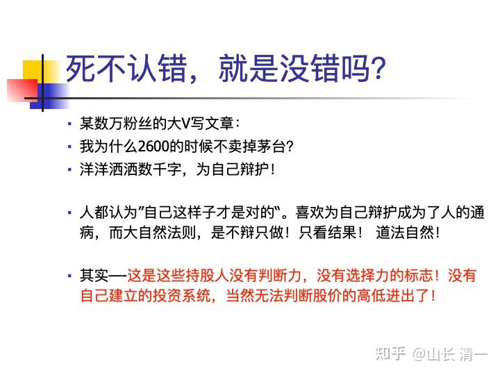

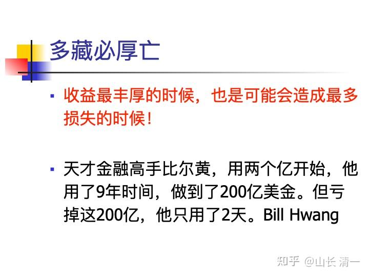

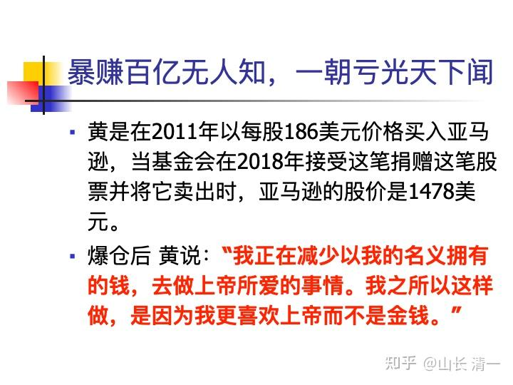

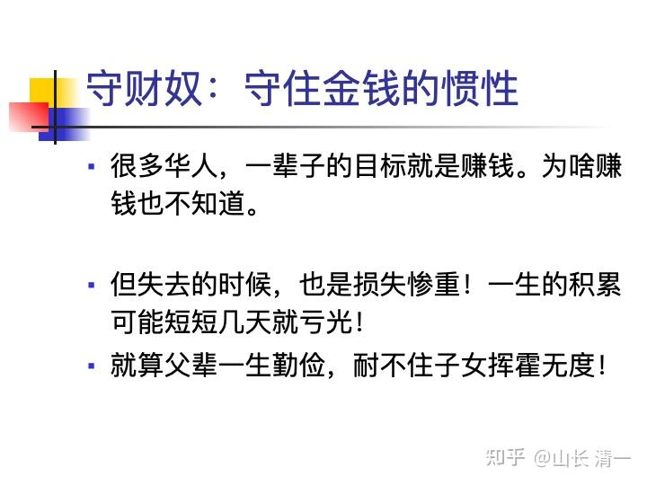

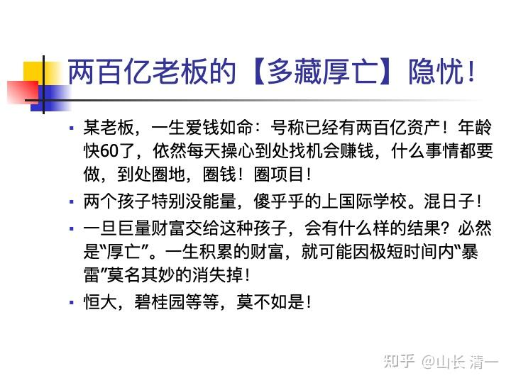

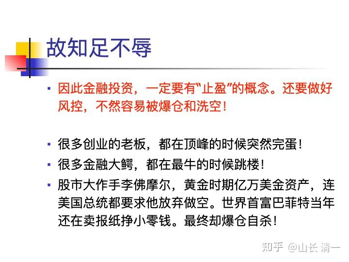

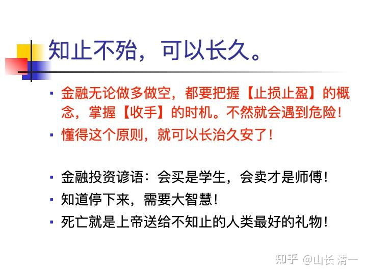

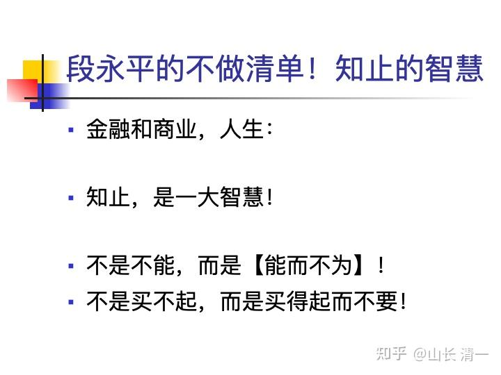

第45章老子股道经---将在8月10日磨丁蕙兰酒店开讲！请来客继续思考，研习。提前做好【股道经】，【教育经】，【生活经】的解读！

大成若缺，其用不弊。大盈若冲②，其用不穷。大直若屈③，大巧若拙，大辩若讷④。静胜躁，寒胜热⑤。清静为天下正⑥。

帛书版：

大成若缺，其用不敝；大盈若盅，其用不窘。大直如诎，大巧如拙，大赢如（肭），躁胜寒，靓胜炅（静胜热），请靓（清静）可以为天下正。

9（通行本45）

天下有道，却走马以粪；天下无道，戎马生于郊。罪莫大于可欲，祸莫大于不知足，咎莫于欲得。故知足之足，恒足矣。