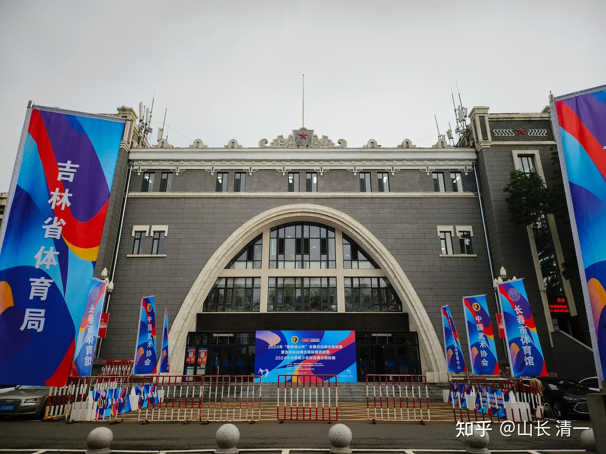
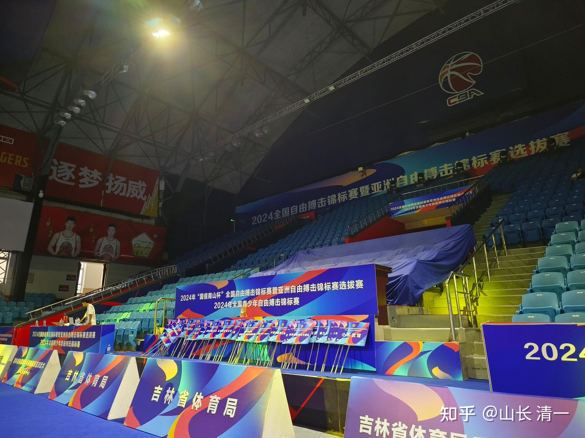
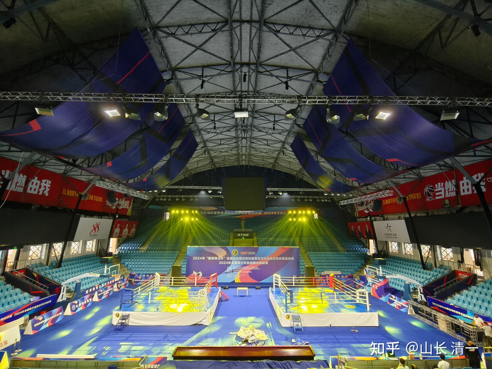

昨天拿到了比赛程序册。昨晚比赛抽签结束之后，我们清一战队的队员，忙于制定战术战略。由于谭木兰去年对阵明晓，不得不让位。加上ELLA去年意外战胜香港冠军，锁定了冠亚军决赛。谭木兰上次只拿到了去年泰拳锦标赛的铜牌，是老木兰们的最差战绩。甚至影响到了她参加今年的亚锦赛预选。但ELLA因为还不够成熟，所以放弃了亚洲赛的名额。我们只派去年获得了冠军的拳手去参加国际赛事！今年的k1赛事，抽签中发现，谭木兰打完对手之后，要对阵的半决赛对手是ELLA。ELLA可以退赛弃权，让谭木兰获取总决赛资格。我们预期谭木兰将要遇到的决赛对手，是去年的自由搏击锦标赛冠军耿春蕾。搜索中还发现了她参加昆仑决的比赛视频，是一个打法凶猛，敢打敢拼的老资格拳手。今年她选择继续参赛，可能是想要获取亚锦赛和世锦标赛的资格赛关系。所以，这一届木兰们需要面对的拳手，应该都是中国国内的顶尖拳手，目标都是国际顶尖赛事！（本届比赛各级别的冠亚军，可以入选中国的国家自由搏击队，去参加亚洲锦标赛。并争夺明年世界运动会的入选资格（仅次于奥运会的顶尖世界级大型比赛，将在成都举行，中国首次举办）。

我在程序册中看到：上海体院的李建文，就是网传的打过普京的保镖，打过俄罗斯特种兵的【中南海保镖】的传奇人物。这次作为裁判技术官，也参加了这次的锦标赛！看我们有无机会跟他聊聊武术发展！

与去年的泰拳全国锦标赛不一样，上次没什么高级别的官员出席比赛。这一次程序册上，武术中心的最高主官正厅级干部出席会议，一大批高级官员出席。还有当地的省级官员出席。全国各地的省队纷纷出现。看样子这是一场国家层面很重视的赛事。国内的几个对国际参加的格斗赛事，基本上都是k1规则的比赛。即使是泰国拳手来中国比赛，也是要求用K1规则，而不是泰拳规则比赛。只是人们一般不懂，以为泰拳手来就是打泰拳的。其实泰国人来中国比赛，基本上是打k1规则的，不能使用泰拳规则。所以---我估计这就是国家体育总局非常重视自由搏击锦标赛，而有点忽略泰拳锦标赛的原因了。从参加人数来看，也是这次自由搏击锦标赛的参赛人数，远远超过泰拳锦标赛！竞争对手也非常的剧烈。据说----国内的散打高手，想要进入职业拳赛，打昆仑决啥的，必须先拿到自由搏击锦标赛的前三名才有机会。所以有信心吃职业拳手饭的散打队员，就会转向训练自由搏击来参赛。这次比赛，显然对木兰们是一个重大的考验-----国内的顶尖高手都会出现在赛场上！

*比赛现场*

*馆内看台*

*比赛现场！*

这次参加比赛的人很多，总人数可能超过600了！仅仅成人组就有255人（青少年组的名单还没有看到）

吉林省省队，派出了20多人的强大队伍来参赛。上海体院也派了不少队员过来，怪不得李建平会出现！陕西省青奥训练基地，也派出了20多人的队伍，这几只国家队的正规军，是木兰们的主要对手。其他一些地方武馆，估计是私人的，有些只有一两个人参赛。清一战队（今日冠名的队伍）总共有20多人参赛，除了这些大牌的，国家出钱的省队级别的搏击队以外，我们是派出队员最多的。我预计是将来拿到奖牌和金牌数量最多的（可能有点狂妄。一旦比赛中实现这个目标，我们击败了几个省队，上海体院这种国家队（全国招生）的队员，拿到奖牌之后，国家体育总局一定会看中我们这批黑马！业余击败专业，一定会让全国武术界震惊的！

18年拿到4四枚金牌，去年拿了一枚金牌的塔沟武校，没想到今年居然缺席了，没有来！另外，大名鼎鼎的【邱建良搏击俱乐部】也参赛了，不过队员人数也很少，只派出了3名队员参赛。其中有一个52公斤的队员，有可能会和我们的木兰交手。是Ella和谭木兰的可能对手，看此人能否赢得第一轮的比赛！她要经过两轮考验，击败对手后才有机会跟我们打。她在半决赛中的对手应该会遇到上届冠军耿春蕾，本次代表上海队参加比赛。赢了耿，才有资格遇到我们打决赛----不知道邱建良的徒弟能过这一关不？过了就是中国的拳王邱建良教出来的弟子，对阵武术界业余票友张清一的弟子，肯定很好玩。这一级别的半决赛，小组抽签的结果ELLA和谭木兰都在同一个小组，她们在首轮战胜对手后，就会碰在一起进行半决赛。其中的赢家，将获得冠军的决赛权。所以，一旦在半决赛中，两人遇到了不会同门相残。ELLA将服从我的命令，乖乖的弃权去拿铜牌，让谭木兰保存体力出线去决赛，与中国最顶尖的专业高手决战金牌！这样我们的胜率会大一些（毕竟ELLA的比赛经验远远不如谭木兰）。最终，看谁才是该级别的顶尖高手！

由于参赛人数众多，每天的上午下午晚上，都安排了比赛！今天木兰们将打完【轻接触规则】的比赛，决出该规则下的所有奖牌。我们有六名队员，参加这个规则两个级别的比赛，如果想要获取冠军，今天一天，就要连续打三场比赛。首场是淘汰赛，赢家才有资格进入半决赛连续打第二场比赛。如果在半决赛赢了对手，赢家就要马上打第三场比赛，而且是最高难度的决赛！与对手争夺金牌。所以今天的比赛密度很大！强度也超过一般人。体能不够的人，估计打到决赛都会体力透支，虚脱了！我们今天这两个级别的比赛有六人参加，我要求木兰们保底要拿到金银铜各一枚奖牌，这不算贪心吧？晚上就知道最终的结果了！也许有意外的惊喜！

到8月29日比赛结束的时候，我希望从全国武术的顶尖专业拳手盛会中，争取拿到总共六个金牌，以及总共拿到20个奖牌和证书，一旦实现，我们将成为本次大赛的最大赢家，诸位看我吹的牛是否能够兑现了。今晚先兑现一枚金牌！