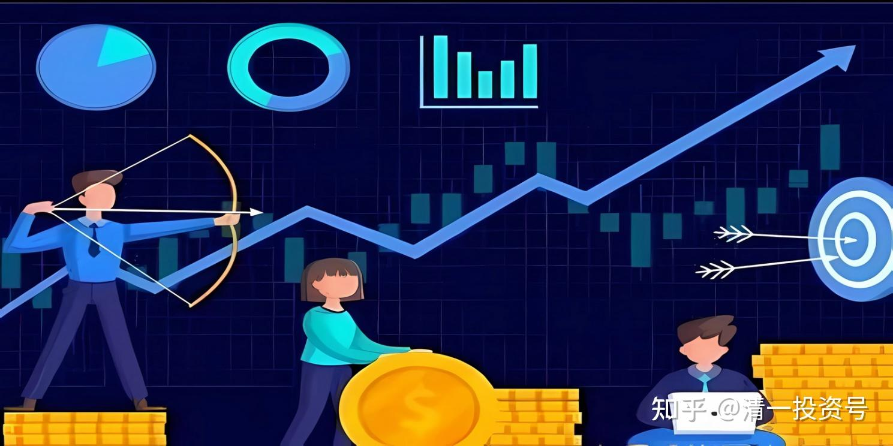
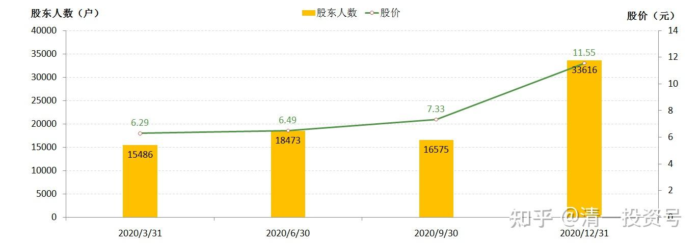
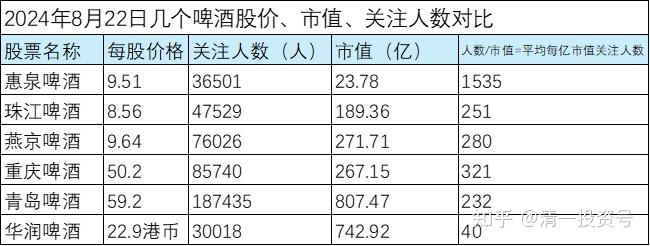

77篇.在确定企业价值的基础上进行金融投机

清一山长2020年12月17～21日

**一、冷点买入，热点卖出** **2020-12-17**

[江苏银行](http://link.zhihu.com/?target=http%3A//xueqiu.com/S/SH600919)，关注人数42762人，市值646亿。成都银行，关注人数27380人，市值384亿。南京银行，关注人数261301人，市值802亿。北京银行，市值1023亿，关注人数229228人。贵阳银行，关注人数29932人，市值255亿。宁波银行，市值2100亿，关注人数179878人。

**根据热点投资原则：关注度高，就是热点聚焦之处。热点股票的上涨可能性最大。**这样算来，这几只股票里面，宁波银行是最值得买的。

**根据冷点投资原则：关注度低，证明人气低不被看好，很可能出现估值洼地。所以你应该买人气最低的股票。**比如这几只股票里面，市值人气比最差的，就是江苏银行。所以它是最值得买的，跌的空间其实也不大了，都没人关心它了！

各位朋友：您支持哪一派呢？**投资没有对错，关键是自己信奉的原则是不是坚决执行了。**别看别人说啥就冲进去，根本不知道别人的投资风格的偏好，万一与自己的投资风格不一样，就会吃亏了，也拿不住的。

**喜欢追人气而走的人，就是“趋势派”。**这一派喜欢赚钱快，喜欢买后不久就涨，喜欢追逐热股，这种股的涨升概率也的确大一些，当然，跌起来也不含糊。

**喜欢买人气低迷的股的人，如买江苏银行的，就是“逆向派”。**既然选择了被冷落的股，就要忍受被冷落的命运。你没有去直接投靠“王子”，比如招商银行等，你就必须要接受乞丐将来慢慢地被认识到，慢慢地变“王子”。也许你还看错了，它永远都变不成“王子”。你就永远守住乞丐股了。

**我在6元左右开始买惠泉啤酒，这时候它是绝对的冷点。**现在正在慢慢地变热。惠泉现在有23584人关注，接近成都银行的关注人数了。但是，惠泉的市值才26.8亿，只有成都银行市值的15分之一，这个差距可大了。**说明惠泉其实现在已经成为“相对热股”了，这就是惠泉主力最近两个月不断拉涨停带来的效应。**

现在进来买惠泉的人，就是趋势派的。跟今年年初买惠泉跟我一起守到现在的人，根本就不是一种人。所以我选择不说话了，10元以上，原来跟我买进的人，基本上会选择慢慢退出的，惠泉会换另外一批人来玩的。（我是两派都可以兼容的，算是投机分子，动机不纯。我是看情况，**一般我买入的时候，会按照冷点原则来买票，然后长期持有。卖出时机，会按照热点原则来卖，边涨边卖。**所以收益比普通的价投要好一些。但一般人几乎不太可能学会我的方式，因为是互相冲突的。所以我的商学院，并不教“热点投资法”，只教“冷点投资法”）。

**二、确定企业价值的基础上进行金融投机** **2020-12-21**

[$中国建筑(SH601668)$](http://link.zhihu.com/?target=http%3A//xueqiu.com/S/SH601668) 昨天推荐人买中建，今天就跌了。直接打脸，害得别人更不敢来买中建了，只好自己喝这杯闷酒。今天5.07元，又买了100万股中建进来。这是从啤酒腾出来的一点钱。原来啤酒跌的时候，“高价”卖了100万股中建去救啤酒，一直很心疼，卖绩优去救绩劣。没想到今天给机会再度接回来了。感谢！

死了的投资家，我最佩服的是范蠡。巴菲特是活着的投资家中，我认为最值得学习的。但我内心最佩服的，当代还活着的投资家，其实是索罗斯。也巧了，他也是哲学专业出身。投资上，需要思考的很多问题，其实不是经济学的问题，而是哲学问题。**巴菲特主要是从企业经营的角度来看股票，踏实，但缺乏一些灵动。索罗斯是从人性和哲学的角度来看金融市场的，**各有各的道理，从不同角度来反映金融市场的高手。我一直在试图把两者结合起来，创造我自己的一派：**价值投机派。简单一点来说，就是：在具有确定企业价值的基础上，运用博弈理论，进行金融投机！**这样可以获得比巴菲特的方式更高的收益。目前为止，进展还算顺利。大家也看到了我在惠泉啤酒上一系列的大仓进出的操作，充分展示了与巴式不同的金融投资扩大收益的模式。

去年下半年，我一直在布局酒类，白酒、啤酒、黄酒买了一大堆。跟上面的原则一样。就是我认为中美贸易战下，消费股将成为未来“稳增长”的重要砝码。这些股具有确定是底部的价格，干嘛不大胆进入？所以，把9位数的资金打进来买酒了。今年已经取得丰厚的收益。而且风口还没有完结，资产还在继续疯涨中。这是用索罗斯的博弈思维，加上巴菲特的企业原则，取得的最大收益——目前为止最大的收益。

**今年下半年开始购买中建，是把酒类上的获利盘，慢慢退出后，找一个资金的避风港**（高高在上的白酒，退出后我就没有勇气再度进入了）。**我认为中建有着索罗斯绝妙的包赢逻辑：**如果5元买入中建，跌破4元的可能性几乎没有。但中建涨破10元的可能性却很大。**用下跌20%的风险，来对赌上涨100%的盈利空间，5:1的赔率，**这种博弈盘，如果用一年期来说，赌场上会开出多少赔率来？其实，如果算持有两年的话，中建维持5元的问题不大，涨到10元的可能不小。因此，其实算是一场零风险，可获取100%利润的博弈盘，为啥不搏一把？

**既然几乎是必赢的，输时间不输钱的买卖，当然要重仓投入了。**所以，我把闲置的资金，就全打给中建了**。其他博弈资金，依然在跟啤酒庄家比耐心！**[大笑]如果涨急了，会调出更多的资金来买。

(标题、图片为编者所加)

**文章音频**：

[474篇.在确定企业价值的基础上进行金融投机](http://link.zhihu.com/?target=https%3A//www.ximalaya.com/sound/752290639)

**参考链接：**
[70篇.隔山观火，不投入情感](https://zhuanlan.zhihu.com/p/707564067)

[71篇.从不缺乏热闹，只缺乏理性](https://zhuanlan.zhihu.com/p/709411110)

[72篇.为什么不要冲过9.60元收午盘](https://zhuanlan.zhihu.com/p/710752420)

[73篇.蓄势上攻，引而不发](https://zhuanlan.zhihu.com/p/712057223)

[74篇.惠泉跨栏历史记录回顾](https://zhuanlan.zhihu.com/p/713488711)

[75篇.惠泉最成功的地方](https://zhuanlan.zhihu.com/p/714477508)

[76篇.聪明人赚钱，傻人赔钱](https://zhuanlan.zhihu.com/p/715051514)