本次自由搏击全国锦标赛，清一战队的30名队员，与本次来自全国省队，专业队，专业俱乐部的共744名专业运动员同台竞技，最终一共拿到了两块金牌，六块银牌，15块铜牌！总奖牌数量是23块奖牌，超出预期。但总金牌数量严重不及预期。小女首次参赛只拿到一枚铜牌，她其实想要的是金牌！不过相比实力比她更强的同伴，居然在预赛第一关就把四个夺金热门队员给判负出局，连铜牌的边都没摸到！小女拿到铜牌也够运气好了！公主们对此结局，也很不服气---决心明年再战江湖。现在回去，用一年的时间来好好练出绝杀技，既然不Ko就判负，小公主们就决心回去练出Ko的真本事来！

实话说:我们的打法技术动作等等，的确与这些“正规军”完全不一样，裁判们看不顺眼也很正常！击中了对手不给分也可以理解！对手出招很漂亮，扫腿很威风，出拳很有力。场上就算只是击中了我们小公主的非有效部位，起码看起来也很养眼！裁判愿意给分也可以理解。特别是青少年比赛，很多家长是保拿到成绩去拼体育大学入门资格证的，对他们来说升学，拿身份是天大的事情。因此各种操作卷得很厉害也很正常！

但我们也不可能为了让裁判们看顺眼，就来迎合他们的技术动作。这样子我们和外家拳就没啥区别了！我们只能尽量提升我们自己的能力，设法练出更快，更重的力量，来给对手造成更大的打击才行！技术不被认可，就只能更加努力地去拼实力！就像我们在泰国做的一样。当然--回国这种比赛，在重重护具之下，要Ko对手，也比在泰国要难多了！但再难，我们也要做！世界冠军，注定是不平凡的一条路！

成年组的三个夺金级别。其实我们已经做到了秀出精彩：首先是48公斤级的明晓以压倒性的优势，击败了所有体制内的对手，包括在半决赛中，击败了本次夺标热门吉林体院的队员，最终顺利地拿到金牌。成为首个清一木兰“双冠王”（自由搏击和泰拳双全国冠军）！

52公斤级的谭木兰也打进了半决赛，与去年的全国自由搏击冠军耿春蕾争夺本次赛会的金牌，三局场上均追着对方打，给对方造成了巨大的压力，技术动作完全失常，谭木兰还差点就Ko了对手。虽然最终被裁判判负，只拿到银牌（我认为实际上应该是谭木兰赢），但这种拼杀结果也不失尊严！Ella也拿到了该项目的铜牌和半接触的银牌！

56公斤级的陆鸽，虽然在半决赛中被判负，失去了决赛权。但她的场上对手吉林体院的队员，虽然判胜赢得了了决赛权，却在跟陆鸽的比赛中因伤退赛，也失去了争夺金牌的机会。相反赛后毫发无伤的陆鸽，居然被判断为半决赛的败方，可以看出这种裁判多么的不公平。

总之---我方木兰虽然只参与了这三个级别的比赛，但孩子们都给对手造成了很大的压力！如果公平一点判的话，这三个级别其实都应该是我们夺冠才是的！因为对手，其实都打不赢我们的木兰，她们才是参赛各方都不敢轻视的对手-----虽然我们是“最不专业”的队伍。孩子们面对的都是全国的专业精英运动员，汇聚的是全国的体育格斗的尖子！但今日已经习惯了超越传统，超越专业。我们不认为自己的业余队员就应该比体制内专业人员差。照样敢参加体制内最高端的比赛。明年再战江湖，一定会给体坛带来更大的冲击。特别在这次孩子们认为判决不公之后，都激发了自己回去后要强化练习的斗志！

今天下午是青少年组的决赛，有两名小公主一路艰难地过关，终于打进了决赛。但面对善于疯狂减重，体重身高都远远大出自己一号，还特别喜欢疯狂进攻的重炮型对手，要顶住还是很不容易的。我都担心她们场上会被Ko。我交代两个队员----不指望你们去拿冠军，对手太强，要求你们KO对手也不现实。但你们现在这么小，就能够与体制内从小练拳的全国冠军交手，是你们的荣幸和机会，你们就只管打出自己的精彩，让自己这一生都不后悔就行了！由于对手都是重炮手，这次比赛前面还轻松Ko了对手。我在技术上，要求两个小公主们无论怎样被打，都绝对不能退后，不能躲避，不然很可能被KO。所以必须与对手主动抢攻，近战缠斗，不能怕。只能用这种方法，以攻击对攻击，才能化解对方的攻击，消耗她们的体力，只有这样才是安全的！

两个小公主们场上都认真执行了这种战术。两场比赛，都是真的把体身高体重的对手都累得要死，最终双方打满三局。我方被判负，结束比赛！当然---今天的判负，我们是认账的。毕竟我方最强队员都已经在第一轮落马了，的确两个小公主目前还没有力量能够和对方抗衡，但在一切不利我方的劣势条件下，公主们上场面对强手的决赛，敢打敢拼，打满三局，已经很了不起了！ 特别是60公斤的小公主面对比她重8公斤以上的强大对手，居然顽强地打满三局，把对方的快累死了。获得了这次武术中心颁发的【最佳风尚奖选手】称号，说明主委会对我们队员的顽强拼搏精神还是非常印象深刻的！

以下照片，是家长们场上现场拍的，场上比赛中公主们击中对手的瞬间！小公主也不是只有温柔的一面！

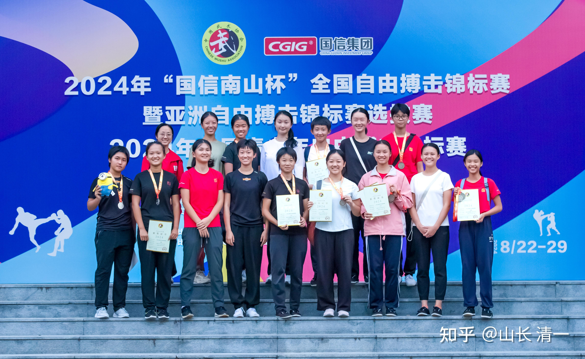

*15人的公主战队赛后合影（缺ELLA，因为她陪我给客户咨询去了）*

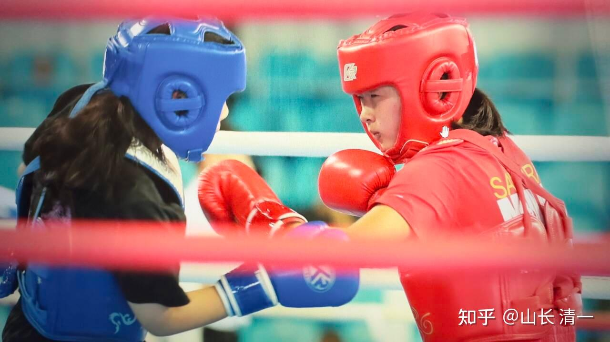

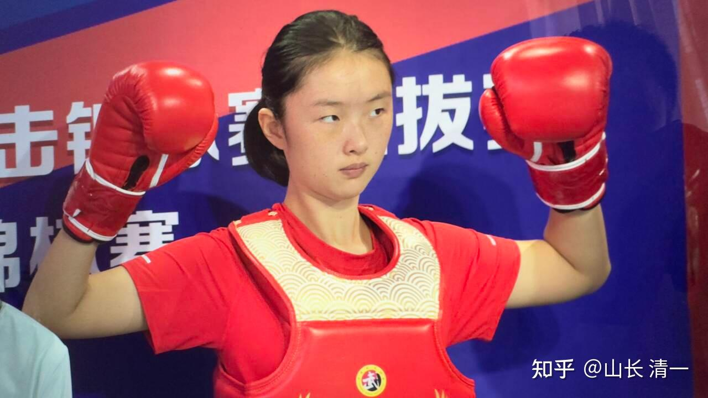

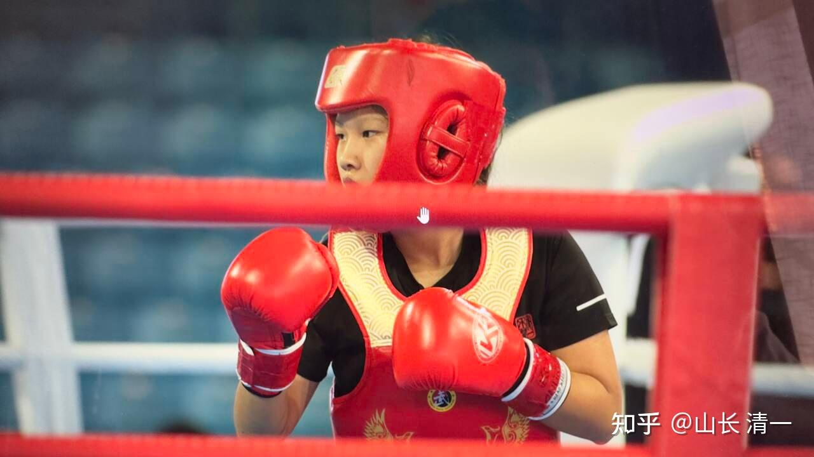

*夺得银牌的小公主刘静殊*

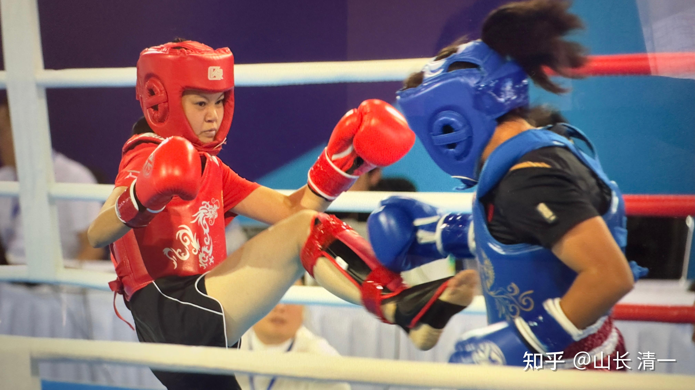

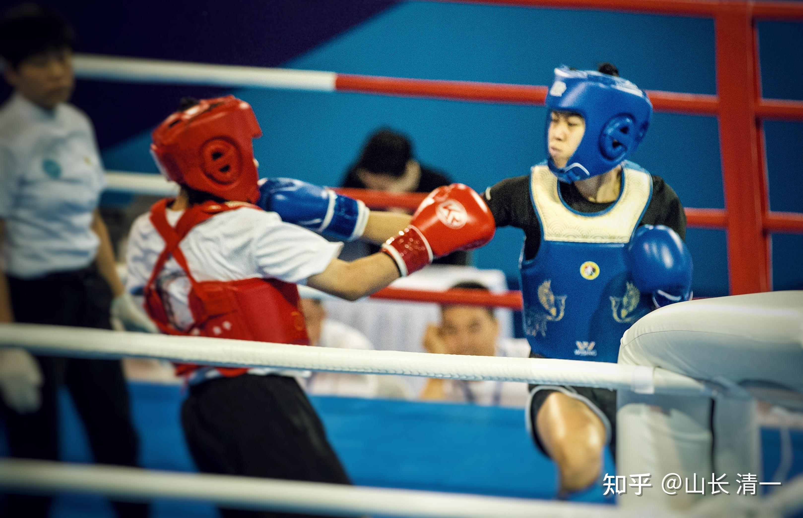

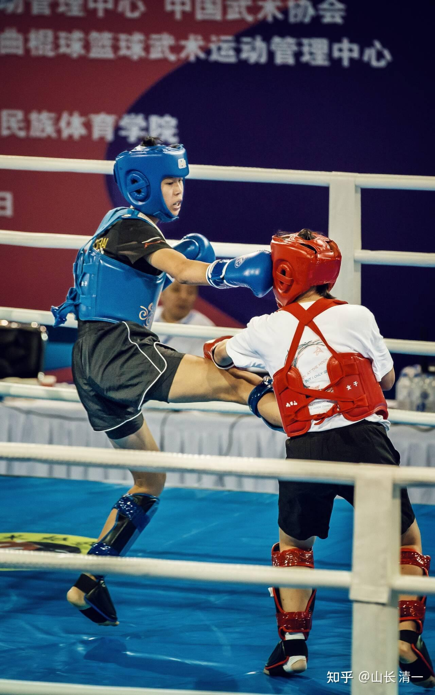

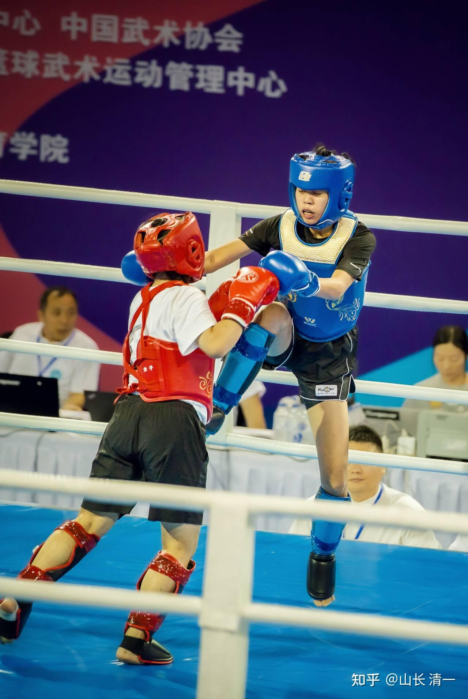

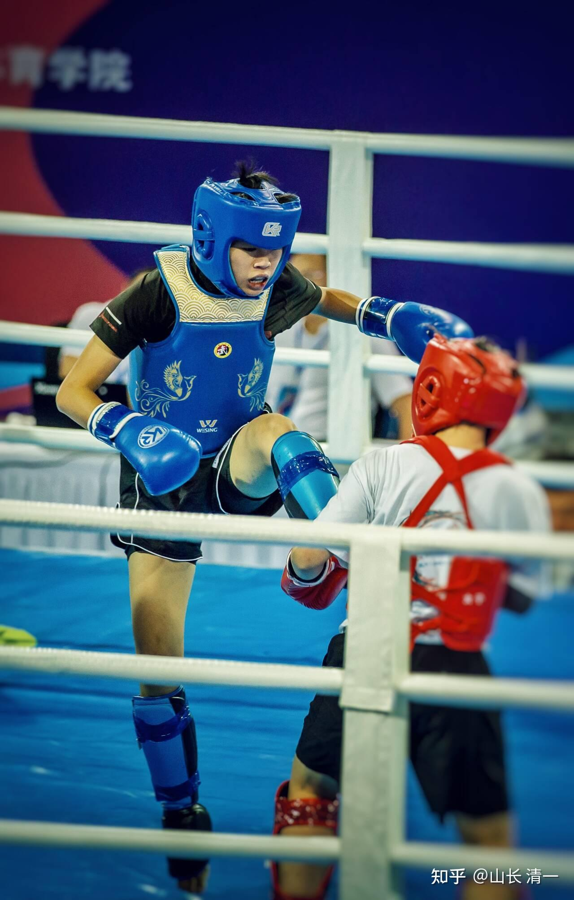

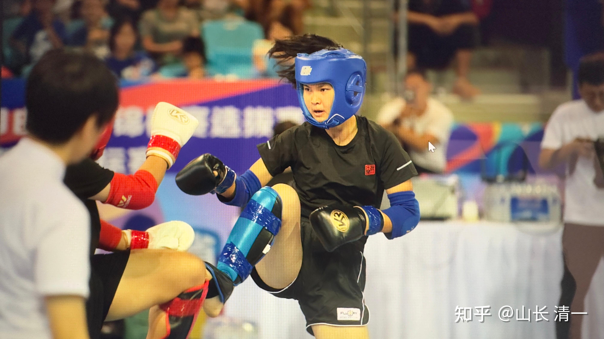

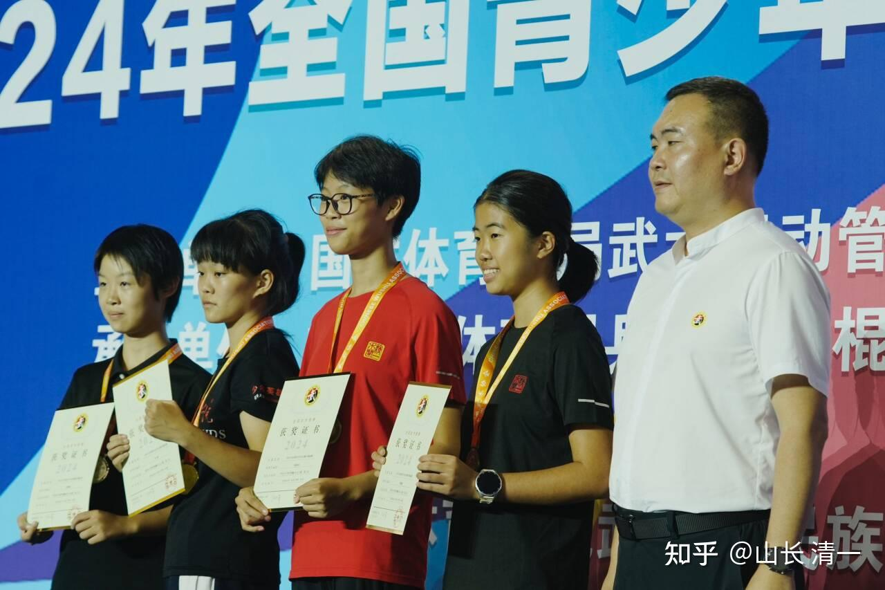

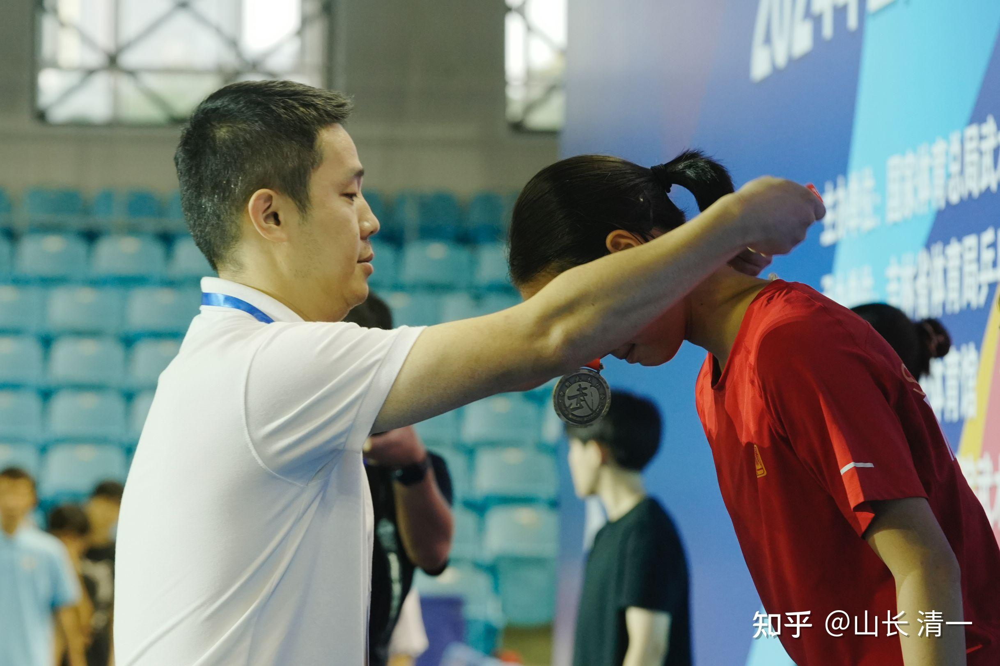

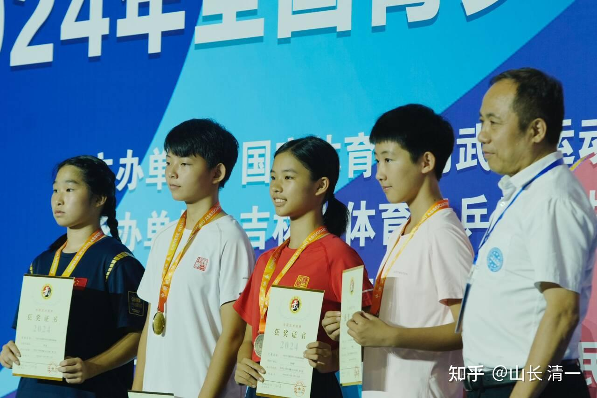

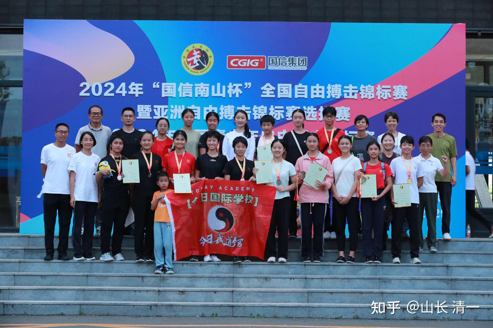

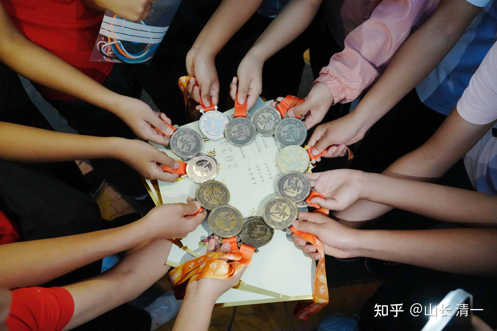