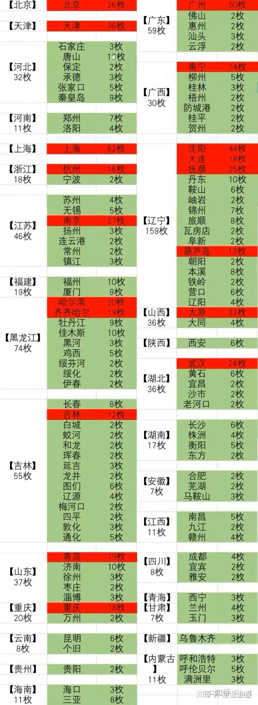

本次清一战队来长春比赛，我此生第一次来东北！由于我认为东北是对中国近代史上影响很大（甚至最大）的地区，也是我党崛起和发源发展的核心地区！所以等队员们回清迈之后，我自己带着两个小公主，留下来多呆了两天，想要更近距离的了解东北和东北人！

首先我对东北“卷死人”的竞争和生存力印象非常深-----这里的自助快餐，居然才15元一份。价格倒是不出奇，昆明也有这价格的自助餐！可是---别忘了这是东北地区----这里的人都太能吃了。饭量一个人大概是我们三个人加在一起的饭量（昨天飞了8个小时，刚回泰国。由于下午我们不敢吃飞机上的供餐，去BIG-C买了两份快餐。一份饭的米饭，居然只有一点----ella说，东北人来泰国，恐怕要吃这样的定食八份才能够----反正ella昨天都吃了两份）。

所以---我们也看到---衣食丰足的东北，身高体重都比其他地区更出彩。我们的人第一次去吃长春吃自助餐，结果老板看了我们吃的量，都连说不好意思-----说你们才吃这一点点呀？都不好意思收你们的钱了！所以-----我很怀疑自助餐这个价格，经营的店家怎么活呀？让我来办餐饮店，我肯定办不下来，铁定亏死。

不仅仅是数量大，价格上卷，还卷品种丰富----这些自助餐至少都有30个菜，甚至还有40多个菜的。而且肉菜管够，还是各种纯肉---鸡鸭鱼肉全都有。脊骨一大锅的卖，都有一斤一个了。

东北餐饮不仅仅卷品种---还卷时间----这里的自助餐，居然还有24小时营业的，吃的人不累，24小时都在吃。可做的人不得累死吗？一家24小时连锁自助餐的殿，看上去生意很不错，员工自豪地说---每天他们都要供应500多号客人吃饭！连续流水席。我认真的算了一下----一天大概可以收入8000多元，一个月可以收入25万多。但仅仅发给20多个工人的工资，每月都要10万元左右了。买原料，店租等等，起码也要十几万吧？这么好的生意，这么旺的人气，这么累的工作，忙上一个月下来，也仅仅是小赚几万元。一点不小心就赔了！可是这样的店自助餐，居然到处都是，有些装修很漂亮的店，居然没有人来吃，几十个菜看上去很寂寞。肯定是亏本的。但依然在坚持，说明这行业真的卷的很厉害。卷赢了也没啥钱赚，卷输了直接本钱亏光光！还不断有人前赴后继的----所以---反推下来---就知道在东北赚钱，做生意。肯定不好做！相当的不好做！

回泰国的前一天晚上，我们三个人特别去一家看起来生意很好的饭店点菜，是一家专做牛羊肉的正规饭店吃饭。发现---点菜吃饭特也不贵，给的分量还特别多。一大碗分量特别足的杂菜汤，都够我们三个人吃了，定价才10元。一个不小的，跟小盘子差不多大的韭菜鸡蛋饼，也就3元，我们点了三个！还有一些店，煎饼会卷到只买1元一个的。我这一次，还额外的多点了一笼烧麦，一共12个。还多要了一份汤喝！结果老板一看我们的点餐量就摇头说----你们三个人，吃这点东西太少了，肯定不够吃的。我说不够再点。我们最后三人，最后也全都吃饱了，总共才花了30多元！不过---根据我的观察，这点量，我们看真的只是一些东北人一个人的饭量！这里有一大碗的朝鲜冷面，孩子们两个人必须分着吃一碗。一个30多岁的大哥笑话说---他年轻的时候一个人就要吃三碗。一个【东北大饭包】，价格才8元钱一个。当地人拿着一个人就啃。但公主们要三个人一起来分一个吃。看起来的确很文弱---但小公主还是格斗高手呢！

东北人吃饭，肯定不会像我们这样吃的---猫食？他们会笑话吃饭不行的人。他们可能中午和早餐会吃大量的主食。晚上，我看他们都大量的吃菜，吃肉！主食很少。我们旁边两个男子，上了一份烤羊头，好大的一份，我看这一份我们三人一起都吃不完的。我说这么多肉，拿到泰国去做份饭供应的话，他们至少可以做七八份快餐，供应7-8个人食用！可在这里，仅仅是两人份的其中一份菜而已！他们还上了别的菜。比如上了一份鱼，餐单上看起来不大，拿上来也是很大量的这种！对于我来说真可以吃三顿了！而且---不吃主食的晚饭，我认为对身体是一种严重的毒害！新教育的饮食观念，要想让东北人认同，我看难度极高！

我原以为东北物产不丰富，就是粮食多，更没想要东北人吃水果比云南更厉害！这次来东北，才算长见识了！---我们本来想去一个沈阳的一个公园，看看公园里面练武的人。无意中却发现附近有一个巨大的水果批发市场，估计全省的水果都来自这里。让我极为惊讶的是：满市场都是来自全国各地的各种水果----特别是南方的热带水果还特别的丰盛---香蕉，榴莲，芒果，成大堆的卖。更特别是价格居然还不高----芒果的价格，我问问老板，居然批发才2元一斤----比泰国本土还低（昨天刚回来，我买了三公斤泰国芒果，30B一公斤）。据说这些芒果是云南攀枝花地区产的！一路高速的拉到东北，几千公里地，不知道花了多少时间，多少汽油呀？才卖这个价格？多感人！

至于苹果和梨，新疆的水果，更是多得不得了。满大街都是水果店。实话说----比泰国的水果店都多，更密集。当地人告诉我---当地人每天都要吃水果的！泰国，老挝这样的地方，当地人其实并不是经常吃水果的。至少比我们这种外国人要少。也许当地产各种水果太多了，反而都不稀奇了吧？水果这个东西，其实是吃不吃都无所谓的。并不是人类必需品。这次我离开泰国去老挝和回国，几个月中就很少吃水果。但我真心没想到东北的水果比云南还多，供应的品种还更丰富！而且价格还不贵。

而且---东北都认为是大陆文化-----肯定与广东的海鲜文化不一样。咩想到海鲜也是东北人的一大消费，去超市里面。看到满满的海鲜，甚至活的海鲜，龙虾很多，因为东北也有海。可见东北人的吃文化，真的丰富到了极点！

见识了 东北人真的是挺能吃的---也许是全国最能吃的地区了！不仅仅是量大，价格低廉，而是品种之丰盛---更是超出了我的想像！

根据我知道的饮食常识---东北人这样吃饭的话，各种慢性病，特别是糖尿病的发病率会很高！网上查了一下，果然我猜对了。----的确东北人的糖尿病发病率全国第一，云贵川的发病率全国最低！我知道云南人的确吃的量不大！主要是原来这个地区的土地差，物质生产不容易，过去很多人没饭吃，只能吃野菜野草。所以云南人没有养成东北人大吃大喝的习惯！但养成了做各种食物东西都很精细的习惯，会把别人不吃的东西也拿来做成食物。比如连树叶子，花花草草的你想不到的东西，都会弄出来做成食物。还有把牛胃里面的半消化物拿出来做汤饭的(傣族的食物）。吃老鼠，虫子等等，显得特别有创意，也有“民族和地域特色"。这其实是当地食物匮乏的表现！云南的一个米线，也能做出很多的花样来！版纳一带的吃法，就很接近泰国的吃法。不仅仅吃法很简单，而且吃的量也少！南北地域特色，的确很明显！

糖尿病号称万病之源------容易得糖尿病的地区，肯定其他慢性病也不少。不过我到东北，是来学习和长见识的，不是来教东北人应该怎样吃饭的，他们也没有交学费给我学养生。所以我也没有去给东北人说他们吃得不对，又浪费金钱又浪费时间。还给自己添病！我猜----东北人如果吃饭让他少吃一点，肯定会认为是骂人吧？我可不敢去惹东北人---一个个巨大的体型。满街都是超过200斤的胖子。真觉得他们会不会每天走路都好累？

透过餐饮行业，我思考的是东北的生存环境问题！简单地推理，就知道在东北做生意赚钱，应该相当的不容易！因为一看就是行业卷到了极致。你作为同业人员，不跟进就会死的很难看。跟进了，一起拼到底，也赚不到啥钱的！东北就很难发大财。所以---怪不得东北人到处跑，全国各地到处都看得到东北人去做各种生意。原因是这里过日子，真的很不容易！有些在当地卷不动的人，当然只能跑外地去发展了！当地的发展空间，实在太有限了！

但另一方面说：如果你在东北，并不需要在东北做生意，赚钱来生活的话，只是来东北休闲和消费，东北应该是一个很不错的吃喝玩乐的好地方----你可以很舒服的呆在这儿过日子！所以---据说东北体制内的人，就日子很好过！没啥压力。怪不得东北人人都想拿编制，进体制。而且----夏天，秋天，东北的气候其实很舒服！物产也非常的丰富！

也正因为这个原因，东北人其实是不待见新教育的。新教育在这边的发展很不好----很少人会选择来上新教育。因为这里的体制思维很严重。我们这种以“超越体制”为目标的教育模式，对东北人来说，还过于遥远了一点。当然，这次打完比赛后，一些有心人还是开始关注我们了。一个格斗俱乐部的教练，就特别找到小明慧，问我们如何入学。小明慧让他先看我们B站上的国际今日的介绍！毕竟----要考今日三校，也不容易呢！

我给小公主们讲东北过去的辉煌时代的时候，小公主们问我---为啥解放后，东北就不发展了？进几十年，越来越差，被其他发达地区拉得越来越远了？我说：东北的重要性，可以从冷战时期。美国人准备给中国的城市提供多少核弹。就来看出来东北地区当年有多重要！多核心了！

仅仅是东北的辽宁一个省，美国人就分配了要放159个核弹来招呼。可见美国人对东北有多重视了！北京都才给了26个名额呢！东三省一共就吸引了超过300个核弹！再看看云南贵州----昆明只给了六个，连内蒙都不如！贵州更是只给了两个！就可以知道西南地区的国际地位的确很低！就是省府给两个意思一下就行了！

公主们提问的问题----看了这种情况，自然就答案了-----当年的东北，面临大型战争威胁是最大的！而且我国当时与苏联交恶，东北可能随时沦陷给老毛子。当年我国真扛不住前苏联的钢铁洪流！所以---共和国过去几十年，一直是扶持其他地方发展，特别是西南地区，而不敢投资东北。反而把东北的技术和力量拉出去，用于支援全国的建设。我当年大学毕业工作过三年的云南某电厂，就是一些东北人过来参建和运行的！因此---过去几十年，东北的衰落和落后，其实是国家战略的体现---有意削弱的结果！“共和国长子”，承担了更多的责任，前方阵地的责任和风险！

现在来看，局势已经开始在变化了！俄乌战争开打之后，东北的地位就明显提高了！我观察到国家的支持资源，正在不断的输入东北。一方面---我知道东北的炮弹，前一段时间，大量的用火车运往南方。说明我国的大领导判断---俄罗斯方向，未来几十年是不可能与中国开战了！东北安全了。这给了东北地区安定和发展的良好空间。相反---俄罗斯彻底与美国欧洲闹翻了，也被迫与中国交好。东北在这种国际地域政治的影响下，反而会成为我们国家对抗欧美的大后方。这是一个非常好的战略空间！未来国家可能会投入重资来建设和发展这个大后方！

这样一说---大家就知道---为啥这几年，东北突然变“火”了？突然有存在感了？淄博的烧烤，哈尔滨的旅游，都被媒体一捧就大火。今年不知道轮到哪个城市火了！另外，各种内容推送，都在越来越多的给与东北地区的话题。比如---今年的全国自由搏击锦标赛，今年居然是在长春举办。泰拳青少年全国锦标赛，也是预期在东北举办！原来都是更愿意选择南方城市的！这些事情，都说明东北的人文气候正在转暖！对东北人应该是个好事吧！

东北人的人情味重，善于沟通交流。这是历史的负担，也是历史的资源！对于做旅游来说，应该是好事。对于发展新科技来说，就可能有点障碍----因为过于关注关系的地区，科技和创新的发展肯定就差一些。目前广东地区，深圳这样的移民城市，人情味最淡，但创新力最强！但人肯定也很累-----人更像机器了！人际关系注定更淡了!

谁才好？人情和创新，我们选什么？我也不知道！你们喜欢啥就是啥吧！