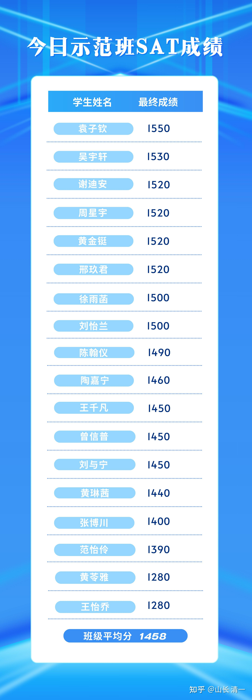
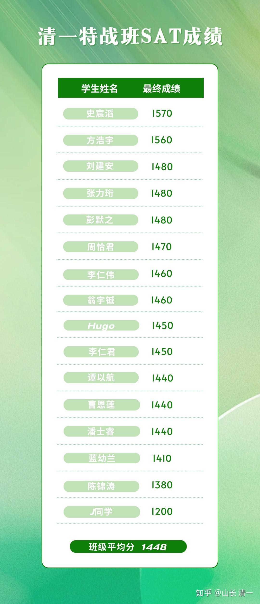

四年前，今日学堂启动示范班教育，把我们【三年学完12年】的教学创举过程，一点一滴的搬到网上，公开分享出来给国人，让中国教育有机会引领世界教育的潮流。因为很多国人都有软骨症，都认为我们不可能超过美国！教育上美国人最厉害！

经过3年学习后，我们的学生，用GED的成绩证明我们真的只需要3年就可圆满完成美国12年的K12课程，但GED仅限16岁以上的学生去考，因此我们拿不到官方成绩。一堆殖人就叽叽歪歪的，质疑我们成绩造假！你也得等16岁之后再来质疑呀？我们每个都要去美国高中毕业资格证的，你们急什么？

我们学生第四年的任务，是冲刺美国高考SAT！这是一个很多美国学生叫嚷难度太高，要求大学放弃用SAT成绩作为入学考评的一个高端考试。实际上---美国大约有三分之二的高中毕业阶段的学生，的确是不去考SAT考试的，就像不是所有的中国18岁学生都会去参加高考一样！只不过美国学生的放弃率太高了。大致上65%的学生都放弃了SAT考试，也放弃上大学，直接走上社会了。因为美国学生普遍认为：这么难的美国高考，去考只是丢脸。的确----就算是大多数去参加考生的学生，考生的总成绩都很感人---差到不可思议。每年的SAT总平均分，居然才530分左右（每科满分800分）。美国设定的【大学基准线】，也就是说超过这条线，就可以上大学了。这个基准线----也就540分左右。可见这个考级的难度之大（对美国人来说）。那么，我们的学生今年去考SAT的官方考试，成绩如何呢？

这几天，我们全体学生SAT官方考试成绩都全部出来了！今日塾的学生，今年以11个考生超过1500分的高分（这是美国1%考生才能达到的优秀成绩）。总比例超过全部参考人数的50%的卓越表现，顶尖学生比例压倒全世界的一切顶尖中学。今日示范班18个学生，总平均成绩是1458分。主要是最后一名1280分，严重拉低了总成绩！ 否则几乎全班都可以过1400分，这是击败美国93%学生的优等生成绩！与示范班班竞争的清一塾特战班，本次考试的成绩也很靓丽。拿到了1560，1570的全校最高分！班级平均总成绩是1448分，比今日塾只低10分！

这两个班级取得的SAT成绩，远远超过中国家长们花费不菲代价，远涉重洋去美国读顶尖私立高中的成绩！这些留洋学生，每年学费生活费等加在一起，差不多要十万美金代价，去就读的所谓【全美顶尖高中】的学业成绩，也不过如此而已（附录在后面】。如果家长没本事，申请不到优质高中，就更烂了，直接就是花钱培养留学垃圾了！

我们最关键的优势还有两条：第一就是我们的学生，只用了四年时间学习，就取得了这个成绩！第二条就是：我们的学生年龄才15岁。如果多给一年的时间来学习考试，基本上我们可以实现全员1500分以上的成绩！至少平均分1500是没有问题的！我们不仅仅拿到了高分，而且所用的时间仅仅是美国人的三分之一。这个价值有多高？节省出来的生命的价值有宝贵？你们就知道中国的教育水平完全自主可控，跟不上不用每年花上千亿元送给老美去赚！钱多人傻吗？

更优越的地方就是：示范班已经公布的我们的教学方式，外围学堂有师生照此办理，跟随学生，也有学生取得了超过1500分的成绩，至于超过1400分的学生就更多了，就根本不算啥稀奇的事情了！也就是说：

中国人没必要继续跪了。就算我们以外国人的身份来学老美的母语课程，我们照样超越老美多多！真没必要送钱给美国人，甚至你没有必要送来今日三校学校，你在家跟学，也一样能够取得优秀的学业成绩！

以下是今年两校的成绩公告。明年三校班级更多（三个班），学生人数也更多。老师们认为：明年的班级，基础比第一届示范班更扎实，学生的程度也更好，一定能够取得更加优秀的成绩！争取明年全班的平均分过1500分！

*今日塾 示范班成绩单*

*清一塾特战班 SAT 总成绩单！*

**与美国百强高中的成绩对照 （来源新东方网站） 说明-----2023榜单只有学校排名。没有SAT成绩排名。因此我们只能用新东方原来发布的老成绩（总分2400版的成绩）来作为一个参考！现在的SAT考试，是两科总分满分1600分，每个单科的没满分均是800分！请大家注意这种成绩的区别！**

2023年美国高中排名百强榜单上榜！ SAT成绩 三科 平均分

1 Phillips Exeter Academy 菲利普艾斯特中学 （2085） 695

　　2 Thomas Jefferson School 托马斯杰佛森中学 (2070) 690

　　3 Groton School 格罗顿中学 2060 687

　　4 Concord Academy 康科德学校 2040 680

　　5 St. Paul‘s School 圣保罗中学 2036 679

　　6 Middlesex School 米德尔塞克斯中学 2030 677

　　7 Hotchkiss School 霍奇基斯中学 2013 671

　　8 Phillips Academy Andover 安多佛菲利普斯中学 2008 669

　　9 Deerfield Academy 迪尔菲尔德中学 2000 667

　　10 Peddie School 佩蒂中学 2000 667

24 马德拉中学 1920 640

50 圣约翰预备中学 1824 608

60 GOVERNOR'S SCHOOL 1802 601

70 北野山高中 1782 594

80 马杜菲高中 1751 584

90 弗吉尼亚主教中学 1720 573

**VS 中国[今日三语学校] 两科1458分！三科就是 2187分！ 平均分 729分 **

比美国的第一名高中名校，整整多了100分总分（三科）！单科平均分多了30分！ 比美国高中百强的第90名学校的总分整整多了350分。 甚至于-----今日示范班全班最差学生的成绩（单科平均分640分），都已经相当于美国排名第24名的优等中学的平均分了（1920分）！外国学校取得这个成绩，国人还有啥好说的？我们的成绩分值压倒美国顶尖高中的程度，远远比华为对苹果的优势更加“遥遥领先”！这就是中国创造的价值！别以为中国没有创新力！

资料来源：

[新东方美国高中百强SAT成绩榜单](http://link.zhihu.com/?target=https%3A//liuxue.xdf.cn/usa/highschool/kpm/846601.shtml)

由于通过了美国高考。今日三校的这些学生，如果只是想当学霸，就可以16岁直接去读欧美和世界大学（的确有一批学生选择这样做）。但超过1500分的这批学生，都是胸怀大志，不仅仅想去读大学拿个打工文凭。而是想创造更大的奇迹！目前他们正在清迈。就读【清一大学国学班】，想要在三年之类，冲刺中国全国锦标赛的前三名。三年后，我们这里会再出现一个榜单！不再是这个班的SAT成绩，而是这个班三年来冲击全国格斗锦标赛的金牌榜榜单，获得的总奖牌数量！我相信这会是一个令人惊讶的世界教育记录！

今日学堂，目前已经超越了世界顶尖的高中！远远超过欧美名校的成绩，排名美国第一高中（起码成绩上超越，学生的人数上，现在还有距离。在体制的夹缝中，能走到现在的规模也很不容易了------但很多美国百年高中，一年也只有一百名左右的学生，不像中国喜欢冲规模）。今日不冲规模，只关心成绩是否卓越！

三年后，奉行真素质教育的清一大学国学班，也将创造世界第一的记录：培养出最多全国格斗冠军的大学！

当然：清一大学，也同时批量培养了小语种教学水平，效率世界第一的学生。

其他专业，成绩不好量化，不好比了。但我相信---师范专业清一大学也是全国甚至世界第一！公主班培养出未来最优秀教师的比率，肯定是世界大学最高的！

谁还在到处说----清一大学是野鸡大学？如果你这样说，我们也承认就是了-----让你们就去上你们认为更好的，有国家标签的【家鸡大学】好了！将来毕业后，你们可以拿到市场上公开标价出售！而野鸡---起码是【非卖品】。我们正在活出自己的精彩！

至于野鸡和家鸡？谁的生命力更强？我猜就不用说了吧？

有兴趣了解今日示范班的现在和未来的人。可以关注这批学生现在建立的班级公众号！他们每日练武，读书，写日记！他们正在创造新的教育和生命的历史！

[清一国术常春藤班](https://www.zhihu.com/people/--65-67-46-37)