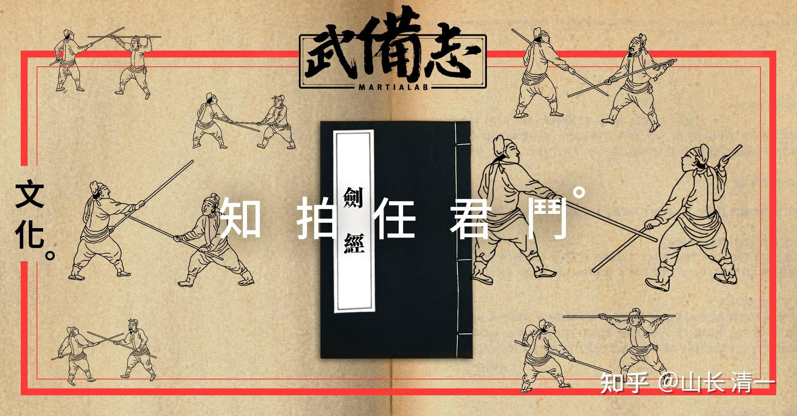

常春藤冠军班其中一项训练模式（第三项训练）：就是【陪行知拍---无接触模拟格斗训练】。

[山长 清一：清一大学首届【太极国术专业班】教学和训练大纲!](https://zhuanlan.zhihu.com/p/699481255)

这种陪形知拍的实战模拟格斗训练方式，我没有在国内专业武校的训练中看到过。在泰国有看过轻接触训练，有点相似。但在本质上也不同。这个训练模式的来源， 就是古代武当剑派的训练模式。首次披露是 俞大猷 的《劍經》。他自己言“猷学[荆楚长剑](http://link.zhihu.com/?target=https%3A//baike.baidu.com/item/%25E8%258D%2586%25E6%25A5%259A%25E9%2595%25BF%25E5%2589%2591/0%3FfromModule%3Dlemma_inlink)，颇得其要法”。荆楚长剑其实就是武当剑法！本书中说是【剑经】，但内容中主要谈棍法的使用。后人觉得奇怪，其实他自己说的是：能棍，各利器之法从此矣。这就是【棍为百兵之祖】的原因！ 另外他传技术给少林寺，只能用棍法，不能用利器---剑。但核心本质也是一样的。

【剑经】原文选读：**【用棍如读《四书》，钩、刀、枪、钯，如各习一经。《四书》既明，六经之理亦明矣。若能棍，则各利器之法，从此得矣。**

**中直八刚十二柔，上剃下滚分左右，打杀高低左右接，手动足进参互就。**

**刚在他力前，柔乘他力后。彼忙我静待，知拍任君斗。**

**[阴阳要转](http://link.zhihu.com/?target=https%3A//baike.baidu.com/item/%25E9%2598%25B4%25E9%2598%25B3%25E8%25A6%2581%25E8%25BD%25AC/0%3FfromModule%3Dlemma_inlink)，两手要直，前脚要曲，后脚要直，[一打一揭](http://link.zhihu.com/?target=https%3A//baike.baidu.com/item/%25E4%25B8%2580%25E6%2589%2593%25E4%25B8%2580%25E6%258F%25AD/0%3FfromModule%3Dlemma_inlink)，遍身着力，步步[进前](http://link.zhihu.com/?target=https%3A//baike.baidu.com/item/%25E8%25BF%259B%25E5%2589%258D/0%3FfromModule%3Dlemma_inlink) ，天下无敌。**

**千言万语不外乎“致人而不致于人”一句。[李良钦](http://link.zhihu.com/?target=https%3A//baike.baidu.com/item/%25E6%259D%258E%25E8%2589%25AF%25E9%2592%25A6/0%3FfromModule%3Dlemma_inlink)之所以救得急者，都是前一下哄我去，然后转第二下来接救，故救得速，故能速也。**

**不外乎“后人发，先人至”一句，不外乎“不打他先一下，只是打他第二一下”。**

**问如何是“顺人之势，借人之力”?曰：“明破此，则得其至妙至妙之诀矣。盖须知他出力在何处，我不于此处与他斗力，姑且忍之，待其旧力略过、新力未发，然后乘之，所以顺人之势、借人之力也。上乘落、下乘起，俱有之，难尽书。勾、刀、枪、棍，千步万步，俱是乘人旧力略过，新力未发而急进压杀焉”。我想出“旧力略过，新力未发”八个字，妙之至也！前言拍位，都是此理。**

**千言万语，总是哄他旧力过去，新力未发而乘之。**

**响而后进，进而后响，分别明白，可以语技矣。**

以上言论，与内家拳的要领是合一的！特别强调阴阳变转，这个原因，肯定是俞大猷的本家武术技巧来自于荆楚武术---武当派武术。当年（明朝）全国最核心的武术中心就是武当山！不是啥少林寺！

武术格斗，俞大猷本人最重視的，則為「時機」，這亦是《劍經》的核心戰略思想。「剛在他力前，柔乘他力後。彼忙我靜待，知拍任君鬥」

**训练要点一：**双方进行模拟实战，但不接触，双方必须控制距离，避免受伤。可以发力（空击），尽量模拟实战的情况。以训练反应为要点！避免外家拳的“换拳对攻”模式！特别强调防守，以及攻防合一的价值！

**训练要点二：**本训练也是我们的“体能和耐力训练”。我们的队员比赛中往往打满五局依然不显疲态，而国内的格斗手往往第二回合就体能衰退了，就是训练方式不一样的结果！这种训练，每局五分钟，连续五局模拟实战，连续30分钟强对抗训练。认真做下来，对抗的体能要求，速度和耐力的要求，对抗强度都是很大的。与我们国家队格斗集训的体能训练项目相比，这种培型训练的实战价值要高得多！国家队的集训，居然把大量的时间花在折返跑，冲刺跑上面了，完全违背了格斗的要领，还把队员累的要死。除了心肺功能外，什么有价值的格斗技术含量都没有增加。我认为是从其他奥运项目训练中拿过来的“宝贝”，肯定是一批不懂格斗的人弄出来的东西！中国队员有在国际比赛过程中突然猝死的案例，我认为就是类似的体能训练模式出了问题，严重消耗生命的原始能量！对运动员很不利，其实对实战能力提高也没啥帮助！

**训练要点三：不求一下击中，关注二次攻击！就是剑经中说的： **“不打他先一下，只是打他第二一下”。这是格斗高手的至理妙言！在防守中，在消解掉对手攻击情况下，寻找对方的薄弱环节打击对手！

只要打过真正实战的就知道---专业拳手的实战对抗，跟普通人打架是完全不一样的。受过训练的人打普通人，就是想怎么打就怎么打，可以打出花样来。但专业的格斗手，都有防反的能力。要想一下就击中对方基本出就是妄想！但外家拳的训练要点，都是想一下子就击中对方，每天都在对沙袋进行更快，更有力量的攻击训练。结果就成了双方“换拳”的格斗模式！外家拳的训练和实战模式，就是竭力去打到对方的空缺部位，如果自己挨打了，就一定要强行支撑住挨你一下，然后我更重的打回去一下。双方都在比谁狠，谁能支撑。最终谁赢谁输，其实充满了偶然性，未必冠军就一定比第三名强。张伟丽和乔安娜的第一战，就是这种格斗技术的典型表现！

而内家拳的格斗要诀，与外家拳完全相反：强调“不思胜，先虑败”。要点是“不制于人而制人”，永远把自保，不被敌人有效击中，放在格斗训练的第一位，只在保障自己安全的情况下施展攻击！不愿意玩换拳游戏！“一比一”换拳都觉得吃亏了！所以，我们就算与强劲的对手打比赛，打下来拳手也很少受伤的，脸上干干净净的！不像是乔安娜和张伟丽这样，一场比赛打下来，双方都成了猪头（寿星头）。能够实现这种即使不胜也不会败的攻防格斗技术的，就是内家太极拳！在太极拳的套路动作，各位认真看的话，就发现都是横向的弧线变化，本质上全都是防守。只在防守成功的情况下，才会攻击（出手第二一下）。但套路训练中，基本上没有攻击，都在练习严密的防守。一些所谓的“太极大师”，居然根据这些太极动作，妄想太极实战就是摔跤擒拿跌扑的技术，以为就是柔道一样的功夫！完全忘记了古拳经上说的“犯者立扑”，就是后发制人，二击必中的原因！懂一点基本实战的道理就知道：实战中想要去擒拿对手，几乎不可能！所以太极大师们，只能跟自己的徒弟玩格斗了！没法走上格斗擂台！

**训练要点四：**一些人在训练中，只管自己拼命的出腿，出拳，而不去研究对方的攻击模式和节奏，时机。自己的空挡也不防守好。这种人，只适合练外家拳，不能练内家拳，这种培形训练就无效了！这也是缺乏内省的人难以练成内家拳的原因！ 因为是双方的【不接触实战】，所以练的时候，看起来自己也不吃亏，自己催眠自己。认为对方是打了自己，但自己也还击了对方！双方至少平了。这样训练，就是外家拳训练模式。实际上---内家拳实战，是步步往前进攻的，是要破坏你重心的，不会给你还击的机会。上述拳经中所言【[一打一揭](http://link.zhihu.com/?target=https%3A//baike.baidu.com/item/%25E4%25B8%2580%25E6%2589%2593%25E4%25B8%2580%25E6%258F%25AD/0%3FfromModule%3Dlemma_inlink)，遍身着力，步步[进前](http://link.zhihu.com/?target=https%3A//baike.baidu.com/item/%25E8%25BF%259B%25E5%2589%258D/0%3FfromModule%3Dlemma_inlink) ，天下无敌】。一旦你没做好防守动作，你被有效击中之后，对手是步步紧逼的，不会给你还手的机会！所以，一旦是强撑着被攻击后的还手，应该视为无效攻击，不能视为双方平手。只有对对手的攻击，做好了防守动作，之后的反攻击，才是有效的！所以练习者一定要注意：不要自欺欺人！

**训练要点四：**对抗累了咋办？这是优秀拳手，老资格拳手的必备素质，可惜我们的拳手全是新的，缺乏长期对抗的经验和心理素质。每天安排这种对抗的意思，就是培养出拳手在擂台的强对抗过程中，找机会调整和休息的方式！时间长了就会非常熟悉和掌控场上的对抗节奏了。这一点，恰好是中国拳手最缺乏的训练内容。只会一昧的猛拼猛打，第一局表面占上风。有经验的拳手面对这种死拼硬打的拳手，会有意的蓄力不发！然后第三局中国拳手就会泰拳手KO。

这种训练，和场上比赛一样，人连续攻击对抗后，都是会累的。累了的场上休息方式，就是很简单的只防守，消耗对方的体力，但不进攻！蓄力之后。等对方累了再猛烈进攻，而且不多进攻，强调进攻的效率而非频率。这样，就可以让自己的体能分配合理，不是一味的场上一直强攻强打。这种模式，铁人都受不了。所以---五场实战比赛的强度很大，就逼得队员会设法在场上进行休息和调整，这样才能成为擂台赢家！

**训练要点五：换人**！所有的训练，队员时间长了，双方过于熟悉了，都会划水，偷懒，应付！为了防止这种局面出现，所以我这里是每天都换人对抗！不能让队员自由组合，然后一起划水！由于每天都有新人来对抗，让队员不得不熟悉新的节奏和打法！当然，对我们来说，不缺人。公主战队已经有超过15人，加上武道馆超过20人。足够对新人进行换人培训了。换一轮之后，已经快一个月了。此时轮回回来的上一轮对手，技术和水平又有变化。所以，训练者几乎每天都在面对新的对手，面对新的考评。这种大循环对抗方式，可以让训练对象的水平短期内大幅提高！

**总结训练要点：本项目的**核心训练的本质：**【千言万语，总是哄他旧力过去，新力未发而乘之】**---这是致理要言。格斗的最大秘诀，要领，不是去拼命抢攻（外家拳的技术），也不是“轮流互殴”，这也是外家拳，有勇无谋的打法。而是**【哄他旧力过去】，去**设法勾引对方出招，落空。我方防住对方攻击，在此时就是最佳的出击时机，对准对方攻击我方时必然露出的破绽加以攻击得手。

另外“**新力未发而乘之”，**其实就是用快速而连续的攻击，让对方打出第一招后，就无法打出后续的招式！不战而克人之兵。方式说起来也不难---只要让对方失去重心，站不稳，对方就不可能发出新招。太极实战“步步紧逼”，用身子打拳的打法，就是这个目的！如果你让人站稳了，你就不是练内家拳的（这个让人站不稳的技术，不在这个项目中练习。而是在后续的第五项训练---条件格斗及发力训练中进行！）

总结：清一大学国学国术专业，正在让传武的内涵和外别，训练和实战，都在完全能够适应现在格斗的基础上，呈现出自己独特的文化魅力。这是泰拳没有的， 也是现代格斗没有的东西！在我们这里---即使是明朝的武道精华，也得能以发扬光大。不像西方人一样---总以为自己才是最先进，最高明的。西方人---其实真的很傲慢！要论格斗技术，现在人怎么可能比得过古代冷兵器时代用生死悟出来的武学道理的人？

附录：【泰国人自己就承认---现在的泰拳不如古泰拳，但古泰拳太难了，很多人练不出来。这次陆鸽去柬埔寨比赛，当地有教练认为，实际上比赛我们是赢了的。对手完全被压制，不过也挺耐打的！没有KO判决我们输了。有教练就说：我们练的应该是古泰拳，就是不知道我们怎么学到了古泰拳。 这种拳，能够完全克制现代泰拳，打法风格上的确也很像。我观察古泰拳的招式，基本上都是单重的，不像现代泰拳是双重的，现代泰拳其实吸取了很多西方格斗的要素和训练模式，不完全是泰国古代的传承。可惜泰国人，现在也只有古泰拳的套路了，格斗技术基本失传。似乎没有人懂得如何训练出古泰拳的单重发力劲力来打比赛，不然赢率会很高的！托尼贾据说打的是古泰拳，但我看了也只是招数动作加上他练体操的肢体动作变化多端，其实并不是真正的古泰拳。因为他的发力方式，还是传统的格斗双重发力模式。只要不是采用单重发力模式，不用整体力的，就不是古泰拳，也不是传武的技术。任何武术，都必须有自己的发力技术训练。如果没有，就只能是体操了，就像中国的太极拳一样。拳击也有不练发力的拳击操，只有动作，没有发力技术和训练。拿来练练健美没问题，拿来打架就跟公园太极一样不堪一击的！但是，要练出发力来，除了老师教，还要学生勤奋。每天一个动作要练上千遍，不然怎么叫做“功夫”，这是要踏实去练的。不是谁去公园练几套套路，汗水都没有出来，就宣称自己是太极传人了。太极骗子还差不多！

中华传武，实战太极的发力训练，功力训练，应该在国内已经失传了。但在清一大学，这些古代的传统，正在恢复过程中】。