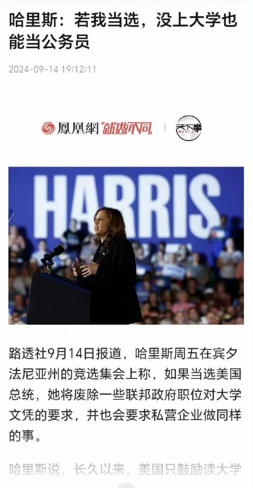

哈里斯此举：惊掉人的下巴！没想到美国堕落到如此地步了！

美国读大学难吗？答案是---简单的要命！SAT每门课程的总分是800分，目前分为英语阅读和写作合并在一起为一门课，以及数学课程为另一门课，总成绩满分是1600分！2023年的大学入学基准分为阅读部分480，数学部分530，与去年持平。新教育最差的学生，都可以轻松超越这个美国的大学基准分。因此，可以说：只要学习新教育，读海外大学是很容易的事情！甚至美国的一些低端一点的大学，不到这个大学基准分的学生，都可以通过绕一圈，先去读一个社区大学，再去申请上州立大学。基本上没有通不过的！

今日学堂作为外国人，学了四年，孩子们15岁去考美国的高考，我们的班级最高分是1570分，我们学生的最低分是1280分！班级的全班平均分是1458分----班级平均分，都高于美国常春藤大学的入读最低分。而且---这个分数，完全符合世界前30名顶尖大学的入读要求。我们的学生，要说考上世界TOP100名的大学，完全就是顺手捡来的，根本就不费力！

可见美国教育，美国高考，没啥了不起的难度。只要把语言基础打好，取得高分很容易！【当然，国内即使是国际学校，都不会教外语，包括美国的学校，所以----只要学好英语就耨个考高分，就是新教育最大的魅力】。

美国总共有5000多所大学，那么：上美国百强大学有多难呢？各位去查一下美国百强大学的入学成绩要求---SAT分数，居然最低只要1200分就能够去读“美国百强大学”---相当于我国的211大学，就这么简单。那么，你可以猜猜看，美国的前一千名大学，你要去读有多容易？SAT恐怕900分都不要！

这么低的门槛，如果美国人还有人，居然上不了大学，实在是一个超级大学渣，完全是一个没脑子，没思考力的废物笨蛋。这种人，去做外卖员恐怕都未必合格。但总统候选人哈里斯却说：这些没上大学的人，将来也能当公务员。这就是赤裸裸的降低美国公务员的智商。这种样子继续下去，社会治理水平怎么才能上升？

但---民主制度就是这样的！为了选票，就必须迎合平庸甚至无脑低级的人群的需求，让社会倒退！

因为：每年全世界考SAT的人只有170万到200万左右，其中只有不到100万人，最终顺利去上大学。而美国每年出生的人口数量是370万人左右！不读大学，甚至不读高中的人，要比上大学的人多四倍。美国总统候选人为了讨好选票，不惜牺牲全国的智商，拿金钱和权利来讨好这些低层次的无法正常思考的群体，交换利益给底层大众，这注定导致美国社会越来越拉美化，底层化！

现在美国的崛起，是一战二战时期，搞乱欧洲和世界。然后全世界的人，特别是欧洲的有资产，有才华，有进取心的人，大量的知识分子和有产阶级，都来美国避难，淘金，寻求发展机会，才造就了美国的强大。

现在美国这种玩法，政客都去讨好社会底层去了，美国能再次强大？才是见鬼了。怪不得现在美国到处都是彩虹旗！一群胡乱找感觉的底层消费者，成为了美国的政治正确，成为美国的主流，美国精神已经死了！

现在的美国，就是当年的大清！固步自封，自以为是。看起来光鲜，但骨子里面已经烂掉了！

但美国也不是没有聪明人，我看特朗普就蛮聪明的！他懂得---美国人实在太差了，现在靠美国人不行了。要靠勤奋努力的外国移民来帮助美国强大。所以---他的竞选政策是：“我想做的，也是我将要做的，就是你从大学毕业，我认为你应该自动获得绿卡，作为你毕业文凭的一部分，能够留在这个国家。这也包括社区大学。任何人只要从大学毕业，无论是两年制还是四年制。如果你从大学毕业或获得博士学位，你应该能够留在这个国家。”

这招其实是对美国真正有利，挺有价值的高招：这些人，愿意花钱来美国上大学的人，肯定是全全世界的有产阶级。他们只要能够大学毕业，就给绿卡。肯定比一般美国人更有能力创造价值！

可惜----招虽然是对的，但他无法得到最多的底层群体民众的选票。因为精英总是少数的，他们抵不过数量巨大的低素质人群。一人一张选票，注定对特朗普不利！这些群众担心的是这些高素质外国人才来美国。抢走了他们的工作机会，所以一定是反对他的！而且---特朗普政策讨好的外国留学生，还没有美国的投票权。他们肯定不可能去投票给特朗普。所以---特朗普万一输掉选举，一点都不奇怪！

当然----站在中国人的立场上说，我更喜欢哈里斯当总统。这种政客，根本不关心美国，只关心自己的位置。这种人多了，对我们中国崛起有好处！

心心念念“让美国再度伟大”的特朗普，其实长期来看，是中国最危险的敌人。比如他一心想要拉拢俄罗斯，孤立中国，这一招就很阴险！让他继续当政， 中国的日子肯定更难过。幸亏民主党主政，俄乌战争打起来了。不然美国现在拉拢俄罗斯，建立联盟，专心对付中国，对我们真没好处！

最终结论：我认为哈里斯是个“国贼”，专门出卖美国最大核心利益的无耻政客！。但我如果有投票权，我投哈里斯一票，欢迎她当美国总统。只是我们中国自己，千万不要弄出一个哈里斯这种无脑的政客出来，讨好底层，祸乱中国！

不过---我认为中国虽然没有这样子的总统，但中国有这样的爷爷奶奶，爸爸妈妈、他们对孩子的要求，就是一味的迁就满足，只关心孩子的吃喝玩乐。不关心孩子的成长。一些所谓的“好人”，也只是说好话。比如一些所谓的国际学校，私立学校，就是成天哄孩子开心就好。对学业成绩不要求，对排名不要求，这种弱智学校， 居然还收高价，家长们还很欢迎。结果这些如哈里斯一样的“好人”，其实就是骗子。结果自然出美国这样的傻子国民了！连SAT都考不好。当然----从这个角度来说，去西方国家留学，是最好的选择。因为你的对手太差了！卷王还是中国厉害！

转文：**美国10年级毕业时，会有50%的学生达不到阅读说明书的，填写稍复杂一些的表格的水平。这就是某些人心心念念的伟大国家吗？自己的国民都照顾不好，还来照顾国际孤儿？你们想多了吧**

[如何看待美国识字率只有79％？](https://www.zhihu.com/question/665901276/answer/3619129630)