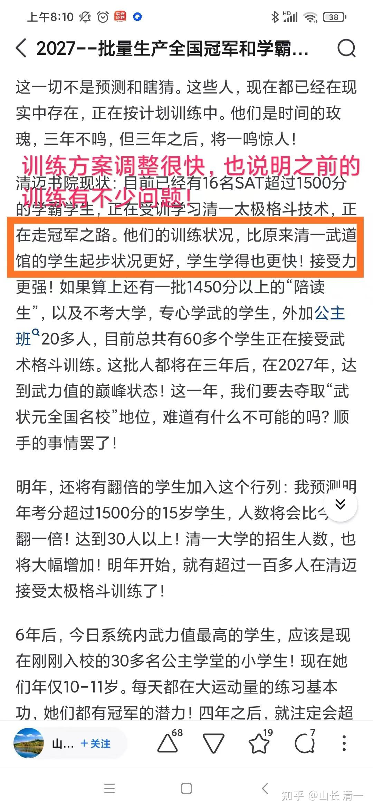
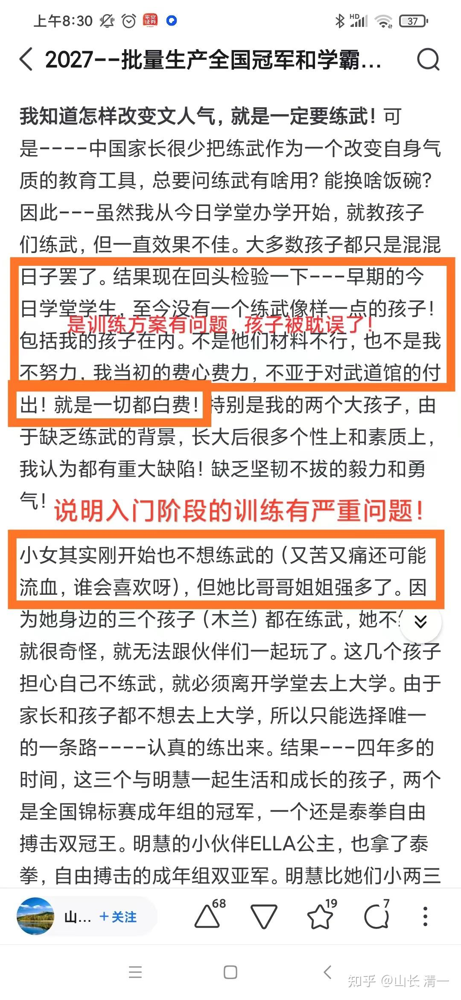
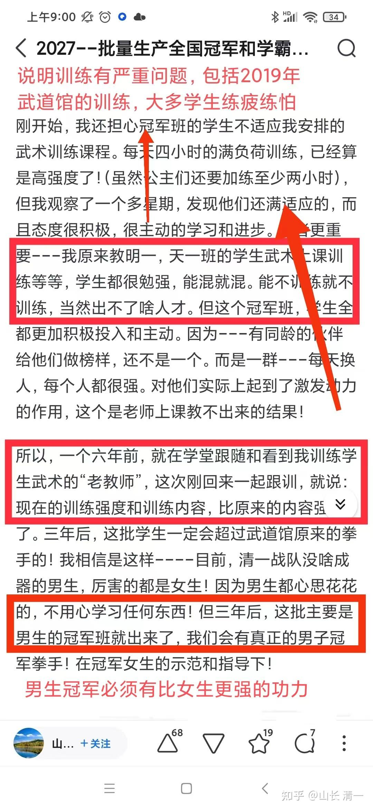

我建议大家好好看看一个国家地理的纪录片 功夫，有三集，第一集最好，开门八极，看到一家人，三代都在认真守护着他们的传统武术，令人尊重。我们其实也在思考这个问题--该怎样守护自己的文化遗产呢？！但我们都在积极行动，去带动更多的人热爱传统武术！

不过，我觉得这个纪录片，最有趣的就是第二集。其中的太极传人，把太极弄成了摔跤，还不如保定快跤好使呢。最可怜的是---当家掌门师父，跟来采访的主持人过招，结局却特别的耐人寻味。充满了江湖气。特别长见识。主持人其实也就是一个拍武术电影的，虽然练过武术，但真实的战力也有限。按道理不是这些正宗传人，专业武者，正宗传人，正宗武林大师的对手。别人只是一个电影演员，来拍电影纪录片的人也没想折辱大师，只是想长长见识！但大师却自己折辱自己，让我们大开眼界。

首先是大师摔弟子的表演，摔得很漂亮。其实---如果是练过的人，就算功夫一般，打没练过的新手，也是怎么打怎么有的。现在的木兰们，如果要真的跟冠军班的人打，不管男女，上台去一定打得很漂亮，比擂台赛精彩多了！因为两者根本就不在一个级别上！这种表演，其实说明不了啥水平！

但是主持人也的确好奇大师的功夫到底有啥深度，自己也是练过一点的！虽然不专业，但也不业余！所以表示能不能亲身感受一下大师的功力。大师肉眼可见的有点紧张，浑身就不自在的样子。嘴巴用话术，外示悠闲，其实身体很诚实，明显很戒备。然后大师却突然开口说话，故意的吸引对方分神，然后言语中就突然出手偷袭，对方结果还防住了，没被摔倒，反而卡主了大师，让大师动惮不得。都是练武的，我一看就知道大师要糟糕了！因为大师的脖子受控，被对方用胳臂夹住了。只要一用力扭腰，头就会被压下来。泰拳此时就是一膝盖上去脸就花了！但奇妙的是------双方僵持一会，主持人的手就突然松开了。然后---身体放松的，就让大师给摔出去了。我看镜头上，是两人一起摔出去的，大师肯定也倒地了。但是镜头却切掉了，转向大师站着的镜头，然后主持人慢慢爬起来。看起来摔倒有点狼狈----大师表示他赢了。不过，大师认为认为这次摔跤太不漂亮了，不够有说服力，但也不敢继续再来一次，知道纪录片的主持人有点真功夫。但为了体现他自己太极功夫的厉害，就自己点名，去找了一个大概是搞摄影的外来人，拿他来摔了一个动作，大师把人背起来了！说可以让他窒息而死-------原来大师的水平，就是专门找小白来虐菜的呀？当然主持人也“很江湖”，表示很佩服。含蓄地表示：太极拳可刚可柔，功夫了得！他很长见识！

我认为，传武太极大师的嘴巴，才是天下最厉害的功夫。这个大师吹得太极要领，练习要求，说法，让我都晕菜了。如果按照他的方式去练拳，我肯定都不及格的！比如，大师说---太极套路一开始就是为了实战的？我咋不知道这一点？我从来就不练太极套路，都只练单招。但我可以随时编一个套路出来，打的给人看！可能不好看，但别人肯定说就是练太极的！只是不知道是啥门派的太极！我认为玩套路，就是自娱自乐的玩意，或者给人看的表演。单招单练才是真功夫。清一武道馆的拳手们，每天练的都是单招。几年就练一个野马分鬃，阴阳开合拳。冠军班，我说他们只要练出来太极三脚，太极三拳，就可以拿冠军了！谁去天天练太极套路呀？如果真的是“套路一开始就是为了实战的”，我干嘛不练套路去打实战？每天枯燥无味的，一个单招练千遍？不烦吗：我承认这样玩单招，没法开馆赚钱。因为一个单招就练三年，你每天咋收费呢？不符合商业要求。不如编一个108招的套路出来。学了一路，还有二路。学了新架，还有老架，学了大架，还有小架。这样，天天有新招玩！一辈子都结束不了。这样，才好收钱吗！我就是太傻了，所以只能赔钱供养，请人来练拳。不如这些大师们有江湖经验。居然不练套路?自己砸自己的饭碗！我才是傻瓜一个呢！

所以：江湖离我们太远，大师比我们太高。我们的境界，是达不到大师水平的！

[《功夫》第2集：大隐于市_哔哩哔哩_bilibili](http://link.zhihu.com/?target=https%3A//www.bilibili.com/video/BV1Yc411z7fh/%3Fspm_id_from%3D333.788%26vd_source%3D4cbc89574f9d1d5fdaaf7ba0be8d9083)

不过---虽然我们不去找江湖武师计较高低，甚至故意回避江湖武师的风头，尽量不与国内的江湖武林人打交道！但江湖武师，还是主动的找上门来，高高在上的指点我们了。还在一些家长群里装神，以大师气派，指指点点的，说我们的武术培训有问题！不如他们的更科学。我也不怕自黑，反正已经被人黑习惯了。我就用我的场子，帮大师们宣传一下我们的黑点和污点吧！

大师对此的评点是：我们本学期改了训练方案，训练方案调整很快，说明我们**“之前的训练有不少问题”！**

大师就是大师，一针见血。马上就发现我们之前的训练系统有问题。我承认---当然有问题，没问题我改啥？

不过：我们每天都在微调，明年冠军班，还要大幅改变训练内容，提升训练量。所以---是不是证明现在的训练方法依然有问题呢？

我承认及时明年以后，我们还是有问题的。我们永远在发现问题中，永远在改变问题中！这才是中国古人的【日新，又日新】的基本治学的态度呀！

大师点评我总结早期学生没有培养出来原因是：**“训练方案有问题，孩子们被耽误了”**。 我写这一段自己总结的核心原因是：“这些孩子们缺乏练武的目标和伙伴，缺乏榜样的力量。光靠我老师指导，再有本事也教不出来”。跟大师相比，我的总结就是小儿科了，有点回避自己的责任，居然推锅给孩子们说他们的伙伴不行，环境不行，而不是反省自己的武力值不行，训练水平不行。所以---大师还是更高明！比我强！

对我描述小女儿刚开始不想练武这一段，大师的说法是：**说明入门阶段有严重的问题。**我就纳闷了---啥问题呀：到底有多严重？难道是说：大师教学生练武，入门一开始就很快乐？很喜欢？

下一个点评，大师就更有水平了：直接点评我们2019年开启的武道馆训练模式，有严重问题！

2019年开启的太极武道训练。当然有“严重问题”，现在的训练方式，肯定比当年更科学，更完善。不过，当年原始版本的训练方式，也训练出了一堆冠亚军了。一年来全国锦标赛的冠亚季军的奖牌，都拿了三十多个了！这严重问题，也不影响出成果呀？

--您既然是大师，既然如此眼光高强，还能够发现我们训练中“有严重的问题”，你把宝贵的时间用来对我们指指点点的，不如不去自己培养学生，多拿几个冠军给我们看？

看记录原文有推某个门派的老师---“荣师说：小孩子练功必须因材施教，每个孩子的身体条件都不一样，不能千篇一律！”。然后有：“小孩子练功要轻松愉快，放松，不用力，不能练疲”了。

说的都挺有道理的！我也巴不得轻松练练就能打冠军呀？你示范一下给我看看？

当然，既然是有资格对我们指指点点的大师，对我们取得的成绩，也有高明的，中肯的评价：比如---对我们不科学的2019年的学生去全国锦标赛，都批量拿了冠亚军！做出了抓住要点的评价：认为我们在全国锦标赛拿冠军的，都是女拳手。因为女生的竞争不激烈，对手太差，弱鸡也可以拿奖牌！但男生的竞争对手太多，太强，所以我们的战绩就很差，至今没有一个男子冠军打出来！说明我们的水平不咋的，就是钻女拳手不强的空子！

这个道理-----其实很有道理。也是目前存在的事实。

不过---要说女生成绩出彩，完全是因为对手太差？恐怕也不是事实。因为：去年的两个木兰，都和国内的男子冠军打过比赛。今年五月份，泰拳国家队集训的时候，女生们再度和男子泰拳全国冠军打了试验赛。虽然女生没有绝对的优势，但肯定是毫无劣势的，场面上还是我们女生在压着男生打的。我们女生甚至在泰国，还与比自己体重更重的泰国职业男拳手打比赛，只是无法Ko男拳手，但男拳手也占不了啥便宜、很难有效击中我们的女拳手。两三年之内，我们的女拳手就可以KO男子冠军级别的拳手了！等到了我们木兰女子的拳力量，都可以KO男拳手的时候，男生练不出来，不知道还有啥脸来说技术问题，而不是反省男生到底有没有冠军之心呢?

如果我们的女拳手可以跟男拳手同台竞赛，同级别男拳手根本就不占便宜。我们原来培养的男拳手，就是打不好比赛。这是啥原因？傻瓜都知道，不是啥技术体系问题，肯定是男拳手没有好好练！我认为就是男拳手太偷懒，实际上，武道馆一直是女拳手更用功。男拳手练功请假更多，划水更多！

当然：能够指点我们缺点和不足的，不管是啥人，大师也好，家长也好，肯定水平都比我们高。不然咋这么有眼光呢？

我们期待的是：既然各位的水平这么高，不如给我们示范一下，用实践来检验真理！用你们自己培养的结果-----而不是这里玩大嘴巴，不是更有说服力吗？我承认我说不过你们的！

家长们也一样：如果真的认为我们的教育模式，武术训练系统，有啥问题的人，我们都承认你们是对的！你们就自己转身，去追捧你们认为自己认为对的东西就行了！

清黑家长就是特别热衷于指出我们的毛病。但自己家庭和自己孩子一大堆毛病却视而不见！我建议这种对我们不满意的人，家长也好，大师也好，不如把你们的宝贵时间，花到去找你们认为更好的机构，来培养你们的宝贝上面！或者你们既然这么有眼光，有独立思考，有水平有境界。就不如像我一样，自己来开学校培养自己的孩子！而不是花时间来对我们指指点点，当义务导师，要求我们提供你想要的理想服务。我们既然没有出钱请你当督导，你免费花功夫来指导我们不觉得吃亏吗？

自尊尊人，是新教育的基本逻辑！

我们尊重所有的大师，也请大师们拿出点实际的成绩，战绩来供我们膜拜一下。而不是网上码字，虽然高明却看不清！实证，实践拿的出来东西，自然有人信服。何必到处去自吹自擂自嗨，到处去踩人上位，攻击贬低他人，以求支持呢？这是最基本的道理吧？

拉著头发是飞不上天的。踩人者只会自己跌入深渊！