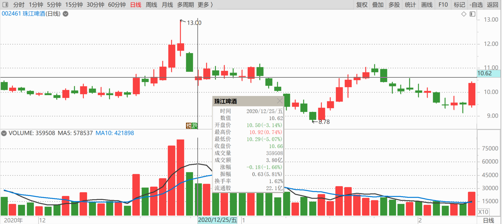

81篇.做人，做事，都必须有“道”

清一山长2020年12月23日

雪球某贴（主贴）

珠江啤酒（002461）融资融券数据显示，12月22日融资买入1.14亿元，融资偿还8656.51万元，融资净买入2754.80万元，当前融资余额为2.82亿元。融券方面，融券卖出2.49万股，融券偿还3.58万股，融券净偿还1.09万股，当前融券余量为10.21万股。

[珠江啤酒：12月22日融资净买入2754.80万元 环比增加472.59%](http://link.zhihu.com/?target=https%3A//xueqiu.com/S/SZ002461/166457323)

清一山长2020-12-23评论主贴：

珠江涨了，敢死队都快速冲进来了。我是还珠江融资的人，昨天还融资的几千万里面，有一千多万是我还的。与这些昨天来新开融资的人，思维方式真的不一样。借钱来买涨停？我实在难以接受。不过，我认为他们昨天开融资，将来也会赚钱的。其实今天就赚了。我还掉融资，我也不赔钱，**我只是绝对不会在这个珠江冲涨停的价位开融资。因为安全第一，**这就是我“看多不做多”的原则的实际体现。**有些钱，是不能赚的，赚了，就破坏了投资的原则。可能会得意一时，但只要有一次失败，就会毁掉一生。所以，这种钱，是不能赚的。2015年，4500点，我就是靠坚持原则，还掉融资。而周围的人都在疯狂的抢融资，抢额度。我坐守上亿的额度空置不用，坚守价值股,才满仓躲过股灾的。**反而在股灾发生后，用融资大量买入，涨了20～30％就出掉，反而创造了2015年账户市值的新高。当年要没有原则，别说赚钱了，创业几十年的成果，可能就一夜归零了。很叹息当年的“93老股民”、逍遥刘强等人。本来已经赚了很多，一辈子花的钱都有了，但还想赚更多。结果，黑天鹅飞来了，钱没了，命也没了。

**融资是把双刃剑，真不是一般人能玩的。诸位小心！功夫不到，不要乱玩融资。**

[gh11](http://link.zhihu.com/?target=http%3A//xueqiu.com/n/gh11)回复[清一山长](http://link.zhihu.com/?target=http%3A//xueqiu.com/n/%25E6%25B8%2585%25E4%25B8%2580%25E5%25B1%25B1%25E9%2595%25BF)跟评上贴：

我还抄过93老股民的作业，他的技术分析给我很大的启发，可惜了他一直满仓满融而且涨了出新的融资额度接着加，诶！

清一山长回复[gh11](http://link.zhihu.com/?target=http%3A//xueqiu.com/n/gh11)：

他的技术分析，可能比我还高，都是老江湖了。可惜就是：他不学哲学，就不懂**做人、做事，都必须有“道”，投资必须有投资原则，不能光玩“技术”。不能光钻到钱眼里。技术再好，没学“道”，迟早走上绝路。**索罗斯是玩投机，但他哲学出身，有他的“道”护身，所以遇险也能安然而退。

我家的孩子，可以不学知识，不学技术，不拼本事。但她从小要学做人、做事的基本原则。**最重要的原则，就是要做经营者，要学会付出，不能去学享受、消费。**看起来我教孩子傻，教她们吃亏，但最终赢得人生的，就是这种人。

**聪明，会成就你。但聪明，也会毁掉你。只有“道”，不管你聪明还是愚笨，都会成就你!**

清一山长2020-12-25跟评主贴：

“12月22日融资买入1.14亿元，融资偿还8656.51万元。”这个数据，可以说明涨停当天的状况——主力应该出货了一部分，不多。多空双方，还是分歧颇大的，退出的人也不少。只是相对强势，散户们冲进来的更多（这个涨停的价格开融资仓位买入的一个多亿，不少了。说明这个股相对强势。但也有保守型的原来用了融资的，如我一样，乘机退出。现在这批人拿着钱，应该再度买入了。这些钱，就是聪明钱。当天融资冲进去的，就是敢死队，只能站一段时间的岗了。

**不过，为啥本来强势的珠江，现在跌下来了？因为主力这一天也卖出了不少，后一天23日看来也卖出不少。主力想要补回来这些卖出的仓位，所以昨天借势打压下跌。**说明庄家的节奏很不错。如果跟上了，可以获得更高的利润。

(标题、图片为编者所加)

**文章音频**：

[482篇.做人，做事，都必须有“道”](http://link.zhihu.com/?target=https%3A//www.ximalaya.com/sound/758775582)

**参考链接：**
[70篇.隔山观火，不投入情感](https://zhuanlan.zhihu.com/p/707564067)
[71篇.从不缺乏热闹，只缺乏理性](https://zhuanlan.zhihu.com/p/709411110)
[72篇.为什么不要冲过9.60元收午盘](https://zhuanlan.zhihu.com/p/710752420)
[73篇.蓄势上攻，引而不发](https://zhuanlan.zhihu.com/p/712057223)
[74篇.惠泉跨栏历史记录回顾](https://zhuanlan.zhihu.com/p/713488711)
[75篇.惠泉最成功的地方](https://zhuanlan.zhihu.com/p/714477508)
[76篇.聪明人赚钱，傻人赔钱](https://zhuanlan.zhihu.com/p/715051514)
[77篇.在确定企业价值的基础上进行金融投机](https://zhuanlan.zhihu.com/p/717031167)
[78篇.你这样做，庄家会吐血](https://zhuanlan.zhihu.com/p/718319738)
[79篇.卖出涨停股，买入跌惨了的股](https://zhuanlan.zhihu.com/p/719002613)
[80篇.燕京是一座金矿](https://zhuanlan.zhihu.com/p/720733084)