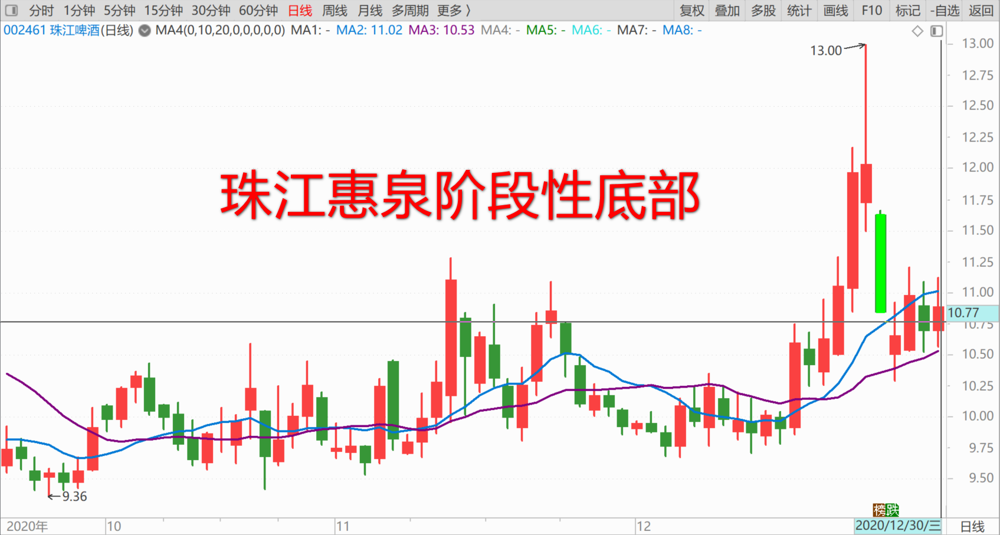
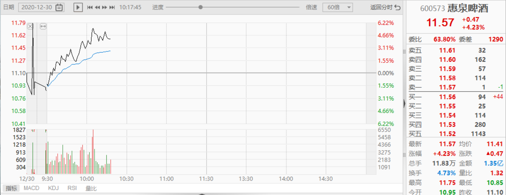
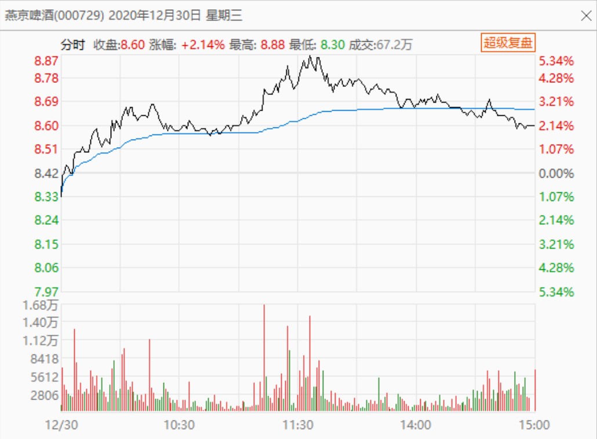
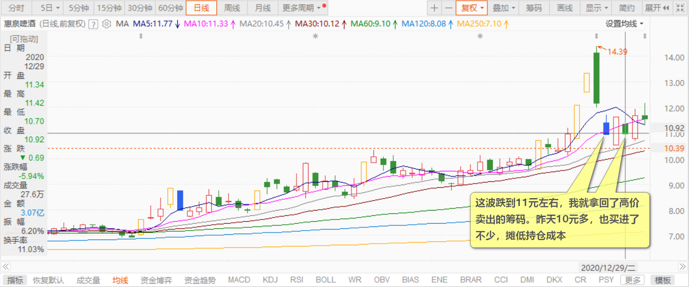
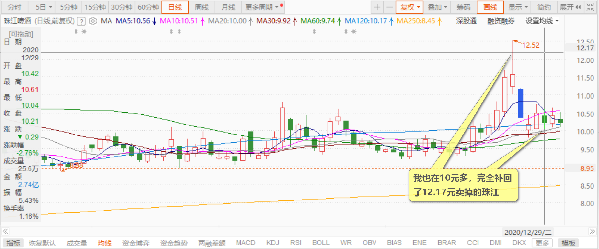
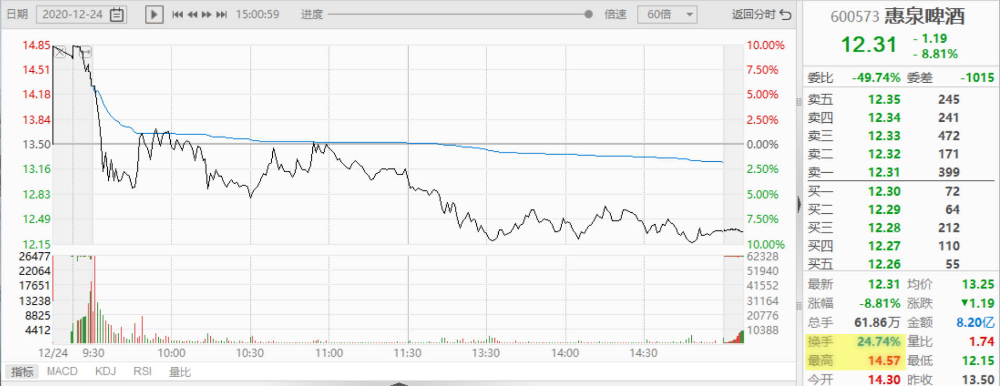
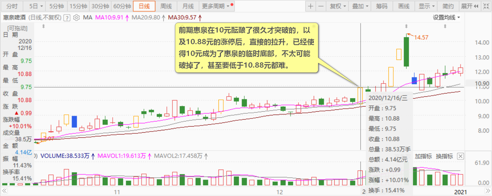
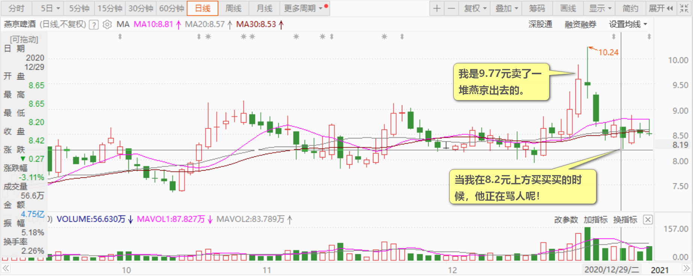
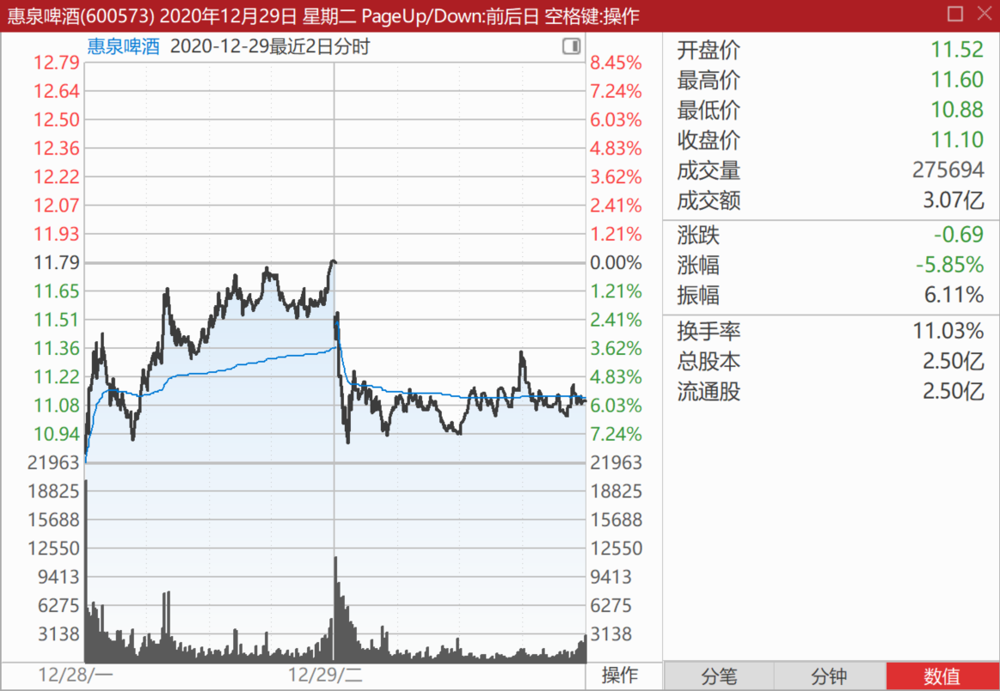

85篇.这一轮珠江的底部和惠泉的底部

清一山长2020年12月30日

**一、珠江阶段性的底部**

[$惠泉啤酒(SH600573)$](http://link.zhihu.com/?target=http%3A//xueqiu.com/S/SH600573)惠泉真是好好玩[大笑]。真长见识！

喜欢刺激的人，应该喝惠泉。喜欢喝闷酒的，可以考虑燕京[俏皮]。

补个尾盘的图，看今天的全剧表演，精彩[献花花]

[明达野老](http://link.zhihu.com/?target=http%3A//xueqiu.com/n/%25E6%2598%258E%25E8%25BE%25BE%25E9%2587%258E%25E8%2580%2581)回复[清一山长](http://link.zhihu.com/?target=http%3A//xueqiu.com/n/%25E6%25B8%2585%25E4%25B8%2580%25E5%25B1%25B1%25E9%2595%25BF)：

恭喜山长在惠泉上收获满满！

惠泉目前的盘口，我个人看，已经是游资炒作频繁换庄的状态，我不打算跟玩了，因为看不懂，这部分利润注定不是我的，就让这些喜欢一日游的炒家们利用后面的空间玩“传雷”游戏吧！所以，我目前的操作是——全线撤出惠泉（部分在华东溜达了一圈）换回了珠江，啤酒整体头寸基本不变。

清一山长回复[明达野老](http://link.zhihu.com/?target=http%3A//xueqiu.com/n/%25E6%2598%258E%25E8%25BE%25BE%25E9%2587%258E%25E8%2580%2581)：

祝您新年快乐，大吉大利！

我认为惠泉的高潮戏，应该还在后面。基本面和技术面都支持未来的精彩表演。所以这波跌到11元左右，我就拿回了高价卖出的筹码。昨天10元多，也买进了不少，摊低持仓成本，陪主力多玩一阵再说！目前应该还在十大里面，除非十大升级了[笑]。

您退出惠泉，也是很明智的：**珠江10元区的调整，已经很久了。这个价位现在基本上算是珠江阶段性的底部了，不太可能继续破位。**比惠泉调整有限的11元价位区，显然要靠谱很多。我也在10元多，完全补回了12.17元卖掉的珠江，还多买了20多万股，算是把赚到的利润也放上去了。惠泉就不敢多买了，只敢少买，没跌到理想的价格，宁肯错过也不追涨（前天追涨的人，肯定昨天就吃亏了）。赚到的利润都留出来，别不小心就赔回去了。珠江就没有这个担心！

**二、这一轮惠泉下杀的底部也是主力重新收集筹码的底部**

其实，**这一轮惠泉冲高14元多，当天换手率很高。**

**相当多的是追涨的散户冲进来了。**主力由于之前已经成功控盘，散户手上，应该没有这么多的量可以卖给拉涨的主力的。所以，**高位放量，其实不代表散户卖给了主力，而是相反，是很多右侧出击的散户追进去了，主力成功地高价出掉了手里的货**。只剩下一点，当天拉高的货，老仓的股票，肯定全卖光了。当天拉高买入的筹码，用于后期的打压。从高度上说，这一轮打到11元左右，就是极限了。前期惠泉在10元酝酿了很久才突破的，以及10.88元的涨停后，直接的拉升，已经使得10元成为了惠泉的临时底部，不太可能破掉了，甚至要低于10.88元都难。因为主力是在这个价格拿走了很多货，**所以我判断11元前后，是这一轮下杀的底部，也是主力重新收集筹码的底部。**

如果继续打到破10元的话，固然会有恐慌盘涌出，但主力的筹码也会被更多的人抢走，而且新进主力的成本，不会低于11元。如果真的跌到8元去，主力手上的筹码还有没有剩下都很难说，更别说主力一定会亏损了。起码我都要升级，做二大了。我会把别的股卖掉来追8元的惠泉的。外围看中了，想抢庄惠泉的人，正好如意了，低价配送筹码。所以，只有傻瓜会干这种事情。**11元，是大家互相博弈比较平衡的点。没进场的人犹豫不敢进，手上有货的人感觉可以抛。**跌破10元，跌到8元，想进的人，会毫不犹疑的全冲进来。手上有货的人，因为浮亏太多，前期没卖，现在更不愿意卖了。**所以，短暂的跌破11元，就是这一轮的底，但要买到的难度很高。所以，我在11元上方一点接货，把握就大得多。**这一轮，我基本上与主力同步收回了筹码。买回的成本，可能比主力还低一些。

这段时间我都不给这么详细的分析，今天做事后诸葛，分析一下过去这几天的惠泉走势。（大家看到我的操作，完全跟我的判断一致。证明我自己就是这样判断，这样操作的。只是我不想去影响主力的操盘，也不想一堆新来的蠢货，看我点评后，高价去追买惠泉，套住了就骂我，所以我都只是事后点评，避免麻烦）。

说过：**10元以上，是高风险、高利润的区域。**想吃这碗饭的，好好练练脑子，练练心。水平不够的，就退出，找适合自己的饭去。我玩得还不错，一直在惠泉上反复赚钱，一直没有被颠下车。但这杯酒，未必适合您喝！特别提醒各位球友！

再次申明：本文没有让你买惠泉，也没有让你卖惠泉。一切您自己决定，自己负责！我也为我自己的账户负责！如果今天明天，惠泉继续玩涨停游戏，难说我就退出十大不做了[笑]。现在目测，我依然还留在十大的位置，虽然进进出出的，很多次了。

祝各位新年快乐！喝点啤酒庆祝一下[干杯]

**三、左侧比忍耐力，右侧比聪明劲**

[简简单单0318](http://link.zhihu.com/?target=http%3A//xueqiu.com/n/%25E7%25AE%2580%25E7%25AE%2580%25E5%258D%2595%25E5%258D%25950318)回复[心存敬畏努力向前](http://link.zhihu.com/?target=http%3A//xueqiu.com/n/%25E5%25BF%2583%25E5%25AD%2598%25E6%2595%25AC%25E7%2595%258F%25E5%258A%25AA%25E5%258A%259B%25E5%2590%2591%25E5%2589%258D)：

为什么要8.7元出呢？（燕京啤酒）

清一山长回复[简简单单0318](http://link.zhihu.com/?target=http%3A//xueqiu.com/n/%25E7%25AE%2580%25E7%25AE%2580%25E5%258D%2595%25E5%258D%25950318)：

你问他，他自己都不知道为啥这样操作。但我知道，我是专门研究人类心理行为的，在股市上，这一套特别好用，很容易就看穿了庄家和散户的互动，所以赚钱比一般人容易些[大笑]。

我替他解释一下，为啥他就是喜欢亏本出货，趋势刚刚转好就赶快卖掉了。

因为他是右侧人，喜欢追涨，也喜欢杀跌！追涨是因为他看多就做多，趋势向上，他要追上去。比如，这一次他买的时候，正好是我卖的时候，我是9.77元卖了一堆燕京出去的。冲破10元，我反而没卖了。因为涨得不够多，没有到我的下一次卖点。如果燕京涨停，我会再卖1M的。因为我是“看多做空”的人。

他杀跌，是看到趋势向下，他想比别人更快地跑出去。而我跟他相反，是看空做多！昨天，当我在8.2元上方买买买的时候，他正在骂人呢！他骂主力阴险，把他忽悠进来。他在骂自己怎么这么蠢，居然9.6元买了燕京，下跌还不尽快放手。

他看着盘面下跌，心内十分的煎熬。昨天看到燕京的下跌趋势很强，在无助和惊慌地想——打压好狠！这样走下去，会不会破8呀？真恨自己没有早点止损卖掉，骂自己不执行投资纪律，导致昨天扩大了损失，白白丢了20%。他昨天一直在懊悔，不该买进，更没有看到下跌就赶快卖掉。他实际上，在燕京破九的时候，就已经想要止损了。只是当时心生侥幸，下不了手割肉。现在特别恨自己，前几天当初没有遵守右侧的投资纪律——只要发现与自己的预期不符，跌破5%，就要快速止损！导致现在扩大了损失。现在丢，实在舍不得。不丢，很煎熬！他昨天一直在想：如果燕京反弹，就一定要走，不能再犹豫不决了。所以，他今天卖出的决定，其实是昨天做出来的，不是今天突然想卖出的。

今天主力真的给了机会，反弹上了8.7元，他自然要赶快卖了。因为上一次燕京在8.8元折腾的时候，他已经想认错，卖掉止损的。果然被他猜到，就破位了。现在，好容易拉回来了，自然要赶快跑掉，让自己不再煎熬和自责！他认为：燕京难说会像惠泉一样，假涨一天，然后跌回原地，盘面上就是出货的样子。比如惠泉前天涨到11.78元，如果卖掉，昨天跌破11元捡回来正好。

难说燕京现在冲破8.8元，再跌回8元左右，也不是没可能。既然他在燕京上，一再出现判断失误，证明这碗饭就不是他吃的，早点认输退出好了！找个不这么折磨他的股守住算了！

这，就是他这几天，在燕京这笔投资上的全部想法和心理！如果错了，欢迎贴主指正！[俏皮]

如果对了：你就知道，我看庄家，看散户，都看得清的。看不清，就别吃投机这碗饭了。我每次抄底，涨停逃顶，你们以为是偶然的吗？**因为我看得到每一个价格，每一个波动后面，不同的人（主要是庄家、散户）在想什么，买进卖出的理由是什么。我看得懂盘面语言，也看得懂你们的价格，买进卖出背后的心理思维。所以——我才能跟你们反向运动，赚到你们赚不到的钱。**

想学？你们就好好研究鬼谷子吧！他是我这一门的鼻祖。现在的语言，叫做——心理行为学！在军事上，商战上，也叫博弈论！基础，就是研究每个人的心理和思维、行为的关系，预测对手的动向，拿出符合自己最大利益的方案来应对！

[心存敬畏努力向前](http://link.zhihu.com/?target=http%3A//xueqiu.com/n/%25E5%25BF%2583%25E5%25AD%2598%25E6%2595%25AC%25E7%2595%258F%25E5%258A%25AA%25E5%258A%259B%25E5%2590%2591%25E5%2589%258D)回复[清一山长](http://link.zhihu.com/?target=http%3A//xueqiu.com/n/%25E6%25B8%2585%25E4%25B8%2580%25E5%25B1%25B1%25E9%2595%25BF)：

先生，没有这么复杂的，我9.7元进货的时候，以为燕京启动涨势了，涨到10.22元最高点的时候，我自己设置的卖价是10.3元，因为有事情要忙，就错过了。我自己操作得比较多的是五粮液做T，几块钱T的那种。我确实没有您的十分之一本事，但也没那么难受，因为我看不懂。

清一山长回复[心存敬畏努力向前](http://link.zhihu.com/?target=http%3A//xueqiu.com/n/%25E5%25BF%2583%25E5%25AD%2598%25E6%2595%25AC%25E7%2595%258F%25E5%258A%25AA%25E5%258A%259B%25E5%2590%2591%25E5%2589%258D)：

你厉害，五粮液做T，高手。

我是14元买的五粮液，现在底仓都在，不敢做T。

14元买五粮液，理由是：当时才170元的茅台，我认为未必涨幅能超过它。果然应验了。可惜我一向不喜欢酒，特别不喜欢白酒，觉得就是害人的，所以没有重仓五粮液。可惜了！

**投资，不要管自己喜不喜欢，而要看市场喜不喜欢。**

2021年，继续是我的啤酒年！我持有比2019年年底更多的啤酒股（是股数，不是市值）。明年继续喝酒！虽然我也不喜欢喝啤酒，即使在泰国这么热也不喝。但没有对白酒这么讨厌啤酒，所以——看来我的命，是赚啤酒的大钱，白酒只能赚小钱！

[jybob](http://link.zhihu.com/?target=http%3A//xueqiu.com/n/jybob)回复[清一山长](http://link.zhihu.com/?target=http%3A//xueqiu.com/n/%25E6%25B8%2585%25E4%25B8%2580%25E5%25B1%25B1%25E9%2595%25BF)：

原来左侧交易者，需要承受的心理压力没有右侧人那么大。

清一山长回复[jybob](http://link.zhihu.com/?target=http%3A//xueqiu.com/n/jybob):

**左侧交易，比的是忍耐力。右侧，比的是聪明劲。**

我笨一些，只好玩左侧了！

**“左侧人”是牛，（跌势中）要忍住苦难，（涨势中）要愿意让利**。买了股，跌了不难过；卖了股，涨了也不生气。做不到，就当不了“左侧人”。

**“右侧人”，是涨了一定要有我一份。跌了也别套我，**我套别人还差不多！所以，“右侧人”都比我聪明一些。我实在玩不来。[俏皮]

我见过的最厉害的右侧人，是我的一个朋友。他最快一秒钟就变盘，同时可以看八台屏幕。我看两台都忙不过来！

[TradingPlan](http://link.zhihu.com/?target=http%3A//xueqiu.com/n/TradingPlan)回复[清一山长](http://link.zhihu.com/?target=http%3A//xueqiu.com/n/%25E6%25B8%2585%25E4%25B8%2580%25E5%25B1%25B1%25E9%2595%25BF)：

你这个朋友的年收益率是多少？

清一山长回复[TradingPlan](http://link.zhihu.com/?target=http%3A//xueqiu.com/n/TradingPlan)：

有一次，他告诉我：他一年就给券商交了1500万的交易费，他是万一的费率。我问他：你赚了多少呢？他有点犹豫，还是告诉我了：赚了500万！[献花花]。怪不得券商都特别的喜欢他，到处拉他。

真比我强，我的啤酒跌一天，我都要赔掉1000万。继续跌一年的话，真不知要跌多少了[大笑]！

[梦长安bhh](http://link.zhihu.com/?target=http%3A//xueqiu.com/n/%25E6%25A2%25A6%25E9%2595%25BF%25E5%25AE%2589bhh)回复[清一山长](http://link.zhihu.com/?target=http%3A//xueqiu.com/n/%25E6%25B8%2585%25E4%25B8%2580%25E5%25B1%25B1%25E9%2595%25BF):

山长，您觉得燕京能过10元吗？

清一山长回复[梦长安bhh](http://link.zhihu.com/?target=http%3A//xueqiu.com/n/%25E6%25A2%25A6%25E9%2595%25BF%25E5%25AE%2589bhh)：

今天肯定不能过，明天也过不了。看样子，明年应该就能过10元了，万一明年还不行的话，您等待后年，保障就能过了！您就耐心等吧[大笑]！起码现价拿上两年，过十元，比您的银行利息高一点[俏皮]。

(标题、图片为编者所加)

**文章音频**：

[508篇.这一轮珠江的底部和惠泉的底部](http://link.zhihu.com/?target=https%3A//www.ximalaya.com/sound/775489357)

**参考链接：**
[76篇.聪明人赚钱，傻人赔钱](https://zhuanlan.zhihu.com/p/715051514)

[77篇.在确定企业价值的基础上进行金融投机](https://zhuanlan.zhihu.com/p/717031167)

[78篇.你这样做，庄家会吐血](https://zhuanlan.zhihu.com/p/718319738)

[79篇.卖出涨停股，买入跌惨了的股](https://zhuanlan.zhihu.com/p/719002613)

[80篇.燕京是一座金矿](https://zhuanlan.zhihu.com/p/720733084)

[81篇.做人，做事，都必须有“道”](https://zhuanlan.zhihu.com/p/722042320)

[82篇.投资必须依赖自己的投资系统、有效的原则、纪律](https://zhuanlan.zhihu.com/p/783923357)

[83篇.第一天涨停第三天跌停](https://zhuanlan.zhihu.com/p/846758124)

[84篇.我的啤酒股票，绝对不会“出清”](https://zhuanlan.zhihu.com/p/6035500140)